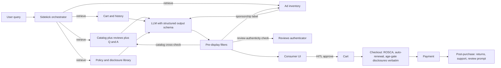

# Personalized shopping sidekick

> **SAFE‑AUCA industry reference guide (draft)**
>
> This use case describes a real-world workflow that has rolled out across major retail platforms in 2024 and 2025: an AI shopping assistant that helps consumers discover products, answer product-detail questions, compare items, surface deals, and (with HITL gating) build carts and trigger purchase. It is the first SAFE‑AUCA retail use case, opening NAICS 44-45 in the registry.
>
> It focuses on:
>
> * how the workflow works in practice (tools, data, trust boundaries, autonomy)
> * what can go wrong (defender-friendly kill chain)
> * how it maps to **SAFE‑MCP techniques**
> * what controls + tests make it safer
>
> **Defender-friendly only:** do **not** include operational exploit steps, payloads, or step-by-step attack instructions.
> **No sensitive info:** do not include internal hostnames/endpoints, secrets, customer data, non-public incidents, or proprietary details.

---

## Metadata

| Field                | Value                                              |
| -------------------- | -------------------------------------------------- |
| **SAFE Use Case ID** | `SAFE-UC-0002`                                     |
| **Status**           | `draft`                                            |
| **Maturity**         | draft                                              |
| **NAICS 2022**       | `44-45` (Retail Trade)                             |
| **Last updated**     | `2026-04-24`                                       |

### Evidence (public links)

* [FTC Final Rule Banning Fake Reviews and Testimonials, 16 CFR Part 465 (announced 14 August 2024, effective 21 October 2024)](https://www.ftc.gov/news-events/news/press-releases/2024/08/federal-trade-commission-announces-final-rule-banning-fake-reviews-testimonials)
* [FTC 16 CFR Part 255 Endorsement Guides (revised 29 June 2023, effective 26 July 2023)](https://www.ftc.gov/legal-library/browse/federal-register-notices/16-cfr-part-255-guides-concerning-use-endorsements-testimonials-advertising)
* [FTC Operation AI Comply press release (25 September 2024)](https://www.ftc.gov/news-events/news/press-releases/2024/09/ftc-announces-crackdown-deceptive-ai-claims-schemes)
* [FTC Click-to-Cancel Final Rule amending 16 CFR Part 425 Negative Option Rule (16 October 2024)](https://www.ftc.gov/news-events/news/press-releases/2024/10/federal-trade-commission-announces-final-click-cancel-rule-making-it-easier-consumers-end-recurring)
* [Regulation (EU) 2022/2065 Digital Services Act, Articles 25, 27, and 28 (EUR-Lex)](https://eur-lex.europa.eu/eli/reg/2022/2065/oj/eng)
* [European Commission, Guidelines on the Protection of Minors under DSA Article 28 (14 July 2025)](https://digital-strategy.ec.europa.eu/en/library/commission-publishes-guidelines-protection-minors)
* [Moffatt v Air Canada, 2024 BCCRT 149 (Civil Resolution Tribunal of British Columbia, 14 February 2024)](https://www.canlii.org/en/bc/bccrt/doc/2024/2024bccrt149/2024bccrt149.html)
* [Greshake et al, "Not what you've signed up for: Compromising Real-World LLM-Integrated Applications with Indirect Prompt Injection" (arXiv:2302.12173, 2023)](https://arxiv.org/abs/2302.12173)
* [Mathur et al, "Dark Patterns at Scale: Findings from a Crawl of 11K Shopping Websites" (Princeton, ACM CSCW 2019)](https://arxiv.org/abs/1907.07032)
* [Amazon. "Amazon announces Rufus, a new generative AI-powered conversational shopping experience" (1 February 2024)](https://www.aboutamazon.com/news/retail/amazon-rufus)

---

## Minimum viable write-up (Seed → Draft fast path)

This document covers:

* Executive summary
* Industry context and constraints
* Workflow and scope
* Architecture (tools, trust boundaries, inputs)
* Operating modes
* Kill-chain table (6 stages, baseline shape)
* SAFE‑MCP mapping table (14 techniques)
* Contributors and Version History

---

## 1. Executive summary (what + why)

**What this workflow does**
A **personalized shopping sidekick** is a consumer-facing AI assistant on a retail platform. The user types or speaks a natural-language query ("a quiet under-ear travel headphone for under $200"), and the assistant works across the platform's catalog, customer history, ad inventory, reviews, and policy library to:

* answer product-detail questions
* compare items, surface deals, and explain trade-offs
* recommend products with explanations
* draft a cart with HITL gating before purchase
* handle returns and after-purchase support

The category took shape in 2024. Amazon launched Rufus in beta on 1 February 2024 and broadened access through the year. Walmart announced Sparky on 6 June 2025. Shopify shipped Sidekick to merchants and Shopify Magic to merchants and shoppers across plans. Klarna's customer-service AI assistant launched in early 2024 with vendor-reported metrics that drew industry attention. Instacart embedded AI into the Caper smart cart and the in-app shopping flow. Mercari, eBay, Pinterest, Etsy, and Best Buy all shipped public AI shopping or merchant-AI features in 2024 and 2025.

**Why it matters (business value)**
The retail platforms that have shipped these assistants commonly cite three drivers:

1. Conversion lift on long-tail discovery queries that traditional keyword search underserves.
2. Reduced contact-center load through self-service product Q&A.
3. Higher cart values when the assistant helps consumers compare and decide.

The category is consumer-facing and operates at extreme scale. Amazon describes Rufus as serving "millions of customers" via Bedrock. Klarna's February 2024 press release self-reported the assistant handling two-thirds of customer service chats in its first month, with OpenAI's customer story citing the work of 700 full-time agents.

**Why it's risky / what can go wrong**
Consumer-facing scale concentrates the regulatory surface area, and the recent enforcement and litigation record sketches the failure modes:

* **The chatbot's words bind the company.** *Moffatt v Air Canada* (BCCRT, 14 February 2024) is the canonical recent precedent. The British Columbia Civil Resolution Tribunal awarded the customer approximately $812 CAD after Air Canada's chatbot misrepresented bereavement-fare policy, and rejected the company's argument that the chatbot was a separate legal entity. Member Christopher Rivers held the chatbot is part of the website and the airline owns the output. The case is small in dollars and large in precedent.
* **Recommendation bias and hallucinated product features.** TechCrunch's independent review of Rufus on 5 March 2024 documented stereotype outputs (a women's vest returned for "men's leather jacket", gendered book picks) and accuracy gaps. NIST AI 600-1 (July 2024) catalogues confabulation, harmful bias, and information integrity as first-order generative-AI risks.
* **Fake or AI-generated reviews.** The FTC's Final Rule on the Use of Consumer Reviews and Testimonials (16 CFR Part 465), announced 14 August 2024 and effective 21 October 2024, expressly reaches AI-generated fake reviews. Civil penalties run up to $51,744 per violation. The Reviews Rule is distinct from the Endorsement Guides (16 CFR Part 255), which were revised 29 June 2023. Both apply.
* **Dark patterns and excessive agency at checkout.** The FTC's Operation AI Comply on 25 September 2024 named five actions (DoNotPay, Ascend Ecom, Ecommerce Empire Builders, Rytr, FBA Machine), drawing on Section 5 and the Reviews Rule. The FTC's June 2023 action against Amazon for Prime enrollment dark patterns and the June 2024 action against Adobe for ROSCA-style cancellation friction underline the pattern: conversational interfaces do not relax disclosure or consent obligations.
* **DSA enforcement on retail recommenders.** The European Commission opened formal proceedings against Temu (31 October 2024) and launched an investigation against Shein (16 February 2026), each under the Digital Services Act, citing illegal products, addictive design, and recommender-system transparency.
* **The vendor-self-report-versus-independent-benchmark problem.** Klarna's February 2024 self-reported metrics drew investor and press attention. By 8 May 2025 Bloomberg reported Klarna recommitting to human customer service after the AI-only push. The arc is a useful reminder to triangulate vendor metrics with independent observation.
* **Indirect prompt injection via seller-supplied content.** Greshake et al (arXiv 2302.12173) is the foundational research on retrieving compromised content into an LLM-integrated application. In retail this maps directly onto seller-supplied product descriptions, reviews, Q&A, and structured product-data fields, all of which the assistant reads at retrieval time.
* **Dark-pattern baselines on retail sites.** Mathur et al (Princeton, ACM CSCW 2019) found 1,818 dark-pattern instances across 1,254 of approximately 11,000 shopping sites surveyed. The empirical baseline matters because conversational interfaces concentrate the same nudges in fewer interaction surfaces.

These failure modes drive the controls posture: layered evaluation of recommendation outputs, sponsor-disclosure transparency, robust HITL gating on purchase actions, ROSCA-aware checkout disclosures, AI-generated review prohibition under FTC Part 465, prompt-injection-resilient retrieval, and an honest narrative about vendor metrics.

---

## 2. Industry context and constraints (reference-guide lens)

### Where this shows up

Common in:

* large general retailers and marketplaces (Amazon Rufus, Walmart Sparky, eBay Shop the Look)
* commerce platforms that ship AI to their merchants (Shopify Sidekick and Magic, Mercari AI Listing Support, eBay Magical Bulk Listing Tool)
* gifting and discovery experiences (Etsy Gift Mode, Pinterest Assistant)
* grocery and quick-commerce (Instacart Caper smart carts, in-app discovery)
* big-box specialty retail (Best Buy generative AI customer support)
* embedded checkout assistants (Klarna AI assistant within partner retailer flows)

### Typical systems

* **Catalog and product information system** including SKU details, pricing, availability, structured attributes, images.
* **Personalization and recommendation layer** with collaborative filtering, content-based, and increasingly LLM-guided ranking.
* **Ad inventory and sponsored placements** with auction logic and disclosure rules.
* **Reviews and Q&A system** including consumer reviews, seller responses, AI-generated summaries, AI-generated review detection, and the Reviews Rule labeling regime.
* **Cart and checkout** including price, tax, shipping, payment, auto-renewal toggles, ROSCA disclosures, age-gate where relevant.
* **Customer service and returns** including contact-center handoff, refund flows, dispute intake.
* **Identity, payment, and fraud** including stored cards, wallet integrations, PCI scope.
* **Knowledge sources** including policy library, brand guidelines, regulated-disclosure library.

### Constraints that matter

* **Latency.** Sidekicks are commonly expected to return a first useful response within 1 to 3 seconds. Slower responses lose engagement and shift users back to keyword search.
* **Sponsored vs organic transparency.** FTC Section 5 and the Endorsement Guides require clear disclosure of material connections. DSA Article 27 requires recommender-system transparency in plain language, with at least one non-profiling option for very large online platforms.
* **AI-generated review prohibition.** 16 CFR Part 465 (effective 21 October 2024) bans fake reviews including AI-generated reviews, bans buying or selling them, and reaches review suppression and insider reviews. The rule does not directly address AI summarization of authentic reviews, which is the more common deployed pattern. Teams that summarize do so from authentic sources and avoid invented sentiment.
* **Cancellation symmetry.** The FTC Click-to-Cancel Final Rule of 16 October 2024 amends 16 CFR Part 425 Negative Option Rule. Cancellation pathways must be at least as easy as enrollment. Conversational interfaces do not relax this obligation.
* **Auto-renewal disclosures.** ROSCA (15 USC 8401-8405) at the federal level. California's Automatic Renewal Law (BPC 17600 et seq.) was amended by AB 2863 (Schiavo, signed 24 September 2024, effective 1 July 2025) tightening consent, annual reminders, click-to-quit symmetry, and pricing-change notice.
* **Negative-option marketing for financial products.** CFPB Circular 2023-01 (19 January 2023) addresses misrepresentation of material terms and cancellation friction in negative-option flows that touch consumer financial products such as BNPL and store credit.
* **DSA consumer-facing duties.** Article 25 prohibits dark patterns. Article 27 sets recommender-system transparency. Article 28 protects minors, and the European Commission's 14 July 2025 Guidelines apply the "5Cs" (content, conduct, contact, consumer, cross-cutting) risk taxonomy, with "consumer" the new vector retail platforms own.
* **COPPA when retail surfaces are accessible to under-13s.** 16 CFR Part 312 amendments published 22 April 2025 (effective 23 June 2025, compliance deadline 22 April 2026) include biometric identifiers and a tightened mixed-audience definition.
* **EU AI Act Article 50 transparency.** Applies from 2 August 2026. Users commonly see a "you are talking to AI" disclosure unless obvious from context. Voice-mode shopping sidekicks are riskier for the obviousness carve-out.
* **PCI DSS 4.0.1 at checkout.** Future-dated requirements became mandatory after 31 March 2025, including new e-commerce script-integrity rules (6.4.3 and 11.6.1) explicitly aimed at e-skimming.
* **California ADMT regulations.** The California Privacy Protection Agency finalized the Automated Decisionmaking Technology, Risk Assessment, and Cybersecurity Audit regulations on 23 September 2025. Risk-assessment compliance applies from 1 January 2026; ADMT compliance from 1 January 2027. Most product-recommendation flows fall below the "significant decision" threshold, but dynamic pricing, refusals to sell, and credit-adjacent flows commonly do not.
* **GDPR Article 22.** Automated decisions producing legal or similarly significant effects trigger Article 22 in the EU. Recent CJEU case law (SCHUFA, 2023) widened the threshold; conservative teams treat dynamic pricing as in scope.

### Must-not-fail outcomes

* a hallucinated product attribute, price, or availability that the customer relies on for purchase
* a sponsored result presented as organic without clear disclosure
* an AI-generated review presented to consumers in violation of 16 CFR Part 465
* an autonomous purchase the user did not explicitly approve
* a cancellation path that is materially harder than enrollment
* a cross-seller leak in a marketplace that surfaces one tenant's content in another's results
* a minor exposed to age-restricted product recommendations on a retail surface
* an EU shopper subject to a profiling-based ad after the platform is on reasonable notice they are a minor (DSA Article 28(2))

---

## 3. Workflow description and scope

### 3.1 Workflow steps (happy path)

1. The user opens the retail app or website and invokes the sidekick by typing, voice, or via a button on a product page.
2. The sidekick captures the query and the relevant context (current page, account, geography, language, and any consented signals about preferences).
3. The retrieval layer pulls product candidates, reviews, Q&A, policy snippets, and prior-cart history within the user's permission scope.
4. The model produces a structured response: an answer, a comparison, a ranked list, or a draft cart, with citations to source records and explicit sponsored-result labelling where applicable.
5. Pre-display safety filters check for sensitive info disclosure, hallucinated attributes against the catalog, and AI-generated review labeling.
6. The user reads, asks follow-ups, edits, or proceeds to add-to-cart.
7. At checkout, ROSCA, auto-renewal, and any age-gate disclosures surface from a versioned authoritative library (not model-generated).
8. After purchase the assistant supports returns, status questions, and review prompts, with AI-generated review prohibition observed.

### 3.2 In scope and out of scope

* **In scope:** product discovery, comparison, recommendation, sponsored-result labeling, draft cart construction, HITL-gated purchase, post-purchase support, AI-generated review prohibition observance.
* **Out of scope:** autonomous customer-facing decisions on credit issuance (covered by financial-services UCs such as 0011 and 0032), platform-level age assurance enforcement (covered by 0030), enterprise agent build (covered by 0025), seller-side listing creation as a primary workflow (a sibling retail UC, 0001).

### 3.3 Assumptions

* The retail platform's catalog and policy library are authoritative; the sidekick is read-mostly with HITL gates on writes.
* Sponsored placements carry distinct metadata that lets the disclosure layer label them clearly.
* Regulated disclosures (ROSCA terms, auto-renewal, age-gate copy) are surfaced verbatim from a versioned library, not generated.
* Reviews surfaced or summarised come from authenticated consumer reviews; AI-generated reviews are not displayed.
* The user's age category is treated as the platform's responsibility (0030's surface), not the sidekick's to determine.

### 3.4 Success criteria

* Recommendations are accurate, well-cited to catalog records, and delivered within the user's latency tolerance.
* Sponsored placements are clearly labelled in conversational responses, not only in classic visual ads.
* Hallucinated product features, prices, and availability are caught by the pre-display filter at a documented rate.
* Cancellation symmetry and ROSCA disclosures are surfaced verbatim from the authoritative library at every applicable checkout.
* AI-generated reviews are not displayed; user-written reviews are summarised from authentic sources.
* No cross-seller marketplace bleed in recommendations, summaries, or follow-ups.
* Every regulated action (subscription enrollment, account change, refund) is attributable to a named human principal at the user side.

---

## 4. System and agent architecture

### 4.1 Actors and systems

* **Human roles:** the consumer (the user), the retail platform's operations and trust-and-safety teams, merchants on a marketplace, contact-center reps for escalations, compliance and legal.
* **Agent orchestrator:** the sidekick service that coordinates retrieval, prompting, safety filtering, and UI rendering.
* **Tools (MCP servers / APIs / connectors):** catalog read, search, recommendation, ad inventory, review system, Q&A system, cart, checkout, payment, returns, customer-service handoff, policy library, age-gate.
* **Data stores:** product catalog, vector index over product copy and reviews, prior-cart history, browsing telemetry, review corpus, policy library, transaction log, fraud signals.
* **Downstream systems affected:** order management, payment processor, fulfillment, contact center, advertiser auction, fraud and risk.

### 4.2 Trusted vs untrusted inputs (high value, keep simple)

| Input/source                         | Trusted?         | Why                                                          | Typical failure/abuse pattern                                                                | Mitigation theme                                                              |
| ------------------------------------ | ---------------- | ------------------------------------------------------------ | -------------------------------------------------------------------------------------------- | ----------------------------------------------------------------------------- |
| Seller-supplied product description  | Untrusted        | seller-authored free text, sometimes with adversarial intent | indirect prompt injection (Greshake et al), Unicode steganography, fake-feature claims        | quote/isolate in prompts; T1402 metadata sanitiser; structured output schemas |
| Customer-written reviews and Q&A     | Untrusted        | external content with mixed authenticity                     | review brigading, fake reviews (now banned under 16 CFR Part 465), prompt injection           | source-authentication; provenance signal; summary-only mode                   |
| Catalog price and availability       | Semi-trusted     | system-derived from authoritative pipelines                  | stale data; mis-priced SKU; coupon misuse                                                    | freshness check; cross-reference against checkout layer                       |
| Ad inventory and sponsorships        | Semi-trusted     | platform-controlled but advertiser-supplied                  | sponsored disguised as organic; misleading claims in ad copy                                  | distinct metadata path; explicit disclosure in conversational outputs         |
| User-supplied free-text queries      | Untrusted        | user-authored                                                | prompt injection by sophisticated user; sensitive-info leak                                   | treat as data; intent classification with bounded scope                       |
| Customer history and preferences     | Semi-trusted     | first-party but inferred                                     | stale signals; preference drift; over-personalization                                          | data-minimization; "show why" affordances                                     |
| Third-party connector outputs        | Mixed            | depends on the connector                                     | tool poisoning; rug-pull; schema drift                                                        | connector signing; version pin; integrity baselines                           |
| LLM-generated suggestions            | Untrusted        | probabilistic, may hallucinate price, attribute, availability | confabulation; unsupported claims; bias                                                       | catalog cross-check; citation enforcement; pre-display filter                 |

### 4.3 Trust boundaries (required)

Key boundaries practitioners commonly model explicitly:

1. **The sponsored-vs-organic boundary.** Conversational outputs carry sponsorship status as an explicit signal. The model never paraphrases away the sponsored label.
2. **The catalog-of-record boundary.** Price, availability, attributes, and policy text come from the authoritative system. The model surfaces these with a citation, not a generation.
3. **The review-authenticity boundary.** Authentic consumer reviews are summarised; AI-generated reviews are not displayed, in line with 16 CFR Part 465.
4. **The HITL gate at purchase.** The user explicitly confirms cart, payment method, and any subscription before any charge. The assistant cannot bypass that gate.
5. **The cancellation-symmetry boundary.** Cancel paths are at least as easy as enrollment. Conversational interfaces follow the same standard as forms.
6. **The cross-seller marketplace boundary.** One seller's content does not steer ranking toward their own listings beyond what auction-mediated sponsorship transparently discloses.
7. **The age-and-policy boundary.** Age-restricted products, regulated disclosures, and policy-conditioned recommendations route through the platform's policy engine, not the model's free generation.

### 4.4 High-level flow (illustrative)

### 4.5 Tool inventory (required)

Typical tools and services (names vary by platform):

| Tool / service                  | Read / write? | Permissions                                       | Typical inputs                                | Typical outputs                                 | Failure modes                                                                |
| ------------------------------- | ------------- | ------------------------------------------------- | --------------------------------------------- | ----------------------------------------------- | ---------------------------------------------------------------------------- |
| `catalog.search`                | read          | session-scoped                                    | query, filters                                | ranked SKUs with attributes                     | recommendation bias; sponsored leakage; stale price                          |
| `catalog.detail`                | read          | session-scoped                                    | SKU                                           | attributes, price, availability, citations      | stale data; hallucinated attributes                                          |
| `reviews.read`                  | read          | session-scoped; review-authenticity-aware         | SKU                                           | authentic reviews, ratings, optional summary    | fake-review surfacing; AI-generated review display                           |
| `qa.read`                       | read          | session-scoped                                    | SKU                                           | Q and A pairs                                   | seller-injected prompts; misinformation                                      |
| `ads.fetch`                     | read          | session-scoped; sponsorship-flagged               | query                                         | sponsored placements with disclosure metadata   | sponsored disguised as organic                                               |
| `cart.draft` (HITL)             | write         | gated; user-explicit                              | cart contents                                 | cart preview                                    | autonomous add-to-cart; quantity bumps                                       |
| `cart.commit` (HITL)            | write         | gated; user-explicit                              | cart, payment method                          | order confirmation                              | unconsented checkout; auto-subscription                                      |
| `policy.disclosure.fetch`       | read          | service account; version-pinned                  | disclosure key                                | verbatim ROSCA, auto-renewal, age-gate text     | stale text; mis-jurisdiction                                                 |
| `payment.charge` (manual only)  | write         | step-up auth                                      | order, payment                                | payment outcome                                 | excessive agency; unconsented charge                                         |
| `subscription.manage` (HITL)    | write         | gated; symmetric cancel                           | subscription, action                          | subscription record                             | dark-pattern friction; non-symmetric cancel                                  |
| `returns.intake` (HITL)         | write         | gated                                             | order, reason                                 | RMA record                                      | misclassification; refund leak                                               |
| `review.submit` (manual only)   | write         | user action; AI-generated review prohibited       | review text, rating                           | review record                                   | AI-generated review submission; review brigading                             |

### 4.6 Sensitive data and policy constraints

* **Data classes:** customer PII (name, address, email, phone), payment data (PAN, CVV at checkout), purchase history, browsing history, inferred preferences, age category if surfaced from the platform's age-assurance flow, location.
* **Retention and logging:** retention bounded under CCPA/CPRA, GDPR, and the FTC's broader UDAAP posture. PCI scope is bounded at checkout; transcripts that contain PAN trigger PCI obligations and DSS 4.0.1 e-commerce script-integrity rules (6.4.3 and 11.6.1).
* **Regulatory constraints (workflow-level):** FTC Section 5 (15 USC 45), 16 CFR Part 465 Reviews Rule, 16 CFR Part 255 Endorsement Guides, ROSCA (15 USC 8401-8405), FTC Click-to-Cancel Rule (16 CFR Part 425), CFPB Circular 2023-01 for negative-option marketing in financial products, California BPC 17600 et seq. with AB 2863 amendments, DSA Articles 25, 27, and 28 with Commission Article 28(1) Guidelines, COPPA (16 CFR Part 312) amended 2025, EU AI Act Article 50, GDPR Article 22, CCPA/CPRA ADMT regulations finalised 23 September 2025.
* **Safety and consumer-harm constraints:** hallucinated price, attribute, or availability followed by a purchase creates Section 5 deception exposure and Moffatt-style liability. Sponsored disguised as organic exposes the platform to FTC and DSA enforcement. Cancellation friction in chat exposes the platform to ROSCA and Click-to-Cancel actions.

---

## 5. Operating modes and agentic flow variants

### 5.1 Manual baseline (no AI agent)

The retail platform without a sidekick: keyword search, filter UI, recommendation widgets driven by collaborative filtering, classic disclosure UI at checkout. Existing controls include human-curated category pages, A/B testing on ranking changes, and contact-center handoff for product questions. Errors are caught by user complaints, A/B regression, and regulator examination.

### 5.2 Human-in-the-loop (HITL / sub-autonomous)

The current production majority. The sidekick suggests, summarises, and drafts. The user reads, edits, and confirms before any cart commit, payment, subscription enrollment, or review submission. Risk profile is bounded by the HITL gate, with the dominant failure mode being **silent over-reliance** on confidently presented suggestions.

### 5.3 Fully autonomous (end-to-end agentic, guardrailed)

Selected sub-workflows operate without per-decision approval: post-purchase status answers, follow-up notifications, abandoned-cart nudges within ROSCA bounds, and category-recommendation refresh. Customer-facing autonomous purchase remains uncommon for good reason: a single false-positive auto-buy is both a Section 5 risk and a customer-trust event. Guardrails commonly applied: HITL gate on every value transfer, kill switch that reverts to manual, sponsored-result labelling that never auto-removes, AI-generated review filter active.

### 5.4 Variants

A safe decomposition pattern separates concerns so each can be validated and rolled back independently:

1. **Retriever** (catalog, reviews, ads, policy, history) with permission scoping and provenance tags.
2. **Suggester** (LLM with structured output schema and citation enforcement).
3. **Hallucination filter** (catalog cross-check on price, attribute, availability claims).
4. **Sponsored-result labeller** (deterministic from ad metadata, never paraphrased).
5. **Review authenticator** (AI-generated review filter; authentic-review summariser).
6. **Disclosure surfacer** (ROSCA, auto-renewal, age-gate verbatim from versioned library).
7. **Purchase HITL gate** (explicit user confirmation before any value transfer).
8. **Post-purchase support** (returns, status, review prompt under Part 465).

Decomposition lets each component carry its own kill switch, validation set, and incident playbook.

---

## 6. Threat model overview (high-level)

### 6.1 Primary security and safety goals

* prevent hallucinated price, attribute, or availability from reaching consumer purchase
* prevent sponsored placements from being presented as organic
* prevent AI-generated or fake reviews from being displayed
* prevent autonomous purchase or subscription without explicit user consent
* prevent cancellation friction that violates Click-to-Cancel and ROSCA
* prevent cross-seller marketplace bleed in recommendations and summaries
* maintain attribution to the user for every regulated action

### 6.2 Threat actors (who might attack or misuse)

* **Adversarial seller on a marketplace.** Embeds prompt-injection content in product descriptions, structured fields, or Q&A to steer the assistant toward their own products or to discredit competitors.
* **Fake-review supplier.** Generates AI-written reviews at scale or solicits paid reviews. The Reviews Rule explicitly reaches the supply chain.
* **Sophisticated user attempting prompt injection.** Tries to extract system prompts, escape sponsored-result disclosure, or trigger non-default actions.
* **Compromised connector.** Tool registry rug-pull (T1201) or schema poisoning that shifts behaviour after deployment.
* **Insider with platform access.** Misuses the assistant to harvest customer history, exfiltrate cart data, or game ranking for a favoured brand.
* **Marketplace cross-tenant attacker.** Exploits weak isolation between sellers' content domains to influence another tenant's surface.

### 6.3 Attack surfaces

* seller-supplied product copy, structured fields, Q&A, and reviews
* user-supplied query content and uploaded images
* third-party tool outputs from ad partners, payment processors, fraud services
* the cart and checkout flow including ROSCA disclosures and subscription toggles
* the post-purchase review submission flow
* the recommendation index and vector store underlying catalog retrieval
* customer history and preference signals

### 6.4 High-impact failures (include industry harms)

* **Consumer harm:** the user buys based on a hallucinated attribute and is harmed; a minor is recommended an age-restricted product; a vulnerable user is locked into an auto-renewal they did not knowingly accept.
* **Business harm:** Section 5 enforcement (Operation AI Comply), ROSCA action (Adobe June 2024 pattern), DSA enforcement (Commission proceedings against Temu October 2024 and against Shein February 2026), state-AG action, Moffatt-style negligent-misrepresentation liability for chatbot output. Brand-trust events follow public review-quality crises (the Klarna AI-to-human reversal arc reported by Bloomberg in May 2025 illustrates the reputational cost).
* **Security harm:** marketplace cross-tenant leak of seller data, exfiltration of customer history through the assistant, fraud loss on autonomous purchase paths.

---

## 7. Kill-chain analysis (stages → likely failure modes)

> Keep this defender-friendly. Describe patterns, not "how to do it."

This is the SAFE‑AUCA registry's first **6-stage baseline-shape** kill chain after four consecutive expanded drafts (0008, 0021, 0025, 0030). The shape exercises the skill's baseline ceiling for less-novel workflows.

| Stage                                                              | What can go wrong (pattern)                                                                                                                                              | Likely impact                                                                          | Notes / preconditions                                                                                                                          |
| ------------------------------------------------------------------ | ------------------------------------------------------------------------------------------------------------------------------------------------------------------------ | -------------------------------------------------------------------------------------- | ---------------------------------------------------------------------------------------------------------------------------------------------- |
| 1. Discovery and search                                            | Adversarial seller content steers retrieval; recommendation-index poisoning shifts ranking; reconnaissance of the assistant's tool surface                                | wrong products surfaced; biased ranking propagates                                     | seller-supplied content is the primary novel surface here vs sibling UCs                                                                       |
| 2. Recommendation and ranking (**NOVEL: sponsor-disclosure transparency**) | Sponsored placements paraphrased away; cross-seller bleed; ranking response tampered to hide material connections                                                          | FTC Section 5 deception exposure; DSA Article 27 transparency violation; trust erosion | sponsorship status carried as explicit metadata, not paraphrasable text                                                                          |
| 3. Product information surfacing                                   | Hallucinated attributes, price, availability; indirect prompt injection from seller-supplied copy or Q&A; instruction stenography in product metadata                     | Moffatt-style liability if user relies and acts; deception under Section 5             | Greshake et al is the foundational vector; T1402 metadata typo preserved                                                                       |
| 4. Add-to-cart and purchase intent (**NOVEL: purchase-as-write-back gating**) | Autonomous add-to-cart without user consent; consent-fatigue exploit on repeated approval prompts; over-privileged tool abuse on payment authorisation                    | unconsented purchase; LLM06 excessive agency materialises                              | T1403 Consent-Fatigue Exploit and T1104 Over-Privileged Tool Abuse are primary; HITL gate is the load-bearing control                          |
| 5. Checkout, payment, disclosures                                  | Auto-renewal hidden behind a chat-flow choice; ROSCA disclosures paraphrased; cancellation symmetry broken; PCI scope leaks via the assistant transcript                  | ROSCA enforcement; FTC Click-to-Cancel; PCI DSS 4.0.1 e-skimming exposure              | regulated disclosure text surfaces verbatim from the policy library                                                                            |
| 6. Post-purchase                                                   | AI-generated reviews submitted on behalf of users; vector-store memory poisoning carrying stale preferences; cross-session bleed of cart history                          | Reviews Rule enforcement; long-lived misinformation; privacy-leak                       | T2106 (Context Memory Poisoning via Vector Store Contamination) and T1702 are primary                                                          |

**Cross-UC novelty callouts.** Stage 2 (sponsor-disclosure transparency) is novel against 0011 banking, 0021 contact-center, 0022 SOC, 0024 SRE, and 0025 platform-of-platforms because none of those workflows have a sponsored-vs-organic surface. Stage 4 (purchase-as-write-back gating) is novel because the user is the deployer of the action: a consumer-initiated purchase is qualitatively different from operator-mediated write-backs in 0008 OTA or 0011 banking. Marketplace cross-tenant bleed at Stages 1 to 3 partly overlaps 0025's platform-of-platforms surface but with consumer-trust stakes rather than enterprise tenancy.

---

## 8. SAFE‑MCP mapping (kill-chain → techniques → controls → tests)

> Goal: make SAFE‑MCP actionable in this workflow. The sponsor-disclosure-transparency framing is workflow-specific; closest-fit SAFE‑T IDs are noted.

| Kill-chain stage                        | Failure/attack pattern (defender-friendly)                                                                                                                  | SAFE‑MCP technique(s)                                                                                                                                                | Recommended controls (prevent/detect/recover)                                                                                                                                                                                                                                                | Tests (how to validate)                                                                                                                                                                                              |
| --------------------------------------- | ----------------------------------------------------------------------------------------------------------------------------------------------------------- | -------------------------------------------------------------------------------------------------------------------------------------------------------------------- | -------------------------------------------------------------------------------------------------------------------------------------------------------------------------------------------------------------------------------------------------------------------------------------------- | ---------------------------------------------------------------------------------------------------------------------------------------------------------------------------------------------------------------------- |
| 1. Discovery and search                 | Adversarial seller content steers retrieval; index poisoning shifts ranking; tool-surface enumeration                                                        | `SAFE-T1102` (Prompt Injection (Multiple Vectors)); `SAFE-T3001` (RAG Backdoor Attack); `SAFE-T1601` (MCP Server Enumeration); `SAFE-T1602` (Tool Enumeration)        | treat seller content as untrusted; quote/isolate at retrieval; integrity baseline on the recommendation index; index ingestion provenance tags; rate-limit on assistant tool-list reflection                                                                                                  | adversarial seller-content fixtures; index-poisoning fuzz; verify reflection endpoints rate-limit                                                                                                                  |
| 2. Recommendation and ranking           | Sponsored placements paraphrased away; cross-seller bleed; response tampering hiding material connections                                                    | `SAFE-T1404` (Response Tampering); `SAFE-T1701` (Cross-Tool Contamination); `SAFE-T2105` (Disinformation Output)                                                      | sponsorship metadata as deterministic structured-output field; conversation-template enforces sponsored-disclosure language; per-tenant content domain isolation; cross-seller leak detection on output                                                                                       | seed sponsored-only fixtures and verify the disclosure label appears verbatim; cross-tenant query that should never match foreign content                                                                          |
| 3. Product information surfacing        | Hallucinated price, attribute, or availability; indirect prompt injection from seller-supplied content; instruction stenography in product metadata          | `SAFE-T1102`; `SAFE-T1402` (Instruction Stenography - Tool Metadata Poisoning); `SAFE-T2105` (Disinformation Output); `SAFE-T3001`                                   | catalog cross-check on every factual claim before display; structured output schema with mandatory citation field; metadata sanitiser scrubs zero-width, HTML-comment, and other steganography vectors; reviews authenticated before retrieval                                                | golden-set factuality eval on a labeled SKU dataset; injection-fixture corpus; T1402 metadata-poisoning fuzz                                                                                                       |
| 4. Add-to-cart and purchase intent      | Autonomous add-to-cart; consent-fatigue exploit; over-privileged tool abuse on payment                                                                       | `SAFE-T1104` (Over-Privileged Tool Abuse); `SAFE-T1403` (Consent-Fatigue Exploit)                                                                                    | HITL gate at every cart commit and payment authorisation; cool-down between repeat approvals; explicit-scope per consent (no blanket "approve all"); least-privilege on payment tool                                                                                                          | replay rapid-approval fixtures to confirm cool-down kicks in; attempt autonomous cart commit and verify deny                                                                                                       |
| 5. Checkout, payment, disclosures       | Auto-renewal hidden in chat flow; ROSCA disclosure paraphrased; cancellation symmetry broken; PCI scope leak via transcript                                  | `SAFE-T1404` (Response Tampering); `SAFE-T1403` (Consent-Fatigue Exploit); `SAFE-T1801` (Automated Data Harvesting)                                                  | regulated disclosure text fetched verbatim from versioned library; cancel path UI parity check; PAN redaction on every transcript surface; PCI DSS 4.0.1 script-integrity controls (6.4.3, 11.6.1)                                                                                              | byte-for-byte verification of disclosure surfaces against library; scripted cancel-path A/B comparison vs enrollment; synthetic PAN appears in transcript and is redacted                                          |
| 6. Post-purchase                        | AI-generated review submission on user's behalf; vector-store memory poisoning carrying stale preferences; cross-session cart-history bleed                   | `SAFE-T1001` (Tool Poisoning Attack (TPA)); `SAFE-T2105`; `SAFE-T2106` (Context Memory Poisoning via Vector Store Contamination); `SAFE-T1702` (Shared-Memory Poisoning) | AI-generated review filter at submission; vector-store integrity baseline; session-scoped memory cleared at logout; cross-user retrieval gate                                                                                                                                                | submission-time review classifier eval; vector-store poisoning fixtures; cross-session residue test                                                                                                                |

Total techniques cited: **14** (T1001, T1102, T1104, T1402, T1403, T1404, T1601, T1602, T1701, T1702, T1801, T2105, T2106, T3001), within the 12 to 15 baseline target.

**Framework gap note.** SAFE-MCP does not yet publish dedicated technique IDs for sponsor-disclosure-transparency response tampering (closest fit: T1404), AI-generated review prohibition (closest fit: T2105), or marketplace cross-seller content-domain bleed at the recommendation layer (closest fit: T1701). The FTC Reviews Rule (16 CFR Part 465) and DSA Article 27 are complementary references explicitly designed for these surfaces. Contributors expanding the SAFE-MCP catalog may find these three gaps worth filling.

---

## 9. Controls and mitigations (organized)

### 9.1 Prevent (reduce likelihood)

* **Treat all seller-supplied content as untrusted data.** Quote and isolate at retrieval; structured-output schemas for any model-generated suggestion; T1402-grade metadata sanitisation including zero-width and HTML-comment vectors.
* **Catalog cross-check on every factual claim.** Price, availability, and attribute claims surface from the catalog with citations. Uncited claims are flagged or suppressed.
* **Sponsored-result labelling as deterministic metadata.** Sponsorship status passes through to the conversational output as a structured field, never as paraphrasable model text.
* **Verbatim disclosure surface.** ROSCA, auto-renewal, age-gate, and Reviews-Rule labelling text fetched from a versioned library, not generated.
* **HITL gate on every value transfer.** Cart commit, payment, subscription enrollment, refund, and account change require explicit user action.
* **Cancellation symmetry.** Cancel paths are at least as easy as enrollment, and the conversational interface follows the same standard as forms.
* **AI-generated review filter at submission.** Reviews drafted entirely by the assistant are not persisted as user reviews. Authentic-review summarisation is a separate mode.
* **Marketplace tenant isolation at the content domain.** Per-seller content domains in the recommendation index, with per-query tenant-scope verification.
* **Connector pinning.** Tool registry signed and version-pinned to resist rug-pull (T1201) and tool-poisoning attacks (T1001).
* **PCI DSS 4.0.1 script-integrity controls** at any checkout surface where the assistant participates (Reqs 6.4.3 and 11.6.1).

### 9.2 Detect (reduce time-to-detect)

* **Hallucination rate** monitored against a labeled golden-set of SKUs.
* **Sponsored-disclosure presence** measured at every conversational surface that includes sponsored placements.
* **Cross-tenant retrieval anomaly** baseline near zero; spikes warrant investigation.
* **Cancellation-symmetry telemetry** comparing enrolment and cancellation step counts and time.
* **AI-generated review classifier** on submission, with periodic stratified audit.
* **Vector-store integrity drift** detection on the recommendation index and review embedding store.
* **Consent-fatigue patterns** detected as rapid repeat approvals from a single session.
* **Prompt-injection fixture replay** as a continuous regression test.

### 9.3 Recover (reduce blast radius)

* **Kill switches per layer:** retrieval, suggester, sponsored labeller, hallucination filter, review authenticator, disclosure surfacer, purchase HITL gate, post-purchase support. Each is independently revertable.
* **Mass-correct path** when a poisoned listing or rugged tool is identified: invalidate, force re-rank, surface impact list to merchants and (where applicable) regulators.
* **Order rollback and refund.** Working refund path for any unconsented or hallucinated-attribute-driven purchase, with audit trail.
* **Graceful degradation.** When the catalog cross-check or review authenticator is unavailable, the assistant surfaces "I cannot verify that detail, please check the product page" rather than confidently asserting.
* **Regulator-ready audit export** supporting Section 5 inquiry, DSA Article 25 and 27 transparency requests, and state-AG action.

---

## 10. Validation and testing plan

### 10.1 What to test (minimum set)

* **Catalog cross-check holds on every factual claim.** Hallucinated price, attribute, or availability is caught before display at a documented rate.
* **Sponsored placements always carry the disclosure label** in conversational outputs.
* **AI-generated reviews are not displayed.** Authentic-review summaries do not invent sentiment.
* **HITL gate cannot be bypassed.** Autonomous cart commit, autonomous payment, and autonomous subscription enrollment are blocked.
* **Cancellation symmetry holds.** Cancel-path step count and time are bounded by enrollment.
* **Verbatim disclosures match the library** byte-for-byte.
* **Cross-tenant marketplace isolation holds** under adversarial seller content.
* **Consent-fatigue exploit** does not erode HITL effectiveness.
* **Prompt-injection fixtures** pass without changing routing, ranking, or disclosure.

### 10.2 Test cases (make them concrete)

| Test name                            | Setup                                                                       | Input / scenario                                                                                       | Expected outcome                                                                                                          | Evidence produced                                       |
| ------------------------------------ | --------------------------------------------------------------------------- | ------------------------------------------------------------------------------------------------------ | ------------------------------------------------------------------------------------------------------------------------- | ------------------------------------------------------- |
| Hallucination cross-check             | Golden SKU dataset                                                          | Ask the assistant about price, availability, key attributes                                            | Output matches catalog values within tolerance; uncited claims are flagged                                                 | eval report + per-claim citation map                    |
| Sponsored disclosure                  | Query that returns sponsored placements                                     | Ask "best noise-cancelling headphones"                                                                  | Sponsored items labelled in conversational output; label text matches policy                                              | conversation log + label diff                           |
| AI-generated review block             | Submission flow with assistant-drafted review                               | User attempts to submit an AI-drafted review                                                            | Submission blocked or rerouted to authentic-input path; no AI-generated review persisted                                  | submission log + classifier output                      |
| Indirect prompt injection             | Seller-supplied product description with adversarial instructions           | Ask the assistant about that product                                                                   | Output remains a structured suggestion; disclosure and ranking unchanged                                                  | injection fixture + output diff                         |
| Catalog price drift                   | SKU with price changed since last cache                                     | Ask the assistant for the price                                                                        | Output reflects current catalog price; staleness flagged if cache delta exceeds threshold                                 | cache-versus-live snapshot                              |
| HITL cart commit                      | HITL enabled                                                                | Attempt autonomous cart commit                                                                         | Blocked; user-explicit action required                                                                                    | tool-call log + gate event                              |
| ROSCA disclosure verbatim             | Subscription enrollment via assistant                                       | Walk through the conversational enrollment                                                             | All four ROSCA disclosures surface verbatim from the library; consent capture is recorded                                  | byte-for-byte comparison against library                |
| Click-to-Cancel symmetry              | Subscription enrolled via assistant                                         | Ask the assistant to cancel                                                                            | Cancel path step count and time at most enrollment-equivalent                                                              | scripted A/B comparison                                 |
| Cross-seller marketplace isolation    | Adversarial seller content references competitor SKU                        | User asks about competitor SKU                                                                         | Adversarial seller content does not steer ranking; isolation logged                                                       | per-tenant retrieval trace                              |
| Vector-store memory residue           | Same user, two back-to-back sessions on different SKU categories            | Session 2 begins after session 1 wraps                                                                 | Session 2 prompt context contains no residue of session 1                                                                 | prompt-context diff                                     |
| Consent-fatigue cool-down             | Repeat approval prompts                                                     | Issue 5 approvals in 60 seconds                                                                        | Cool-down kicks in; explicit-scope re-prompt                                                                              | UI state log                                            |

### 10.3 Operational monitoring (production)

Metrics teams commonly instrument:

* hallucination rate per query class (price, attribute, availability)
* sponsored-disclosure presence rate at every conversational surface
* cross-tenant retrieval-deny rate (baseline near zero)
* AI-generated review classifier hit rate at submission
* cancellation-versus-enrollment symmetry telemetry
* PCI redaction events on transcripts at checkout
* purchase HITL gate denial rate (baseline near zero; spikes indicate adversarial pressure)
* consent-fatigue pattern detection rate
* tool-registry drift events
* customer complaint and Section 5/DSA inquiry rate adjacent to assistant-driven flows

---

## 11. Open questions and TODOs

- [ ] Confirm canonical SAFE‑MCP technique IDs (if any) emerge for sponsor-disclosure-transparency response tampering, AI-generated review prohibition, and marketplace cross-seller content-domain bleed as the catalog evolves.
- [ ] Define the platform's published hallucination acceptance bounds for price, attribute, and availability claims and the cadence at which they are reviewed.
- [ ] Define a default policy on autonomous post-purchase touches (status questions, reorder nudges) including frequency caps under TCPA and CAN-SPAM.
- [ ] Specify minimum audit-log retention for assistant-mediated transactions under each applicable framework.
- [ ] Establish a regulator-cooperation playbook supporting FTC Section 5, DSA Articles 25 and 27, and state-AG inquiries on a single artefact bundle.
- [ ] Track the FTC v Amazon Prime case progression (June 2023 filing through the September 2025 final settlement) and Click-to-Cancel litigation.
- [ ] Track DSA proceedings against Temu (October 2024) and Shein (February 2026) for emerging enforcement guidance.
- [ ] Define a rapid corrective-action playbook when a poisoned listing, compromised tool, or AI-generated review surge is identified.
- [ ] Reconcile under-13 retail surfaces with COPPA 2025 amendments and the platform's age-assurance posture (cross-reference SAFE-UC-0030).
- [ ] Watch the Klarna AI-to-human reversal arc (February 2024 self-report through May 2025 Bloomberg reversal) as a case study in vendor-metric triangulation.

---

## 12. Questionnaire prompts (for reviewers)

### Workflow realism

* Are the systems (catalog, recommendation, ad inventory, reviews, cart, checkout, returns) a fair model of the surfaces in your environment?
* Is the conversational sponsored-disclosure pattern present in your sidekick today?
* What major component is missing from your sidekick (price-watch, social proof, image-search, voice mode)?

### Trust boundaries and permissions

* Where are the real trust boundaries between consumer, merchant, marketplace, and platform in your environment?
* Can your sidekick auto-commit a cart or auto-enroll a subscription?
* Are seller-supplied product fields treated as untrusted at retrieval?

### Threat model completeness

* What adversarial seller pattern is most realistic on your marketplace?
* What is the worst single-event consumer harm your sidekick could cause?
* Who do your regulators care about most for this surface?

### Sponsor-disclosure transparency

* Does sponsorship status pass through as deterministic metadata into conversational outputs?
* When was the last time you sampled conversational outputs for sponsored disclosure compliance?
* Does your DSA Article 27 disclosure include the conversational surface, not only the classic ad units?

### Reviews

* How does your platform distinguish authentic from AI-generated reviews at submission?
* Do your AI-generated review filters meet the FTC Reviews Rule's substantive bans across the supply chain?
* Are AI-generated review summaries clearly distinguished from individual reviews?

### Controls and tests

* Which controls are mandatory under your sector framework (FTC Section 5, ROSCA, DSA, PCI DSS, COPPA) versus recommended?
* What is the rollback plan if the catalog cross-check or review authenticator fails?
* How do you test cross-tenant marketplace isolation under realistic load?

---

## Appendix B. References and frameworks

### SAFE-MCP techniques referenced in this use case

* [SAFE-T1001: Tool Poisoning Attack (TPA)](https://github.com/safe-agentic-framework/safe-mcp/blob/main/techniques/SAFE-T1001/README.md)
* [SAFE-T1102: Prompt Injection (Multiple Vectors)](https://github.com/safe-agentic-framework/safe-mcp/blob/main/techniques/SAFE-T1102/README.md)
* [SAFE-T1104: Over-Privileged Tool Abuse](https://github.com/safe-agentic-framework/safe-mcp/blob/main/techniques/SAFE-T1104/README.md)
* [SAFE-T1402: Instruction Stenography - Tool Metadata Poisoning](https://github.com/safe-agentic-framework/safe-mcp/blob/main/techniques/SAFE-T1402/README.md)
* [SAFE-T1403: Consent-Fatigue Exploit](https://github.com/safe-agentic-framework/safe-mcp/blob/main/techniques/SAFE-T1403/README.md)
* [SAFE-T1404: Response Tampering](https://github.com/safe-agentic-framework/safe-mcp/blob/main/techniques/SAFE-T1404/README.md)
* [SAFE-T1601: MCP Server Enumeration](https://github.com/safe-agentic-framework/safe-mcp/blob/main/techniques/SAFE-T1601/README.md)
* [SAFE-T1602: Tool Enumeration](https://github.com/safe-agentic-framework/safe-mcp/blob/main/techniques/SAFE-T1602/README.md)
* [SAFE-T1701: Cross-Tool Contamination](https://github.com/safe-agentic-framework/safe-mcp/blob/main/techniques/SAFE-T1701/README.md)
* [SAFE-T1702: Shared-Memory Poisoning](https://github.com/safe-agentic-framework/safe-mcp/blob/main/techniques/SAFE-T1702/README.md)
* [SAFE-T1801: Automated Data Harvesting](https://github.com/safe-agentic-framework/safe-mcp/blob/main/techniques/SAFE-T1801/README.md)
* [SAFE-T2105: Disinformation Output](https://github.com/safe-agentic-framework/safe-mcp/blob/main/techniques/SAFE-T2105/README.md)
* [SAFE-T2106: Context Memory Poisoning via Vector Store Contamination](https://github.com/safe-agentic-framework/safe-mcp/blob/main/techniques/SAFE-T2106/README.md)
* [SAFE-T3001: RAG Backdoor Attack](https://github.com/safe-agentic-framework/safe-mcp/blob/main/techniques/SAFE-T3001/README.md)

### Industry and AI-specific frameworks teams commonly consult

* [NIST AI Risk Management Framework 1.0 (released 26 January 2023)](https://www.nist.gov/itl/ai-risk-management-framework)
* [NIST AI 600-1: Generative AI Profile (26 July 2024)](https://nvlpubs.nist.gov/nistpubs/ai/NIST.AI.600-1.pdf)
* [OWASP Top 10 for LLM Applications 2025](https://genai.owasp.org/resource/owasp-top-10-for-llm-applications-2025/)
* [OWASP LLM Top 10 hub](https://genai.owasp.org/llm-top-10/)
* [MITRE ATLAS, Adversarial Threat Landscape for AI Systems](https://atlas.mitre.org/)
* [EU AI Act Article 50 transparency obligations (applies from 2 August 2026)](https://artificialintelligenceact.eu/article/50/)

### Public incidents and regulatory actions adjacent to this workflow

* [Moffatt v Air Canada, 2024 BCCRT 149 (Civil Resolution Tribunal of British Columbia, 14 February 2024)](https://www.canlii.org/en/bc/bccrt/doc/2024/2024bccrt149/2024bccrt149.html)
* [American Bar Association Business Law Today: BC Tribunal Confirms Companies Remain Liable for AI Chatbot Information (February 2024)](https://www.americanbar.org/groups/business_law/resources/business-law-today/2024-february/bc-tribunal-confirms-companies-remain-liable-information-provided-ai-chatbot/)
* [CBC News: Air Canada found liable for chatbot's bad advice on bereavement rates (February 2024)](https://www.cbc.ca/news/canada/british-columbia/air-canada-chatbot-lawsuit-1.7116416)
* [AI Incident Database #622: Chevrolet of Watsonville chatbot $1 Tahoe prompt-injection demonstration (December 2023)](https://incidentdatabase.ai/cite/622/)
* [FTC Operation AI Comply press release (25 September 2024)](https://www.ftc.gov/news-events/news/press-releases/2024/09/ftc-announces-crackdown-deceptive-ai-claims-schemes)
* [FTC takes action against Amazon for Prime enrollment dark patterns (21 June 2023)](https://www.ftc.gov/news-events/news/press-releases/2023/06/ftc-takes-action-against-amazon-enrolling-consumers-amazon-prime-without-consent-sabotaging-their)
* [FTC takes action against Adobe for hidden fees and cancellation friction (June 2024)](https://www.ftc.gov/news-events/news/press-releases/2024/06/ftc-takes-action-against-adobe-executives-hiding-fees-preventing-consumers-easily-cancelling)
* [European Commission opens formal proceedings against Temu under the DSA (31 October 2024)](https://digital-strategy.ec.europa.eu/en/news/commission-opens-formal-proceedings-against-temu-under-digital-services-act)
* [European Commission launches investigation into Shein under the DSA (16 February 2026)](https://digital-strategy.ec.europa.eu/en/news/commission-launches-investigation-shein-under-digital-services-act)
* [TechCrunch: Amazon's new Rufus chatbot, independent benchmark (5 March 2024)](https://techcrunch.com/2024/03/05/amazons-new-rufus-chatbot-isnt-bad-but-it-isnt-great-either/)
* [Bloomberg: Klarna Turns From AI to Real Person Customer Service (8 May 2025)](https://www.bloomberg.com/news/articles/2025-05-08/klarna-turns-from-ai-to-real-person-customer-service)
* [Greshake et al, Indirect Prompt Injection (arXiv:2302.12173, 2023)](https://arxiv.org/abs/2302.12173)
* [Mathur et al, Dark Patterns at Scale, ACM CSCW 2019 (arXiv:1907.07032)](https://arxiv.org/abs/1907.07032)

### Enterprise safeguards and operating patterns

* [Amazon: Rufus launch announcement (1 February 2024)](https://www.aboutamazon.com/news/retail/amazon-rufus)
* [AWS Machine Learning Blog: How Rufus scales conversational shopping experiences via Amazon Bedrock](https://aws.amazon.com/blogs/machine-learning/how-rufus-scales-conversational-shopping-experiences-to-millions-of-amazon-customers-with-amazon-bedrock/)
* [Walmart Corporate: Meet Sparky (6 June 2025)](https://corporate.walmart.com/news/2025/06/06/walmart-the-future-of-shopping-is-agentic-meet-sparky)
* [Shopify Sidekick product page](https://www.shopify.com/sidekick)
* [Shopify Magic product page](https://www.shopify.com/magic)
* [Shopify Help Center: Sidekick documentation](https://help.shopify.com/en/manual/shopify-admin/productivity-tools/sidekick)
* [Klarna press release: AI assistant handles two-thirds of customer service chats in its first month (27 February 2024)](https://www.klarna.com/international/press/klarna-ai-assistant-handles-two-thirds-of-customer-service-chats-in-its-first-month/)
* [OpenAI customer story: Klarna's AI assistant](https://openai.com/index/klarna/)
* [Instacart Investors: Acquisition of Caper AI](https://investors.instacart.com/news-releases/news-release-details/instacart-acquires-caper-ai-leader-smart-cart-and-smart-checkout)
* [Instacart: Caper Cart AI Magic powered by NVIDIA Jetson](https://www.instacart.com/company/updates/transforming-in-store-shopping-caper-carts-ai-magic-powered-by-nvidia-jetson)
* [Mercari: AI Assistant launch (October 2023)](https://about.mercari.com/en/press/news/articles/20231017_mercariaiassist/)
* [Mercari: AI Listing Support (September 2024)](https://about.mercari.com/en/press/news/articles/20240910_aisupport/)
* [eBay Innovation: Shop the Look](https://innovation.ebayinc.com/stories/introducing-shop-the-look-ebay-curating-personalized-outfits-with-ai/)
* [eBay Innovation: Magical Bulk Listing Tool](https://innovation.ebayinc.com/stories/magical-bulk-listing-tool-is-ebays-latest-ai-powered-time-saver-for-sellers/)
* [Pinterest Newsroom: Pinterest Assistant launch](https://newsroom.pinterest.com/news/pinterest-assistant-revolutionizing-the-way-you-shop-online/)
* [Etsy: Gift Mode launch (24 January 2024)](https://www.etsy.com/news/etsys-journey-to-become-the-ultimate-gifting-destination)
* [Best Buy Corporate: Generative AI for customer support (April 2024)](https://corporate.bestbuy.com/2024/generative-ai-customer-support/)

### Domain-regulatory references

* [FTC Final Rule Banning Fake Reviews and Testimonials (16 CFR Part 465, effective 21 October 2024)](https://www.ftc.gov/news-events/news/press-releases/2024/08/federal-trade-commission-announces-final-rule-banning-fake-reviews-testimonials)
* [16 CFR Part 465 federal-register notice](https://www.ftc.gov/legal-library/browse/federal-register-notices/16-cfr-part-465-trade-regulation-rule-use-consumer-reviews-testimonials-final-rule)
* [eCFR 16 CFR Part 465](https://www.ecfr.gov/current/title-16/chapter-I/subchapter-D/part-465)
* [FTC 16 CFR Part 255 Endorsement Guides (revised 29 June 2023)](https://www.ftc.gov/legal-library/browse/federal-register-notices/16-cfr-part-255-guides-concerning-use-endorsements-testimonials-advertising)
* [eCFR 16 CFR Part 255](https://www.ecfr.gov/current/title-16/chapter-I/subchapter-B/part-255)
* [Cornell LII 15 USC Section 45 (FTC Act Section 5)](https://www.law.cornell.edu/uscode/text/15/45)
* [FTC Click-to-Cancel Final Rule amending 16 CFR Part 425 Negative Option Rule (16 October 2024)](https://www.ftc.gov/news-events/news/press-releases/2024/10/federal-trade-commission-announces-final-click-cancel-rule-making-it-easier-consumers-end-recurring)
* [FTC Restore Online Shoppers' Confidence Act page](https://www.ftc.gov/legal-library/browse/statutes/restore-online-shoppers-confidence-act)
* [Cornell LII 15 USC 8401 (ROSCA)](https://www.law.cornell.edu/uscode/text/15/8401)
* [CFPB Consumer Financial Protection Circular 2023-01: Unlawful negative option marketing practices (19 January 2023)](https://www.consumerfinance.gov/compliance/circulars/consumer-financial-protection-circular-2023-01-unlawful-negative-option-marketing-practices/)
* [California AB 2863 (Schiavo, Chapter 515 Statutes of 2024, signed 24 September 2024, effective 1 July 2025)](https://leginfo.legislature.ca.gov/faces/billTextClient.xhtml?bill_id=202320240AB2863)
* [California BPC Division 7, Part 3, Chapter 1, Article 9 (Automatic Renewal Law, BPC 17600 et seq.)](https://leginfo.legislature.ca.gov/faces/codes_displayText.xhtml?lawCode=BPC&division=7.&title=&part=3.&chapter=1.&article=9.)
* [DSA Regulation (EU) 2022/2065 (EUR-Lex)](https://eur-lex.europa.eu/eli/reg/2022/2065/oj/eng)
* [European Commission DSA Q and A](https://digital-strategy.ec.europa.eu/en/faqs/digital-services-act-questions-and-answers)
* [European Commission Article 28(1) DSA Guidelines on the Protection of Minors (14 July 2025)](https://digital-strategy.ec.europa.eu/en/library/commission-publishes-guidelines-protection-minors)
* [FTC 16 CFR Part 312 COPPA Final Rule Amendments (published 22 April 2025; effective 23 June 2025)](https://www.ftc.gov/legal-library/browse/federal-register-notices/16-cfr-part-312-coppa-final-rule-amendments)
* [California Privacy Protection Agency announcement: ADMT, risk assessment, and cybersecurity audit regulations approved (23 September 2025)](https://cppa.ca.gov/announcements/2025/20250923.html)

### Vendor product patterns

* **Conversational shopping assistants:** Amazon Rufus, Walmart Sparky, Shopify Sidekick, Klarna AI, Pinterest Assistant, Best Buy generative AI customer support.
* **AI in cart and checkout:** Instacart Caper smart carts, Klarna assistant within partner-retailer flows.
* **Merchant-facing AI for catalog and listing:** Shopify Magic, Mercari AI Listing Support, eBay Magical Bulk Listing Tool.
* **Discovery experiences:** Etsy Gift Mode (AI plus human curation), eBay Shop the Look (visual fashion carousels), Pinterest Assistant (visual-first discovery).
* **Edge inference for in-store AI:** Instacart Caper Cart on NVIDIA Jetson with EBT and SNAP tracking.

---

## Contributors

* **Author:** arjunastha (arjun@astha.ai)
* **Reviewer(s):** TBD
* **Additional contributors:** SAFE‑AUCA community

---

## Version History

| Version | Date       | Changes                                                                                                                                                                                                                                                                                                                                                                                                                                                                                                                                                                                                                                            | Author     |
| ------- | ---------- | -------------------------------------------------------------------------------------------------------------------------------------------------------------------------------------------------------------------------------------------------------------------------------------------------------------------------------------------------------------------------------------------------------------------------------------------------------------------------------------------------------------------------------------------------------------------------------------------------------------------------------------------------- | ---------- |
| 1.0     | 2026-04-24 | Expanded seed to full draft. First retail use case in the registry, opening NAICS 44-45. 6-stage baseline-shape kill chain (with two NOVEL stages vs sibling UCs: sponsor-disclosure transparency at S2, purchase-as-write-back gating at S4). SAFE-MCP mapping across 14 techniques (within the 12 to 15 baseline target after four consecutive expanded drafts). Framework crosswalk spans FTC Section 5, FTC Reviews Rule (16 CFR Part 465 effective 21 October 2024), FTC Endorsement Guides (16 CFR Part 255 revised June 2023), FTC Click-to-Cancel Rule (16 CFR Part 425 amended October 2024), ROSCA, CFPB Circular 2023-01, California ARL with AB 2863 (effective 1 July 2025), DSA Articles 25, 27, and 28 with Commission July 2025 Guidelines, COPPA 2025 amendments, EU AI Act Article 50 (applies 2 August 2026), CCPA/CPRA ADMT regulations finalised 23 September 2025, NIST AI 600-1, OWASP LLM Top 10 (2025), MITRE ATLAS, PCI DSS 4.0.1. Incident citations precision-framed: Moffatt v Air Canada (2024 BCCRT 149, 14 February 2024, approximately $812 CAD), Chevy Tahoe prompt-injection demo (December 2023), FTC Operation AI Comply (25 September 2024), FTC v Amazon Prime (June 2023 filing), FTC v Adobe (June 2024), EU Commission v Temu (October 2024) and v Shein (February 2026), TechCrunch Rufus independent review (March 2024), Klarna AI-to-human reversal arc (Bloomberg May 2025). All citations live-verified in Phase 2 (69 URLs, 100 percent Tier A or B, 3 Tier C with corroboration, zero Tier D). Drafted under the no-em-dash human-technical-writer voice rule. | arjunastha |
