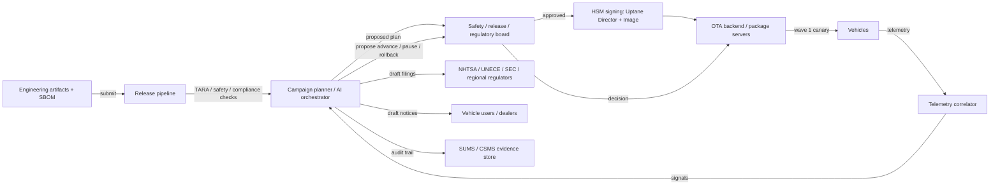

# Over-the-air vehicle software update orchestration

> **SAFE‑AUCA industry reference guide (draft)**
>
> This use case describes a real-world workflow at the center of modern vehicle fleet operations: AI-assisted over-the-air (OTA) software update orchestration. An AI-augmented system plans rollouts, selects cohorts, monitors telemetry during deployment, proposes pause / advance / rollback decisions, and drafts regulator and user-facing communications — across fleets of connected vehicles. This is **cyber-physical and safety-critical**: a bad update can affect braking, steering, ADAS, or high-voltage battery management across hundreds of thousands of vehicles in hours.
>
> It focuses on:
>
> * how the workflow works in practice (tools, data, trust boundaries, autonomy)
> * what can go wrong (defender-friendly kill chain)
> * how it maps to **SAFE‑MCP techniques**
> * what controls + tests make it safer
>
> **Defender-friendly only:** do **not** include operational exploit steps, payloads, or step-by-step attack instructions.  
> **No sensitive info:** do not include internal hostnames/endpoints, secrets, customer data, non-public incidents, or proprietary details.

---

## Metadata

| Field                | Value                                                            |
| -------------------- | ---------------------------------------------------------------- |
| **SAFE Use Case ID** | `SAFE-UC-0008`                                                   |
| **Status**           | `draft`                                                          |
| **Maturity**         | draft                                                            |
| **NAICS 2022**       | `31-33` (Manufacturing), `3361` (Motor Vehicle Manufacturing), `3363` (Motor Vehicle Parts Manufacturing), `5415` (Computer Systems Design and Related Services) |
| **Last updated**     | `2026-04-23`                                                     |

### Evidence (public links)

* [UN Regulation No. 156 — Software update and software update management system (UNECE WP.29)](https://unece.org/sites/default/files/2024-03/R156e%20%282%29.pdf)
* [UN Regulation No. 155 — Cyber security and cyber security management system (UNECE WP.29)](https://unece.org/sites/default/files/2023-02/R155e%20%282%29.pdf)
* [ISO 24089:2023 — Road vehicles — Software update engineering](https://www.iso.org/standard/77796.html)
* [NHTSA — Cybersecurity Best Practices for the Safety of Modern Vehicles (September 2022)](https://www.nhtsa.gov/document/cybersecurity-best-practices-safety-modern-vehicles-2022)
* [Uptane — A secure software update framework for ground vehicles](https://uptane.org/)
* [NHTSA Safety Recall 23V-838 — Tesla, ~2 million vehicles, Autopilot OTA remedy](https://static.nhtsa.gov/odi/rcl/2023/RCLRPT-23V838-8276.PDF)
* [TechCrunch — "A software update bricked Rivian infotainment systems" (November 2023)](https://techcrunch.com/2023/11/14/a-software-update-bricked-rivian-infotainment-systems/)
* [Miller & Valasek — Remote Exploitation of an Unaltered Passenger Vehicle (Jeep Cherokee, 2015)](https://illmatics.com/Remote%20Car%20Hacking.pdf)
* [Upstream Security — 2025 Global Automotive Cybersecurity Report](https://upstream.auto/reports/global-automotive-cybersecurity-report-2025/)
* [OWASP Top 10 for LLM Applications (2025)](https://genai.owasp.org/llm-top-10/)

---

## Minimum viable write-up (Seed → Draft fast path)

This document covers:

* Executive summary
* Industry context & constraints
* Workflow + scope
* Architecture (tools + trust boundaries + inputs)
* Operating modes
* Kill-chain table
* SAFE‑MCP mapping table
* Contributors + Version History

---

## 1. Executive summary (what + why)

**What this workflow does**  
An AI-assisted **OTA vehicle software update orchestration** system plans, stages, delivers, monitors, and adjudicates software updates across vehicle fleets. Typical capabilities include:

* compiling release candidates from engineering artifacts and running pre-deployment safety and security checks (TARA, SBOM diff, type-approval impact analysis per UN R156, ISO/SAE 21434, ISO 24089, ISO 26262)
* cohort / canary selection from telemetry — which VINs get the update first, then second, etc.
* signing update packages against Uptane / TUF role keys and distributing through secure backend infrastructure
* monitoring in-flight rollout telemetry (boot success, error codes, feature-health signals, crash reports)
* proposing pause / advance / rollback decisions based on in-flight signals
* drafting regulator filings (NHTSA Part 573, UN R155/R156 incident reports), dealer notifications, and vehicle-user communications
* feeding lessons into subsequent cycle (vulnerability management, SBOM updates)

Industry examples span OEM in-house programs (Tesla OTA, Rivian, Ford Power-Up / BlueCruise, GM vehicle software updates, Stellantis, BMW Remote Software Upgrade, Mercedes MB.OS, Hyundai/Kia, Volkswagen Group CARIAD, Toyota / Woven Arene, Polestar, Lucid) and OEM-adjacent platform vendors (Sibros, Aurora Labs, HARMAN OTA, Airbiquity, Excelfore, Bosch Automotive Cloud Suite, Continental, Cybellum for SBOM + regulatory compliance). Per Upstream Security's 2025 Global Automotive Cybersecurity Report, BYD alone shipped roughly 200 software updates in 2025 across its fleet — the operational cadence is now continuous.

**Why it matters (business value)**  
OTA update orchestration is the connective tissue between a vehicle manufacturer's software organization and its deployed fleet. Correctly run, it turns recalls from dealer-visit events measured in quarters into overnight fleet-wide remediation (NHTSA Safety Recall 23V-838 remedied ~2 million Tesla vehicles via OTA in December 2023). Incorrectly run, it does the opposite at the same scale.

**Why it's risky / what can go wrong**  
This workflow's defining trait, distinct from every other SAFE-AUCA use case authored to date, is that **it is cyber-physical, safety-critical, and fleet-scale**. Unlike SAFE-UC-0018 (read-only summarization), SAFE-UC-0011 (consumer-facing banking), SAFE-UC-0022 (SOC investigation), or SAFE-UC-0024 (privileged shell execution), a wrong action here can:

* disable **safety-related E/E systems** — ABS, ESC, traction control, ADAS, steering, braking (Ford Mustang Mach-E OTA was reported in 2024 to have degraded ABS/ESC/traction control on affected vehicles)
* **brick an entire fleet cohort** — Rivian's 2023.42.0 release in November 2023 left approximately 3% of the fleet with inoperative infotainment and driver displays due to wrong signing certificates in the shipped build
* **alter type-approval-relevant functional behavior** — triggering FMVSS non-compliance, UN regulation non-conformity, EU GSR2 exposure
* **embed a persistent backdoor** across hundreds of thousands of vehicles — because the update channel IS the persistence mechanism (Keen Security Lab's 2019 Tesla Autopilot research and the 2015 Miller-Valasek Jeep Cherokee remote exploit illustrate how this pipeline is a high-value target)
* **cause recallable injury or death** — the vehicles are moving machines weighing 1,500-4,000 kg operating at highway speeds

A defining inversion from prior UCs: **persistence is a safety control, not a hazard.** The ability to reliably roll back a bad update is the primary recovery mechanism. Stages of the kill chain where the agent is persuaded to **not** act (rollback denial) are as dangerous as stages where it over-acts.

The regulatory fabric is also unique to this workflow. UN Regulation No. 155 (Cybersecurity Management System / CSMS) and UN Regulation No. 156 (Software Update Management System / SUMS) have been mandatory for type approvals in UN ECE contracting parties since July 2022 for new types and July 2024 for all new registrations. Non-compliance has revoked homologation outright.

---

## 2. Industry context & constraints (reference-guide lens)

### Where this shows up

Common in:

* passenger-vehicle OEMs with connected vehicles in production (Tesla, Ford, GM, Stellantis, Toyota, Hyundai-Kia, Volkswagen Group, BMW, Mercedes-Benz, Rivian, Lucid, Polestar, BYD, NIO, Xpeng, Li Auto)
* commercial-vehicle and truck OEMs (Daimler Truck, PACCAR, Volvo Trucks, Scania)
* AV / robotaxi fleet operators (Waymo, Zoox, AV remnants at Cruise)
* Tier 1 ADAS / infotainment suppliers operating OTA pipelines on behalf of OEMs (Bosch, Continental, Magna, ZF, HARMAN, Aptiv)
* OTA platform vendors (Sibros, Aurora Labs, Airbiquity, Excelfore, HERE, Wind River)
* automotive cybersecurity platforms (Argus, Upstream, VicOne, Cybellum, Karamba, Guardknox)
* certified independent test services and type-approval bodies (TÜV, SGS, DEKRA, UTAC, JIC, CATARC for CN)

### Typical systems

* vehicle-side: HSM, secure boot, bootloader, primary ECU (Uptane Primary), secondary ECUs (Uptane Secondaries), HV battery management, ADAS ECUs, infotainment/HUI, telematics control unit (TCU), CAN / Ethernet in-vehicle networks
* backend: package build pipelines, signing infrastructure (HSM-backed), Uptane / TUF repositories (Director + Image), campaign orchestrator, telemetry ingestion, fleet management console, ticketing and recall-management, SBOM registry
* regulatory-facing systems: RXSWIN tracking, type-approval documentation management, NHTSA Part 573 filing tooling, UN R155/R156 SUMS audit evidence
* AI/ML: campaign-planning models, cohort-selection models, anomaly detection on telemetry, LLM-based operator consoles, incident-report drafting assistants

### Constraints that matter

* **Safety-critical by construction.** A software change can alter the ISO 26262 ASIL-classified safety argument for the vehicle. Impact analysis is not optional.
* **Regulated type approval.** UN R155 (CSMS) and UN R156 (SUMS) are mandatory for UN ECE contracting parties. Non-compliance revokes homologation. EU GSR2 transposes these. China GB 44495 / 44496 / 44497 are mandatory for intelligent connected vehicles from January 2026. Japan MLIT transposed UN R155/R156 in January 2021.
* **Fleet scale.** A single campaign can reach ≥1 million vehicles. Blast radius is an order of magnitude beyond software-only workflows.
* **Supply-chain exposure.** Build pipelines, code-signing keys (Uptane/TUF root keys), SBOM integrity, ECU firmware signing — every supplier in the chain is in scope (NHTSA 2022 Best Practices, ISO/SAE 21434 Clause 7 distributed cybersecurity activities / DIA).
* **Incident-reporting obligations.** UN R155 CSMS requires monitoring and reporting; R156 SUMS includes incident / anomaly disclosure; NHTSA Part 573 defect and non-compliance reporting timelines; EU 2018/858 in-service conformity; SEC cybersecurity disclosure for publicly-traded OEMs.
* **User-safety communication.** UN R156 §7.2 and NHTSA Part 573 owner notification obligations apply to the vehicle user (not just the regulator).
* **Rollback is a control, not a fallback.** The ability to reliably roll back a bad update is the primary safety recovery path — not an optional nice-to-have.

### Must-not-fail outcomes

* deploying an update that degrades a safety-related E/E function without a complete, signed-off safety argument (ISO 26262 ASIL impact analysis)
* deploying a compromised update artifact (supply-chain poisoning or signing-key compromise)
* shipping an update that violates type-approval parameters without recertification (UN R156 §7.2 impact analysis; EU 2018/858 in-service conformity)
* refusing or obstructing rollback when field signals indicate harm
* bricking a fleet cohort through wrong artifact / wrong certificate / wrong ECU mapping
* missing a regulated disclosure (UN R155 CSMS incident notification; NHTSA Part 573 timeline; SEC Item 1.05 materiality for public OEMs; EU NIS 2 Article 23 for essential entities)
* silently backdooring vehicles via the update channel

---

## 3. Workflow description & scope

### 3.1 Workflow steps (happy path)

1. Engineering artifacts (firmware images, SBOMs, test reports, safety case updates, regulatory impact analyses) are submitted into the release pipeline.
2. The orchestrator runs pre-deployment checks: ISO/SAE 21434 TARA delta, ISO 24089 impact analysis, ISO 26262 ASIL revalidation, FMVSS / UN / GB compliance diff, SBOM vulnerability scan, Uptane / TUF role signing.
3. The orchestrator proposes a cohort strategy — typical pattern: internal fleet → employee / developer → small external canary (0.1-1%) → progressive waves (5% → 25% → 100%) — with explicit safety gates between each wave.
4. A human safety / release board reviews the plan, safety argument, TARA, and monitoring plan; approves, rejects, or requests changes.
5. Release is signed against Uptane Director + Image repository roles (HSM-backed keys) and distributed through the OTA backend.
6. Canary wave executes. Telemetry streams back: boot success, error rates, feature health, crash events, owner-facing complaints. The orchestrator monitors against pre-declared thresholds.
7. The orchestrator proposes advance / pause / rollback based on in-flight signals; humans (safety officer, release captain, regulatory lead) retain the authority to accept or override.
8. Subsequent waves execute with continuous monitoring and the same human gate pattern.
9. Post-deployment: SBOM registry updated, RXSWIN updated, NHTSA Part 573 filed where the update is a recall remedy, UN R155/R156 incident log updated if any events occurred, lessons fed into the next release cycle.
10. Vehicle-user communication (per UN R156 §7.2 and applicable regional requirements) — pre-update notice, during-update state, post-update confirmation and rollback-availability disclosure.

### 3.2 In scope / out of scope

* **In scope:** release pipeline planning; campaign orchestration; Uptane / TUF signing and distribution; in-flight telemetry monitoring; proposed advance / pause / rollback; regulator filing drafting; user communication drafting; SBOM maintenance; post-deployment audit evidence assembly.
* **Out of scope:** autonomous deployment of safety-related E/E changes without human safety signoff; autonomous waiver of type-approval parameters; unsupervised signing of release artifacts; regulator communications without a named human signer; silent rollback without user disclosure.

### 3.3 Assumptions

* The OEM operates a certified CSMS under UN R155 and SUMS under UN R156 (where applicable to the vehicle's type-approval jurisdiction).
* ISO/SAE 21434, ISO 24089, ISO 26262 processes are in place and the AI orchestrator operates within them — not around them.
* Uptane or an equivalent role-separated signing architecture is in production; HSM-backed key management is the norm, not the exception.
* Code signing roles are held by separate principals; no single credential authorizes fleet-wide deploy without multi-party authorization.
* Functional-safety accountability remains with a named human safety officer; the orchestrator proposes and reports.

### 3.4 Success criteria

* Every deployed package has a traceable chain of: engineering artifact → SBOM → TARA / safety-case evaluation → signed packages → distribution → vehicle-level install confirmation.
* Zero deployments that violate type-approval parameters without recertification.
* Zero deployments that degrade a safety-related E/E function without a signed safety argument.
* Rollback works within declared time window across the cohort and is exercised regularly.
* Every regulated incident is filed within obligation timelines (NHTSA Part 573, UN R155/R156, SEC Item 1.05, NIS 2, regional equivalents).
* Vehicle users receive required pre- and post-update disclosures per UN R156 §7.2 and regional equivalents.

---

## 4. System & agent architecture

### 4.1 Actors and systems

* **Human roles:** safety officer (ISO 26262 accountability), cybersecurity officer (UN R155 CSMS), software-update manager (UN R156 SUMS), release captain, regulatory lead, product-line lead, quality assurance, dealer service operations, customer service, executive approver for fleet-scale actions.
* **Agent / orchestrator:** the OTA planning-and-monitoring system — campaign planner, cohort selector, telemetry correlator, decision proposer, report drafter.
* **LLM runtime:** typically on-premise or private-cloud foundation model for operator consoles, release-note generation, regulator-filing drafting.
* **Tools (MCP servers / APIs / connectors):** build-pipeline artifact API, SBOM registry, signing service (HSM-backed), Uptane Director + Image repositories, fleet-management console, telemetry ingestion, ticketing, recall-management, regulatory-filing toolchains.
* **Data stores:** engineering artifacts, SBOMs, TARA / safety-case documents, campaign plans, telemetry time-series, recall records, user-communication templates, RXSWIN ledger.
* **Downstream systems affected:** millions of vehicles and their safety-related ECUs — braking, steering, ADAS, HV battery, occupant protection, lighting, emissions.

### 4.2 Trusted vs untrusted inputs

| Input / source                                  | Trusted?          | Why                                               | Typical failure / abuse pattern                                            | Mitigation theme                                              |
| ----------------------------------------------- | ----------------- | ------------------------------------------------- | -------------------------------------------------------------------------- | ------------------------------------------------------------- |
| Build artifacts + SBOMs                         | Semi-trusted      | produced by internal pipelines, supplier chains  | supply-chain compromise, unsigned component swap                           | reproducible builds; SBOM signing; integrity attestation      |
| Code-signing keys (Uptane / TUF roots)          | Crown-jewel       | root of trust for vehicle-side verification      | key compromise; HSM misuse; root-role substitution                         | HSM-only; threshold signing; role separation; offline root    |
| Third-party supplier firmware                   | Semi-trusted      | outside the OEM's direct security perimeter      | Tier-N compromise; non-conforming DIA                                      | ISO/SAE 21434 Clause 7 DIA; SBOM + vulnerability scan         |
| In-flight vehicle telemetry                     | Semi-trusted      | from vehicles that may already be compromised    | telemetry poisoning; fabricated "update succeeded" signals                 | statistical anomaly detection; independent sampling; crypto-signed telemetry |
| User-submitted reports / feedback               | Untrusted         | external                                          | brigading, false reports, injection in free-text fields                    | treat as data; quote-isolate; verify against telemetry        |
| LLM output (release notes, regulator filings)   | Untrusted         | probabilistic                                      | hallucinated safety case; fabricated SBOM entry; wrong RXSWIN               | grounded retrieval; source-artifact citation; verifier step   |
| Public threat-intel and researcher disclosures  | Semi-trusted      | useful but mixed quality                          | feed poisoning; false-positive engineering                                 | provenance weighting; cross-reference Auto-ISAC / CERT       |
| MCP server tool descriptions                    | Semi-trusted      | authored upstream                                  | tool-description poisoning (Invariant Labs, April 2025)                     | pin and sign manifests; registry verification                  |
| Recall / regulator communications               | Authoritative     | regulator-originated                               | phishing masquerading as regulator contact                                  | out-of-band authentication; established contact channels      |

### 4.3 Trust boundaries

Teams commonly model eight boundaries when reasoning about this workflow:

1) **Build-pipeline / supply-chain boundary**  
Everything from source-code commit through artifact build, SBOM generation, and package signing is a trust boundary. Compromise here compromises every downstream vehicle.

2) **Code-signing / HSM boundary**  
Uptane / TUF root and targeting keys are held in HSMs with role separation. The orchestrator never holds a root key directly.

3) **Campaign-authorization boundary**  
Fleet-scale deployment requires multi-party authorization — no single principal (human or agent) can push to the full fleet.

4) **Safety-case boundary**  
Any update touching a safety-related E/E system goes through ISO 26262 ASIL-appropriate re-validation with named human signoff. The agent proposes; safety officer signs.

5) **Type-approval boundary**  
UN R156 §7.2 and EU 2018/858 define changes that require recertification or RXSWIN increment. The orchestrator flags; regulatory lead decides.

6) **Telemetry-trust boundary**  
Vehicle telemetry is cryptographically attributed but may come from a compromised endpoint. Rollout decisions triangulate multiple signals; no single source is authoritative.

7) **Rollback boundary**  
Rollback is an authorized action with its own gating — prevents unauthorized "undo" from erasing incident evidence, while ensuring legitimate rollback is fast and reliable.

8) **User / regulator communication boundary**  
All external communication (user notifications, NHTSA Part 573 filings, UN R155/R156 incident reports, SEC disclosures) goes through named human signers. The orchestrator drafts; humans sign.

### 4.4 High-level flow (illustrative)

### 4.5 Tool inventory

Typical tools (names vary by OEM / platform):

| Tool / MCP server                | Read / write?   | Permissions                                  | Typical inputs                          | Typical outputs                                | Failure modes                                                                 |
| -------------------------------- | --------------- | -------------------------------------------- | --------------------------------------- | ---------------------------------------------- | ----------------------------------------------------------------------------- |
| `artifact.registry.read`         | read            | release-train scoped                         | artifact id, ECU target                 | signed artifact + SBOM                         | supply-chain compromise; unsigned swap                                        |
| `sbom.diff`                      | read            | release-scoped                               | old + new SBOM                          | component delta + CVE matches                  | stale vulnerability feed; missed transitive dep                                |
| `tara.evaluate`                  | read/compute    | release-scoped                               | asset model + attack library            | TARA delta; risk determination                  | incomplete threat catalog; miscategorized assets                               |
| `asil.revalidate`                | read/compute    | release-scoped                               | safety case + change manifest           | ASIL impact report                             | hallucinated safety case; missing hazard analysis                              |
| `uptane.sign` (HSM-backed)       | write           | role-separated; offline-root-held quorum      | artifact hash + target metadata         | signed target                                  | HSM misuse; role-substitution attempt                                          |
| `campaign.create`                | write           | gated; named signer                          | cohort rules + schedule                  | campaign id                                    | cohort manipulation via poisoned telemetry                                     |
| `campaign.advance` / `pause` / `rollback` | write   | gated; named signer; step-up for fleet-scale | campaign id + decision rationale         | state transition                                | wrong decision from poisoned signals; rollback denial                          |
| `telemetry.query`                | read            | tenant-scoped; rate-limited                  | time window + filter                    | aggregated metrics / crash records              | telemetry poisoning; fabricated signals                                        |
| `recall.file.part573`            | write           | named human signer                           | defect description + remedy              | Part 573 filing                                 | misfiling; timeline miss                                                       |
| `unece.incident.report`          | write           | named human signer                           | incident description + CSMS evidence     | R155 / R156 filing                              | omission; disinformation in narrative                                          |
| `user.notification.send`         | write           | named signer; template-grounded              | cohort + template id                     | message dispatch                                | inaccurate disclosure; missed regional obligation                              |
| `rxswin.update`                  | write           | release-scoped                               | RXSWIN id + new value                    | updated ledger                                  | out-of-sync RXSWIN; type-approval drift                                        |

### 4.6 Governance & authorization matrix

| Action category                                   | Example actions                                            | Allowed mode(s)                             | Approval required?                          | Required auth                                    | Required logging / evidence                                                  |
| ------------------------------------------------- | ---------------------------------------------------------- | ------------------------------------------- | ------------------------------------------- | ------------------------------------------------ | ---------------------------------------------------------------------------- |
| Read-only planning                                | TARA, SBOM diff, ASIL review, telemetry query              | manual / HITL / autonomous                  | no                                           | release-train role                                | query + retrieval set                                                         |
| Campaign plan drafting                            | propose cohort, schedule, thresholds                        | manual / HITL / autonomous                  | board review before execution               | release-train role                                | plan hash + source artifact citations                                         |
| Signing a release artifact                        | Uptane / TUF sign                                          | manual only — quorum, HSM-backed            | always; multi-party                          | HSM + named signers                              | quorum evidence; HSM audit log                                                |
| Deploying canary (≤1% fleet)                     | execute narrow cohort                                      | HITL                                        | release captain + safety officer             | scoped deployer role                              | campaign audit; telemetry snapshots                                           |
| Advancing to next wave                            | escalate cohort                                            | HITL                                        | release captain                              | scoped role                                       | decision rationale + telemetry evidence                                       |
| Fleet-scale deploy                                | push to ≥25% or full fleet                                 | HITL — multi-party                          | always — safety + cyber + regulatory leads   | step-up auth                                      | immutable multi-party audit                                                   |
| Rollback                                          | revert a canary / wave / full campaign                     | HITL                                        | release captain (canary); multi-party (fleet)| scoped role                                       | rollback audit; user-disclosure audit                                         |
| NHTSA Part 573 filing / UN R155 / R156 filing     | draft + submit                                             | manual — named signer                       | always — human signer                        | regulatory-lead credential                        | version history + signature                                                   |
| Signing key handling                              | root, targeting, snapshot, timestamp roles                 | manual — HSM only                           | multi-party for root                         | HSM policy                                        | HSM audit log                                                                 |
| Type-approval impact action                       | RXSWIN change; EU 2018/858 recertification trigger         | manual — regulatory lead                    | always                                       | regulatory-lead credential                        | type-approval doc + regulator correspondence                                  |
| User / dealer communication                       | pre-update notice, during-update state, post-update note    | manual signer — template-grounded           | yes — named signer                           | comms-lead credential                             | versioned draft + dispatch records                                             |
| Emergency pause (all campaigns)                   | global kill switch                                         | manual                                      | safety officer + cyber officer               | step-up auth                                      | immutable reason + scope                                                      |

### 4.7 Sensitive data & policy constraints

* **Data classes:** build artifacts, SBOMs, TARA and safety-case documents, Uptane / TUF role keys (crown-jewel), vehicle telemetry (including driver-behavior data subject to privacy regimes), campaign plans, recall records, RXSWIN ledger.
* **Retention and logging:** preserve originals as cryptographic evidence for type-approval audits (UN R155/R156 require CSMS/SUMS evidence retention); Uptane metadata archives; HSM audit logs; campaign decision audit; user-communication archive. Retention horizons span the vehicle's expected life (often 15+ years).
* **Regulatory constraints:** the workflow commonly operates under multiple overlays — UN R155 (CSMS) and R156 (SUMS) as the core; ISO/SAE 21434 and ISO 24089 as engineering companions; ISO 26262 for functional safety; EU GSR2 (2019/2144) + 2018/858 (type approval); NHTSA FMVSS + Cybersecurity Best Practices 2022 + Part 573; China GB 44495/44496/44497; Japan MLIT transposition. NIS 2 for EU-essential entities, SEC Item 1.05 for publicly-traded OEMs.
* **Output policy:** regulator filings and user notifications surface verbatim from approved templates where regulation requires specific language; AI-drafted content is clearly labeled AI-drafted in internal workflow and de-labeled only after named human signoff; safety-argument claims require source-artifact citation (hazard analysis, FMEA, FTA).

---

## 5. Operating modes & agentic flow variants

### 5.1 Manual baseline (no AI orchestrator)

Engineering teams manage releases through traditional release-train tooling. Campaign orchestration is spreadsheet-driven; telemetry is reviewed in engineering-only tools; regulator filings are drafted by humans. Existing safeguards — multi-party signing, safety-case review boards, type-approval discipline, recall-filing protocols — continue to apply.

**Risks:** slow, inconsistent under cadence pressure, vulnerable to human error under time constraint, error-prone on regulator-filing timelines.

### 5.2 AI as drafter (proposal-only)

The orchestrator drafts campaign plans, release notes, telemetry summaries, and regulator filings; humans make all decisions and execute all actions. No AI-driven tool calls affect production vehicles.

**Risk profile:** bounded by human reviewer capacity. Most regulated OEMs operate here as the default.

### 5.3 HITL per-action (common for advance / pause / rollback decisions)

The orchestrator proposes individual actions — cohort composition, schedule adjustment, advance / pause / rollback — and named humans approve each before execution. Signing, fleet-scale deploy, and regulator filings remain multi-party manual.

**Risk profile:** moderate; turns on UI discipline and on the resistance to consent-fatigue during long rollout windows.

### 5.4 Autonomous on a narrow allow-list (bounded autonomy)

An explicitly allow-listed set of low-risk actions — e.g., advancing internal-only fleet from wave 1 to wave 2 based on pre-declared thresholds, automatic pause on telemetry-alert patterns — executes without per-action human approval. Anything touching external customer fleet, signing, regulator filings, or safety-case changes remains HITL or manual.

**Risk profile:** depends on allow-list quality and on the agent's resistance to telemetry-poisoning attacks that could satisfy its thresholds under adversarial conditions.

### 5.5 Fully autonomous with guardrails (rare for external customer fleets)

End-to-end autonomous campaign execution with post-hoc human review. Rare for production customer fleets. Occasionally used in internal-fleet scenarios (employee validation fleets, non-safety-related infotainment-only updates) with very strong rollback SLAs and kill switches.

**Risk profile:** highest. Incompatible with most OEMs' current interpretation of UN R156 SUMS accountability requirements and ISO 26262 named-human safety accountability.

### 5.6 Variants

Architectural variants teams reach for:

1. **Planner / safety-verifier / executor split** — separate agents for campaign planning, safety-case verification, and execution, with narrowest possible tool scope per agent.
2. **Dual-signing quorum** — every release artifact requires signatures from at least two named signers plus HSM policy satisfaction.
3. **Shadow-fleet / digital-twin dry-run** — the update executes against a digital-twin or bench fleet with representative ECU stacks before any customer vehicle receives it.
4. **Independent safety monitor (ISM)** — a separately-authored, independently-developed monitor watches campaign behavior against a non-overlapping signal set and can trigger global pause.
5. **Progressive rollout gates tied to ISO 26262 ASIL** — stricter gates (higher wave latency, more monitoring, more approvals) for ASIL-B/C/D-relevant changes than for QM or non-safety-related changes.

---

## 6. Threat model overview (high-level)

### 6.1 Primary security & safety goals

* prevent deployment of compromised, malformed, or non-compliant update artifacts
* prevent AI-assisted decision manipulation that advances a bad update or denies a needed rollback
* preserve the integrity of the Uptane / TUF trust model (role separation, key hygiene)
* keep safety-case accountability with a named human; the agent proposes and reports
* meet regulated disclosure timelines (UN R155/R156, NHTSA Part 573, SEC Item 1.05, NIS 2, regional)
* preserve vehicle-user safety disclosure obligations (UN R156 §7.2 and regional)

### 6.2 Threat actors (who might attack or misuse)

* **Nation-state actor** targeting supply chain, signing infrastructure, or fleet-scale persistence (vehicle fleets as strategic asset)
* **Criminal actor** pursuing ransom, dealer-SaaS compromise (Upstream 2025 report cites a $1.02B loss event in this category)
* **Insider threat** — engineering staff or supplier with pipeline access
* **Compromised supplier / Tier-N** — unsigned component swap, backdoored firmware
* **Public-safety researchers** (historically the honest signal — Miller/Valasek 2015, Keen Lab 2019) — the workflow is expected to respond responsibly to coordinated disclosure
* **Civil adversaries** — bad-faith owners attempting to manipulate recall / owner-notification flows

### 6.3 Attack surfaces

* build pipeline, source-code repositories, CI/CD runners
* Uptane / TUF signing infrastructure and HSM access paths
* package-distribution backend and CDN
* vehicle-side TCU, gateway ECU, HSM, bootloader, Uptane Primary and Secondaries
* telemetry ingestion pipelines
* dealer / service-tool interfaces
* AI orchestrator: prompts, tool descriptions, vector stores over incident corpora
* regulator-filing and owner-notification tooling

### 6.4 High-impact failures (include industry harms)

* **Customer / consumer harm:** vehicle immobilized (brick) or with degraded safety-related function; physical injury from unsafe ADAS behavior; privacy breach of driver-behavior telemetry.
* **Business harm:** homologation revoked for affected types (UN R155/R156 non-conformity); fleet-wide recall with remedy-verification scrutiny (NHTSA RQ-class investigations, as with Tesla 23V-838 → RQ24009); class-action litigation; SEC disclosure exposure; earnings impact at OEM scale (Volkswagen Group's CARIAD has publicly reported billions of euros in operating losses tied to software-platform challenges, per InsideEVs coverage).
* **Security harm:** persistent backdoor across hundreds of thousands of vehicles; Uptane root-role compromise; cross-OEM supply-chain cascade via shared suppliers.

---

## 7. Kill-chain analysis (stages → likely failure modes)

> Keep this defender-friendly. Describe patterns, not "how to do it."
>
> Note: this UC uses an **eight-stage kill chain** — one stage more than the typical SAFE-AUCA default of 6-7. The extra stage is warranted because supply-chain compromise, signing-key access, and persistence-via-update-channel are each genuinely distinct threat stages for cyber-physical workflows and compressing them loses defender signal. Each stage below is annotated `novel vs 0018 / 0024 / 0011 / 0022` where the pattern didn't apply to prior use cases.

| Stage                                                          | What can go wrong (pattern)                                                                                                | Likely impact                                                                 | Notes / preconditions                                                                |
| -------------------------------------------------------------- | -------------------------------------------------------------------------------------------------------------------------- | ----------------------------------------------------------------------------- | ------------------------------------------------------------------------------------ |
| 1. Supply-chain / build-pipeline compromise                   | Malicious code injected via build pipeline, compromised CI runner, Tier-N supplier firmware, or poisoned tool manifest       | compromised release candidate enters the signing queue                        | **novel vs 0018/0024/0011/0022** — build pipelines were out of scope                  |
| 2. Code-signing key or schema credential access                | HSM policy bypass; signing-role substitution; compromised maintainer with signing privileges                                 | unauthorized signing capability                                               | **novel** — Uptane / TUF root keys are the crown jewels                                |
| 3. Persistent backdoor staged via update                       | Trojanized firmware signed and distributed; the update channel itself becomes the persistence mechanism                    | backdoor reaches fleet-scale endpoints with full trust                         | **novel** — update-channel-as-persistence inverts prior UC risk models                |
| 4. Cohort-selection manipulation via poisoned telemetry        | Adversary poisons vehicle-health signals to steer target VINs into (or out of) a specific wave                              | targeted or decoy cohort harm; pre-positioning for later stages                | **novel** — cohort selection is unique to fleet orchestration                          |
| 5. Functional-safety (ISO 26262 ASIL) gate bypass              | Agent persuaded to advance a change without complete ASIL impact analysis; safety-case argument incomplete or hallucinated   | deployed change degrades a safety-related function                             | **novel** — safety-case coupling is unique to cyber-physical workflows                 |
| 6. Telemetry-poisoning-driven rollout advance                  | Fabricated "update succeeded" signals convince the orchestrator to advance through waves                                     | bad update escalates from canary to fleet-scale                                | **novel** — "advance" is the dangerous direction here, inverse of prior UCs            |
| 7. Rollback denial and reporting obfuscation                   | Agent persuaded not to roll back when field signals warrant; filing narrative hides the decision chain                      | prolonged harm in field; regulator filings misrepresent timeline or cause    | **novel** — inaction is the failure, and reports are manipulated to match              |
| 8. Regulatory-reporting failure + mass impact                  | NHTSA Part 573 timeline missed; UN R155/R156 incident not filed; SEC disclosure omitted or inaccurate; user notice skipped  | homologation exposure; enforcement action; class-action liability; injury     | **novel** — regulated-reporting-as-kill-chain-terminus                                 |

---

## 8. SAFE‑MCP mapping (kill-chain → techniques → controls → tests)

Practitioners commonly map this workflow's failure patterns to the following SAFE‑MCP techniques. The mapping is directional — teams adapt it to their stack, threat model, regulatory regime, and vehicle class. Links in Appendix B resolve to the canonical technique pages.

| Kill-chain stage                                         | Failure / attack pattern (defender-friendly)                                                                                | SAFE‑MCP technique(s)                                                                                                                                                                                                  | Recommended controls (prevent / detect / recover)                                                                                                                                                                                                                                                                                                                                                                                        | Tests (how to validate)                                                                                                                                                                                                                                                                                                                                                                                          |
| -------------------------------------------------------- | --------------------------------------------------------------------------------------------------------------------------- | ----------------------------------------------------------------------------------------------------------------------------------------------------------------------------------------------------------------------- | ---------------------------------------------------------------------------------------------------------------------------------------------------------------------------------------------------------------------------------------------------------------------------------------------------------------------------------------------------------------------------------------------------------------------------------------- | ---------------------------------------------------------------------------------------------------------------------------------------------------------------------------------------------------------------------------------------------------------------------------------------------------------------------------------------------------------------------------------------------------------------- |
| Supply-chain / build-pipeline compromise                 | Malicious code, unsigned component swap, poisoned manifest enters the build                                                  | `SAFE-T1002` (Supply Chain Compromise); `SAFE-T1001` (Tool Poisoning Attack (TPA)); `SAFE-T1003` (Malicious MCP-Server Distribution); `SAFE-T1203` (Backdoored Server Binary)                                           | reproducible builds; build-attestation (SLSA-style); SBOM generation and signing at build time; Uptane / TUF signing of all artifacts; supplier DIA per ISO/SAE 21434 Clause 7; vulnerability scanning against SBOM                                                                                                                                                                                                                       | red-team exercises against the build pipeline; integrity verification of reproducibly-built artifacts; SBOM signature validation; in-toto attestation replay                                                                                                                                                                                                                                                     |
| Code-signing key or schema credential access             | HSM policy bypass; role substitution; privilege escalation to signing tools                                                 | `SAFE-T1501` (Full-Schema Poisoning (FSP)); `SAFE-T1502` (File-Based Credential Harvest); `SAFE-T1503` (Env-Var Scraping); `SAFE-T1408` (OAuth Protocol Downgrade)                                                       | HSM-only signing with threshold quorum; role separation per Uptane (root / targets / snapshot / timestamp / image); offline root; short-lived credentials for automation; environment-variable scrubbing; no signing credentials reachable from the orchestrator                                                                                                                                                                          | simulated HSM policy breach; quorum-satisfaction verification; role-substitution detection; credential-harvest attempt against orchestrator runtime                                                                                                                                                                                                                                                               |
| Persistent backdoor staged via update                    | Trojanized firmware signed and distributed; update channel becomes the persistence mechanism                                | `SAFE-T1203` (Backdoored Server Binary); `SAFE-T1205` (Persistent Tool Redefinition); `SAFE-T1202` (OAuth Token Persistence); `SAFE-T1204` (Context Memory Implant)                                                      | reproducible builds that can be independently re-attested; dual-maintainer review for all safety-relevant changes; independent security scan prior to signing; in-vehicle attestation on boot; Uptane rollback protection against version downgrade                                                                                                                                                                                       | supply-chain compromise simulation on a dev pipeline; in-vehicle attestation verification; version-downgrade protection tests                                                                                                                                                                                                                                                                                    |
| Cohort-selection manipulation via poisoned telemetry     | Telemetry poisoning steers target VINs into or out of specific waves                                                        | `SAFE-T1102` (Prompt Injection (Multiple Vectors)); `SAFE-T1309` (Privileged Tool Invocation via Prompt Manipulation); `SAFE-T1402` (Instruction Stenography - Tool Metadata Poisoning); `SAFE-T2106` (Context Memory Poisoning via Vector Store Contamination) | cryptographically-signed telemetry; multi-source triangulation for cohort decisions; statistical anomaly detection on telemetry distributions; named human review of cohort composition before fleet-scale wave                                                                                                                                                                                                                           | adversarial telemetry fixture library; verify cohort decisions resist injected signals; verify signed-telemetry validation works                                                                                                                                                                                                                                                                                  |
| Functional-safety (ASIL) gate bypass                     | Agent advances a change without complete ISO 26262 impact analysis; hallucinated or incomplete safety case                  | `SAFE-T1309` (Privileged Tool Invocation via Prompt Manipulation); `SAFE-T1401` (Line Jumping); `SAFE-T1104` (Over-Privileged Tool Abuse); `SAFE-T1302` (High-Privilege Tool Abuse); `SAFE-T2105` (Disinformation Output) | hard policy-as-code gate on safety-related changes; grounded-retrieval-only safety-case text with source-artifact citation; named safety-officer signoff; ISO 26262 change-impact analysis mandatory precursor; AI-drafted safety claims labeled AI-drafted until human attestation                                                                                                                                                      | adversarial prompt-injection fixtures against the safety-case drafter; verify gate rejects incomplete impact analysis; verify hallucinated ASIL claims fail the verifier step                                                                                                                                                                                                                                    |
| Telemetry-poisoning-driven rollout advance               | Fabricated "update succeeded" signals escalate a bad rollout through waves                                                  | `SAFE-T1702` (Shared-Memory Poisoning); `SAFE-T2106` (Context Memory Poisoning via Vector Store Contamination); `SAFE-T2107` (AI Model Poisoning via MCP Tool Training Data Contamination); `SAFE-T1201` (MCP Rug Pull Attack) | cryptographic attestation on telemetry; statistical-outlier detection on wave-level success signals; independent safety monitor (ISM) running on non-overlapping signal set; decision thresholds require multi-signal agreement                                                                                                                                                                                                           | inject fabricated "success" signals and verify orchestrator pauses rather than advances; verify independent safety monitor triggers against a blind signal set                                                                                                                                                                                                                                                   |
| Rollback denial and reporting obfuscation                | Agent dissuaded from rollback; filing narrative hides decision chain                                                         | `SAFE-T1404` (Response Tampering); `SAFE-T2105` (Disinformation Output); `SAFE-T1403` (Consent-Fatigue Exploit)                                                                                                        | rollback is a first-class action with its own SLA and exercise regime; filing narrative must cite tool-call audit log verbatim; AI-drafted filings labeled; named human signer attestation before submission; dual-person integrity review on any rollback-deferral decision                                                                                                                                                              | tabletop exercise on rollback-deferral; verify filing narrative matches tool-call audit; attestation integrity check                                                                                                                                                                                                                                                                                              |
| Regulatory-reporting failure + mass impact               | NHTSA Part 573 timeline missed; UN R155/R156 filing omitted; SEC Item 1.05 inaccurate; mass vehicle brick or harm             | `SAFE-T2101` (Data Destruction); `SAFE-T2102` (Service Disruption via External API Flooding); `SAFE-T2103` (Code Sabotage via Malicious Agentic Pull Request); `SAFE-T2105` (Disinformation Output)                    | pre-mapped regulator-filing paths per jurisdiction; countdown timers tied to materiality determination; template-grounded filings with verbatim legal language; named signer for every external submission; post-incident review SLA; regulator-notification test exercises                                                                                                                                                                | regulator-filing tabletop per jurisdiction (NHTSA, UNECE, SEC, EU CAs); verify template grounding catches hallucinated legal language; verify timeline integrity from materiality → filing                                                                                                                                                                                                                          |

---

## 9. Controls & mitigations (organized)

### 9.1 Prevent (reduce likelihood)

* **Uptane / TUF adoption** — role-separated signing (root / targets / snapshot / timestamp / image) with HSM-backed keys, offline root, and threshold signing for production.
* **Reproducible builds + SBOM signing** — every artifact is independently re-buildable and its SBOM is signed at build time; NTIA Minimum Elements + CycloneDX / SPDX.
* **Supplier DIA per ISO/SAE 21434 Clause 7** — distributed cybersecurity activities explicitly allocated to each supplier in the chain.
* **Policy-as-code safety gates** — ISO 26262 ASIL impact analysis is a hard precondition for safety-related changes; the orchestrator cannot bypass.
* **Type-approval impact analysis per UN R156 §7.2** — every change is evaluated for RXSWIN impact, type-approval conformity, and regulatory-disclosure trigger before signing.
* **Multi-party authorization** — signing and fleet-scale deploy require at least two named humans; no single principal authorizes.
* **Cryptographically-signed telemetry** — vehicles sign their telemetry; the orchestrator cross-validates signatures.
* **Grounded-retrieval-only for safety and regulatory text** — claims the agent makes must cite source artifacts (hazard analyses, safety cases, regulatory templates); ungrounded assertions fail closed.
* **Egress allow-list** for any external communication (regulator APIs, user notifications).

### 9.2 Detect (reduce time-to-detect)

* in-vehicle attestation on boot after update; attestation failures alert fleet-wide
* statistical-outlier detection on wave-level success signals
* independent safety monitor (ISM) running on a non-overlapping signal set
* SBOM vulnerability-scan monitoring against continuous feeds
* anomaly detection on build-pipeline timing, signing-role usage, HSM access patterns
* consent-rate monitoring on approval consoles
* RXSWIN drift detection (deployed RXSWIN vs registered RXSWIN)
* regulator-filing-timer integrity checks (materiality-to-filing latency)

### 9.3 Recover (reduce blast radius)

* rehearsed rollback SLAs per wave class
* Uptane version-downgrade protection with explicit "roll-back to specific-version-N" primitive rather than "reject all updates"
* emergency-pause kill switch for all active campaigns, owned by safety officer + cyber officer
* SBOM-based rapid vulnerability-response path (identify affected vehicles, stage fix)
* regulator-notification playbook per jurisdiction pre-mapped with countdown SLAs
* post-incident review playbook explicitly for AI-orchestrator-originated incidents
* coordinated-disclosure process for responsibly-disclosed vulnerabilities (researchers, Auto-ISAC)

---

## 10. Validation & testing plan

### 10.1 What to test (minimum set)

* **Build-pipeline integrity** — reproducible-build attestation; SBOM signature validation; supplier DIA verification.
* **Signing-quorum integrity** — HSM policy enforcement; threshold quorum satisfaction; role-substitution detection.
* **ASIL gate enforcement** — the orchestrator cannot advance a safety-related change without complete ISO 26262 impact analysis.
* **Type-approval gate enforcement** — UN R156 §7.2 impact analysis is a hard precondition for any change that may alter type-approval parameters.
* **Telemetry-poisoning robustness** — fabricated "update succeeded" signals do not cause the orchestrator to advance.
* **Adversarial cohort manipulation resistance** — poisoned telemetry cannot steer specific VINs into or out of a wave.
* **Rollback SLAs** — every wave class has a rehearsed rollback path that meets declared time windows.
* **Regulator-filing integrity** — filings match tool-call audit log; named human signer attestation; template-grounded language.
* **User-communication integrity** — UN R156 §7.2 and regional disclosures are accurate and timely.
* **Independent safety monitor** — ISM triggers correctly on a blind signal set.

### 10.2 Test cases (make them concrete)

| Test name                              | Setup                                                        | Input / scenario                                                                                       | Expected outcome                                                                                                       | Evidence produced                              |
| -------------------------------------- | ------------------------------------------------------------ | ------------------------------------------------------------------------------------------------------ | ---------------------------------------------------------------------------------------------------------------------- | ---------------------------------------------- |
| Supply-chain compromise simulation     | Staged compromise of CI runner on dev pipeline               | malicious commit / build-plugin tries to inject unsigned component                                     | reproducible-build attestation fails; SBOM signature mismatch surfaces in pre-signing scan; release blocked             | attestation log + blocked release              |
| Unsigned component swap                | Swap a Tier-N supplier firmware with an unsigned variant      | pipeline ingests unsigned component                                                                    | Uptane role check fails; release blocked before signing                                                                | signature-check log                             |
| HSM policy bypass attempt              | Attempt to sign without quorum satisfaction                   | single-principal signing attempt                                                                        | HSM rejects; audit log captures attempt                                                                                | HSM audit                                      |
| ASIL gate — hallucinated safety case  | LLM drafted safety case missing required hazard analysis      | orchestrator asked to advance a safety-related change                                                  | gate rejects; flags unsupported claims; safety officer notified                                                         | gate-rejection log + flagged-claims list      |
| Telemetry-poisoning cohort steer       | Seeded adversarial telemetry on a subset of synthetic VINs    | adversary attempts to place specific VINs in wave 1                                                    | anomaly detection fires; cohort decision doesn't incorporate poisoned signal; named review captures attempt            | anomaly alert + cohort decision audit          |
| Fabricated "success" signals           | Seeded fabricated boot-success telemetry during canary        | orchestrator proposes advance                                                                          | triangulation fails; independent safety monitor signals disagreement; wave pauses                                      | ISM alert + pause record                        |
| Rollback SLA rehearsal                 | Controlled deployment to staging cohort                       | simulated field-harm signal                                                                             | rollback executes within declared SLA; user notification dispatched; regulator-filing draft generated                   | rollback timing + user-notice + draft filing  |
| Regulator-filing integrity             | Simulated Part 573-reportable event                           | orchestrator drafts filing                                                                              | draft cites tool-call audit verbatim; template-grounded legal language; named signer attestation required before submit | draft + attestation audit                       |
| RXSWIN drift                           | Update deployed without RXSWIN update                         | post-deploy RXSWIN reconciliation                                                                       | drift detected; release-lead notified; type-approval documentation updated before next wave                             | drift alert                                     |
| Coordinated disclosure ingest         | Simulated researcher disclosure via Auto-ISAC                 | researcher submits vulnerability finding                                                                | ingest path routes to security-response team; not absorbed into LLM context; acknowledgment follows established SLA    | disclosure routing audit                        |

### 10.3 Operational monitoring (production)

* campaigns-in-flight; wave-completion rate; rollback-invocation rate
* build-pipeline attestation success rate; signing-role usage patterns
* cryptographic-telemetry validation pass rate
* anomaly-detection trigger rate on cohort-selection and advance-decision signals
* independent-safety-monitor alerts
* regulator-filing-timer integrity (no missed windows)
* user-notification dispatch completeness
* RXSWIN drift alerts
* HSM access audit summary
* consent-rate distribution on approval consoles

---

## 11. Open questions & TODOs

- [ ] Define the organization's acceptable scope of autonomous decisions — if any — for internal-only fleets versus customer fleets.
- [ ] Document the named human roles (safety officer, cyber officer, regulatory lead, release captain) and their attestation artifacts for each regulated jurisdiction.
- [ ] Specify the Uptane / TUF role-separation and HSM policy for root / targets / snapshot / timestamp / image in production.
- [ ] Map regulator-filing SLAs per jurisdiction (NHTSA Part 573 timelines, UN R155/R156 CSMS/SUMS incident notification, SEC Item 1.05 materiality-to-filing, NIS 2 Article 23 24h / 72h / 1-month, regional overlays).
- [ ] Define the SBOM vulnerability-response SLA for newly-disclosed critical findings across the deployed fleet.
- [ ] Document coordinated-disclosure and Auto-ISAC engagement procedures for this workflow.
- [ ] Decide what in-vehicle attestation signals drive the independent safety monitor and what those trigger paths are.

---

## 12. Questionnaire prompts (for reviewers)

### Workflow realism

* Are the integrations (build pipeline, SBOM registry, signing service, fleet telemetry, regulator-filing toolchains) realistic for the OEM's stack?
* What ECU architecture variants (gateway-centric, zonal, SDV-class) does the workflow need to accommodate?
* Is the safety-case tooling integrated into the orchestrator or adjacent to it?

### Trust boundaries & permissions

* Is Uptane or an equivalent role-separated signing architecture in production?
* Who holds the Uptane root role, and is the root key offline?
* How is supplier DIA evidence assembled and audited?

### Output safety & persistence

* How is the AI orchestrator's access to signing credentials constrained?
* How is cryptographic telemetry verified against non-compromised vehicles?
* How does the ISM independently signal disagreement with the orchestrator?

### Correctness

* How are hallucinated ASIL claims or safety-case text detected before they affect a release?
* How is RXSWIN drift detected and corrected?
* What facts must never be wrong in a regulator filing or user notification?

### Operations

* Success metrics: campaign throughput, rollback SLA, regulator-filing integrity
* Danger metrics: supply-chain-compromise attempts, HSM policy violations, telemetry-poisoning alerts, RXSWIN drift events, regulator-filing timer misses
* Who owns the global emergency-pause kill switch?

---

## Appendix

### A. Suggested campaign-decision output format

A pattern that tends to work well for AI-assisted orchestrator output:

* **Release identifier** (version, RXSWIN delta, ECU targets)
* **Impact analysis** (TARA delta, ASIL revalidation summary, type-approval impact)
* **SBOM summary** (new / changed components; CVE matches)
* **Cohort proposal** (wave composition with rationale)
* **Monitoring plan** (signals, thresholds, ISM coupling)
* **Rollback plan** (trigger conditions, target time window, user-notice template)
* **Regulator posture** (filings likely to be required; templates pre-positioned)
* **Uncertainty** (known unknowns, explicit confidence signals)
* **AI-drafted label** with model identifier, prompt version, timestamp; stripped only after named-human attestation

### B. References & frameworks

Industry practitioners commonly cross-reference the following catalogs and frameworks when reasoning about this workflow. Inclusion here is directional — applicability depends on the vehicle's type-approval jurisdiction, the vehicle class, the deployment scope, and the data the orchestrator can reach. This use case uses **seven Appendix B subsections** rather than the typical four-to-six; the extra subsection is warranted by a dedicated automotive regulatory fabric that sits alongside (not inside) jurisdictional overlays.

**SAFE‑MCP techniques referenced in this use case**

* [SAFE‑MCP framework (overview)](https://github.com/safe-agentic-framework/safe-mcp)
* [SAFE-T1001: Tool Poisoning Attack (TPA)](https://github.com/safe-agentic-framework/safe-mcp/blob/main/techniques/SAFE-T1001/README.md)
* [SAFE-T1002: Supply Chain Compromise](https://github.com/safe-agentic-framework/safe-mcp/blob/main/techniques/SAFE-T1002/README.md)
* [SAFE-T1003: Malicious MCP-Server Distribution](https://github.com/safe-agentic-framework/safe-mcp/blob/main/techniques/SAFE-T1003/README.md)
* [SAFE-T1102: Prompt Injection (Multiple Vectors)](https://github.com/safe-agentic-framework/safe-mcp/blob/main/techniques/SAFE-T1102/README.md)
* [SAFE-T1104: Over-Privileged Tool Abuse](https://github.com/safe-agentic-framework/safe-mcp/blob/main/techniques/SAFE-T1104/README.md)
* [SAFE-T1201: MCP Rug Pull Attack](https://github.com/safe-agentic-framework/safe-mcp/blob/main/techniques/SAFE-T1201/README.md)
* [SAFE-T1202: OAuth Token Persistence](https://github.com/safe-agentic-framework/safe-mcp/blob/main/techniques/SAFE-T1202/README.md)
* [SAFE-T1203: Backdoored Server Binary](https://github.com/safe-agentic-framework/safe-mcp/blob/main/techniques/SAFE-T1203/README.md)
* [SAFE-T1204: Context Memory Implant](https://github.com/safe-agentic-framework/safe-mcp/blob/main/techniques/SAFE-T1204/README.md)
* [SAFE-T1205: Persistent Tool Redefinition](https://github.com/safe-agentic-framework/safe-mcp/blob/main/techniques/SAFE-T1205/README.md)
* [SAFE-T1302: High-Privilege Tool Abuse](https://github.com/safe-agentic-framework/safe-mcp/blob/main/techniques/SAFE-T1302/README.md)
* [SAFE-T1309: Privileged Tool Invocation via Prompt Manipulation](https://github.com/safe-agentic-framework/safe-mcp/blob/main/techniques/SAFE-T1309/README.md)
* [SAFE-T1401: Line Jumping](https://github.com/safe-agentic-framework/safe-mcp/blob/main/techniques/SAFE-T1401/README.md)
* [SAFE-T1402: Instruction Stenography - Tool Metadata Poisoning](https://github.com/safe-agentic-framework/safe-mcp/blob/main/techniques/SAFE-T1402/README.md)
* [SAFE-T1403: Consent-Fatigue Exploit](https://github.com/safe-agentic-framework/safe-mcp/blob/main/techniques/SAFE-T1403/README.md)
* [SAFE-T1404: Response Tampering](https://github.com/safe-agentic-framework/safe-mcp/blob/main/techniques/SAFE-T1404/README.md)
* [SAFE-T1408: OAuth Protocol Downgrade](https://github.com/safe-agentic-framework/safe-mcp/blob/main/techniques/SAFE-T1408/README.md)
* [SAFE-T1501: Full-Schema Poisoning (FSP)](https://github.com/safe-agentic-framework/safe-mcp/blob/main/techniques/SAFE-T1501/README.md)
* [SAFE-T1502: File-Based Credential Harvest](https://github.com/safe-agentic-framework/safe-mcp/blob/main/techniques/SAFE-T1502/README.md)
* [SAFE-T1503: Env-Var Scraping](https://github.com/safe-agentic-framework/safe-mcp/blob/main/techniques/SAFE-T1503/README.md)
* [SAFE-T1702: Shared-Memory Poisoning](https://github.com/safe-agentic-framework/safe-mcp/blob/main/techniques/SAFE-T1702/README.md)
* [SAFE-T2101: Data Destruction](https://github.com/safe-agentic-framework/safe-mcp/blob/main/techniques/SAFE-T2101/README.md)
* [SAFE-T2102: Service Disruption via External API Flooding](https://github.com/safe-agentic-framework/safe-mcp/blob/main/techniques/SAFE-T2102/README.md)
* [SAFE-T2103: Code Sabotage via Malicious Agentic Pull Request](https://github.com/safe-agentic-framework/safe-mcp/blob/main/techniques/SAFE-T2103/README.md)
* [SAFE-T2105: Disinformation Output](https://github.com/safe-agentic-framework/safe-mcp/blob/main/techniques/SAFE-T2105/README.md)
* [SAFE-T2106: Context Memory Poisoning via Vector Store Contamination](https://github.com/safe-agentic-framework/safe-mcp/blob/main/techniques/SAFE-T2106/README.md)
* [SAFE-T2107: AI Model Poisoning via MCP Tool Training Data Contamination](https://github.com/safe-agentic-framework/safe-mcp/blob/main/techniques/SAFE-T2107/README.md)

**AI-specific frameworks teams commonly consult**

* [NIST AI Risk Management Framework (AI RMF 1.0)](https://www.nist.gov/itl/ai-risk-management-framework)
* [NIST AI 600-1 — Generative AI Profile (July 2024)](https://nvlpubs.nist.gov/nistpubs/ai/NIST.AI.600-1.pdf)
* [NIST SP 800-218A — SSDF Community Profile for Generative AI](https://csrc.nist.gov/pubs/sp/800/218/a/final)
* [OWASP Top 10 for LLM Applications (2025)](https://genai.owasp.org/llm-top-10/)
* [MITRE ATLAS](https://atlas.mitre.org/)
* [ISO/IEC 42001:2023 — AI management systems](https://www.iso.org/standard/81230.html)

**Automotive cybersecurity, software update, and functional-safety standards**

* [UN Regulation No. 155 — Cyber security and cyber security management system (UNECE WP.29)](https://unece.org/sites/default/files/2023-02/R155e%20%282%29.pdf)
* [UN Regulation No. 156 — Software update and software update management system (UNECE WP.29)](https://unece.org/sites/default/files/2024-03/R156e%20%282%29.pdf)
* [ISO/SAE 21434:2021 — Road vehicles — Cybersecurity engineering](https://www.iso.org/standard/70918.html)
* [ISO 24089:2023 — Road vehicles — Software update engineering](https://www.iso.org/standard/77796.html)
* [ISO 26262-1:2018 — Road vehicles — Functional safety — Part 1: Vocabulary](https://www.iso.org/standard/68383.html)
* [NHTSA — Cybersecurity Best Practices for the Safety of Modern Vehicles (September 2022)](https://www.nhtsa.gov/document/cybersecurity-best-practices-safety-modern-vehicles-2022)
* [Automotive Information Sharing and Analysis Center (Auto-ISAC)](https://automotiveisac.com/)
* [Uptane — Secure OTA framework for ground vehicles](https://uptane.org/)
* [TUF — The Update Framework (CNCF)](https://theupdateframework.io/)

**Jurisdictional regulatory overlays (directional)**

Practitioners cross-reference these depending on where the vehicle is type-approved and marketed:

* [Regulation (EU) 2019/2144 — General Safety Regulation (GSR2)](https://eur-lex.europa.eu/eli/reg/2019/2144/oj/eng)
* [Regulation (EU) 2018/858 — Type Approval Framework](https://eur-lex.europa.eu/eli/reg/2018/858/oj/eng)
* [NHTSA — Federal Motor Vehicle Safety Standards (FMVSS)](https://www.nhtsa.gov/laws-regulations/fmvss)
* [NHTSA — Defect Investigation and Part 573 Recall Reporting](https://www.nhtsa.gov/recalls)
* [GB 44495-2024 (Vehicle cybersecurity) / GB 44496-2024 (Software update) — China](https://www.codeofchina.com/standard/GB44495-2024.html)
* [SEC cybersecurity disclosure rules — Form 8-K Item 1.05 (2023)](https://www.sec.gov/newsroom/press-releases/2023-139)
* [NIS 2 Directive (EU) 2022/2555 — incident reporting obligations for essential entities](https://eur-lex.europa.eu/eli/dir/2022/2555/oj)

**Public incidents and disclosures adjacent to this workflow**

* [Miller & Valasek — Remote Exploitation of an Unaltered Passenger Vehicle (Jeep Cherokee, 2015)](https://illmatics.com/Remote%20Car%20Hacking.pdf) — foundational remote cyber-physical compromise; FCA recall followed
* [NHTSA Safety Recall 23V-838 — Tesla, Inc. Autopilot, ~2 million vehicles, OTA remedy (December 2023)](https://static.nhtsa.gov/odi/rcl/2023/RCLRPT-23V838-8276.PDF) — canonical OTA recall; NHTSA subsequently opened RQ24009 scrutinizing remedy effectiveness
* [TechCrunch — "A software update bricked Rivian infotainment systems" (November 2023)](https://techcrunch.com/2023/11/14/a-software-update-bricked-rivian-infotainment-systems/) — ~3% of fleet affected; illustrates release-gating / certificate-handling failure
* [Carscoops — Ford OTA update reported to disable ABS, ESC, and traction control (October 2024)](https://www.carscoops.com/2024/10/fords-latest-issues-include-an-ota-update-that-disables-abs-esc-and-traction-control/)
* [California DMV — Suspension of Cruise LLC deployment and driverless testing permits (October 2023)](https://www.dmv.ca.gov/portal/news-and-media/dmv-statement-on-cruise-llc-suspension/) — relevant to AI-decision incident-reporting controls
* [Tencent Keen Security Lab — Experimental Security Research of Tesla Autopilot (March 2019)](https://keenlab.tencent.com/en/2019/03/29/Tencent-Keen-Security-Lab-Experimental-Security-Research-of-Tesla-Autopilot/)
* [Troy Hunt — Controlling vehicle features of Nissan LEAFs via vulnerable APIs (February 2016)](https://www.troyhunt.com/controlling-vehicle-features-of-nissan/) — classic backend / telematics-API failure
* [Upstream Security — 2025 Global Automotive Cybersecurity Report (February 2025)](https://upstream.auto/reports/global-automotive-cybersecurity-report-2025/) — 409 incidents in 2024, 92% remote

**Vendor product patterns (OEM OTA and OTA platform vendors)**

* [Tesla — Software Updates](https://www.tesla.com/support/software-updates)
* [Rivian — How do over-the-air (OTA) updates work?](https://rivian.com/support/article/how-do-over-the-air-ota-updates-work)
* [Ford — BlueCruise software updates](https://www.ford.com/support/how-tos/ford-technology/software-update-highlights/ford-bluecruise-software-updates/)
* [GMC — Vehicle Software Updates](https://www.gmc.com/connectivity-technology/vehicle-software-updates)
* [BMW — Remote Software Upgrade](https://www.bmwusa.com/explore/connecteddrive/remote-software-upgrade.html)
* [Hyundai — Over-the-air updates](https://www.hyundaiusa.com/us/en/over-the-air)
* [Woven by Toyota — Arene SDV platform](https://woven.toyota/en/arene/)
* [Sibros — Automotive Software & Cloud Platform](https://www.sibros.tech/)
* [Aurora Labs — automotive delta OTA with rollback](https://www.automotive.auroralabs.com/about-us/)
* [Bosch Mobility — Updates over the air](https://www.bosch-mobility.com/en/mobility-topics/updates-over-the-air/)
* [Cybellum — product security platform (ISO 21434 / R155 alignment)](https://cybellum.com/platform/)

**Enterprise safeguards and operating patterns**

* [CISA — Software Bill of Materials (SBOM) guidance](https://www.cisa.gov/sbom)
* [NTIA — Software Bill of Materials minimum elements](https://www.ntia.gov/page/software-bill-materials)

---

## Contributors

* **Author:** SAFE‑AUCA community (update with name / handle)
* **Reviewer(s):** TBD
* **Additional contributors:** TBD

---

## Version History

| Version | Date       | Changes                                                                                                                                                                                                                                                                                                                                                                                                                                                                                                                                                                                                                                                                                                                                                                                                                                                                                                                                                                                                                                                                                                                                                                                                                                                                                                                                                                                                                                                                                                                                                                                                                                                                                                                                                                                                                                                                                                                                                                                                                                                                                                                                                                    | Author                  |
| ------- | ---------- | -------------------------------------------------------------------------------------------------------------------------------------------------------------------------------------------------------------------------------------------------------------------------------------------------------------------------------------------------------------------------------------------------------------------------------------------------------------------------------------------------------------------------------------------------------------------------------------------------------------------------------------------------------------------------------------------------------------------------------------------------------------------------------------------------------------------------------------------------------------------------------------------------------------------------------------------------------------------------------------------------------------------------------------------------------------------------------------------------------------------------------------------------------------------------------------------------------------------------------------------------------------------------------------------------------------------------------------------------------------------------------------------------------------------------------------------------------------------------------------------------------------------------------------------------------------------------------------------------------------------------------------------------------------------------------------------------------------------------------------------------------------------------------------------------------------------------------------------------------------------------------------------------------------------------------------------------------------------------------------------------------------------------------------------------------------------------------------------------------------------------------------------------------------------------- | ----------------------- |
| 1.0     | 2026-04-23 | Initial draft authored from seed. Covers AI-assisted OTA vehicle software update orchestration — fundamentally distinct from prior UCs (0018 read-only summarization, 0024 privileged shell, 0011 consumer banking, 0022 SOC investigation) in that this workflow is cyber-physical, safety-critical, and fleet-scale. Eight-stage kill chain — one stage longer than the prior SAFE-AUCA default of 6-7 — with all eight stages materially novel: supply-chain / build-pipeline compromise; code-signing key access; persistence via update channel; cohort-selection manipulation; ISO 26262 ASIL gate bypass; telemetry-poisoning-driven rollout advance; rollback denial and reporting obfuscation; regulatory-reporting failure with mass impact. SAFE‑MCP mapping covers 28 techniques including ten not previously referenced across the catalog (T1002 Supply Chain Compromise, T1003 Malicious MCP-Server Distribution, T1203 Backdoored Server Binary, T1205 Persistent Tool Redefinition, T1501 Full-Schema Poisoning, T2102 Service Disruption via External API Flooding, T2103 Code Sabotage via Malicious Agentic PR, T2107 AI Model Poisoning via MCP Tool Training Data). Evidence set covers the primary automotive regulatory fabric (UN R155, UN R156, ISO 24089, NHTSA 2022 Best Practices, Uptane), public incidents (Jeep Cherokee 2015, Tesla Recall 23V-838, Rivian 2023.42.0 soft-brick, Upstream 2025 Global Automotive Cybersecurity Report), and OWASP LLM Top 10 2025. Appendix B organized into seven subsections — one more than the prior SAFE-AUCA default of six — warranted by a dedicated automotive regulatory fabric separate from jurisdictional overlays. | SAFE‑AUCA community     |
