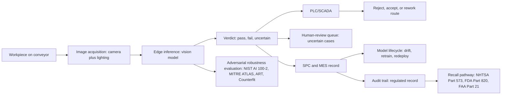

# Manufacturing line visual inspection assistant

> **SAFE‑AUCA industry reference guide (draft)**
>
> This use case describes the workflow that runs AI-driven visual inspection on a manufacturing assembly line: cameras and lighting capture parts in motion, an edge or near-edge model classifies defects, and the model's output drives a pass/fail decision routed to the production PLC or SCADA. It is the **first SAFE‑AUCA computer-vision use case** and the first domain shift in the registry away from LLM-centric workflows. SAFE-MCP's LLM/MCP-tool taxonomy applies in places, but the framework gap for industrial CV (physical adversarial patches, sensor and optics spoofing, OT-protocol-level evasion, functional-safety integration, recall-reporting integrity) is substantial and load-bearing for §8.
>
> It focuses on:
>
> * how the workflow works in practice (tools, data, trust boundaries, autonomy)
> * what can go wrong (defender-friendly kill chain)
> * how it maps to **SAFE‑MCP techniques**
> * what controls + tests make it safer
>
> **Defender-friendly only:** do **not** include operational exploit steps, payloads, or step-by-step attack instructions.
> **No sensitive info:** do not include internal hostnames/endpoints, secrets, customer data, non-public incidents, or proprietary details.

---

## Metadata

| Field                | Value                                              |
| -------------------- | -------------------------------------------------- |
| **SAFE Use Case ID** | `SAFE-UC-0009`                                     |
| **Status**           | `draft`                                            |
| **Maturity**         | draft                                              |
| **NAICS 2022**       | `31-33` (Manufacturing)                            |
| **Last updated**     | `2026-04-25`                                       |

### Evidence (public links)

* [NTSB Aviation Investigation Report AIR-25-04, In-Flight Separation of Left Mid Exit Door Plug, Alaska Airlines 1282 (released June 2025)](https://www.ntsb.gov/investigations/AccidentReports/Reports/AIR2504.pdf)
* [NTSB press release: Boeing's inadequate training, guidance, oversight led to door plug blowout (24 June 2025)](https://www.ntsb.gov/news/press-releases/Pages/NR20250624.aspx)
* [NIST AI 100-2 E2025: Adversarial Machine Learning Taxonomy and Terminology of Attacks and Mitigations (24 March 2025)](https://nvlpubs.nist.gov/nistpubs/ai/NIST.AI.100-2e2025.pdf)
* [Eykholt et al: Robust Physical-World Attacks on Deep Learning Visual Classification (CVPR 2018; arXiv:1707.08945; 100% lab and 84.8% field misclassification)](https://arxiv.org/abs/1707.08945)
* [NHTSA EA22-002 Tesla Autopilot Engineering Analysis Close Resume (211 frontal-plane crashes, 13 fatal; triggered Recall 23V-838)](https://static.nhtsa.gov/odi/inv/2022/INCLA-EA22002-14498.pdf)
* [49 CFR Part 573 Defect and Noncompliance Responsibility and Reports (NHTSA 5-working-day reporting)](https://www.ecfr.gov/current/title-49/subtitle-B/chapter-V/part-573)
* [21 CFR Part 820 Quality Management System Regulation (effective 2 February 2026; incorporates ISO 13485:2016 by reference)](https://www.ecfr.gov/current/title-21/chapter-I/subchapter-H/part-820)
* [ISO 21448:2022 Road vehicles, Safety of the Intended Functionality (SOTIF)](https://www.iso.org/standard/77490.html)
* [ISA/IEC 62443 Series of Standards for industrial automation and control systems cybersecurity](https://www.isa.org/standards-and-publications/isa-standards/isa-iec-62443-series-of-standards)
* [Cognex VisionPro Deep Learning, vendor first-party documentation](https://www.cognex.com/en/products/machine-vision-software/visionpro-deep-learning)

---

## Minimum viable write-up (Seed → Draft fast path)

This document covers:

* Executive summary
* Industry context and constraints
* Workflow and scope
* Architecture (tools, trust boundaries, inputs)
* Operating modes
* Kill-chain table (7 stages)
* SAFE‑MCP mapping table (14 techniques)
* Contributors and Version History

---

## 1. Executive summary (what + why)

**What this workflow does**
A **manufacturing line visual inspection assistant** is a computer-vision AI deployed on a production line. Cameras and structured lighting capture parts in motion (or stationary at an inspection cell); an edge or near-edge model classifies defects (surface scratches, dimensional deviations, missing components, color anomalies, contamination, soldering errors, weld quality); the model's output drives a pass/fail decision that routes to the production PLC or SCADA, often within a hard real-time deadline measured in milliseconds.

The category exists across the major industrial vision vendors (Cognex VisionPro Deep Learning, Keyence CV-X and IV3, Landing AI's LandingLens, Siemens Industrial Edge with Industrial AI Suite, ABB Robotics Integrated Vision, Datalogic MX-E, Inspekto Autonomous Machine Vision, MakinaRocks, Omron FH Series, Sick AG), the cloud-vision platforms (Google Cloud Visual Inspection AI, Microsoft Azure Custom Vision), the edge-accelerator stack (NVIDIA Jetson Orin and Metropolis for Factories with adopters Foxconn, Pegatron, Quanta, and Wistron; Hailo-8), and the recently sunset cautionary tale of Amazon Lookout for Vision (discontinued 31 October 2025; new customers blocked 10 October 2024).

**Why it matters (business value)**
Operators commonly cite three drivers: (1) detection of defects that human inspectors miss at production-line pace, (2) consistent inspection across shifts and across sites, and (3) integration with Statistical Process Control to drive process improvement upstream of defect escape.

**Why it's risky / what can go wrong**
Manufacturing-line CV inspection inverts the failure-mode profile of every prior SAFE‑AUCA UC. The recent record sketches the shape:

* **Manufacturing-inspection failure with regulatory ruling.** The NTSB final report on Alaska Airlines Flight 1282 (AIR-25-04, released June 2025) found that on 18 September 2023 at Boeing's Renton facility, workers opened the mid-exit door (MED) plug to perform a rivet repair, removed four bolts, did not reinstall the bolts, and did not perform a quality assurance inspection. On 5 January 2024 the door plug separated in flight at 16,000 feet on a Boeing 737-9 MAX. The NTSB Board ruled probable cause was inadequate Boeing training, guidance, and oversight. The Board also found the FAA's compliance program "ineffective" against Boeing's "repetitive and systemic" nonconformance. This is the canonical recent precedent for what a manufacturing-inspection escape looks like in a regulated supply chain.
* **Vision-AI safety precedent in adjacent domain.** NHTSA's Engineering Analysis EA22-002 (upgraded from PE21-020 on 8 June 2022; closed April 2024) on Tesla Autopilot examined 211 frontal-plane Tesla strikes, of which 13 were fatal, and ultimately triggered Tesla's voluntary recall 23V-838 (5 December 2023). NHTSA preliminary evaluation PE25-012 opened 7 October 2025 covering 2,882,566 vehicles for FSD traffic-violation behaviour. These are autopilot vision systems rather than manufacturing inspection systems, but the regulatory pathway and the adversarial-vision threat surface transfer to industrial CV.
* **Physical adversarial attacks are real, demonstrated, and printable.** Eykholt et al (arXiv:1707.08945, CVPR 2018) showed that black-and-white printed stickers on a stop sign caused 100% misclassification in lab settings and 84.8% in captured field video frames. Brown et al (arXiv:1712.09665, NIPS 2017) demonstrated universal printable adversarial patches that force targeted misclassification regardless of scene. Both transfer directly to factory-floor threat modelling: a sticker on a part, retro-reflective tape, lighting manipulation, or printed adversarial perturbation can shift a "defect" prediction to "pass."
* **Recall pathway is a 5-working-day clock.** Under 49 CFR Part 573, an automotive manufacturer that determines a manufacturing-related safety defect has 5 working days to file a Defect Information Report with NHTSA. The audit trail from the inspection station becomes the operative evidence. For medical devices, FDA 21 CFR Part 820 (now QMSR effective 2 February 2026, incorporating ISO 13485:2016 by reference) governs the inspection-record integrity. For aviation parts, FAA Part 21 §21.137 (h) and (i) govern nonconforming output and CAPA.
* **Functional safety is a parallel regulatory column.** ISO 26262 (automotive ASIL classifications) and IEC 61508 (general industry SIL 1 to 4) were not written for ML. Multiple peer-reviewed sources confirm gaps in lifecycle phases, testing methods, and verification criteria for learned components. Teams supplement with ISO 21448 SOTIF (Safety of the Intended Functionality, with the "triggering condition" concept that maps cleanly to deployed CV failure modes), ISO/PAS 8800 (forthcoming AI in road vehicles standard), and ISO/IEC TR 5469.
* **AWS Lookout for Vision sunset is a vendor-lock-in cautionary tale.** AWS announced discontinuation 31 October 2025, with new customers blocked 10 October 2024. Customers running production-line inspection on the service have a hard migration deadline. The pattern recurs across cloud-vision services (Microsoft Azure Custom Vision retirement is planned for 2028).
* **The SAFE-MCP framework gap is real and load-bearing.** SAFE-MCP today maps cleanly to LLM and MCP-server attack surfaces. For industrial CV it does not yet cover physical adversarial patches on workpieces, sensor and optics spoofing, camera firmware and ISP-pipeline tampering, edge-accelerator supply-chain integrity, functional-safety-aware mitigations (ASIL decomposition, SIL voting, redundant channel diversity), OT-protocol-level evasion (OPC-UA, PROFINET, EtherNet/IP, MQTT), or recall-reporting integrity. The honest disclosure is in §8.

These failure modes drive the controls posture: layered visual inspection (no single classifier is load-bearing), independent adversarial robustness benchmarking (NIST AI 100-2 E2025 taxonomy, MITRE ATLAS, IBM Adversarial Robustness Toolbox, Microsoft Counterfit), tamper-evident audit trails for the recall pathway, OT-side cybersecurity at IEC 62443 SL2 minimum, functional-safety integration (ASIL decomposition or a separate SIL-rated interlock as the actual safety function), and an honest narrative about what SAFE-MCP does not yet cover for industrial CV.

---

## 2. Industry context and constraints (reference-guide lens)

### Where this shows up

Common in:

* **Automotive Tier 1 and OEM lines** (brake calipers, airbag inflators, steering columns, body panels, paint inspection)
* **Electronics manufacturing** (PCB AOI, semiconductor wafer inspection, smartphone assembly with NVIDIA Metropolis adopters Foxconn, Pegatron, Quanta, Wistron)
* **Medical device manufacturing** (catheters, implants, surgical instruments, syringes) under 21 CFR Part 820 QMSR
* **Aviation parts production** (turbine blades, fasteners, composite layups) under 14 CFR Part 21 PMA / Production Certificate
* **Food packaging and pharmaceutical packaging** (label inspection, fill-level inspection, blister-pack QC)
* **Heavy industry** (steel mills, forging, casting inspection, weld quality)

### Typical systems

* **Image acquisition**: industrial cameras (line-scan, area-scan, 2D, 3D structured light, hyperspectral), structured lighting (ringlight, dome, coaxial, dark-field), optics (telecentric, fixed focal, varifocal), enclosures (IP67 for wet or dusty environments).
* **Edge inference**: NVIDIA Jetson Orin (and earlier Xavier, Nano), Hailo-8 (26 TOPS), Intel Movidius Myriad, FPGA inference accelerators, dedicated industrial PCs.
* **Vision software stacks**: Cognex VisionPro Deep Learning (formerly ViDi), Keyence CV-X and IV3, Landing AI LandingLens, Siemens Industrial AI Suite on Industrial Edge, ABB Integrated Vision, Datalogic IMPACT, OMRON FH/FZ, Sick Intelligent Inspection, Inspekto, MakinaRocks.
* **PLC/SCADA integration**: Siemens S7, Allen-Bradley/Rockwell ControlLogix, Mitsubishi MELSEC, Schneider Modicon, Omron Sysmac. OPC-UA, PROFINET, EtherNet/IP, MQTT, Modbus TCP as the OT protocols.
* **MES/ERP integration**: SAP, Oracle, Siemens Opcenter, Rockwell FactoryTalk, Dassault DELMIA. Production records flow from inspection through MES to ERP and (where applicable) into PLM and recall-tracking systems.
* **Quality management**: SPC packages, FMEA tooling, IATF 16949 Control Plans, FDA 21 CFR Part 11 electronic records.

### Constraints that matter

* **Hard real-time deadline.** Production-line tact time is often under 100 milliseconds per part. The model has to decide pass/fail at line speed. Async approval and human-in-the-loop review do not survive contact with conveyor speed; they apply only to flagged-for-review queues.
* **Functional safety integration.** ISO 26262 ASIL classifications (A through D) for automotive; IEC 61508 SIL classifications (1 through 4) for general industry; ISO 21448 SOTIF for ML perception failures; ISO/PAS 8800 (forthcoming) and ISO/IEC TR 5469 for AI in safety-related systems. ISO 26262 was not written for ML; the typical practice is to treat the AI box as a non-safety advisory and keep a separate SIL-rated or ASIL-rated interlock as the actual safety function.
* **OT cybersecurity.** ISA/IEC 62443 zones and conduits, with the inspection station typically targeting Security Level 2 (SL2). NIST SP 800-82 Rev. 3 (Guide to Operational Technology Security, September 2023) is the US-side companion. Both are silent on ML-specific failure modes, so teams pair them with NIST AI 100-2 or MITRE ATLAS.
* **Quality management.** ISO 9001:2015 Clause 8.7 (control of nonconforming outputs) is the baseline. IATF 16949:2016 (automotive QMS overlay) requires PFMEA, PPAP, MSA (sometimes called "ML R&R" when applied to model output), and Control Plan integration. FDA 21 CFR Part 820 QMSR (effective 2 February 2026) and FDA 21 CFR Part 11 (electronic records, audit trails) apply for medical device manufacturing.
* **Recall pathway.** 49 CFR Part 573 (NHTSA): 5 working days to file a Defect Information Report once a safety-related defect is determined; 60-day owner notification. 21 CFR Part 820.100 (CAPA) and Medical Device Reporting under 21 CFR Part 803 for medical devices. FAA Part 21 §21.137 (h) and (i) for aviation parts. The audit trail from the inspection station becomes the operative evidence in every recall investigation.
* **Adversarial CV is the dominant threat.** NIST AI 100-2 E2025 (24 March 2025) is the authoritative taxonomy, superseding the IR 8269 series. MITRE ATLAS (v5.4.0, with February 2026 update adding agentic AI techniques) is the threat catalogue, especially AML.T0015 Evade ML Model and the physical-environment adversarial-example techniques. ENISA Securing Machine Learning Algorithms (December 2021) is the EU companion.
* **Workplace safety where the cell is shared with humans.** OSHA 29 CFR 1910 Subpart O machine guarding; ANSI/RIA R15.06 / ISO 10218 for industrial robotics. Vision systems used as safeguards (light-curtain replacements) are subject to a different validation regime than vision systems used as inspection.
* **AI-specific frameworks.** NIST AI RMF 1.0 (January 2023) for governance scaffolding; ISO/IEC 42001:2023 AI Management System (December 2023) for auditable AIMS; ISO/IEC 23894:2023 for AI risk management; ISO/IEC 22989:2022 for terminology; OWASP Machine Learning Security Top 10 for developer-side checklist.
* **Recent vendor-lock-in lesson.** AWS Lookout for Vision sunset (discontinued 31 October 2025; new customers blocked 10 October 2024). Microsoft Azure Custom Vision retirement planned for 2028. Operators with production lines on these services face hard migration deadlines and the model-portability question becomes a procurement criterion.

### Must-not-fail outcomes

* a defective part shipped because the AI model misclassified it (the canonical false-negative)
* a good part scrapped because the model misclassified it (the false-positive: cost, supplier disputes, production halts)
* a physical adversarial patch (sticker, tape, paint mark) on the workpiece flipping defect classification at scale
* sensor or lighting manipulation by an insider or upstream supplier shifting model output
* a model swap or rug-pull post-validation that silently changes inspection behaviour
* an audit-trail tampering event that conceals an escape, undermining the recall investigation
* an OT-side compromise that lets a tampered verdict propagate through the PLC to downstream production
* a workplace-safety incident where a vision-driven actuator misjudges a worker in the shared cell

---

## 3. Workflow description and scope

### 3.1 Workflow steps (happy path)

1. A part enters the inspection cell on the conveyor or robot end-effector. The cell triggers acquisition (encoder pulse, light gate, or external trigger from the PLC).
2. Cameras and structured lighting capture one or more images (single shot, multi-shot, line-scan stitch) within the tact-time budget.
3. The edge inference stack runs the trained model: defect classification, segmentation, anomaly score. Output is a structured verdict (pass, fail, uncertain) with optional bounding boxes and a confidence interval.
4. The verdict routes to the PLC or SCADA via OPC-UA, PROFINET, EtherNet/IP, MQTT, or Modbus TCP. The PLC actuates the rejector or routes to a rework cell. Uncertain verdicts route to a human-review queue.
5. Inspection records persist to the SPC system and the MES with timestamps, model version, lot, serial, image references, and verdict.
6. Periodically, a sample of inspection records flows to the model-lifecycle pipeline for drift monitoring, retraining-data labelling, and recalibration.
7. Where regulated (automotive Part 573, medical Part 820 + Part 11, aviation Part 21), the audit trail from the inspection system is preserved for regulatory examination. If a defect escape is later determined, the inspection records become evidence for the Defect Information Report or analogous filing.
8. Cross-line and cross-shift consistency reviews compare verdict distributions and false-positive/false-negative rates against control limits.

### 3.2 In scope and out of scope

* **In scope:** real-time visual inspection at production-line pace; edge-inference deployment; pass/fail routing to PLC/SCADA; SPC and MES integration; model lifecycle (drift monitoring, retraining, redeployment); audit-trail preservation for the recall pathway; OT/IT boundary at IEC 62443.
* **Out of scope:** robotic motion control safety functions (a separate UC class governed by ANSI/RIA R15.06 and ISO 10218); end-of-line testing that exercises product function rather than visual conformance; supply-chain inbound inspection at the receiving dock (a different workflow); after-market recall management beyond the inspection-system audit-trail handover.

### 3.3 Assumptions

* The inspection station is the regulated entity's processor for inspection-record purposes. The product's manufacturer carries the QMS and recall obligations.
* Inspection imagery is treated as a controlled record under whichever regulation applies (FDA Part 11 for medical, IATF 16949 for automotive, FAA Part 21 for aviation).
* Functional-safety responsibility sits with a separately rated interlock or with an ASIL/SIL-decomposed channel; the AI inspection assistant is most commonly a non-safety advisory.
* The OT network meets at least IEC 62443 SL2; the inspection station's network presence is in a defined zone with documented conduits.
* Adversarial robustness is benchmarked independently (NIST AI 100-2 grade), not only on vendor-supplied datasets.

### 3.4 Success criteria

* False-negative rate (defect escape) is bounded by a published threshold under each part class and reviewed continuously against the recall-pathway risk.
* False-positive rate (good-part scrap) is paired with an appeals path and cost monitor; sustained false-positive spikes trigger an SPC investigation.
* Adversarial-robustness evaluation passes the documented benchmarks before any model promotion to the line.
* Audit trail is tamper-evident, version-pinned, and produces a regulator-ready bundle on demand.
* OT/IT cybersecurity posture is at IEC 62443 SL2 or higher with documented zones and conduits.
* When the AI inspection assistant fails or is uncertain, the line continues under a documented degradation policy (manual inspection, hold-for-review, or stop-production) without an unsafe pass-through default.

---

## 4. System and agent architecture

### 4.1 Actors and systems

* **Operators on the line**: machine operators, line leaders, quality technicians, maintenance, IT/OT engineers.
* **The product on the conveyor**: the workpiece under inspection. In some adversarial scenarios, the product itself carries the attack surface (a sticker, tape, paint mark, or printed perturbation applied upstream).
* **Image acquisition stack**: cameras, structured lighting, optics, enclosures, encoders, light gates.
* **Edge inference stack**: NVIDIA Jetson Orin, Hailo-8, Movidius, FPGA accelerators, dedicated industrial PCs.
* **Vision software**: Cognex, Keyence, Landing AI, Siemens, ABB, Datalogic, Inspekto, MakinaRocks, Omron, Sick, plus cloud-vision platforms where applicable.
* **PLC/SCADA**: Siemens S7, Rockwell ControlLogix, Mitsubishi MELSEC, Schneider Modicon, Omron Sysmac.
* **MES/ERP/PLM**: SAP, Oracle, Siemens Opcenter, Rockwell FactoryTalk.
* **Quality and audit**: SPC, FMEA tools, FDA Part 11 audit trails for medical, IATF 16949 records for automotive.
* **Regulators**: NHTSA (49 CFR Part 573), FDA (21 CFR Part 820 + Part 11), FAA (14 CFR Part 21), OSHA, equivalents in EU and Asia.

### 4.2 Trusted vs untrusted inputs (high value, keep simple)

| Input/source                                | Trusted?       | Why                                                                  | Typical failure/abuse pattern                                                                                                | Mitigation theme                                                                  |
| ------------------------------------------- | -------------- | -------------------------------------------------------------------- | ---------------------------------------------------------------------------------------------------------------------------- | --------------------------------------------------------------------------------- |
| The workpiece itself                         | Untrusted      | external; can carry physical adversarial patches                     | sticker, tape, paint mark, printed perturbation flips classification (Eykholt et al, Brown et al patterns)                    | layered detection; physical-patch fixture library; provenance and chain-of-custody upstream |
| Image acquisition (camera plus lighting)    | Semi-trusted   | platform-controlled but tamperable                                   | camera firmware tampering; ISP-pipeline manipulation; lighting strobing; lens contamination; polarizer change                 | sealed enclosures; integrity-monitored firmware; lighting-baseline checks; lens-cleanliness telemetry |
| Encoder / trigger from the PLC              | Semi-trusted   | OT-side input                                                        | mistimed trigger; missing trigger; spoofed trigger via OT compromise                                                          | watchdog timers; trigger-rate baselines; IEC 62443 zone enforcement                  |
| Vendor-supplied pre-trained model           | Semi-trusted   | vendor-curated but supply-chain attackable                          | training-data poisoning (T2107); rug-pull on model swap (T1201); metadata steg (T1402)                                       | signed model artefacts; integrity baselines; version pin; reproducible build evidence |
| Vendor-supplied software stack              | Semi-trusted   | vendor-curated; in-place updates                                     | tool poisoning (T1001); rogue MCP server in factory MCP fabric (T1003); cross-server shadowing (T1301)                        | connector signing; provenance attestation; allowlist                                |
| Operator console input                       | Semi-trusted   | authenticated humans, but coercible                                  | command injection (T1101); consent fatigue on override approvals (T1403)                                                     | least-privilege OT accounts; cool-down between repeat overrides; audit log on overrides |
| Production-history feedback for retraining   | Semi-trusted   | system-derived but selection-biased                                  | feedback-loop poisoning where false-pass cases enter retraining and entrench the failure mode                                | feedback labelling QC; out-of-distribution detection; periodic blind audit         |
| Cross-line federated learning signals        | Semi-trusted   | platform-curated across plants                                       | cross-tool contamination (T1701); shared-memory poisoning (T1702) where multi-line knowledge bleeds incorrectly               | per-line scope; signed updates; integrity baseline                                  |
| LLM-generated reports or coaching outputs    | Untrusted      | probabilistic; only when the inspection assistant has an LLM wrapper | prompt injection in operator chat (T1102); response tampering (T1404)                                                        | structured output; verification step; strictly advisory mode                       |

### 4.3 Trust boundaries (required)

Key boundaries practitioners commonly model explicitly:

1. **The physical-attack boundary at the workpiece itself.** A sticker on a part is not a digital input vector; SAFE-MCP today does not have a technique for it. The closest fit is T1402 (Instruction Stenography Tool Metadata Poisoning) only if the steg payload is in tool descriptors rather than on the workpiece. The honest framing: this boundary is outside the current SAFE-MCP catalogue.
2. **The optics and sensor boundary.** Cameras, lighting, polarizers, and the ISP pipeline pre-inference are tamperable surfaces. Camera firmware manipulation, lens contamination, lighting strobing, and IR-band filtering are all real-world attack vectors. SAFE-MCP does not yet name these.
3. **The hard real-time inference boundary.** Line tact time (often under 100 ms) precludes large-model fallback, async approval, or LLM-mediated review. Mitigations like SAFE-M-20 forced-delay and SAFE-M-23 batching prevention do not survive contact with conveyor speed at this stage.
4. **The model output to PLC/SCADA boundary.** Verdict tampering between the model output and the actuator is the SAFE-T1404 (Response Tampering) surface. Cryptographic signing of verdicts and PLC-side attestation closes most of the gap.
5. **The OT/IT zone boundary at IEC 62443.** The inspection station typically sits in a Level 2 or Level 3 zone of the Purdue model with conduits to higher levels. NIST SP 800-82 Rev. 3 is the US companion guide.
6. **The functional-safety boundary at ISO 26262 / IEC 61508 / ISO 21448 SOTIF.** The AI inspection assistant is most commonly non-safety advisory. A separate ASIL-rated or SIL-rated interlock provides the actual safety function. The boundary between advisory and safety is an explicit architectural decision documented in the safety case.
7. **The regulated-record boundary at FDA Part 11 / IATF 16949 / FAA Part 21.** Inspection records are tamper-evident, version-pinned, and produce a regulator-ready bundle on demand. The audit trail is the operative evidence in every recall investigation.

### 4.4 High-level flow (illustrative)

### 4.5 Tool inventory (required)

Typical tools and services (names vary by deployment):

| Tool / service                                    | Read / write? | Permissions                                               | Typical inputs                            | Typical outputs                                | Failure modes                                                                |
| ------------------------------------------------- | ------------- | --------------------------------------------------------- | ----------------------------------------- | ---------------------------------------------- | ---------------------------------------------------------------------------- |
| `image.capture`                                   | read          | per-station; encoder-triggered                             | trigger pulse                              | image, timestamp, lighting state               | mistimed acquisition; lens contamination; lighting drift                      |
| `model.classify`                                  | read          | per-line; signed model artefact                            | image                                      | verdict, confidence, optional segmentation     | adversarial-evasion, OOD samples, drift                                      |
| `model.lifecycle`                                 | write         | platform-admin; reproducible build                         | retraining data + provenance               | new model version + signature                  | feedback poisoning; model rug-pull (T1201)                                   |
| `verdict.publish.plc`                             | write         | OT-side; signed                                            | verdict + part identifier                  | PLC signal                                     | response tampering (T1404); replay; OT-protocol abuse                        |
| `record.audit.write`                              | write         | tamper-evident                                             | verdict + image-ref + lot/serial           | audit-trail entry                              | T2101 data destruction to hide escapes                                       |
| `spc.update`                                      | write         | service account                                            | verdict stream                             | SPC chart update                               | data corruption that drowns control-limit signals                            |
| `mes.report`                                      | write         | service account                                            | inspection summary                         | MES record                                     | misalignment with PLM/ERP records                                            |
| `human.review.queue`                              | read/write    | quality-technician role                                    | uncertain verdicts                         | resolved verdict + rationale                   | consent fatigue (T1403) on override approvals                                |
| `plc.actuate.rejector` (HITL by policy)           | write         | OT account; safety-interlocked                             | PLC verdict                                | physical reject action                         | over-rejection; under-rejection                                              |
| `recall.report.573` (manual)                      | write         | quality-officer; legal sign-off                            | escape evidence + audit-trail bundle       | NHTSA Part 573 filing                          | tampered evidence; missing audit-trail entries                               |
| `redteam.adversarial`                             | read/write    | service account                                            | adversarial fixture corpus                 | robustness report                              | non-representative test set; bench drift                                     |

### 4.6 Sensitive data and policy constraints

* **Data classes:** part imagery (sometimes containing trade secrets like proprietary alloys, novel geometries, or pre-launch products); production records (lot, serial, timestamp); model artefacts and training data; OT credentials and PLC tags; supplier identity and chain-of-custody metadata.
* **Retention and logging:** automotive (IATF 16949 typical retention 10+ years for safety-critical parts); medical (FDA 21 CFR Part 820 retention varies by class, commonly 2-7 years post-distribution, with Part 11 audit-trail durability requirements); aviation (FAA Part 21 retention varies by article type).
* **Regulatory constraints:** ISO 26262 (automotive functional safety), IEC 61508 (general functional safety), ISO 21448 SOTIF, ISO/SAE 21434 (cybersecurity engineering for road vehicles), ISO/IEC 42001:2023 AIMS, ISO/IEC 23894:2023 risk management, ISO 9001:2015, IATF 16949:2016 (automotive QMS), ISA/IEC 62443 (OT cybersecurity), NIST AI RMF + AI 100-2 E2025 + SP 800-82 Rev. 3, OWASP ML Security Top 10, ENISA Securing ML Algorithms, MITRE ATLAS, 49 CFR Part 573 (NHTSA recall), 21 CFR Part 820 QMSR effective 2 February 2026 + 21 CFR Part 11, 14 CFR Part 21 (FAA), OSHA 29 CFR 1910 Subpart O.
* **Safety/consumer-harm constraints:** false-negative escapes can cause downstream injury or death (the Alaska Airlines 1282 pattern); false-positives waste good parts and can stop production; physical adversarial patches cascade across many units; sensor or model tampering by an insider undermines the entire QMS; recall-evidence destruction is a federal offence under 49 USC §30166 (records and inspections) and analogous medical/aviation statutes.

---

## 5. Operating modes and agentic flow variants

### 5.1 Manual baseline (no AI)

Human inspection at line speed, with mechanical or rule-based checks (gauges, fixtures, simple optical sensors). Existing controls include trained inspectors, sample-based audits, and SPC charts. Errors are caught by downstream test, customer complaint, or recall. The Alaska 1282 pattern shows the limits of this mode under cost and pace pressure.

### 5.2 Human-in-the-loop (HITL / sub-autonomous)

The current production majority. The AI model classifies at line speed; uncertain or low-confidence verdicts route to a quality technician for review. SPC, MES, and Part 11 audit trails capture the AI verdict, the human review, and the final disposition. Risk profile: bounded when the human review queue is genuinely worked; the dominant failure mode is silent over-reliance plus consent-fatigue (T1403) on operator override approvals.

### 5.3 Fully autonomous (end-to-end, guardrailed)

The AI model classifies at line speed and the PLC actuates the rejector without per-decision human review. Fully autonomous operation is common for high-volume electronics (PCB AOI, semiconductor wafer inspection) where the cost-of-stop is high and the consequence-of-escape is bounded. For safety-critical automotive parts (brake calipers, airbag inflators, steering columns), fully autonomous is rare; a separate ASIL-rated interlock or sample-based human audit retains the safety function. Guardrails: kill switch reverts to HITL; degradation policy is documented; audit trail captures every fully-autonomous verdict.

### 5.4 Variants

A safe decomposition pattern separates components:

1. **Image acquisition** (camera, lighting, optics, enclosures).
2. **Edge inference** (model execution at line speed).
3. **Verdict layer** (pass, fail, uncertain) routed to PLC/SCADA.
4. **Human-review queue** for uncertain cases.
5. **SPC and MES integration** for production-record persistence.
6. **Model lifecycle** (drift detection, retraining, redeployment) on a non-real-time path.
7. **Audit-trail preservation** for the recall pathway.
8. **Adversarial-robustness harness** continuously evaluating against NIST AI 100-2 / MITRE ATLAS fixtures.
9. **OT/IT boundary controls** at IEC 62443 SL2 or higher.
10. **Functional-safety interlock** (ASIL or SIL rated) operating in parallel as the actual safety function.

Each component carries its own kill switch, validation set, and incident playbook.

---

## 6. Threat model overview (high-level)

### 6.1 Primary security and safety goals

* keep false-negative rate (defect escapes) below documented thresholds, with adversarial-aware evaluation
* keep false-positive rate (good-part scrap) bounded by an appeals path and cost monitor
* preserve audit-trail tamper evidence for the recall pathway
* preserve OT/IT cybersecurity posture at IEC 62443 SL2 or higher
* preserve functional-safety integration where the inspection feeds a safety function
* maintain a regulator-ready evidence bundle on demand

### 6.2 Threat actors (who might attack or misuse)

* **Adversarial supplier or upstream actor.** Applies a physical adversarial patch (sticker, tape, paint mark, printed perturbation) to the workpiece before it reaches the inspection cell. Eykholt et al and Brown et al show this is a printable, transferable threat.
* **Insider on the line.** Tampers with camera firmware, lighting baseline, lens cleanliness, polarizer angle, or model artefact to influence verdicts.
* **Compromised vendor or supply-chain actor.** Tool poisoning at registry layer (T1001), rug-pull on model swap post-validation (T1201), metadata steganography in tool descriptors (T1402).
* **OT-side attacker.** Command injection on the operator console (T1101); response tampering between the model output and the PLC (T1404); cross-tool contamination across plant lines (T1701).
* **Insider attempting to conceal an escape.** Audit-trail tampering or destruction (T2101) to hide a false-pass that later causes a recall.
* **Adversarial-ML researcher (and adversary using the research).** Evasion attacks at evaluation time, including the printable-patch class.

### 6.3 Attack surfaces

* the workpiece itself (physical adversarial patches)
* camera, lighting, polarizer, optics (sensor and ISP-pipeline tampering)
* edge inference stack (model artefact, edge accelerator firmware, supply-chain integrity)
* vendor software stack (tool registry, MCP fabric where applicable)
* OT-side communications (OPC-UA, PROFINET, EtherNet/IP, MQTT, Modbus TCP)
* PLC/SCADA verdict ingestion path
* SPC and MES audit-trail surface
* model-lifecycle pipeline (retraining feedback, version registry)
* operator console and override flow

### 6.4 High-impact failures (include industry harms)

* **Consumer harm:** a defective part shipped that causes injury or death downstream (the Alaska Airlines 1282 pattern). For automotive safety-critical parts, the harm cascades into NHTSA recall and personal-injury liability. For medical devices, FDA Medical Device Reporting and patient harm. For aviation, FAA AD and potentially loss of life.
* **Business harm:** recall cost (commonly 8 to 9 figures for automotive safety-critical), production-line stop cost (commonly 6 to 7 figures per hour), brand and stock-price impact, regulator consent decrees, loss of customer audit qualification (Tier 1 OEM, hospital system, defense prime).
* **Security harm:** persistent OT-side compromise enabling lateral movement; recall-evidence destruction (federal offence); supply-chain compromise of pre-trained models cascading across many factories; insider tampering that survives across model retrainings.

---

## 7. Kill-chain analysis (stages → likely failure modes)

> Keep this defender-friendly. Describe patterns, not "how to do it."

This is the registry's first 7-stage kill chain with **five NOVEL stages**, validating the domain shift away from LLM-centric workflows.

| Stage                                                                             | What can go wrong (pattern)                                                                                                                                                                                                                  | Likely impact                                                                                                                                          | Notes / preconditions                                                                                                                                                  |
| --------------------------------------------------------------------------------- | -------------------------------------------------------------------------------------------------------------------------------------------------------------------------------------------------------------------------------------------- | ------------------------------------------------------------------------------------------------------------------------------------------------------ | ---------------------------------------------------------------------------------------------------------------------------------------------------------------------- |
| 1. Sensor and image capture (**NOVEL: physical adversarial inputs, SAFE-MCP gap**) | Sticker, tape, paint mark, retro-reflective patch on the workpiece; lighting strobe or polarizer manipulation; camera firmware or ISP-pipeline tampering; lens contamination                                                                  | adversary forces "pass" on a defective part or "fail" on a good part with high reliability                                                              | Eykholt et al (100% lab, 84.8% field) and Brown et al universal patches confirm this is a real and transferable threat; SAFE-MCP today has no dedicated technique ID    |
| 2. Edge inference (**NOVEL: hard real-time deadline**)                            | Adversarial-evasion attacks on the model at line speed; out-of-distribution samples (new lighting, new defect class, new supplier batch); edge-accelerator firmware tampering; rug-pull model swap post-validation                            | wrong verdict at conveyor pace; SAFE-M async-approval mitigations do not survive contact with line speed                                                | NIST AI 100-2 E2025 is the authoritative attack taxonomy; T1201 rug-pull and T2107 training-data poisoning are primary                                                  |
| 3. Pass/fail decision routed to PLC/SCADA (**NOVEL: functional safety integration**) | Verdict tampering between model and PLC (T1404); replay of stale verdicts; OT-protocol abuse (OPC-UA, PROFINET, EtherNet/IP, MQTT); command injection on operator console (T1101)                                                            | tampered verdicts propagate downstream; safety function depends on a separate interlock that the AI advisory does not control                          | ISO 26262 ASIL and IEC 61508 SIL classifications for the safety function are typically held by a separately rated interlock                                            |
| 4. Data logging and SPC integration                                                | Audit-trail tampering or destruction (T2101) to hide an escape; bulk harvest of inspection records (T1801); OAuth token persistence on MES integration (T1202); cross-line memory bleed (T1702)                                                | recall evidence corrupted; supply-chain trade-secret leakage; Part 11 audit-trail integrity violation                                                  | FDA Part 11 audit-trail durability and IATF 16949 retention are the operative controls                                                                                  |
| 5. Model lifecycle (retrain, drift, redeploy)                                      | Training-data poisoning (T2107) via feedback loop or supplier-supplied images; vector-store contamination on a defect-pattern embedding store (T2106); metadata steganography in tool descriptors (T1402); rug-pull at redeploy (T1201)        | model drift toward the adversary's preferred misclassification; persistent compromise across retrainings                                              | provenance tagging on retraining data; signed model artefacts; reproducible build evidence; out-of-distribution detection on retraining data                            |
| 6. OT/IT boundary (**NOVEL: IEC 62443 zones and conduits**)                       | Cross-tool contamination across plant lines (T1701); cross-server tool shadowing where a rogue inspection MCP server impersonates the legitimate one (T1301); enumeration of inspection MCP fleet (T1601); credential harvest on edge nodes (T1502) | lateral movement across the plant; compromised credentials persist into MES/ERP                                                                       | IEC 62443 SL2 minimum; signed conduits; per-zone authentication                                                                                                          |
| 7. Recall and regulatory reporting (**NOVEL: regulated escape pathway**)           | Audit-trail destruction (T2101) to hide an escape; tampered Defect Information Report under 49 CFR Part 573; consent-fatigue on disclosure approvals (T1403); recall-evidence integrity failure                                                | regulatory non-compliance; criminal liability under 49 USC §30166 or analogous; recall scope expanded as evidence integrity is questioned             | 49 CFR Part 573 (5 working days), 21 CFR Part 820.100 CAPA, 14 CFR Part 21 §21.137 (h) and (i) are the operative reporting channels                                     |

**Cross-UC novelty callouts.** Five of seven stages are NOVEL vs. every prior SAFE‑AUCA UC because no prior UC operates in the industrial CV / functional-safety / OT-cybersecurity / regulated-recall regime. This validates the domain-shift selection: the workflow genuinely differs, not just nominally.

---

## 8. SAFE‑MCP mapping (kill-chain → techniques → controls → tests)

> Goal: make SAFE‑MCP actionable in this workflow. **The framework gap is load-bearing.** SAFE-MCP today maps cleanly to LLM and MCP-server attack surfaces. For industrial CV, several primary attack surfaces are not covered. The honest disclosure follows the table.

| Kill-chain stage                                  | Failure/attack pattern (defender-friendly)                                                                                                              | SAFE‑MCP technique(s)                                                                                                                                                              | Recommended controls (prevent/detect/recover)                                                                                                                                                                                                                                                | Tests (how to validate)                                                                                                                                                                                              |
| ------------------------------------------------- | ------------------------------------------------------------------------------------------------------------------------------------------------------- | ---------------------------------------------------------------------------------------------------------------------------------------------------------------------------------- | -------------------------------------------------------------------------------------------------------------------------------------------------------------------------------------------------------------------------------------------------------------------------------------------- | -------------------------------------------------------------------------------------------------------------------------------------------------------------------------------------------------------------------- |
| 1. Sensor and image capture                       | Physical adversarial patches on workpiece; sensor or optics tampering; lighting manipulation                                                            | **No direct SAFE-T fit (framework gap).** Closest: `SAFE-T1402` (Instruction Stenography Tool Metadata Poisoning) only if steg payload is in tool descriptors rather than on the part | physical-patch fixture library; chain-of-custody upstream; sealed enclosures; firmware integrity on cameras; lighting-baseline checks; lens-cleanliness telemetry; pair with NIST AI 100-2 E2025 evasion-attack countermeasures and MITRE ATLAS AML.T0015 Evade ML Model                       | apply Eykholt-style printed-patch fixtures and Brown-style universal patches across part classes; verify detection rate within published bound; lighting-perturbation fuzz; camera-firmware integrity attestation     |
| 2. Edge inference                                  | Adversarial-evasion at line speed; OOD samples; rug-pull on model artefact; training-data poisoning                                                      | `SAFE-T2107` (AI Model Poisoning via MCP Tool Training Data Contamination); `SAFE-T1201` (MCP Rug Pull Attack); `SAFE-T1001` (Tool Poisoning Attack)                              | signed model artefacts; reproducible build evidence; integrity baselines; version pinning; OOD detector; adversarial-aware retraining; pair with IBM Adversarial Robustness Toolbox (ART) and Microsoft Counterfit for evaluation                                                              | adversarial-fixture regression on every release; OOD-sample evaluation; signed-artefact verification at boot                                                                                                       |
| 3. Pass/fail decision routed to PLC/SCADA          | Verdict tampering between model and PLC; replay of stale verdicts; OT-protocol abuse; command injection on operator console                              | `SAFE-T1404` (Response Tampering); `SAFE-T1101` (Command Injection); `SAFE-T1401` (Line Jumping)                                                                                  | cryptographic signing of verdicts; PLC-side attestation of source; replay protection; least-privilege on operator console; cool-downs between repeat overrides                                                                                                                                | replay-attack fixtures against the PLC ingest path; verdict-signature integrity verification; operator-console injection corpus                                                                                    |
| 4. Data logging and SPC integration                | Audit-trail tampering or destruction; bulk record harvest; cross-line memory bleed                                                                       | `SAFE-T2101` (Data Destruction); `SAFE-T1801` (Automated Data Harvesting); `SAFE-T1202` (OAuth Token Persistence); `SAFE-T1702` (Shared-Memory Poisoning)                          | tamper-evident audit trail; per-tenant record isolation; rate-limit on bulk export; short-lived OAuth on MES integration; per-line memory partition                                                                                                                                          | tamper-detection drill on audit trail; bulk-export anomaly detection seeded with synthetic queries; cross-line residue test                                                                                        |
| 5. Model lifecycle                                 | Training-data poisoning via feedback loop; vector-store contamination; metadata steganography; rug-pull at redeploy                                     | `SAFE-T2107` (AI Model Poisoning via Training Data Contamination); `SAFE-T2106` (Context Memory Poisoning via Vector Store Contamination); `SAFE-T1402` (Instruction Stenography); `SAFE-T1201` (MCP Rug Pull) | provenance tagging on retraining data; signed model artefacts; reproducible build; out-of-distribution detection on retraining data; integrity baseline on vector store; metadata sanitiser on tool descriptors                                                                                | feedback-loop poisoning drill; vector-store integrity check; reproducible-build verification                                                                                                                       |
| 6. OT/IT boundary                                  | Cross-tool contamination across plant lines; cross-server tool shadowing; enumeration of inspection MCP fleet; credential harvest on edge nodes          | `SAFE-T1701` (Cross-Tool Contamination); `SAFE-T1301` (Cross-Server Tool Shadowing); `SAFE-T1601` (MCP Server Enumeration); `SAFE-T1602` (Tool Enumeration); `SAFE-T1502` (File-Based Credential Harvest) | IEC 62443 SL2 minimum with documented zones and conduits; per-zone authentication; signed federated updates; KMS-backed credential storage; allowlisted tool registry                                                                                                                          | cross-zone pivot simulation; federated-update integrity check; credential-vault integrity audit                                                                                                                    |
| 7. Recall and regulatory reporting                 | Audit-trail destruction; tampered Defect Information Report; consent-fatigue on disclosure approvals; evidence-integrity failure                          | `SAFE-T2101` (Data Destruction); `SAFE-T1403` (Consent-Fatigue Exploit)                                                                                                            | tamper-evident audit trail with immutable ledger pattern; documented escalation matrix on disclosure approvals; cool-downs between repeat approvals; regulator-ready export bundle with integrity hashes; legal-hold pattern on suspected escapes                                              | tamper-detection drill on audit trail; escalation-matrix walkthrough; export-bundle integrity verification                                                                                                         |

Total SAFE-MCP techniques cited: **14** (within the leaner 8 to 14 baseline target appropriate for a domain-shift UC).

**Framework gap note (load-bearing).** SAFE-MCP today maps cleanly to LLM and MCP-server attack surfaces. For industrial CV the catalogue does NOT yet cover:

* **Physical adversarial patches** on the workpiece itself (no SAFE-T for "adversarial sticker on part"). Eykholt et al (CVPR 2018) and Brown et al (NIPS 2017) demonstrate the threat is real, printable, and transferable.
* **Sensor and optics spoofing** (camera firmware, ISP-pipeline tampering, lighting strobe, polarizer manipulation, lens contamination, IR-band filtering).
* **Edge-accelerator supply-chain integrity** (Jetson, Movidius, Hailo) beyond generic model-artefact integrity.
* **Functional-safety-aware mitigations** (ASIL decomposition, SIL voting, redundant channel diversity per ISO 26262, IEC 61508, ISO 21448 SOTIF).
* **OT-protocol-level evasion** (OPC-UA, PROFINET, EtherNet/IP, MQTT, Modbus TCP) where a tampered verdict is replayed downstream past the PLC's protocol-level checks.
* **Recall-reporting integrity** (49 CFR Part 573, 21 CFR Part 820 CAPA, 14 CFR Part 21 §21.137) as an attestation surface separate from generic audit-log integrity.

The complementary references for these gaps are NIST AI 100-2 E2025 (adversarial-ML taxonomy), MITRE ATLAS (AML.T0015 Evade ML Model and the physical-environment adversarial-example techniques), ISA/IEC 62443 (OT cybersecurity zones and conduits), ISO 26262 / IEC 61508 / ISO 21448 (functional safety), and ENISA Securing Machine Learning Algorithms (December 2021). Contributors expanding the SAFE-MCP catalogue may find these gaps worth filling.

---

## 9. Controls and mitigations (organized)

### 9.1 Prevent (reduce likelihood)

* **Layered visual detection.** No single classifier is load-bearing for safety-critical inspection. Combine multiple defect-detection passes (different illumination, different camera angle, different model architecture) and require concurrence for high-stakes pass decisions.
* **Independent adversarial-robustness benchmarking.** Evaluate on NIST AI 100-2 E2025 fixtures, MITRE ATLAS technique corpus, and the Eykholt and Brown printable-patch families before any model promotion. Pair vendor self-reports with independent benchmarks.
* **Signed model artefacts and reproducible builds.** Every model version is signed; reproducible-build evidence is preserved; integrity baselines drive drift detection. Connector and tool registry pinning for all vendor-supplied software.
* **Camera and lighting integrity.** Sealed enclosures; integrity-monitored firmware; lighting-baseline checks; lens-cleanliness telemetry; physical chain-of-custody upstream.
* **Hard real-time deadline budget.** Document the tact-time budget; reject async approval and large-model fallback in the real-time path; route uncertain verdicts to a separate human-review queue rather than blocking the line.
* **Functional-safety architecture.** Treat the AI inspection assistant as non-safety advisory by default; a separate ASIL-rated or SIL-rated interlock provides the actual safety function. Document the boundary in the safety case (ISO 26262, IEC 61508, ISO 21448 SOTIF, ISO/PAS 8800 forthcoming).
* **OT cybersecurity at IEC 62443 SL2 minimum.** Documented zones and conduits; per-zone authentication; signed conduits; allowlisted tool registry. Pair with NIST SP 800-82 Rev. 3.
* **Tamper-evident audit trail.** Inspection records flow into a Part 11-compliant or IATF 16949-compliant audit trail with immutable-ledger characteristics. Version-pinned model identity is part of every record.
* **Vendor-portability discipline.** AWS Lookout for Vision sunset (October 2025) and Azure Custom Vision retirement (planned 2028) are recurring patterns. Contracted model-export rights, on-premises fallback, and standards-based formats (ONNX) are the practical hedges.
* **Operator-override governance.** Cool-downs between repeat overrides; explicit-scope per override; supervisor escalation for high-stakes overrides.

### 9.2 Detect (reduce time-to-detect)

* **False-negative rate** monitored continuously per part class against published thresholds.
* **False-positive rate** paired with appeals path and cost monitor.
* **Adversarial-fixture regression** on every release with NIST AI 100-2 E2025 grade methodology.
* **Out-of-distribution detector** on every inference, with sustained OOD spike alerting.
* **Model-artefact integrity check** at boot and at periodic checkpoints.
* **Audit-trail tamper-evidence monitoring** with cryptographic-hash verification.
* **OT-side anomaly detection** at IEC 62443 SL2: signed conduits, replay rejects, per-zone authentication failures.
* **Cross-line consistency monitoring** with verdict-distribution comparison.
* **Vendor lifecycle anomaly** (model swap, firmware rollback, schema drift on tool descriptors).

### 9.3 Recover (reduce blast radius)

* **Kill switches per layer:** acquisition, inference, verdict path, audit trail, MES integration. Each can be disabled independently while the line continues under documented degradation.
* **Model rollback** to a signed prior version when drift, adversarial findings, or rug-pull is detected.
* **Mass-revoke and mass-re-evaluate** when a poisoned tool, compromised model, or rugged vendor is identified.
* **Recall-pathway readiness.** Regulator-ready export bundle with integrity hashes, supporting NHTSA Part 573 (5 working days), FDA Part 820 CAPA, FAA Part 21 §21.137 inquiries.
* **Working appeal at every false-positive scrap** with documented turnaround to limit cost and supplier disputes.
* **Graceful degradation to manual inspection** when the AI inspection assistant is offline, uncertain, or rate-limited; the line continues without an unsafe pass-through default.

---

## 10. Validation and testing plan

### 10.1 What to test (minimum set)

* **Adversarial-robustness bounds** on every model release using NIST AI 100-2 E2025 fixtures, MITRE ATLAS evasion corpora, IBM ART, and Microsoft Counterfit.
* **Physical-patch resilience** using Eykholt-style printed stickers and Brown-style universal patches across part classes.
* **Sensor and lighting integrity** (camera firmware attestation, lens-cleanliness telemetry, lighting-baseline drift).
* **Verdict-path integrity** under replay, OT-protocol abuse, and command-injection fixtures.
* **Audit-trail tamper evidence** with cryptographic-hash verification.
* **Model-lifecycle integrity** under rug-pull, training-data poisoning, and metadata steganography fixtures.
* **OT/IT cybersecurity** at IEC 62443 SL2 with documented zone-conduit penetration tests.
* **Functional-safety boundary** documented in the safety case with the AI advisory clearly distinguished from the rated interlock.
* **Recall-pathway readiness** with a regulator-ready export bundle drill.

### 10.2 Test cases (make them concrete)

| Test name                              | Setup                                                            | Input / scenario                                                                    | Expected outcome                                                                                                       | Evidence produced                                       |
| -------------------------------------- | ---------------------------------------------------------------- | ----------------------------------------------------------------------------------- | ---------------------------------------------------------------------------------------------------------------------- | ------------------------------------------------------- |
| Eykholt-style printed-patch resistance | Production model on a representative line                         | Apply printed-sticker fixtures across part classes per Eykholt et al methodology    | Detection rate within published bound; false-pass rate below threshold                                                  | adversarial-regression report                          |
| Brown-style universal-patch resistance | Production model                                                  | Apply universal printable patches per Brown et al methodology                        | Detection rate within published bound                                                                                  | regression report                                       |
| Lighting-perturbation fuzz             | Production lighting baseline                                      | Vary lighting angle, intensity, and spectrum within sane bounds                     | Verdict stability within tolerance; OOD detector flags out-of-range cases                                              | lighting-fuzz report                                    |
| Camera-firmware integrity              | Camera under production firmware                                  | Boot-time and periodic attestation                                                  | Firmware hash matches signed baseline                                                                                  | attestation log                                         |
| Edge-accelerator integrity             | Edge inference on Jetson or Hailo                                 | Boot-time integrity check                                                           | Accelerator firmware and model artefact hashes match                                                                   | boot-integrity log                                      |
| Verdict-replay attack                  | Verdict pipeline with cryptographic signing                       | Replay an old signed verdict to the PLC                                             | PLC rejects; alerted; freshness check holds                                                                            | replay log                                              |
| OT-protocol-level fuzz                 | OPC-UA / PROFINET / EtherNet/IP / MQTT bridge                     | Fuzz the verdict-ingest path                                                        | Bridge integrity holds; malformed payloads rejected                                                                    | fuzz report                                             |
| Audit-trail tamper drill               | Inspection-record store with tamper-evident audit                  | Attempt to alter or delete a verdict record                                         | Tamper detected; alert raised; recovery from immutable replica                                                          | tamper-drill log                                        |
| Rug-pull on model artefact             | Vendor-supplied model with version pin                            | Attempt silent swap with a different signed-but-unauthorised model                  | Rug-pull detected; per-line freeze; mass re-evaluation triggered                                                      | rug-pull log                                            |
| Training-data poisoning drill          | Retraining feedback loop                                          | Inject crafted false-pass cases into retraining queue                               | OOD detector flags; provenance check rejects; retraining halts                                                       | poisoning-drill log                                     |
| OT-zone pivot                          | IEC 62443 SL2 zone with documented conduit                        | Attempt cross-zone access from a compromised peer                                   | Per-zone authentication denies; alerted                                                                              | zone-pivot log                                          |
| Recall-pathway export                  | Inspection records spanning a representative period               | Run regulator-ready export                                                          | Bundle contains audit trail, model versions, fixtures, eval results, with integrity hashes; meets 5-working-day clock | export-bundle integrity report                          |

### 10.3 Operational monitoring (production)

Metrics teams commonly instrument:

* false-negative and false-positive rates per part class, per line, per shift
* adversarial-robustness regression rate on every release
* OOD-sample rate at inference
* model-artefact integrity-check pass rate
* camera-firmware and edge-accelerator attestation pass rate
* verdict-signature integrity and replay-attack rejection rate
* audit-trail tamper-evidence event rate
* OT-side IEC 62443 zone-pivot detection rate
* model-lifecycle event rate (retraining, rollback, redeploy)
* recall-pathway export-bundle drill cadence
* operator-override volume and escalation rate (consent-fatigue indicator)

---

## 11. Open questions and TODOs

- [ ] Confirm canonical SAFE‑MCP technique IDs (if any) emerge for physical adversarial patches, sensor and optics spoofing, OT-protocol-level evasion, functional-safety-aware mitigations, and recall-reporting integrity as the catalogue evolves.
- [ ] Track ISO/PAS 8800 publication (forthcoming AI in road vehicles standard) and ISO/IEC TR 5469 progression.
- [ ] Track NIST AI 100-2 successor editions beyond E2025.
- [ ] Track MITRE ATLAS additions for industrial CV / physical adversarial techniques (the February 2026 update added agentic AI; future updates may close the physical-attack gap).
- [ ] Define the platform's published false-negative and false-positive bounds per part class and review cadence.
- [ ] Define a default policy on autonomous redeploy: which model classes and confidence levels warrant autonomous push without HITL approval.
- [ ] Specify minimum audit-log retention under each applicable framework (IATF 16949 commonly 10+ years for safety-critical; 21 CFR Part 820 commonly 2-7 years; FAA Part 21 varies).
- [ ] Establish a regulator-cooperation playbook supporting NHTSA, FDA, FAA, OSHA inquiries on a single artefact bundle.
- [ ] Define a vendor-portability hedge for cloud-vision platforms with sunset risk (AWS Lookout precedent, Azure Custom Vision retirement planned 2028).
- [ ] Coordinate the safety-case boundary between AI advisory and rated interlock with the functional-safety team (ISO 26262, IEC 61508, ISO 21448 SOTIF).

---

## 12. Questionnaire prompts (for reviewers)

### Workflow realism

* Are the systems (cameras, lighting, edge accelerators, vision software, PLC/SCADA, MES, audit trail) a fair model of your environment?
* Is the tact-time budget for AI inference documented and respected?
* Where does the safety function actually sit (the AI advisory, a separate ASIL or SIL interlock, sample-based human audit, or a combination)?

### Trust boundaries and permissions

* Is the workpiece itself treated as untrusted? Do you have a physical-patch fixture library?
* Are camera firmware, lighting baseline, and lens cleanliness monitored as integrity surfaces?
* Is the verdict-to-PLC path cryptographically signed?

### Threat model completeness

* What physical adversarial pattern is most realistic for your part class?
* What insider-tampering scenario is most realistic given your shift coverage and access controls?
* What is the highest-impact failure your largest customer or regulator would care about most?

### Domain-shift and framework gap

* Where does SAFE-MCP fit cleanly in your inspection program, and where do you supplement with NIST AI 100-2, MITRE ATLAS, ISA/IEC 62443, or ISO 26262 / IEC 61508 / ISO 21448?
* Are physical adversarial patches in your red-team scope?
* Is recall-pathway integrity a distinct attestation surface in your QMS, or is it folded into general audit-log integrity?

### Controls and tests

* Which controls are mandatory under your sector framework (NHTSA, FDA, FAA, IATF 16949) versus recommended?
* What is the rollback plan if a poisoned model, rugged vendor, or compromised edge accelerator is identified?
* How do you test physical-patch resistance at scale?

---

## Appendix B. References and frameworks

### SAFE-MCP techniques referenced in this use case

* [SAFE-T1001: Tool Poisoning Attack (TPA)](https://github.com/safe-agentic-framework/safe-mcp/blob/main/techniques/SAFE-T1001/README.md)
* [SAFE-T1101: Command Injection](https://github.com/safe-agentic-framework/safe-mcp/blob/main/techniques/SAFE-T1101/README.md)
* [SAFE-T1102: Prompt Injection (Multiple Vectors)](https://github.com/safe-agentic-framework/safe-mcp/blob/main/techniques/SAFE-T1102/README.md)
* [SAFE-T1201: MCP Rug Pull Attack](https://github.com/safe-agentic-framework/safe-mcp/blob/main/techniques/SAFE-T1201/README.md)
* [SAFE-T1202: OAuth Token Persistence](https://github.com/safe-agentic-framework/safe-mcp/blob/main/techniques/SAFE-T1202/README.md)
* [SAFE-T1301: Cross-Server Tool Shadowing](https://github.com/safe-agentic-framework/safe-mcp/blob/main/techniques/SAFE-T1301/README.md)
* [SAFE-T1401: Line Jumping](https://github.com/safe-agentic-framework/safe-mcp/blob/main/techniques/SAFE-T1401/README.md)
* [SAFE-T1402: Instruction Stenography - Tool Metadata Poisoning](https://github.com/safe-agentic-framework/safe-mcp/blob/main/techniques/SAFE-T1402/README.md)
* [SAFE-T1403: Consent-Fatigue Exploit](https://github.com/safe-agentic-framework/safe-mcp/blob/main/techniques/SAFE-T1403/README.md)
* [SAFE-T1404: Response Tampering](https://github.com/safe-agentic-framework/safe-mcp/blob/main/techniques/SAFE-T1404/README.md)
* [SAFE-T1502: File-Based Credential Harvest](https://github.com/safe-agentic-framework/safe-mcp/blob/main/techniques/SAFE-T1502/README.md)
* [SAFE-T1601: MCP Server Enumeration](https://github.com/safe-agentic-framework/safe-mcp/blob/main/techniques/SAFE-T1601/README.md)
* [SAFE-T1602: Tool Enumeration](https://github.com/safe-agentic-framework/safe-mcp/blob/main/techniques/SAFE-T1602/README.md)
* [SAFE-T1701: Cross-Tool Contamination](https://github.com/safe-agentic-framework/safe-mcp/blob/main/techniques/SAFE-T1701/README.md)
* [SAFE-T1702: Shared-Memory Poisoning](https://github.com/safe-agentic-framework/safe-mcp/blob/main/techniques/SAFE-T1702/README.md)
* [SAFE-T1801: Automated Data Harvesting](https://github.com/safe-agentic-framework/safe-mcp/blob/main/techniques/SAFE-T1801/README.md)
* [SAFE-T2101: Data Destruction](https://github.com/safe-agentic-framework/safe-mcp/blob/main/techniques/SAFE-T2101/README.md)
* [SAFE-T2106: Context Memory Poisoning via Vector Store Contamination](https://github.com/safe-agentic-framework/safe-mcp/blob/main/techniques/SAFE-T2106/README.md)
* [SAFE-T2107: AI Model Poisoning via MCP Tool Training Data Contamination](https://github.com/safe-agentic-framework/safe-mcp/blob/main/techniques/SAFE-T2107/README.md)

### Industry and AI-specific frameworks teams commonly consult

* [NIST AI Risk Management Framework 1.0 (AI 100-1, January 2023)](https://nvlpubs.nist.gov/nistpubs/ai/nist.ai.100-1.pdf)
* [NIST AI 600-1 Generative AI Profile (July 2024)](https://nvlpubs.nist.gov/nistpubs/ai/NIST.AI.600-1.pdf)
* [NIST AI 100-2 E2025: Adversarial Machine Learning Taxonomy and Terminology of Attacks and Mitigations (24 March 2025)](https://nvlpubs.nist.gov/nistpubs/ai/NIST.AI.100-2e2025.pdf)
* [NIST AI 100-2 E2023 (predecessor)](https://csrc.nist.gov/pubs/ai/100/2/e2023/final)
* [NIST SP 800-82 Rev. 3 Guide to Operational Technology Security (28 September 2023)](https://csrc.nist.gov/pubs/sp/800/82/r3/final)
* [ISO/IEC 22989:2022 AI concepts and terminology](https://www.iso.org/standard/74296.html)
* [ISO/IEC 23894:2023 AI risk management guidance](https://www.iso.org/standard/77304.html)
* [ISO/IEC 42001:2023 AI Management System](https://www.iso.org/standard/42001)
* [ISO 26262-9:2018 Road vehicles, ASIL-oriented analyses](https://www.iso.org/standard/68391.html)
* [ISO 21448:2022 Road vehicles, Safety of the Intended Functionality (SOTIF)](https://www.iso.org/standard/77490.html)
* [ISO/SAE 21434:2021 Cybersecurity Engineering for Road Vehicles](https://www.iso.org/standard/70918.html)
* [IEC 61508-1:2010 Functional Safety of E/E/PE safety-related systems, Part 1](https://webstore.iec.ch/en/publication/5515)
* [ISA/IEC 62443 Series of Standards](https://www.isa.org/standards-and-publications/isa-standards/isa-iec-62443-series-of-standards)
* [ISO 9001:2015 Quality Management Systems](https://www.iso.org/standard/62085.html)
* [IATF 16949:2016 Automotive Quality Management Systems](https://www.iatfglobaloversight.org/iatf-169492016/about/)
* [MITRE ATLAS, Adversarial Threat Landscape for AI Systems](https://atlas.mitre.org/)
* [ENISA Securing Machine Learning Algorithms (December 2021)](https://www.enisa.europa.eu/publications/securing-machine-learning-algorithms)
* [OWASP Machine Learning Security Top 10](https://owasp.org/www-project-machine-learning-security-top-10/)

### Public incidents and research adjacent to this workflow

* [NTSB DCA24MA063: Alaska Airlines Flight 1282 in-flight structural failure (5 January 2024)](https://www.ntsb.gov/investigations/Pages/DCA24MA063.aspx)
* [NTSB AIR-25-04 final report: In-Flight Separation of Left Mid Exit Door Plug](https://www.ntsb.gov/investigations/AccidentReports/Reports/AIR2504.pdf)
* [NTSB press release: Boeing's inadequate training, guidance, oversight (24 June 2025)](https://www.ntsb.gov/news/press-releases/Pages/NR20250624.aspx)
* [FAA: Updates on Boeing 737-9 MAX Aircraft](https://www.faa.gov/newsroom/updates-boeing-737-9-max-aircraft)
* [NHTSA EA22-002 Tesla Autopilot Engineering Analysis Close Resume (211 frontal-plane crashes, 13 fatal; triggered Tesla Recall 23V-838)](https://static.nhtsa.gov/odi/inv/2022/INCLA-EA22002-14498.pdf)
* [NHTSA PE25-012 Tesla FSD Preliminary Evaluation Open Resume (7 October 2025; 2,882,566 vehicles)](https://static.nhtsa.gov/odi/inv/2025/INOA-PE25012-19171.pdf)
* [Eykholt et al: Robust Physical-World Attacks on Deep Learning Visual Classification (CVPR 2018; arXiv:1707.08945)](https://arxiv.org/abs/1707.08945)
* [Brown et al: Adversarial Patch (NIPS 2017; arXiv:1712.09665)](https://arxiv.org/abs/1712.09665)
* [Trusted-AI: Adversarial Robustness Toolbox (ART)](https://github.com/Trusted-AI/adversarial-robustness-toolbox)
* [Microsoft Azure: Counterfit, ML model security assessment CLI](https://github.com/Azure/counterfit)
* [Microsoft Security Blog: AI security risk assessment using Counterfit (3 May 2021)](https://www.microsoft.com/en-us/security/blog/2021/05/03/ai-security-risk-assessment-using-counterfit/)

### Enterprise safeguards and operating patterns

* [Cognex: VisionPro Deep Learning](https://www.cognex.com/en/products/machine-vision-software/visionpro-deep-learning)
* [Cognex: Deep Learning product hub](https://www.cognex.com/products/deep-learning)
* [Cognex: VisionPro Deep Learning documentation](https://docs.cognex.com/deep-learning_320/web/EN/deep-learning/Content/deep-learning-Topics/what-is-vpdl/what-is-vpdl.htm)
* [Keyence: CV-X Series Vision Systems](https://www.keyence.com/products/vision/vision-sys/cv-x100/)
* [Keyence: IV3 Vision Sensor with Built-in AI](https://www.keyence.com/products/vision/vision-sensor/iv3/)
* [Landing AI: Manufacturing industries](https://landing.ai/industries/manufacturing)
* [Landing AI: Visual Prompting documentation](https://docs.landing.ai/landinglens/visual-prompting)
* [Siemens: AI-based visual quality inspection](https://www.siemens.com/global/en/products/automation/topic-areas/industrial-ai/usecases/ai-based-quality-inspection.html)
* [Siemens Press: Industrial Edge ecosystem strengthens data and AI integration](https://press.siemens.com/global/en/pressrelease/siemens-industrial-edge-ecosystem-strengthens-data-and-ai-integration)
* [ABB Robotics: Integrated Vision](https://new.abb.com/products/robotics/equipment-ecosystem/vision-systems/integrated-vision)
* [ABB News: Acquisition of NUB3D 3D inspection technology](https://new.abb.com/news/detail/780/abb-strengthens-digital-offering-by-acquiring-leading-pioneer-in-3d-inspection-technology)
* [Datalogic: MX-E Series Vision Processor](https://www.datalogic.com/eng/products/industrial-automation/machine-vision/mx-e-series-pd-708.html)
* [Inspekto: Autonomous Machine Vision](https://inspekto.com/autonomous-machine-vision/)
* [MakinaRocks: Specialized AI for Manufacturing](https://www.makinarocks.ai/en/specialized/manufacturing)
* [Omron: FH Series Vision System with industry-first defect-detection AI](https://www.omron.com/global/en/media/2020/06/c0629.html)
* [Sick AG: Machine Vision portfolio](https://s.sick.com/us-en-vision)
* [NVIDIA Developer: Metropolis for Factory Automation](https://developer.nvidia.com/metropolis-for-factories)
* [NVIDIA Blog: Electronics giants tap into industrial automation with Metropolis](https://blogs.nvidia.com/blog/electronics-giants-industrial-automation-nvidia-metropolis-for-factories/)
* [NVIDIA Developer Blog: Optimizing Semiconductor Defect Classification with Generative AI and Vision Foundation Models (8 January 2026)](https://developer.nvidia.com/blog/optimizing-semiconductor-defect-classification-with-generative-ai-and-vision-foundation-models/)
* [AWS: Amazon Lookout for Vision FAQs (sunset 31 October 2025)](https://aws.amazon.com/lookout-for-vision/faqs/)
* [Google Cloud: Visual Inspection AI](https://cloud.google.com/solutions/visual-inspection-ai)
* [Google Cloud Blog: Improve manufacturing quality control with Visual Inspection AI](https://cloud.google.com/blog/products/ai-machine-learning/improve-manufacturing-quality-control-with-visual-inspection-ai)
* [Microsoft Learn: Azure AI Custom Vision overview](https://learn.microsoft.com/en-us/azure/ai-services/custom-vision-service/overview)
* [Hailo: Automatic Optical Inspection With AI For Industrial Manufacturing](https://hailo.ai/applications/industrial-automation/automatic-optical-inspection/)
* [NVIDIA: Jetson AGX Orin embedded AI computing](https://www.nvidia.com/en-us/autonomous-machines/embedded-systems/jetson-orin/)
* [Hailo: Hailo-8 AI accelerator](https://hailo.ai/products/ai-accelerators/hailo-8-ai-accelerator/)

### Domain-regulatory references

* [21 CFR Part 820 Quality Management System Regulation, eCFR (effective 2 February 2026; incorporates ISO 13485:2016 by reference)](https://www.ecfr.gov/current/title-21/chapter-I/subchapter-H/part-820)
* [FDA: Quality Management System Regulation (QMSR) hub](https://www.fda.gov/medical-devices/postmarket-requirements-devices/quality-management-system-regulation-qmsr)
* [21 CFR Part 11 Electronic Records and Electronic Signatures, eCFR](https://www.ecfr.gov/current/title-21/chapter-I/subchapter-A/part-11)
* [FDA Part 11 Scope and Application Guidance](https://www.fda.gov/regulatory-information/search-fda-guidance-documents/part-11-electronic-records-electronic-signatures-scope-and-application)
* [49 CFR Part 573 Defect and Noncompliance Responsibility and Reports, eCFR](https://www.ecfr.gov/current/title-49/subtitle-B/chapter-V/part-573)
* [NHTSA: Manufacturer Recalls Portal User Guidance (12 May 2025)](https://www.nhtsa.gov/sites/nhtsa.gov/files/2025-05/manufacturer-recalls-portal-user-guide.pdf)
* [14 CFR Part 21 Certification Procedures for Products and Articles, eCFR](https://www.ecfr.gov/current/title-14/chapter-I/subchapter-C/part-21)
* [FAA: Production Certificates](https://www.faa.gov/aircraft/air_cert/production_approvals/prod_cert)
* [OSHA: Robotics Overview](https://www.osha.gov/robotics)

### Vendor product patterns

* **Industrial vision incumbents:** Cognex VisionPro Deep Learning, Keyence CV-X and IV3, Omron FH Series, Sick Machine Vision, Datalogic MX-E.
* **Industrial AI platforms:** Siemens Industrial Edge with Industrial AI Suite, ABB Integrated Vision plus 3D inspection (NUB3D acquisition), MakinaRocks, Inspekto Autonomous Machine Vision.
* **AI-first vendors:** Landing AI LandingLens with Visual Prompting, NVIDIA Metropolis for Factories with Foxconn, Pegatron, Quanta, Wistron adopters.
* **Edge accelerators:** NVIDIA Jetson Orin, Hailo-8, Intel Movidius (incumbent class), FPGA inference accelerators.
* **Cloud vision platforms (with sunset risk):** Google Cloud Visual Inspection AI, Microsoft Azure Custom Vision (retirement planned 2028), AWS Lookout for Vision (sunset 31 October 2025).
* **Adversarial-robustness tooling:** IBM Adversarial Robustness Toolbox (ART, donated to LF AI and Data), Microsoft Counterfit, NIST AI 100-2 E2025 fixtures, MITRE ATLAS technique corpus.

---

## Contributors

* **Author:** arjunastha (arjun@astha.ai)
* **Reviewer(s):** TBD
* **Additional contributors:** SAFE‑AUCA community

---

## Version History

| Version | Date       | Changes                                                                                                                                                                                                                                                                                                                                                                                                                                                                                                                                                                                                                                                          | Author     |
| ------- | ---------- | -------------------------------------------------------------------------------------------------------------------------------------------------------------------------------------------------------------------------------------------------------------------------------------------------------------------------------------------------------------------------------------------------------------------------------------------------------------------------------------------------------------------------------------------------------------------------------------------------------------------------------------------------------------------- | ---------- |
| 1.0     | 2026-04-25 | Expanded seed to full draft. **First SAFE-AUCA computer-vision use case** and the registry's first domain shift away from LLM-centric workflows. 7-stage kill chain with **five NOVEL stages**: physical adversarial inputs (S1, framework gap), hard real-time edge deadline (S2), functional-safety integration at PLC/SCADA boundary (S3), OT/IT boundary at IEC 62443 (S6), regulated escape pathway (S7). SAFE-MCP mapping cites 14 techniques (within the leaner 8 to 14 baseline target appropriate for a domain-shift UC). Framework-gap note in §8 is the most prominent in the registry to date, naming seven specific dimensions SAFE-MCP does not yet cover for industrial CV (physical patches, sensor and optics spoofing, edge-accelerator supply chain, functional-safety mitigations, OT-protocol evasion, recall-reporting integrity). Framework crosswalk spans NIST AI RMF + AI 100-2 E2025 (24 March 2025) + SP 800-82 Rev. 3, ISO/IEC 22989 + 23894 + 42001, ISO 26262 + IEC 61508 + ISO 21448 SOTIF, ISO/SAE 21434, ISA/IEC 62443, ISO 9001 + IATF 16949, FDA 21 CFR Part 820 QMSR (effective 2 February 2026, incorporates ISO 13485:2016 by reference) + Part 11, NHTSA 49 CFR Part 573, FAA 14 CFR Part 21, OSHA 29 CFR 1910 Subpart O, MITRE ATLAS, ENISA Securing ML Algorithms, OWASP ML Security Top 10. Incident citations precision-framed: NTSB AIR-25-04 final report on Alaska Airlines 1282 (probable cause: inadequate Boeing training, guidance, oversight; FAA found "ineffective"; rivet repair at Renton 18 September 2023 with 4 bolts removed and not reinstalled, no QA inspection; door plug separation 5 January 2024); NHTSA EA22-002 Tesla Autopilot Engineering Analysis (211 frontal-plane Tesla strikes, 13 fatal; triggered Tesla Recall 23V-838 on 5 December 2023; closed April 2024); NHTSA PE25-012 Tesla FSD Preliminary Evaluation (opened 7 October 2025; 2,882,566 vehicles); Eykholt et al stop-sign sticker (100% lab, 84.8% field misclassification); Brown et al universal adversarial patches; AWS Lookout for Vision sunset (discontinued 31 October 2025; new customers blocked 10 October 2024). All citations live-verified in Phase 2 (~73 URLs, 100 percent Tier A or B, zero Tier C, zero Tier D). Drafted under the no-em-dash human-technical-writer voice rule. | arjunastha |
