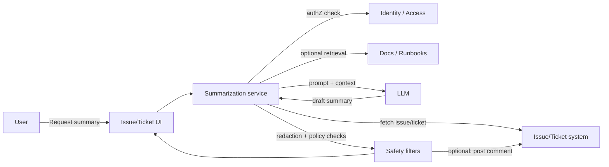

# Work-item summarization assistant (thread + context summaries)

> **SAFE‑AUCA industry reference guide (draft)**
>
> This use case describes a real-world workflow that many organizations deploy early as they introduce agentic AI into daily operations: summarizing long work-item threads (issues, tickets, incident records, support cases) into a structured context snapshot for humans.
>
> It focuses on:
>
> * how the workflow works in practice (tools, data, trust boundaries, autonomy)
> * what can go wrong (defender-friendly kill chain)
> * how it maps to **SAFE‑MCP techniques**
> * what controls + tests make it safer
>
> **Defender-friendly only:** do **not** include operational exploit steps, payloads, or step-by-step attack instructions.  
> **No sensitive info:** do not include internal hostnames/endpoints, secrets, customer data, non-public incidents, or proprietary details.

---

## Metadata

| Field                | Value                                                            |
| -------------------- | ---------------------------------------------------------------- |
| **SAFE Use Case ID** | `SAFE-UC-0018`                                                   |
| **Status**           | `draft`                                                          |
| **Maturity**         | draft                                                            |
| **NAICS 2022**       | `51` (Information), `513210` (Software Publishers)               |
| **Last updated**     | `2026-04-21`                                                     |

### Evidence (public links)

* [Jira Service Management — Summarize a work item's details using AI](https://support.atlassian.com/jira-service-management-cloud/docs/summarize-an-issues-comments-using-atlassian-intelligence/)
* [Atlassian Rovo — product overview](https://www.atlassian.com/software/rovo)
* [GitHub Copilot — Using GitHub Copilot to explore issues and discussions](https://docs.github.com/en/copilot/tutorials/explore-issues-and-discussions)
* [Slack — Guide to AI features in Slack](https://slack.com/help/articles/25076892548883-Guide-to-AI-features-in-Slack)
* [Desk365 — How to summarize a ticket using AI](https://help.desk365.io/en/articles/summarize-ticket-using-ai/)
* [Microsoft Purview — data security and compliance protections for Microsoft 365 Copilot and other generative AI apps](https://learn.microsoft.com/en-us/purview/ai-microsoft-purview)
* [OWASP Top 10 for LLM Applications (2025)](https://genai.owasp.org/llm-top-10/)
* [NIST AI 600-1 — AI Risk Management Framework: Generative AI Profile (July 2024)](https://nvlpubs.nist.gov/nistpubs/ai/NIST.AI.600-1.pdf)
* [Invariant Labs — GitHub MCP Exploited: Accessing private repositories via MCP (May 2025)](https://invariantlabs.ai/blog/mcp-github-vulnerability)

---

## Minimum viable write-up (Seed → Draft fast path)

This document covers:

* Executive summary
* Industry context & constraints
* Workflow + scope
* Architecture (tools + trust boundaries + inputs)
* Operating modes
* Kill-chain table
* SAFE‑MCP mapping table
* Contributors + Version History

---

## 1. Executive summary (what + why)

**What this workflow does**  
Software engineering, IT service, customer support, and security operations teams use "work items" (bugs, feature requests, incident records, support tickets, alert cases) as the system of record for ongoing work. Over time, a single item can accumulate:

* long comment threads
* status changes and ownership handoffs
* attachments (screenshots, logs, documents)
* links to other work items, pull requests, documentation, dashboards, runbooks

A **work-item summarization assistant** generates a short, structured summary of the current state:

* what happened so far
* current status and owner
* key decisions and rationale
* open questions / blockers
* next actions

**Why it matters (business value)**  
This reduces time to:

* get context during handoffs
* re-triage reopened tickets
* prepare status updates
* decide whether escalation is needed

Because it is often deployed **read-only** (no tool writes), it tends to be one of the first agentic workflows organizations roll out.

**Why it's risky / what can go wrong**  
Even read-only summarization can fail in high-impact ways:

* **Integrity:** hallucinated or incorrect summaries mislead humans about status, owners, commitments, or decisions
* **Confidentiality:** summaries can surface sensitive content from tickets (PII, credentials, incident details, customer data)
* **Scope:** retrieval expansion (linked tickets, docs, search) can cross permission boundaries
* **Persistence:** if the assistant auto-posts summaries back into work items, errors or leakage can spread and persist in the system of record

Public incidents across adjacent workflows — indirect prompt injection in enterprise Copilot (CVE-2025-32711 "EchoLeak"), Slack AI data exfiltration via public-channel messages (PromptArmor, August 2024), and private-repository data access via GitHub MCP (Invariant Labs, May 2025) — illustrate that these risks are not theoretical when LLMs ingest untrusted, user-generated content from work items.

---

## 2. Industry context & constraints (reference-guide lens)

Keep this high level (no implementation specifics).

### Where this shows up

Common in:

* SaaS engineering teams (bugs, feature requests, customer-reported issues)
* IT service management / service desks (incidents, requests, problems)
* customer support escalation queues
* security operations (investigation cases, incident threads, reliability follow-ups)
* site reliability / on-call workflows (incident context, post-incident drafting)
* developer-tooling agents that read pull request discussions or issue threads

### Typical systems

* ticket / issue trackers (issue fields, comments, history)
* identity and access (SSO, RBAC, groups, session-scoped tokens)
* knowledge bases, runbooks, internal documentation
* code hosting (pull request and commit links), dashboards, incident timelines (optional)
* enterprise data loss prevention / redaction layers (commonly placed in front of or around the summarizer)

### Constraints that matter

* **Access control:** summaries are expected to respect the same permissions as the underlying work item and any linked objects.
* **Data sensitivity:** tickets often contain secrets, credentials, PII, security incident details, or customer data.
* **Auditability:** teams often need to answer "what source text produced this summary?"
* **Latency:** users expect a summary in seconds.
* **Correctness over creativity:** hallucinations are harmful; faithful summarization is the goal.

### Must-not-fail outcomes

* leaking secrets or PII into a broadly visible summary
* misrepresenting status, owner, or commitments in a way that causes incorrect action
* persistent misinformation if auto-posted into the system of record
* cross-scope disclosure of content the requester is not authorized to see

---

## 3. Workflow description & scope

### 3.1 Workflow steps (happy path)

1. A user views a work item and requests a summary (button, command, or automated trigger).
2. The summarizer fetches the work item: description, comments, metadata, status, timestamps.
3. (Optional) The summarizer retrieves limited related context (linked items, runbooks, docs) within permission scope.
4. The model produces a structured summary.
5. The summary is shown to the user, and optionally:
   * copied into a handoff
   * posted back as a comment (HITL / guarded)
   * written into dedicated fields ("Summary", "Next steps") (higher-risk)

### 3.2 In scope / out of scope

* **In scope:** faithful summarization of ticket content and explicitly allowed related context.
* **Out of scope:** executing instructions contained inside ticket text; taking operational actions (deploys, incident remediation) as part of summarization.

### 3.3 Assumptions

* The ticketing system is the authoritative record.
* The summarizer enforces request-scoped authorization checks for any retrieval.
* Model output is treated as untrusted until it passes safety checks (redaction, policy checks).

### 3.4 Success criteria

* Summary is accurate and clearly marked as machine-generated (when applicable).
* No cross-scope leakage (summary reveals only what the requester can access).
* Secrets and PII are redacted or blocked before display or posting.
* Delivered within target latency / SLO and fails safely.

---

## 4. System & agent architecture

### 4.1 Actors and systems

* **Human roles:** engineers, support agents, on-call responders, managers
* **Work-item system:** issue tracker / ticketing system
* **Identity & access:** SSO / RBAC / group membership
* **Summarization service:** the component orchestrating retrieval, prompting, filtering
* **LLM runtime:** internal or hosted model
* **Optional context sources (read-only):** docs / runbooks, code links, dashboards
* **Safety filters:** secret scanning, PII detection / redaction, policy checks (commonly provided by enterprise DLP layers)

### 4.2 Trusted vs untrusted inputs

| Input / source                  | Trusted?       | Why                              | Typical failure / abuse pattern                                 | Mitigation theme                                           |
| ------------------------------- | -------------- | -------------------------------- | --------------------------------------------------------------- | ---------------------------------------------------------- |
| Ticket comments & descriptions  | Untrusted      | user-generated                   | prompt injection / misinformation                               | treat as data; isolate instructions; structured output      |
| Attachments (logs, screenshots) | Untrusted      | often external                   | secrets exposure / irrelevant content                           | scanning + limits + sandboxing                              |
| Links in tickets                | Untrusted      | can be malicious or restricted   | retrieval expansion / scope confusion                           | no direct browsing; strict allowlists                       |
| Ticket metadata (status / assignee) | Semi-trusted | system-derived but editable      | manipulation / stale fields                                     | verify via system APIs; prefer authoritative fields         |
| Internal KB / runbooks          | Semi-trusted   | can be stale                     | wrong guidance                                                  | provenance + "last updated" + citations                     |
| Tool outputs                    | Mixed          | depends on tool                  | contaminated context                                            | schema + validation + logging                               |

### 4.3 Trust boundaries

Teams commonly model four boundaries when reasoning about this workflow:

1) **Untrusted input boundary**  
Ticket text is untrusted data (even when authored by employees). It can contain adversarial instructions, misinformation, or malformed content.

2) **Permission boundary**  
The summarizer must not access or reveal data the requester cannot access (including linked tickets and documents).

3) **Model boundary**  
LLM outputs are probabilistic and are treated as untrusted until checked.

4) **Write boundary (if enabled)**  
Posting summaries back into the ticket makes model output persistent and shareable; risk increases sharply.

### 4.4 High-level flow (illustrative)

### 4.5 Tool inventory

Typical tools (names vary by platform):

| Tool / MCP server                  | Read / write? | Permissions            | Typical inputs           | Typical outputs               | Failure modes                                |
| ---------------------------------- | ------------- | ---------------------- | ------------------------ | ----------------------------- | -------------------------------------------- |
| `issue.read`                       | read          | requester-scoped       | issue / ticket id        | fields, comments, history     | over-fetching; missing fields; stale cache    |
| `issue.list_comments`              | read          | requester-scoped       | issue id                 | comment list + ids            | ingestion of untrusted content                |
| `issue.search` (optional)          | read          | restricted             | query text               | matching issues               | cross-scope leakage; bulk harvesting          |
| `docs.read` (optional)             | read          | restricted             | doc id / url             | doc content                   | stale or incorrect context                    |
| `issue.comment.create` (optional)  | write         | gated                  | issue id + content       | created comment id            | persistence of hallucination or leakage       |
| `issue.field.update` (optional)    | write         | gated                  | field + value            | updated record                | integrity damage; workflow disruption         |

### 4.6 Governance & authorization matrix

| Action category           | Example actions                          | Allowed mode(s)                      | Approval required? | Required auth                 | Required logging / evidence               |
| ------------------------- | ---------------------------------------- | ------------------------------------ | ------------------ | ----------------------------- | ----------------------------------------- |
| Read-only retrieval       | fetch issue fields / comments            | manual / HITL / autonomous           | no                 | requester-scoped token        | request + retrieval set                   |
| Retrieval expansion       | fetch linked docs / issues               | manual / HITL / autonomous (guarded) | depends on scope   | requester-scoped + allowlists | retrieval list + denials                  |
| Global search             | org-wide issue search                    | manual / HITL only (initially)       | yes                | elevated scope                | query logs + access checks                |
| Write back to system      | post comment with summary                | HITL (initially)                     | yes                | scoped writer role            | before / after + attribution              |
| Update workflow fields    | update status / owner / priority         | manual only (recommended)            | always             | step-up auth                  | immutable audit trail                     |

### 4.7 Sensitive data & policy constraints

* **Data classes:** internal-only information, customer PII, credentials / tokens, security incident details, contractual commitments
* **Retention / logging:** keep audit logs while avoiding replication of sensitive data in logs
* **Output policy:** summaries should not reveal secrets or PII; should be faithful to source; should not fabricate citations
* **UI policy:** clearly label machine-generated summaries and provide "view sources" affordances

When tickets routinely carry regulated data, sector overlays commonly apply — for example, HIPAA administrative and technical safeguards for healthcare contexts, GLBA and PCI DSS obligations for financial contexts, and SOC 2 CC6 / CC7 trust-services criteria for SaaS providers. These overlays are directional; their applicability depends on deployment context and jurisdiction.

---

## 5. Operating modes & agentic flow variants

### 5.1 Manual baseline (no agent)

A human reads the issue and writes:

* handoff notes
* status update
* summary for manager / customer

**Risks:** slow and inconsistent; context switching; missed details.

### 5.2 Human-in-the-loop (HITL / sub-autonomous)

The assistant drafts a summary; a human:

* reviews for accuracy
* removes sensitive content
* decides whether to post it back

**Typical UX:** "Summarize" → editable output → "Copy / Insert / Post" actions.

**Risk profile:** mostly bounded to incorrect text if not auto-posted.

### 5.3 Fully autonomous (end-to-end agentic, guardrailed)

Summaries generated automatically on triggers:

* reassigned to a new owner
* reopened after closure
* thread exceeds N messages
* major status transition

Guardrails commonly applied for autonomy:

* clear "auto-generated draft" labeling
* owner notifications and easy edit / remove
* citations to source comment IDs / timestamps
* default to not posting publicly without explicit enablement

**Risk profile:** higher; persistence makes errors long-lived.

### 5.4 Variants

A safe pattern is to split the workflow into small components:

1. **Collector** (permission-scoped retrieval only)
2. **Summarizer** (structured draft)
3. **Redactor** (secrets / PII policy)
4. **Verifier** (unsupported-claim detection + citation enforcement)

Splitting enables independent review, separate kill switches, and cleaner audit trails.

---

## 6. Threat model overview (high-level)

### 6.1 Primary security & safety goals

* prevent cross-scope data leakage
* prevent persistence of sensitive content (especially if posting back)
* minimize hallucinations and unsupported claims
* keep the workflow attributable and auditable

### 6.2 Threat actors (who might attack / misuse)

* malicious external reporter (public bug tracker scenarios)
* compromised employee account
* insider attempting to launder sensitive content into summaries
* compromised or malicious integration (third-party tool, MCP server, connected app) whose outputs flow into the summarizer's context

### 6.3 Attack surfaces

* user-generated ticket text (comments, descriptions)
* attachments (pasted logs often include secrets)
* links and referenced resources
* retrieval expansion (linked tickets, docs, search)
* write-back actions (posting summaries into the system of record)
* tool / connector output that reaches the model as context

### 6.4 High-impact failures (include industry harms)

* **Customer / consumer harm:** disclosure of customer information; incorrect commitments communicated or relied upon
* **Business harm:** breach incidents, regulatory exposure, reputational damage, bad prioritization, missed incidents
* **Security harm:** unauthorized access or exfiltration; integrity damage if summaries are persisted and trusted

---

## 7. Kill-chain analysis (stages → likely failure modes)

> Keep this defender-friendly. Describe patterns, not "how to do it."

| Stage                        | What can go wrong (pattern)                                                 | Likely impact                                           | Notes / preconditions                                          |
| ---------------------------- | --------------------------------------------------------------------------- | ------------------------------------------------------- | -------------------------------------------------------------- |
| 1. Entry / trigger           | Adversary creates or edits ticket content to influence the summarizer       | sets up prompt injection or misinformation              | external reporter or compromised user                          |
| 2. Context contamination     | Summarizer ingests untrusted thread text without boundaries                 | model follows instructions inside "data"                | treat ticket text as untrusted                                 |
| 3. Retrieval expansion       | Agent pulls linked issues, docs, or search results beyond requester scope   | data exfiltration via summary                           | common when global search or unrestricted retrieval is enabled |
| 4. Generation                | Model hallucinates status, owner, decisions, or supporting evidence         | mis-triage; wrong escalation; bad decisions             | mitigated with verification + structured format                |
| 5. Persistence               | Auto-posted summary becomes part of the record and spreads                  | long-lived misinformation or leakage                    | higher risk in autonomous mode                                 |
| 6. Feedback loop             | Humans trust the summary and stop reading source records                    | systemic quality and safety regression                  | counter with citations and "view sources" UX                   |

---

## 8. SAFE‑MCP mapping (kill-chain → techniques → controls → tests)

Practitioners commonly map this workflow's failure patterns to the following SAFE‑MCP techniques. The mapping is directional — teams adapt it to their stack, threat model, and operating mode. Links in Appendix B resolve to the canonical technique pages.

| Kill-chain stage           | Failure / attack pattern (defender-friendly)                                                                                             | SAFE‑MCP technique(s)                                                                                      | Recommended controls (prevent / detect / recover)                                                                                                                  | Tests (how to validate)                                                                         |
| -------------------------- | ---------------------------------------------------------------------------------------------------------------------------------------- | ---------------------------------------------------------------------------------------------------------- | ------------------------------------------------------------------------------------------------------------------------------------------------------------------ | ----------------------------------------------------------------------------------------------- |
| Entry / contamination      | Untrusted ticket text — including content authored by third parties on linked items — steers the model away from summarization            | `SAFE-T1102` (Prompt Injection); `SAFE-T1103` (Fake Tool Invocation / indirect-data vector)                | treat ticket text as data; strict system instructions; isolate and quote ticket content; structured output schema; detect content patterns attempting to reframe instructions | adversarial-content fixtures; verify output remains a structured summary and remains policy-compliant |
| Retrieval expansion        | Cross-scope leakage via linked items, search, or connector outputs                                                                       | `SAFE-T1309` (Privileged Tool Invocation via Prompt Manipulation); `SAFE-T1801` (Automated Data Harvesting) | requester-scoped auth per retrieval; explicit allowlists; deny global search by default; log the full retrieval set; cap graph or link-expansion depth              | attempt to reference restricted objects; confirm refusal and omission; rate-limit and budget tests |
| Generation                 | Unsupported claims; fabricated status, owner, or decisions                                                                               | `SAFE-T2105` (Disinformation Output)                                                                       | structured summaries; require citations (comment IDs / timestamps); verifier step for key claims; "needs review" label on unsupported content                       | golden-set eval for factual fields (owner / status / next steps); hallucination thresholds        |
| Persistence                | Posting a summary leaks sensitive information or propagates errors                                                                       | `SAFE-T1910` (Covert Channel Exfiltration); `SAFE-T1911` (Parameter Exfiltration)                          | secret / PII scanning before display or post; default to draft-only; approval gate for posting; immutable write log                                                 | seed synthetic secrets or PII; verify block / redaction before any write-back                     |
| Feedback loop              | UI hides tool activity or overstates certainty                                                                                           | `SAFE-T1404` (Response Tampering)                                                                          | show "sources used"; link back to original comments; label machine-generated output; tool-ledger transparency                                                       | UX tests: users can trace claims to sources; audits show tool calls match the narrative           |

---

## 9. Controls & mitigations (organized)

### 9.1 Prevent (reduce likelihood)

* **Least privilege by default:** start read-only (`issue.read`).
* **Permission-scoped retrieval:** each retrieved object passes requester authorization.
* **No direct URL browsing from ticket text:** treat links as untrusted; require explicit allowlists.
* **Structured output:** a fixed schema reduces drift and hallucination surface.
* **Citations:** include comment IDs and timestamps for key claims (status, decision, next steps).
* **Redaction:** scan inputs and outputs for secrets and PII; block or redact.

### 9.2 Detect (reduce time-to-detect)

* injection-pattern detection on user-generated content (lightweight heuristics + analytics)
* log and alert on blocked or redacted generations
* monitor hallucination and unsupported-claim rates over time
* anomaly detection on retrieval volume (bulk or iterative patterns)

### 9.3 Recover (reduce blast radius)

* kill switch to disable auto-generation and / or write-back
* easy rollback: delete or replace posted summaries
* user reporting flow ("bad summary") routed to owners
* degrade safely: if uncertain, show a partial summary with explicit "needs review"

---

## 10. Validation & testing plan

### 10.1 What to test (minimum set)

* **Permission boundaries:** different users with different ticket access receive different summaries; cross-scope leakage is verified absent.
* **Prompt / tool-output robustness:** adversarial ticket content does not change system behavior.
* **Secret / PII protection:** synthetic secrets and PII are blocked or redacted in outputs and never written back.
* **Factuality:** key fields (owner, status, decisions, next steps) meet accuracy targets.
* **Reliability:** summaries meet latency SLOs and fail safely.

### 10.2 Test cases (make them concrete)

| Test name             | Setup                                       | Input / scenario                                      | Expected outcome                                                | Evidence produced                    |
| --------------------- | ------------------------------------------- | ----------------------------------------------------- | --------------------------------------------------------------- | ------------------------------------ |
| Cross-scope summary   | two users with different access             | summarize the same ticket with restricted links       | outputs differ; no restricted information in the broader output | logs + output snapshots              |
| Injection robustness  | adversarial text fixture                    | ticket contains instruction-like content              | still a summary; ignores embedded instructions                  | fixture + output diff                |
| Secret / PII filter   | synthetic secret fixtures                   | ticket contains fake keys / PII                       | blocked or redacted before display / write                      | filter logs + outputs                |
| Factual fields eval   | labeled dataset                             | run summaries vs ground truth                         | accuracy above threshold (set per deployment)                   | eval report                          |
| Write-back gating     | HITL enabled                                | attempt to post the summary                           | requires approval; audit trail present                          | tool logs + change record            |

### 10.3 Operational monitoring (production)

* summary request volume, latency, error rate
* blocked / redacted output rate
* retrieval expansion rate (linked docs / issues)
* user feedback signals ("bad summary" reports)
* rollback events / kill-switch activations

---

## 11. Open questions & TODOs

- [ ] Define a standard structured summary schema (fields + citation format) for consistency across deployments.
- [ ] Decide the policy for attachments (logs, screenshots): summarize vs. exclude vs. gated review.
- [ ] Decide the default policy for write-back: disabled by default vs. HITL-only.
- [ ] Define minimum audit requirements for regulated environments (retention, provenance, evidence).
- [ ] Document the threshold above which retrieval expansion requires step-up authorization.

---

## 12. Questionnaire prompts (for reviewers)

### Workflow realism

* Are the tools and steps realistic for common issue trackers and ITSM tools?
* What major constraint is missing (permissions, attachments, links, latency)?

### Trust boundaries & permissions

* Where are the real trust boundaries in your deployment?
* Can the summarizer access linked issues and documents? Global search?
* Are tokens request-scoped and short-lived?

### Output safety & persistence

* Is the summary displayed only to the requester, or posted back?
* Do you scan for secrets and PII before display or posting?
* Is output clearly labeled as machine-generated? Do you show sources?

### Correctness

* What facts must never be wrong (owner, status, SLA timers, commitments)?
* Do you require citations for key claims?
* What is the rollback plan if summaries drift or regress?

### Operations

* Success metrics: time saved, better handoffs, fewer reopen loops
* Danger metrics: leakage incidents, hallucination rate, complaint rate
* Who owns the kill switch?

---

## Appendix

### A. Suggested summary format

A format that tends to work well:

* **TL;DR (1–2 sentences)**
* **Current status** (state, owner, SLA clock)
* **What changed recently** (last 24–72 hours)
* **Key decisions** (with citations)
* **Open questions / blockers**
* **Next steps** (with owner + due date if available)

### B. References & frameworks

Industry practitioners commonly cross-reference the following catalogs and frameworks when reasoning about this workflow. Inclusion here is directional — applicability depends on deployment context, jurisdiction, and the data the summarizer can reach.

**SAFE‑MCP techniques referenced in this use case**

* [SAFE‑MCP framework (overview)](https://github.com/safe-agentic-framework/safe-mcp)
* [SAFE-T1102: Prompt Injection (Multiple Vectors)](https://github.com/safe-agentic-framework/safe-mcp/blob/main/techniques/SAFE-T1102/README.md)
* [SAFE-T1103: Fake Tool Invocation (Function Spoofing)](https://github.com/safe-agentic-framework/safe-mcp/blob/main/techniques/SAFE-T1103/README.md)
* [SAFE-T1309: Privileged Tool Invocation via Prompt Manipulation](https://github.com/safe-agentic-framework/safe-mcp/blob/main/techniques/SAFE-T1309/README.md)
* [SAFE-T1404: Response Tampering](https://github.com/safe-agentic-framework/safe-mcp/blob/main/techniques/SAFE-T1404/README.md)
* [SAFE-T1801: Automated Data Harvesting](https://github.com/safe-agentic-framework/safe-mcp/blob/main/techniques/SAFE-T1801/README.md)
* [SAFE-T1910: Covert Channel Exfiltration](https://github.com/safe-agentic-framework/safe-mcp/blob/main/techniques/SAFE-T1910/README.md)
* [SAFE-T1911: Parameter Exfiltration](https://github.com/safe-agentic-framework/safe-mcp/blob/main/techniques/SAFE-T1911/README.md)
* [SAFE-T2105: Disinformation Output](https://github.com/safe-agentic-framework/safe-mcp/blob/main/techniques/SAFE-T2105/README.md)

**Industry frameworks teams commonly consult**

* [NIST AI Risk Management Framework (AI RMF 1.0), January 2023](https://nvlpubs.nist.gov/nistpubs/ai/NIST.AI.100-1.pdf)
* [NIST AI 600-1 — AI Risk Management Framework: Generative AI Profile, July 2024](https://nvlpubs.nist.gov/nistpubs/ai/NIST.AI.600-1.pdf)
* [NIST SP 800-218A — Secure Software Development Practices for Generative AI and Dual-Use Foundation Models (SSDF Community Profile), July 2024](https://nvlpubs.nist.gov/nistpubs/SpecialPublications/NIST.SP.800-218A.pdf)
* [OWASP Top 10 for LLM Applications (2025)](https://genai.owasp.org/llm-top-10/)
* [MITRE ATLAS](https://atlas.mitre.org/)
* [Regulation (EU) 2024/1689 (AI Act)](https://eur-lex.europa.eu/eli/reg/2024/1689/oj)
* [ISO/IEC 42001:2023 — AI management systems](https://www.iso.org/standard/81230.html)
* [ISO/IEC 23894:2023 — AI risk management guidance](https://www.iso.org/standard/77304.html)

**Public incidents and disclosures adjacent to this workflow**

* [CVE-2025-32711 (EchoLeak), Microsoft Security Response Center, June 2025](https://msrc.microsoft.com/update-guide/vulnerability/CVE-2025-32711)
* [Cato Networks — "Breaking down 'EchoLeak', the First Zero-Click AI Vulnerability Enabling Data Exfiltration from Microsoft 365 Copilot" (May 2025)](https://www.catonetworks.com/blog/breaking-down-echoleak/)
* [PromptArmor — "Data Exfiltration from Slack AI via indirect prompt injection" (August 2024)](https://promptarmor.substack.com/p/data-exfiltration-from-slack-ai-via)
* [Invariant Labs — "GitHub MCP Exploited: Accessing private repositories via MCP" (May 2025)](https://invariantlabs.ai/blog/mcp-github-vulnerability)
* [HiddenLayer — "New Gemini for Workspace Vulnerability Enabling Phishing & Content Manipulation" (September 2024)](https://hiddenlayer.com/innovation-hub/new-gemini-for-workspace-vulnerability)

**Enterprise safeguards and operating patterns**

* [Microsoft Purview — data security and compliance protections for Microsoft 365 Copilot and other generative AI apps](https://learn.microsoft.com/en-us/purview/ai-microsoft-purview)

---

## Contributors

* **Author:** SAFE‑AUCA community (update with name / handle)
* **Reviewer(s):** TBD
* **Additional contributors:** TBD

---

## Version History

| Version | Date       | Changes                                                                                                                                                                                                                                                                                                                      | Author                  |
| ------- | ---------- | ---------------------------------------------------------------------------------------------------------------------------------------------------------------------------------------------------------------------------------------------------------------------------------------------------------------------------- | ----------------------- |
| 1.0     | 2026-02-15 | Rewritten to align with latest SAFE‑AUCA template; retains starter content and adds governance / inputs / versioning sections.                                                                                                                                                                                               | SAFE‑AUCA community     |
| 2.0     | 2026-04-21 | Promoted from starter to draft. Expanded Evidence section to include verified vendor documentation, standards bodies (OWASP LLM Top 10, NIST AI 600-1), and a public incident disclosure. Added `SAFE-T1103` to the Entry / contamination mapping row. Added Appendix B ("References & frameworks") following the community draft convention. Voice pass to reinforce directional-guidance framing while preserving hard safety rules on permission boundaries, sensitive-data handling, and defender-friendly disclosure. | SAFE‑AUCA community     |
