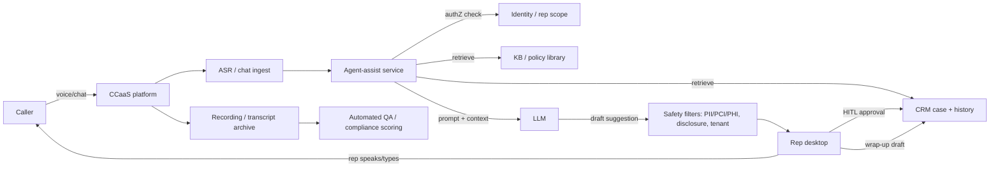

# Contact-center agent assist

> **SAFE‑AUCA industry reference guide (draft)**
>
> This use case describes a real-world workflow deployed broadly across customer-facing operations: real-time AI assistance for contact-center representatives while they handle live voice and chat interactions with customers. The assistant listens to (or reads) the exchange, retrieves relevant knowledge, suggests next-best replies, generates a wrap-up summary, and writes disposition metadata back to the CRM.
>
> It focuses on:
>
> * how the workflow works in practice (tools, data, trust boundaries, autonomy)
> * what can go wrong (defender-friendly kill chain)
> * how it maps to **SAFE‑MCP techniques**
> * what controls + tests make it safer
>
> **Defender-friendly only:** do **not** include operational exploit steps, payloads, or step-by-step attack instructions.
> **No sensitive info:** do not include internal hostnames/endpoints, secrets, customer data, non-public incidents, or proprietary details.

---

## Metadata

| Field                | Value                                                            |
| -------------------- | ---------------------------------------------------------------- |
| **SAFE Use Case ID** | `SAFE-UC-0021`                                                   |
| **Status**           | `draft`                                                          |
| **Maturity**         | draft                                                            |
| **NAICS 2022**       | `56` (Administrative and Support and Waste Management and Remediation Services), `561422` (Telemarketing Bureaus and Other Contact Centers), with deployment overlays in `52` (Finance and Insurance), `62` (Health Care and Social Assistance), and `51` (Information) |
| **Last updated**     | `2026-04-24`                                                     |

### Evidence (public links)

* [CFPB Issue Spotlight — Chatbots in Consumer Finance (June 2023)](https://www.consumerfinance.gov/about-us/newsroom/cfpb-issue-spotlight-analyzes-artificial-intelligence-chatbots-in-banking/)
* [CFPB Consumer Financial Protection Circular 2023-03 — Adverse action notification requirements and AI-generated decisions (Sept 2023)](https://www.consumerfinance.gov/compliance/circulars/circular-2023-03-adverse-action-notification-requirements-and-the-proper-use-of-the-cfpbs-sample-forms-provided-in-regulation-b/)
* [FTC Operation AI Comply — Press release on five enforcement actions (Sept 25, 2024)](https://www.ftc.gov/news-events/news/press-releases/2024/09/ftc-announces-crackdown-deceptive-ai-claims-schemes)
* [FCC Declaratory Ruling FCC-24-17 — TCPA applies to AI-generated voices (Feb 8, 2024)](https://www.fcc.gov/document/fcc-confirms-tcpa-applies-ai-technologies-generate-human-voices)
* [NIST AI 600-1 — Artificial Intelligence Risk Management Framework: Generative AI Profile (July 26, 2024)](https://www.nist.gov/publications/artificial-intelligence-risk-management-framework-generative-artificial-intelligence)
* [OWASP LLM01:2025 — Prompt Injection (OWASP Gen AI Security Project, 2025)](https://genai.owasp.org/llmrisk/llm01-prompt-injection/)
* [EU AI Act — Article 50 transparency obligations for AI interacting with natural persons](https://artificialintelligenceact.eu/article/50/)
* [ABA Business Law Today — BC Tribunal confirms companies remain liable for information provided by AI chatbot (Moffatt v Air Canada, Feb 2024)](https://www.americanbar.org/groups/business_law/resources/business-law-today/2024-february/bc-tribunal-confirms-companies-remain-liable-information-provided-ai-chatbot/)
* [The Markup — NYC's AI chatbot tells businesses to break the law (March 29, 2024)](https://themarkup.org/news/2024/03/29/nycs-ai-chatbot-tells-businesses-to-break-the-law)
* [Google Cloud — Agent Assist (real-time suggestions, transcription, post-call summary)](https://cloud.google.com/agent-assist)

---

## Minimum viable write-up (Seed → Draft fast path)

This document covers:

* Executive summary
* Industry context & constraints
* Workflow + scope
* Architecture (tools + trust boundaries + inputs)
* Operating modes
* Kill-chain table (7 stages)
* SAFE‑MCP mapping table (22 techniques)
* Contributors + Version History

---

## 1. Executive summary (what + why)

**What this workflow does**
A **contact-center agent-assist** runs alongside a human representative while the rep handles a live customer interaction over voice, chat, email, or messaging. It transcribes or ingests the conversation in near-real-time, retrieves relevant knowledge from internal knowledge bases, CRM histories, and policy libraries, and surfaces:

* next-best-reply suggestions ("whisper" prompts the rep can paraphrase or read verbatim)
* structured summaries of the case so far
* disposition/tagging recommendations
* draft wrap-up notes for the CRM
* real-time compliance signals (e.g., required disclosures pending, sentiment or regulated-term alerts)

Architectures span the major CCaaS and CRM platforms — Amazon Connect AI agents and Q in Connect, Salesforce Agentforce for Service, ServiceNow Now Assist, Zendesk AI, Intercom Fin, Cresta Agent Assist, Observe.AI real-time assist, Google Cloud Agent Assist, Five9 Genius, NICE CXone AI (formerly Enlighten AI), and Genesys Agent Copilot among them.

**Why it matters (business value)**
Contact-center operations sit on top of two durable cost drivers: handle time and rep ramp. Teams commonly cite agent-assist for:

* reducing average handle time on complex cases
* cutting new-rep ramp through in-line coaching
* raising first-contact-resolution rates by surfacing the right policy or past case at the moment of need
* enabling 100% QA sampling (vs. random sampling of 1–5% of calls historically), as described by vendors like CallMiner, NICE, and Observe.AI
* compressing post-call wrap-up from minutes per call to seconds
* extending skilled-rep throughput during volume spikes without proportionally adding headcount

A June 2023 CFPB Issue Spotlight observed that roughly 37% of the US population had interacted with a bank chatbot in 2022 — a regulator-sourced deployment-density signal that frames both the upside (ubiquity) and the downside (regulated-language exposure at scale).

**Why it's risky / what can go wrong**
Agent-assist has a different risk shape than batch summarization or privileged-execution assistants because it sits inside a real-time, regulated consumer interaction. High-impact failure patterns include:

* **Integrity:** a hallucinated rate, fee, policy term, or statutory right that the rep repeats verbatim to the caller — becoming a binding misrepresentation. The February 2024 Moffatt v Air Canada ruling at the British Columbia Civil Resolution Tribunal awarded the customer $650.88 CAD after a bereavement-fare chatbot hallucinated a policy; the tribunal rejected the airline's argument that the chatbot was a separate legal entity.
* **Confidentiality:** caller PII, PHI, or payment card data leaking into prompts, logs, or wrap-up summaries stored outside the permitted scope.
* **Scope:** knowledge-base retrieval crossing tenants (especially acute in BPO engagements) or pulling policies from a regulated vertical into a different vertical's call.
* **Regulatory drift:** a required disclosure (Reg E §1005.11 error-resolution rights, Reg Z §1026 credit cost, Reg DD §1030 deposit terms, TCPA recording consent, HIPAA notice of privacy practices) paraphrased by the model and losing the protective statutory language.
* **Handoff-boundary smuggling:** context persisted across agent ↔ supervisor ↔ specialist-team handoffs in a way that allows prior-call residue to bias the next session.
* **Real-time adversarial pressure:** caller-spoken or caller-typed instructions attempting to redirect the model (prompt injection via ASR-transcribed speech, memo-field text, or chat turns).
* **Over-reliance regression:** reps stopping to verify AI output, especially when the assistant reads confident-sounding language over a headset on call-15 of the shift.

---

## 2. Industry context & constraints (reference-guide lens)

### Where this shows up

Common in:

* BPO and outsourced contact centers (NAICS 561422) serving finance, healthcare, telecom, utility, retail, and public-sector clients
* in-house customer-operations teams at banks, insurers, brokerages, and payment processors (NAICS 52)
* healthcare call centers, nurse advice lines, and payer/provider member-services teams (NAICS 62)
* telecom/utility/cable customer care, technical support, and collections
* software and SaaS support desks handling licensing, provisioning, and incident coordination
* public-sector / municipal 311, benefits, and agency-support lines

### Typical systems

* **CCaaS platforms:** Amazon Connect, Salesforce Service Cloud Voice, ServiceNow CSM, Five9, NICE CXone, Genesys Cloud, Zoom Contact Center, Talkdesk
* **Agent-assist layers:** vendor-native copilots (Q in Connect, Agentforce for Service, Now Assist, Agent Copilot, CXone AI), and specialty real-time-assist products (Cresta, Observe.AI, Gong, Level AI)
* **CRM systems of record:** Salesforce, Microsoft Dynamics 365, HubSpot, Zendesk, Intercom, ServiceNow
* **Speech / language infrastructure:** ASR engines (cloud or on-prem), LLM runtimes, vector databases for KB retrieval, sentiment and intent classifiers, text-to-speech for any synthetic-voice component
* **Knowledge / policy sources:** internal KBs, runbooks, product/price catalogs, compliance disclosure libraries, prior case histories
* **Quality and monitoring:** call recording platforms, speech-analytics (CallMiner, Verint, NICE), workforce-optimization tools

### Constraints that matter

* **Latency:** suggestions are commonly expected within 1–3 seconds of the caller's utterance; slower assistance is routinely ignored by reps and quickly becomes shelfware.
* **Consumer protection and UDAAP risk:** the CFPB's June 2023 Issue Spotlight and FTC's September 2024 Operation AI Comply make clear that AI that misleads a consumer or blocks reasonable access to human help creates enforcement risk independent of any AI-specific framework.
* **Regulated disclosure fidelity:** Reg E, Reg Z, and Reg DD define what must be said to the consumer in specific situations. Many operators treat regulated language as verbatim-only: the model suggests when a disclosure is due, but the text itself is retrieved from an authoritative library rather than generated.
* **Recording and biometric consent:** approximately a dozen US states apply all-party (two-party) consent to call recording, including California (Penal Code §632), Connecticut, Delaware, Florida, Illinois, Maryland, Massachusetts, Michigan, Montana, Nevada, New Hampshire, Pennsylvania, and Washington. Voiceprint handling is additionally governed by biometric-privacy statutes like Illinois BIPA (740 ILCS 14), Texas CUBI, and Washington RCW 19.375.
* **Payment card data:** PCI DSS 4.0.1 Req 3 and the PCI SSC's Telephone-Based Payment Card Data guidance treat pause-and-resume recording as insufficient on its own for DTMF-entered PAN; DTMF-suppression architectures are the increasingly preferred pattern.
* **PHI in healthcare contact centers:** 45 CFR §164.308 and §164.312 apply to transcripts, prompts, and retrieval stores that contain patient identifiers.
* **Multi-tenant BPO isolation:** a contact center handling calls for multiple clients must keep each client's KB, CRM, and case history strictly partitioned — contractually as much as technically.
* **Disclosure to the caller:** EU AI Act Article 50 requires that AI systems interacting with natural persons be designed so those persons are informed — for chatbots or AI-voice adjuncts. Whether a whisper-style assistant behind a human rep triggers Article 50 remains genuinely ambiguous; practitioners and counsel disagree.

### Must-not-fail outcomes

* the rep repeating a hallucinated statutory right, price, fee, rate, or eligibility rule to the consumer
* a regulated disclosure being model-paraphrased in a way that loses its protective statutory meaning
* cross-tenant or cross-vertical KB content surfacing in a call where it does not belong
* PCI PAN, PHI, SSN, or other sensitive identifiers persisted into prompts, logs, transcripts, or wrap-up fields beyond their permitted scope
* a caller being blocked from reaching a human when the AI cannot resolve the issue
* an AI-influenced adverse credit or service-denial decision delivered without a specific and accurate reason (per CFPB Circular 2023-03)

---

## 3. Workflow description & scope

### 3.1 Workflow steps (happy path)

1. A customer contacts the organization via voice, chat, messaging, email, or social — possibly after passing through an IVR or AI-voice front door.
2. The interaction is routed to a human representative based on skills, language, queue, or predicted intent.
3. The agent-assist service begins real-time ingestion: speech-to-text for voice, or direct-text for chat; it may also pull the caller's identity, account context, and prior case history from the CRM within the rep's permission scope.
4. During the interaction, the assistant:
   * transcribes and indexes the live utterance stream
   * runs retrieval against KBs, policy libraries, and prior cases using the current context
   * produces whisper-style suggested replies, rebuttals, or next-best-action prompts
   * surfaces real-time flags: disclosure required, sentiment deteriorating, regulated keyword detected, hold-time threshold crossed
5. The rep paraphrases, reads, or ignores each suggestion; for regulated language the canonical pattern is to read authoritative disclosure text from a verified library.
6. On wrap-up, the assistant drafts:
   * a case summary (CRM "case note" field)
   * a disposition/tag recommendation
   * next-action items (callback, escalation, ticket, refund, dispute)
7. The rep reviews the draft summary, edits if needed, and saves it. Post-call automated QA scoring may run across the full interaction.
8. Analytics pipelines aggregate transcripts and summaries for coaching, compliance review, and product feedback.

### 3.2 In scope / out of scope

* **In scope:** real-time transcription, KB retrieval within the rep's permission scope, whisper-style suggestions surfaced only to the rep, draft wrap-up generation, disposition suggestions, HITL-gated CRM write-back, automated QA scoring on completed interactions, sentiment and compliance cueing.
* **Out of scope:** autonomous customer-facing responses without a rep in the loop (covered by chatbot/voicebot use cases), autonomous decisioning for regulated actions (credit, adverse action, claims denial), direct tool execution that binds the organization contractually without rep authorization, caller voice biometric authentication decisions made by the assistant alone.

### 3.3 Assumptions

* The CCaaS platform, not the assistant, is the authoritative source of call state, recording, and routing metadata.
* ASR and LLM outputs are treated as untrusted drafts until the rep decides to adopt them; regulated disclosure text is retrieved from an authoritative library rather than generated.
* Retrieval is scoped to the rep's current queue, skill, and tenant assignment; cross-tenant, cross-skill, or cross-vertical retrieval requires an explicit policy allow.
* Consent (recording, biometric) is captured at the edge by the CCaaS platform and respected by every downstream component.
* The assistant does not bind the organization contractually; any commitment to the caller is authored by the rep.

### 3.4 Success criteria

* Suggestions are accurate, well-cited to a KB article or prior case, and delivered within the rep's latency tolerance.
* Regulated disclosures, when surfaced, are verbatim from an authoritative source.
* No cross-scope, cross-tenant, or cross-vertical leakage in suggestions, summaries, or logs.
* PCI/PHI/PII redaction holds across prompts, transcripts, logs, and persisted summaries.
* Wrap-up summaries reduce post-call time without systematically misstating facts.
* Every regulated action taken during the call is attributable to a named human principal (the rep).
* The system degrades safely: when the assistant is uncertain, low-confidence, or offline, the rep can complete the call unimpeded.

---

## 4. System & agent architecture

### 4.1 Actors and systems

* **Human roles:** contact-center representatives, supervisors, QA analysts, compliance officers, workforce managers, trainers, and — on regulated lines — licensed specialists (registered reps, clinicians, loan officers).
* **The caller:** an external, untrusted participant whose speech or text is the primary injection surface.
* **Assistant orchestrator:** the agent-assist service coordinating transcription, retrieval, prompting, safety filtering, and UI rendering.
* **Tools (MCP servers / APIs / connectors):** ASR, TTS, LLM runtime, KB search, CRM read/write, ticketing, policy-disclosure library, sentiment/intent classifiers, QA scorer, wrap-up field update.
* **Data stores:** live transcript cache, CRM case record, KB vector store, policy library, prior-call history, QA-scoring warehouse, recording archive.
* **Downstream systems affected:** CRM, ticketing, refund/claims systems, credit decisioning (if AI influences adverse action), QA dashboards, coaching and workforce-management platforms.

### 4.2 Trusted vs untrusted inputs (high value, keep simple)

| Input/source                          | Trusted?           | Why                                                           | Typical failure/abuse pattern                                                                                       | Mitigation theme                                                         |
| ------------------------------------- | ------------------ | ------------------------------------------------------------- | ------------------------------------------------------------------------------------------------------------------- | ------------------------------------------------------------------------ |
| Caller speech (via ASR)               | Untrusted          | external; ASR errors introduce novel ambiguity                 | prompt-injection phrases survive transcription; deepfake-voice impersonation; barge-in redirects the model          | treat transcript as data; quote/isolate; voiceprint + step-up authN       |
| Caller chat / email / social text     | Untrusted          | external free text                                            | classic prompt injection; malicious attachments; link-laden social-engineering                                      | treat as data; strict allowlist for any link fetch; attachment sandbox    |
| Prior case notes (CRM history)        | Semi-trusted       | human-authored; may contain stale, biased, or manipulated text | insider case-note poisoning; circular references; stale status fields                                               | provenance display; "view original" affordance; don't treat prior notes as ground truth |
| KB articles / policy library          | Semi-trusted       | internally curated but can drift or be poisoned                | RAG-corpus poisoning; stale pricing; edited-disclosure tampering                                                    | per-article provenance; retrieval signing / integrity checks; version pin on disclosures |
| CRM account data                      | Semi-trusted       | authoritative but editable                                    | stale balance; unauthorized write; enumeration via assist queries                                                   | request-scoped authZ; rate-limit reads; write gating                      |
| Rep-side input (agent typing)         | Semi-trusted       | authenticated human but can be coerced or compromised          | social engineering by caller; insider misuse; coached over-reliance                                                 | supervisor review sampling; anomaly detection on behavioral patterns      |
| Third-party tool outputs              | Mixed              | depends on vendor                                             | contaminated context; tool-schema drift; proxied response tampering                                                 | schema enforcement; output validation; connector allowlists               |
| LLM-generated suggestions             | Untrusted          | probabilistic; can hallucinate fees, rates, policy, statutes   | fabricated disclosure text; hallucinated refund amounts; invented case history                                      | citation enforcement; verbatim retrieval for regulated text; "needs review" label |

### 4.3 Trust boundaries (required)

Key boundaries practitioners commonly model explicitly:

1. **Live-caller boundary.** Every token of caller speech or text crosses from an untrusted external party into the assistant's prompt context. This is the primary injection surface in real-time operation.

2. **Rep-caller mediation boundary.** The rep stands between the AI and the caller. When the rep reads a suggestion verbatim, the AI's words become the organization's words — regulatory liability flows accordingly (Moffatt v Air Canada illustrates the principle for chatbots; the analogy is frequently cited for whisper-assist too).

3. **Permission boundary (agent scope).** The assistant must not retrieve or surface data beyond what the current rep is authorized to access — cross-queue, cross-skill, cross-team, or cross-tenant retrieval is generally out of scope without explicit policy.

4. **Tenant-isolation boundary.** In BPO and multi-client deployments, one client's context, KB, or case history must not bleed into another client's call. This is often a contractual obligation, not just a privacy control.

5. **Disclosure boundary.** Regulated disclosures (Reg E/Z/DD, TCPA consent, HIPAA notices, state biometric notices) must surface verbatim from an authoritative source, not be generated or paraphrased by the model.

6. **Write-back boundary.** Destructive or record-persisting actions (CRM case-note save, disposition tag, refund, ticket escalation, field update) must be gated by policy-as-code and require the rep's explicit action, with AI-attribution labeling preserved.

7. **Handoff boundary.** When a call transfers across reps, supervisors, specialist teams, or sessions, previous-context handoff should be scoped: enough for continuity, nothing that smuggles restricted content forward.

### 4.4 High-level flow (illustrative)

### 4.5 Tool inventory (required)

Typical tools (names vary by platform):

| Tool / MCP server                          | Read / write? | Permissions                                  | Typical inputs                               | Typical outputs                                     | Failure modes                                                                         |
| ------------------------------------------ | ------------- | -------------------------------------------- | -------------------------------------------- | --------------------------------------------------- | ------------------------------------------------------------------------------------- |
| `asr.transcribe`                           | read          | session-scoped; consent-gated                | audio stream                                 | token stream + confidence scores                    | mis-transcription introducing injection; PAN/PHI surviving into transcript             |
| `kb.search`                                | read          | rep-scoped queue/skill/tenant filter         | natural-language query                       | ranked articles + citations                         | RAG poisoning; stale content; cross-tenant match                                       |
| `crm.case.read`                            | read          | rep-scoped + account ACL                     | case/account ID                              | case fields, history, linked records                | over-fetching; ACL bypass; stale status                                                |
| `crm.customer.history`                     | read          | rep-scoped + privacy-tier gated              | customer ID                                  | prior cases, dispositions, flags                    | sensitive-flag leakage (e.g., fraud hold, restraining order)                           |
| `policy.disclosure.fetch`                  | read          | service account; version-pinned              | disclosure key (Reg E error, TCPA consent)   | verbatim statutory/policy text + version ID         | stale text; wrong jurisdiction; tampered store                                         |
| `sentiment.score` / `intent.classify`      | read          | session-scoped                               | transcript window                            | score + category                                    | biased scoring; spurious escalation; missed distress                                   |
| `qa.score`                                 | read          | service account                              | full transcript                              | QA score + rubric hits                              | over-scoring regulated risk; under-scoring de-escalation wins                          |
| `crm.case.note.create` (HITL)              | write         | gated; rep-attributed                        | case ID, draft note                          | case note ID + timestamp                            | persistence of hallucinated content; mis-attribution                                   |
| `crm.case.disposition.set` (HITL)          | write         | gated; policy-checked                        | case ID, disposition                         | updated case                                        | systematic mis-categorization; downstream SLA impact                                   |
| `ticket.create` / `ticket.update` (HITL)   | write         | gated; policy-checked                        | ticket fields                                | ticket ID                                           | cross-queue routing; missing required fields                                           |
| `refund.or.credit.initiate` (manual only)  | write         | step-up auth; supervisor for > threshold     | account ID, amount, reason                   | transaction ID                                      | over-refund; fraud loop; policy drift                                                  |
| `transfer.call` / `escalate.to.supervisor` | write         | rep action                                   | queue/skill/supervisor ID                    | routed session                                      | loss of context; cross-team handoff smuggling                                          |

### 4.6 Sensitive data & policy constraints

* **Data classes:** customer PII (name, DOB, SSN/TIN, address, email, phone), PCI PAN and CVV (IVR and spoken channels), PHI in healthcare centers, account credentials (PINs, security-question answers), voice biometrics, geolocation, children's data (COPPA if under-13 interactions), session recordings and transcripts.
* **Retention and logging:** recordings and transcripts commonly subject to minimum retention under sector rules (e.g., 3 years for financial disputes under Reg E; varies by state for healthcare); prompt/completion logs are increasingly scrutinized for sensitive-data replication and are often held to the shortest retention consistent with fraud and complaint defensibility.
* **Regulatory constraints:** TCPA (47 CFR §64.1200) and FCC Declaratory Ruling FCC-24-17 (Feb 8, 2024) covering AI-generated voices; Regulation E (12 CFR §1005, including §1005.11 error-resolution and §1005.17 overdraft opt-in); Regulation Z (12 CFR §1026) credit cost disclosures; Regulation DD (12 CFR §1030) deposit account disclosures; CFPB Circular 2023-03 adverse-action reasoning; FTC Section 5 and Operation AI Comply; EU AI Act Article 50 transparency; HIPAA 45 CFR §164.308 and §164.312; PCI DSS 4.0.1 (Requirement 3 stored account data, Requirement 12 risk assessment); California Penal Code §632 and peer all-party-consent states; Illinois BIPA (740 ILCS 14), Texas CUBI, and Washington RCW 19.375 for voice biometrics.
* **Safety/consumer-harm constraints:** mis-stated rate/fee/policy delivered in real time creates UDAAP exposure; an AI-paraphrased disclosure that loses statutory meaning may vitiate a regulated notice; cross-tenant or cross-vertical data surfacing creates contractual and privacy liability; children's interactions require COPPA-aware handling when applicable.

---

## 5. Operating modes & agentic flow variants

### 5.1 Manual baseline (no agent)

The rep handles the interaction directly: takes notes, looks up policy in a separate KB tab, types the wrap-up summary, and tags the disposition manually. **Existing controls:** supervisor monitoring, random-sample QA, real-time side-by-side coaching on new reps, mandatory checklists on high-risk dispositions. **Errors caught by:** supervisor listen-in, complaint-driven review, regulator examination. Many errors are latent until a complaint or audit surfaces them.

### 5.2 Human-in-the-loop (HITL / sub-autonomous)

The assistant surfaces suggestions, retrieves KB articles, and drafts the wrap-up; the rep remains in the loop for every customer-facing statement and every CRM write. This is the most common production pattern. **Typical UX:** "whisper" panel next to the live conversation, suggested-reply cards, a "save & attribute" wrap-up action, and inline disclosure reminders.

**Risk profile:** bounded when the rep genuinely reviews each suggestion; the failure mode is **silent over-reliance** during high-volume shifts, where the rep reads verbatim without verification and hallucinations propagate.

### 5.3 Fully autonomous (end-to-end agentic, guardrailed)

Selected sub-workflows run without rep-in-the-loop: automated post-call wrap-up summarization, automated disposition tagging for simple call types, automated QA scoring across 100% of interactions, automated routing or callback scheduling. Fully autonomous **customer-facing** response is a different use case (chatbot/voicebot) and is out of scope here; however, **back-office autonomy** over the contact-center's own data (summaries, tags, QA scores, coaching nudges) is common in production.

Guardrails practitioners typically apply:

* autonomous wrap-up summaries clearly labeled "AI-generated — needs review within N hours"
* automated QA scoring paired with human calibration and periodic blind review
* no autonomous customer-affecting actions (refunds, credits, adverse-action decisions) without a rep in the loop
* kill switch to revert to manual wrap-up and random-sample QA
* compliance-officer daily review of disposition-drift metrics and disclosure-completion rates

**Risk profile:** higher for persistence failures (an AI-tagged disposition flows downstream into SLA, reporting, and coaching); lower for customer harm because no customer-facing action is autonomous.

### 5.4 Variants

A safe decomposition pattern separates responsibilities so each can be validated, monitored, and rolled back independently:

1. **Transcriber** (ASR; consent-gated; redaction at ingest)
2. **Retriever** (rep-scoped KB and CRM fetch; deterministic allowlists)
3. **Suggester** (LLM producing whisper-style replies; structured-output schema)
4. **Disclosure surfacer** (deterministic rule engine → verbatim library fetch; no model paraphrase)
5. **Redactor** (PII/PCI/PHI policy filter on every prompt, every display, every write)
6. **Wrap-up drafter** (structured summary with citation fields)
7. **QA scorer** (post-call; deterministic rubric + LLM explanation overlay)
8. **Coaching aggregator** (cross-call; de-identified; coaching-purposes only)

Separation lets each component carry its own kill switch and validation plan.

---

## 6. Threat model overview (high-level)

### 6.1 Primary security & safety goals

* prevent real-time regulatory drift in language read to the consumer
* prevent cross-scope, cross-tenant, and cross-vertical data leakage in suggestions, summaries, and logs
* prevent PCI PAN, PHI, SSN, or other sensitive identifiers from persisting beyond their permitted scope
* prevent adversarial caller input (voice or text) from redirecting the assistant
* maintain auditable human attribution for every regulated action taken during the call
* preserve the rep's ability to complete the call safely when the assistant is uncertain or offline

### 6.2 Threat actors (who might attack / misuse)

* **Adversarial caller:** attempts prompt injection via speech or chat; may use synthesized or deepfake voice; may attempt to manipulate the rep socially while manipulating the model linguistically.
* **Insider threat (rep, QA analyst, or developer):** uses agent-assist to harvest PII, lookup information outside the assigned queue, or mass-tag dispositions favorably to meet metrics.
* **Malicious or compromised KB contributor:** seeds the RAG corpus with tampered policy text or steered examples that flip the model's recommendation.
* **Compromised third-party connector:** an upstream ASR, CRM, or KB vendor returns contaminated output that contaminates the assistant's context.
* **BPO cross-tenant attacker:** exploits misconfigured isolation to pull a competitor tenant's KB or case history.
* **External attacker with credential access:** uses a compromised rep or admin session to probe retrieval scope or to exfiltrate bulk case data via wrap-up summaries.

### 6.3 Attack surfaces

* caller speech transcribed via ASR — ASR errors and phoneme engineering make this a novel surface beyond plain text
* caller chat, email, and social messages
* attachments uploaded during digital interactions
* prior case notes stored in the CRM
* KB and policy-library corpora used for retrieval
* tool outputs from third-party connectors (ASR, CRM, ticketing, refund, credit decisioning)
* rep-side free-text input to the assistant
* handoff transitions (agent ↔ supervisor, warm transfers, specialist escalations)
* write-back actions into CRM, ticketing, and payment systems
* post-call QA, coaching, and analytics pipelines that re-ingest transcripts

### 6.4 High-impact failures (include industry harms)

* **Consumer harm:** mis-stated rate, fee, policy term, or statutory right leading to wrong action by the consumer; hallucinated eligibility rule in benefits or healthcare triage; biased recommendation tone across demographics; a caller being told illegal activity is permitted (as occurred with NYC's MyCity chatbot in March 2024, per *The Markup*).
* **Business harm:** UDAAP or Section-5 enforcement from mis-represented terms; Moffatt-style negligent-misrepresentation exposure when the AI's words become the organization's words; SOC/privacy incidents from PII/PCI/PHI leakage; reputational damage from rogue-chatbot viral moments (as with the DPD incident in January 2024).
* **Security harm:** exfiltration of PII or PCI via wrap-up summaries or QA pipelines; cross-tenant leakage in BPO engagements; insider misuse of retrieval scope; credential harvest from rep workstations compromising the assistant's connectors.

---

## 7. Kill-chain analysis (stages → likely failure modes)

> Keep this defender-friendly. Describe patterns, not "how to do it."

| Stage                                        | What can go wrong (pattern)                                                                                                                                          | Likely impact                                                                                   | Notes / preconditions                                                                                                                             |
| -------------------------------------------- | -------------------------------------------------------------------------------------------------------------------------------------------------------------------- | ----------------------------------------------------------------------------------------------- | ------------------------------------------------------------------------------------------------------------------------------------------------- |
| 1. Live-channel initial access — **novel vs. 0018 / 0015** (ASR/voice surface) | Adversarial caller speech transcribed through ASR becomes injection text; crafted phonemes exploit ASR mis-transcription; attachments and links in chat carry further vectors | assistant context steered; downstream suggestions compromised                                    | real-time voice is the distinctive vector; text-channel injection mirrors 0018 patterns                                                            |
| 2. Caller-verification bypass — **novel vs. 0011** (rep–AI–caller triangle)   | Deepfake-voice impersonation, social engineering of the rep using AI-facilitated context, voiceprint spoofing against biometric authN                                | unauthorized account access; fraud loss; PII exposure                                            | 0011 assumes authenticated customer-to-bank channel; 0021 has an unknown caller mediated by a rep plus an AI — distinct triangle                   |
| 3. Agent-assist retrieval compromise          | RAG-corpus poisoning, cross-tenant KB bleed, policy-library tampering, shared-memory residue from the previous call surfacing in the current session                  | wrong policy cited; cross-client disclosure; reputational harm                                   | multi-tenant BPO architectures concentrate this risk                                                                                               |
| 4. Handoff-boundary context smuggling — **novel dimension**                  | Context persisted across rep↔supervisor↔specialist handoffs smuggles restricted content forward; session-residue across shift change; warm-transfer context over-shares | cross-team data leakage; escalated scope creep; supervisor-only content reaching front-line reps | real-time live-handoff with shared AI context is largely absent from 0018 / 0022 / 0024                                                            |
| 5. Write-back & disposition tampering         | Hallucinated wrap-up summary persisted to CRM; mis-tagged disposition flows into SLA and coaching pipelines; edited policy text saved as case reference               | polluted audit trail; bad metrics; downstream coaching drift                                     | higher risk where HITL review is nominal; 100% QA helps detect                                                                                     |
| 6. Regulatory disclosure drift — **novel real-time**                          | Required Reg E/Z/DD, TCPA, HIPAA, or state-biometric disclosure is paraphrased or omitted mid-call; FCC-24-17 AI-voice disclosure missed on a synthetic-voice surface | UDAAP exposure; vitiated statutory notice; enforcement risk                                      | under live-voice pressure the rep reads whatever is fastest — whatever the assistant surfaces                                                      |
| 7. Post-call exfiltration / wrap-up abuse     | Wrap-up field or case note used as covert channel; QA-pipeline re-ingestion harvests sensitive data; tool parameters carry steganographic content                      | bulk PII/PCI exfiltration; insider-abetted data loss                                             | post-call persistence makes this the longest-lived surface                                                                                         |

**Persistence-as-control inversion note.** On contact-center interactions, the ability to re-open or override AI-authored case notes and dispositions is itself a defensive control — analogous to editable audit trails on 0024-style privileged-execution. Teams commonly preserve editable AI-attribution labels on every persisted wrap-up so corrections leave a clean audit trail rather than a destructive overwrite.

---

## 8. SAFE‑MCP mapping (kill-chain → techniques → controls → tests)

> Goal: make SAFE‑MCP actionable in this workflow. Kill-chain stages aligned with native SAFE‑MCP MITRE-oriented tactics where possible; the handoff-boundary and disclosure-drift stages are workflow-specific and do not yet have a dedicated SAFE‑T ID — the closest fits are noted.

| Kill-chain stage                          | Failure/attack pattern (defender-friendly)                                                                                             | SAFE‑MCP technique(s)                                                                                                                                                                              | Recommended controls (prevent/detect/recover)                                                                                                                                                                                                                                                | Tests (how to validate)                                                                                                                                                                                                                                |
| ----------------------------------------- | -------------------------------------------------------------------------------------------------------------------------------------- | -------------------------------------------------------------------------------------------------------------------------------------------------------------------------------------------------- | ------------------------------------------------------------------------------------------------------------------------------------------------------------------------------------------------------------------------------------------------------------------------------------------- | ------------------------------------------------------------------------------------------------------------------------------------------------------------------------------------------------------------------------------------------------------ |
| 1. Live-channel initial access             | Caller speech survives ASR as instruction text; chat/email carry classic injection; social-engineering install of rogue assist connectors | `SAFE-T1102` (Prompt Injection (Multiple Vectors)); `SAFE-T1006` (User‑Social‑Engineering Install (Improved)); `SAFE-T1001` (Tool Poisoning Attack (TPA))                                          | treat transcript and chat as data; quote/isolate untrusted content in prompts; structured-output schemas; ASR confidence thresholds that drop suspicious low-confidence spans; restrict who can install connectors                                                                            | fixture library of caller-injection phrases (voice and text); verify output remains a structured suggestion and does not change routing or disposition                                                                                                 |
| 2. Caller-verification bypass              | Deepfake-voice calls the voiceprint authN system; caller socially engineers the rep while the AI gives helpful context                  | `SAFE-T1502` (File-Based Credential Harvest); `SAFE-T1501` (Full-Schema Poisoning (FSP))                                                                                                           | multi-factor / step-up authentication for account changes; voiceprint-plus-knowledge-based-verification for high-risk actions; do not let the assistant propose sensitive-account disclosure based solely on caller-provided identifiers                                                      | synthetic-voice test-calls against the voiceprint stack; verify escalation to step-up; confirm the assistant refuses to expose PII beyond authN scope                                                                                                    |
| 3. Agent-assist retrieval compromise       | Corrupted KB entry shapes a confident wrong answer; cross-tenant KB result surfaces in a BPO tenant's call; prior call residue bleeds in | `SAFE-T3001` (RAG Backdoor Attack); `SAFE-T1001` (Tool Poisoning Attack (TPA)); `SAFE-T1402` (Instruction Stenography - Tool Metadata Poisoning); `SAFE-T1702` (Shared-Memory Poisoning)           | per-article provenance and integrity signing; retrieval filter enforces tenant/queue/skill scope; session-scoped memory cleared at wrap-up; versioned disclosure library with canonical-source attestation                                                                                   | corrupt-article fixtures; cross-tenant retrieval attempts; verify denial + absence from response; shared-memory seed test across simulated back-to-back calls                                                                                            |
| 4. Handoff-boundary context smuggling      | Warm transfer carries supervisor-only content to front-line rep; specialist-queue context reaches a rep without clearance                | `SAFE-T1701` (Cross-Tool Contamination); `SAFE-T1702` (Shared-Memory Poisoning); `SAFE-T1407` (Server Proxy Masquerade)                                                                            | minimal-transfer context pattern (ID + summary only); re-check scope on receive; explicit supervisor-only partition in the prompt graph; clear assist memory between transfers                                                                                                                 | simulate transfers from higher-privilege to lower-privilege scopes; verify restricted context is dropped; audit handoff artifact for sensitive-field bleed                                                                                               |
| 5. Write-back & disposition tampering      | Hallucinated wrap-up saved to CRM; disposition mis-tag propagates to SLA/coaching; response-tampering in case-history lookups              | `SAFE-T1404` (Response Tampering); `SAFE-T1302` (High-Privilege Tool Abuse); `SAFE-T1301` (Cross-Server Tool Shadowing); `SAFE-T1201` (MCP Rug Pull Attack); `SAFE-T1202` (OAuth Token Persistence) | HITL approval gate on every CRM write; AI-attribution metadata preserved on every saved field; policy-as-code on dispositions and refund thresholds; connector pinning with signature verification; short-lived OAuth with session-bound scope                                                 | attempt autonomous case-note save without rep approval → confirm gate blocks; disposition-drift regression check against historical baselines; connector-rug-pull simulation                                                                             |
| 6. Regulatory disclosure drift             | Reg E/Z/DD or TCPA/HIPAA disclosure paraphrased; required disclosure sequencing jumped; FCC-24-17 AI-voice disclosure missed                | `SAFE-T1401` (Line Jumping); `SAFE-T1404` (Response Tampering)                                                                                                                                     | disclosure surface pattern: deterministic rules engine → verbatim library fetch → display to rep → rep reads; version-pin disclosure strings; real-time prompt to rep when a required disclosure is due; compliance-officer daily review of completion rate                                     | fixture set covering each required disclosure scenario; confirm surfaced text is byte-for-byte from authoritative library; replay-based check that sequencing is not skipped                                                                             |
| 7. Post-call exfiltration / wrap-up abuse  | Wrap-up field or case note used as covert channel; parameter exfiltration via tool calls; steganographic content in suggestions            | `SAFE-T1910` (Covert Channel Exfiltration); `SAFE-T1911` (Parameter Exfiltration); `SAFE-T1912` (Stego Response Exfiltration); `SAFE-T1801` (Automated Data Harvesting); `SAFE-T1804` (API Data Harvest) | DLP scanning on wrap-up writes; rate-limit on case-history and customer-history reads from assist context; content-type policy on suggestion payloads; anomaly detection on bulk-read patterns per rep session                                                                               | seed synthetic PII/PCI in transcripts and KB; verify redaction holds at every output surface; DLP gate on wrap-up write; simulated high-volume lookups confirm rate-limit trips                                                                          |

Horizontal risks that span several stages: `SAFE-T2102` (Service Disruption via External API Flooding) — KB or CRM DoS during peak call volume; `SAFE-T1201` / `SAFE-T1202` — connector and token persistence across shift changes.

**Framework gap note.** SAFE-MCP does not yet publish a dedicated technique for real-time voice / ASR injection or for the rep–AI–caller handoff triangle. `SAFE-T1102` (Multiple Vectors) is the closest umbrella for voice-channel injection; `SAFE-T1404` (Response Tampering) is the closest for real-time disclosure drift. Contributors expanding the catalog may find these gaps worth filling.

---

## 9. Controls & mitigations (organized)

### 9.1 Prevent (reduce likelihood)

* **Treat every caller utterance as untrusted data.** Quote / isolate transcript and chat content in prompts; use structured-output schemas for suggestions.
* **Rep-scoped retrieval by default.** Every KB, CRM, and policy call is authorized against the current rep's queue, skill, and tenant; cross-scope retrieval requires an explicit policy allow.
* **Verbatim disclosure pattern.** Regulated text (Reg E/Z/DD, TCPA, HIPAA, state biometric notices, FCC-24-17 AI-voice disclosure) must surface from an authoritative versioned library — not be model-generated.
* **Tenant isolation at every layer.** Per-tenant KB partitions, per-tenant prompt templates, per-tenant audit logs; the default prompt context contains no cross-tenant history.
* **Session-scoped memory.** Assist memory is cleared at wrap-up; the next call begins with a clean context.
* **PAN / PHI / PII redaction at ingestion.** Apply DLP rules to ASR output, chat input, prompts, and every persisted surface (logs, transcripts, wrap-up fields, QA pipelines).
* **DTMF suppression for card-data capture.** Where IVR or voice channels accept PAN, follow PCI SSC's Telephone-Based Payment Card Data guidance patterns rather than relying on pause-and-resume.
* **HITL gating on every CRM write.** The rep's explicit action commits the case note, disposition, ticket, or refund; AI-attribution metadata is preserved on every saved field.
* **Connector pinning.** Pin each MCP server / connector to a signed version; re-verify at session start to resist rug-pull attacks.
* **Short-lived credentials.** OAuth scopes are session-bound; tokens rotate with shift changes.
* **Attachment sandboxing.** Uploads are scanned and rendered in an isolated context; no direct browse of caller-provided links without allowlist.
* **Step-up authentication for high-risk actions.** Account changes, refunds, and PII disclosure require rep step-up (or supervisor) independent of the assistant's recommendation.

### 9.2 Detect (reduce time-to-detect)

* **Real-time prompt-injection heuristics** applied to transcript and chat; alert on classic injection patterns and low-confidence ASR spans.
* **Compliance completion monitoring:** the fraction of calls where each required disclosure surfaced and was acknowledged, tracked per rep, team, and queue.
* **100% automated QA scoring** paired with random human calibration samples (pattern validated by CallMiner, NICE, Observe.AI, and peers).
* **Cross-tenant retrieval anomaly detection** for BPO deployments — an article returned from a tenant partition not assigned to the current rep is a halt-worthy signal.
* **Wrap-up DLP alerts** on any persisted field containing PAN, SSN, or unredacted PHI.
* **Disposition drift analytics:** rep-level and team-level distribution of AI-suggested vs. rep-edited dispositions; sudden changes flag coaching or model drift.
* **Rep override-rate monitoring** (how often reps accept suggestions verbatim vs. edit): a sudden drop across a team commonly indicates over-reliance or model quality improvement — either warrants review.
* **Voiceprint anomaly alerts** where biometric authN is in use — flag caller-voice variance that exceeds expected thresholds.
* **Bulk-read anomaly detection** on `customer.history` and `kb.search` during single sessions.

### 9.3 Recover (reduce blast radius)

* **Kill switch** to disable whisper suggestions, autonomous wrap-up, or automated QA independently. The rep can always complete the call without the assistant.
* **Editable AI-attribution labels** on every persisted field let corrections leave a clean audit trail rather than a destructive overwrite.
* **Call-level redaction rollback:** ability to re-redact a transcript when a DLP rule is tightened or a false-negative is discovered.
* **Disposition re-open and re-tag** workflows preserve history and attribution.
* **Rapid-broadcast corrective disclosure:** when a hallucinated policy term was told to many callers, a regulator-ready notification and remediation playbook is commonly pre-defined.
* **Graceful degradation:** when retrieval confidence is low or the model is uncertain, surface "I don't have a confident answer — consult the KB or escalate" to the rep rather than a confident-sounding hallucination.
* **Model rollback** to a prior validated version when drift or incident metrics exceed thresholds.

---

## 10. Validation & testing plan

### 10.1 What to test (minimum set)

* **Permission boundaries:** the agent must not access or reveal data outside the requesting rep's queue, skill, and tenant scope.
* **Tenant isolation:** one tenant's context must not bleed into another tenant's call in BPO or multi-client deployments.
* **Prompt/tool-output robustness:** adversarial caller speech or chat text does not change routing, disposition, or disclosure behavior.
* **Regulatory disclosure fidelity:** the text surfaced for each mandatory disclosure is byte-for-byte verbatim from the authoritative library.
* **PAN/PHI/PII redaction:** synthetic sensitive data in transcripts, chats, prompts, wrap-ups, and QA pipelines is redacted at every surface.
* **Write-back gating:** destructive or record-persisting actions require the rep's explicit approval and are policy-checked.
* **Attribution to a human principal:** every regulated action taken during the call is attributable to a named rep with audit-trail evidence.
* **Graceful degradation:** the rep can complete the call when the assistant is offline, uncertain, or rate-limited.
* **Connector integrity:** rug-pulled or shadowed connectors are detected and blocked.

### 10.2 Test cases (make them concrete)

| Test name                       | Setup                                                                                        | Input / scenario                                                                                                              | Expected outcome                                                                                                                     | Evidence produced                                          |
| ------------------------------- | -------------------------------------------------------------------------------------------- | ----------------------------------------------------------------------------------------------------------------------------- | ------------------------------------------------------------------------------------------------------------------------------------ | ---------------------------------------------------------- |
| Cross-tenant retrieval block    | Two BPO tenants with separate KBs; rep assigned to Tenant A                                  | Rep searches KB with a query that would match an article in Tenant B                                                          | Retrieval denied; Tenant B content never returned; denial logged                                                                     | auth logs + retrieval trace + output absence               |
| ASR-injection robustness        | Fixture library of crafted caller utterances containing classic prompt-injection phrasing     | Injected phrase survives ASR and is delivered to the assistant                                                                 | Assistant output remains a structured suggestion; no disposition, routing, or disclosure change                                       | fixture + output diff + field-level assertion              |
| Cross-rep session-residue test  | Same rep handles two back-to-back calls from different customers                              | Call 2 begins after Call 1's wrap-up                                                                                          | Call 2's prompt context contains no residue of Call 1 (no PII, no case numbers, no entity references)                                 | prompt log diff across calls                               |
| Verbatim-disclosure fidelity    | Library of required disclosures version-pinned (Reg E §1005.11, TCPA consent, HIPAA notice)   | Simulated scenarios triggering each disclosure                                                                                 | Text surfaced to rep matches library byte-for-byte; version ID captured                                                              | library hash + surfaced-text capture + byte comparison     |
| PCI-PAN redaction gate          | Synthetic PAN appears in live transcript and chat                                             | Assistant ingests and prompt, suggests wrap-up, saves case note                                                                | PAN absent from prompt, display, wrap-up, and QA pipeline; `[REDACTED-PAN]` in its place                                              | DLP logs + sample outputs                                  |
| Wrap-up HITL gate               | HITL enabled; rep takes no approval action                                                    | Attempt to save AI-drafted wrap-up as case note                                                                                | Save blocked; rep sees "approval required"; nothing persisted                                                                          | tool log + gate event                                      |
| Step-up for account change      | Caller requests address change                                                                | Assistant surfaces change-address action                                                                                       | Action requires rep step-up (or supervisor) independent of assistant recommendation; audit trail captures approval                    | auth log + action record                                    |
| Handoff-boundary restriction    | Warm transfer from supervisor queue to front-line rep                                         | Prior session includes supervisor-only context                                                                                 | Receiving rep's assist context contains only the handoff summary; supervisor-only content dropped                                    | prompt context snapshots across transfer                   |
| Connector rug-pull simulation   | MCP connector replaced with an unsigned variant                                               | Session begins                                                                                                                 | Unsigned connector rejected; session opens with pinned signed version only                                                            | connector-pinning log + rejection event                     |
| Disclosure sequencing replay    | Fixture: call that requires two disclosures in a specific order                               | Assistant skips the first disclosure                                                                                           | Sequencing monitor flags; call flagged for review; compliance alert                                                                   | sequencing trace + alert                                    |
| Graceful-degradation test       | Assistant service forced offline                                                              | Rep handles a live call                                                                                                       | CCaaS continues; rep sees "assist unavailable" banner; call completes manually                                                        | banner capture + post-call wrap-up created manually         |

### 10.3 Operational monitoring (production)

Metrics teams commonly instrument:

* assist suggestion volume, latency, and error rate per channel and per team
* rep override rate — accept-verbatim vs. edit vs. full override — segmented by suggestion type (KB-answer, next-best-action, wrap-up, disposition)
* disclosure-completion rate per disclosure category, per rep, per team, per queue
* PAN / PHI / PII DLP alert rate at each surface (transcript, prompt, display, wrap-up, QA pipeline)
* cross-tenant and cross-scope retrieval-deny rate (baseline near zero; spikes warrant investigation)
* voiceprint anomaly rate (where biometrics are in use)
* post-call wrap-up time savings vs. manual baseline (validates business value)
* automated-QA score distribution and human-calibration agreement rate
* kill-switch and rollback event rate and mean-time-to-resolve
* regulator complaint and examination findings adjacent to AI-assisted interactions

---

## 11. Open questions & TODOs

- [ ] Confirm the canonical SAFE‑MCP technique ID (if any) for real-time voice / ASR injection and handoff-boundary smuggling as the catalog evolves.
- [ ] Define a standard structured-output schema for whisper suggestions and wrap-up drafts (fields, confidence, citation format).
- [ ] Clarify policy on caller-provided attachments: summarize, exclude, or route to specialist review.
- [ ] Define a default policy on autonomous wrap-up and disposition tagging: which call types are eligible, and at what accuracy threshold.
- [ ] Specify minimum audit-log retention for AI-assisted interactions under sector rules (Reg E disputes, HIPAA, PCI) and state privacy laws.
- [ ] Define an override-rate alert threshold and the governance process triggered when the rate crosses it.
- [ ] Clarify EU AI Act Article 50 applicability for whisper-style assistants behind a human rep, given ongoing legal ambiguity.
- [ ] Define cross-border data-residency policy when the assistant, the CCaaS, and the CRM are hosted in different regions.
- [ ] Establish a playbook for rapid corrective disclosure when a hallucinated policy term has been told to many callers.
- [ ] Define expected behavior and auditability when the AI is used to score reps themselves (employment-decision surface per EU AI Act Annex III §4 and EEOC guidance).

---

## 12. Questionnaire prompts (for reviewers)

### Workflow realism

* Are the tools and steps realistic for the CCaaS + CRM + agent-assist stack deployed in your environment?
* Is the caller-channel coverage complete (voice, chat, messaging, email, social) for your context?
* What major integration is missing from the tool inventory (workforce management, identity verification vendor, IVR payment gateway, biometric vendor)?

### Trust boundaries & permissions

* Where are the real trust boundaries in your multi-tenant or multi-vertical deployment?
* Can the assistant access supervisor-only content during a transfer? What prevents it?
* Are OAuth scopes session-bound? What happens when a rep is suspended mid-session?

### Threat model completeness

* What caller-side adversarial pattern is most relevant to your volume and mix (deepfake voice, social engineering, prompt injection, bulk-harvest callers)?
* What insider-threat scenario is most realistic given your rep workflow, QA process, and coaching regime?
* What is the highest-impact failure your regulator or examiner would focus on first?

### Regulated disclosure & consumer protection

* Are regulated disclosures surfaced verbatim from an authoritative library, or generated by the model?
* How do you verify that a hallucinated rate, fee, or policy term was not read to the caller?
* What is your process when a systemic mis-statement is discovered across multiple calls?

### Controls & tests

* Which controls are mandatory under your sector framework (Reg E/Z/DD, HIPAA, PCI, EU AI Act) vs. recommended?
* Is the proposed override-rate monitoring sufficient to satisfy your model-performance review?
* What is the rollback plan if wrap-up summaries show systematic factuality degradation?
* How do you test cross-tenant isolation under realistic load?

---

## Appendix B — References & frameworks

### SAFE-MCP techniques referenced in this use case

* [SAFE-T1001 — Tool Poisoning Attack (TPA)](https://github.com/safe-agentic-framework/safe-mcp/blob/main/techniques/SAFE-T1001/README.md)
* [SAFE-T1006 — User‑Social‑Engineering Install (Improved)](https://github.com/safe-agentic-framework/safe-mcp/blob/main/techniques/SAFE-T1006/README.md)
* [SAFE-T1102 — Prompt Injection (Multiple Vectors)](https://github.com/safe-agentic-framework/safe-mcp/blob/main/techniques/SAFE-T1102/README.md)
* [SAFE-T1201 — MCP Rug Pull Attack](https://github.com/safe-agentic-framework/safe-mcp/blob/main/techniques/SAFE-T1201/README.md)
* [SAFE-T1202 — OAuth Token Persistence](https://github.com/safe-agentic-framework/safe-mcp/blob/main/techniques/SAFE-T1202/README.md)
* [SAFE-T1301 — Cross-Server Tool Shadowing](https://github.com/safe-agentic-framework/safe-mcp/blob/main/techniques/SAFE-T1301/README.md)
* [SAFE-T1302 — High-Privilege Tool Abuse](https://github.com/safe-agentic-framework/safe-mcp/blob/main/techniques/SAFE-T1302/README.md)
* [SAFE-T1401 — Line Jumping](https://github.com/safe-agentic-framework/safe-mcp/blob/main/techniques/SAFE-T1401/README.md)
* [SAFE-T1402 — Instruction Stenography - Tool Metadata Poisoning](https://github.com/safe-agentic-framework/safe-mcp/blob/main/techniques/SAFE-T1402/README.md)
* [SAFE-T1404 — Response Tampering](https://github.com/safe-agentic-framework/safe-mcp/blob/main/techniques/SAFE-T1404/README.md)
* [SAFE-T1407 — Server Proxy Masquerade](https://github.com/safe-agentic-framework/safe-mcp/blob/main/techniques/SAFE-T1407/README.md)
* [SAFE-T1501 — Full-Schema Poisoning (FSP)](https://github.com/safe-agentic-framework/safe-mcp/blob/main/techniques/SAFE-T1501/README.md)
* [SAFE-T1502 — File-Based Credential Harvest](https://github.com/safe-agentic-framework/safe-mcp/blob/main/techniques/SAFE-T1502/README.md)
* [SAFE-T1701 — Cross-Tool Contamination](https://github.com/safe-agentic-framework/safe-mcp/blob/main/techniques/SAFE-T1701/README.md)
* [SAFE-T1702 — Shared-Memory Poisoning](https://github.com/safe-agentic-framework/safe-mcp/blob/main/techniques/SAFE-T1702/README.md)
* [SAFE-T1801 — Automated Data Harvesting](https://github.com/safe-agentic-framework/safe-mcp/blob/main/techniques/SAFE-T1801/README.md)
* [SAFE-T1804 — API Data Harvest](https://github.com/safe-agentic-framework/safe-mcp/blob/main/techniques/SAFE-T1804/README.md)
* [SAFE-T1910 — Covert Channel Exfiltration](https://github.com/safe-agentic-framework/safe-mcp/blob/main/techniques/SAFE-T1910/README.md)
* [SAFE-T1911 — Parameter Exfiltration](https://github.com/safe-agentic-framework/safe-mcp/blob/main/techniques/SAFE-T1911/README.md)
* [SAFE-T1912 — Stego Response Exfiltration](https://github.com/safe-agentic-framework/safe-mcp/blob/main/techniques/SAFE-T1912/README.md)
* [SAFE-T2102 — Service Disruption via External API Flooding](https://github.com/safe-agentic-framework/safe-mcp/blob/main/techniques/SAFE-T2102/README.md)
* [SAFE-T3001 — RAG Backdoor Attack](https://github.com/safe-agentic-framework/safe-mcp/blob/main/techniques/SAFE-T3001/README.md)

### Industry and AI-specific frameworks teams commonly consult

* [NIST AI Risk Management Framework 1.0](https://www.nist.gov/itl/ai-risk-management-framework)
* [NIST AI 600-1 — Generative AI Profile (July 2024)](https://www.nist.gov/publications/artificial-intelligence-risk-management-framework-generative-artificial-intelligence)
* [OWASP LLM Top 10 (2025)](https://genai.owasp.org/llm-top-10/)
* [OWASP LLM01:2025 — Prompt Injection](https://genai.owasp.org/llmrisk/llm01-prompt-injection/)
* [MITRE ATLAS — Adversarial Threat Landscape for AI Systems](https://atlas.mitre.org/)
* [ISO/IEC 42001:2023 — AI management system](https://www.iso.org/standard/42001)
* [ISO/IEC 23894:2023 — AI risk management guidance](https://www.iso.org/standard/77304.html)
* [NIST SP 800-218A — Secure Software Development Practices for Generative AI (SSDF GenAI Profile)](https://csrc.nist.gov/pubs/sp/800/218/a/final)
* [EU AI Act — Article 50 transparency obligations](https://artificialintelligenceact.eu/article/50/)
* [EU AI Act — Annex III high-risk system categories](https://artificialintelligenceact.eu/annex/3/)

### Public incidents and disclosures adjacent to this workflow

* [Moffatt v Air Canada — BC Civil Resolution Tribunal (Feb 14, 2024); chatbot hallucinated bereavement-fare policy; negligent misrepresentation; $650.88 CAD awarded (ABA Business Law Today)](https://www.americanbar.org/groups/business_law/resources/business-law-today/2024-february/bc-tribunal-confirms-companies-remain-liable-information-provided-ai-chatbot/)
* [AI Incident Database #622 — Chevrolet of Watsonville dealer chatbot agrees to sell a Tahoe for $1; prompt-injection demonstration by Chris Bakke, Dec 18, 2023 (not an enforceable sale, not fraud)](https://incidentdatabase.ai/cite/622/)
* [AI Incident Database #475 — McDonald's / IBM voice-AI drive-thru ordering ended at over 100 US locations by July 26, 2024](https://incidentdatabase.ai/cite/475)
* [The Markup — NYC's MyCity chatbot misstated tip-pocketing, source-of-income discrimination, and other local laws (March 29, 2024)](https://themarkup.org/news/2024/03/29/nycs-ai-chatbot-tells-businesses-to-break-the-law)
* [The Register — DPD chatbot "goes off the rails" after customer prompt redirect (January 23, 2024)](https://www.theregister.com/2024/01/23/dpd_chatbot_goes_rogue/)

### Enterprise safeguards and operating patterns

* [Amazon Connect — AI agents for contact centers](https://aws.amazon.com/connect/q/)
* [Google Cloud — Agent Assist (real-time suggestions, post-call summary)](https://cloud.google.com/agent-assist)
* [Salesforce — Agentforce general availability announcement (October 29, 2024)](https://www.salesforce.com/news/press-releases/2024/10/29/agentforce-general-availability-announcement/)
* [Cresta — Agent Assist (real-time behavioral guidance and knowledge agent)](https://cresta.com/product/agent-assist/)
* [Observe.AI — Real-Time Agent Assist (alerts for hold time, overtalking, negative sentiment)](https://www.observe.ai/real-time/agent-assist)
* [Genesys — About Genesys Agent Copilot](https://help.genesys.cloud/articles/about-genesys-agent-copilot/)
* [Zendesk — AI for customer service](https://www.zendesk.com/service/ai/)
* [Intercom Fin — AI agent for customer service](https://fin.ai/)
* [NiCE CXone AI (formerly Enlighten AI) — behavioral analytics framework](https://help.nicecxone.com/content/globalfeatures/enlighten/enlightenai.htm)
* [CallMiner — Speech Analytics (100% interaction coverage; automated compliance monitoring)](https://callminer.com/conversation-analytics/speech-analytics)
* [Vonage — Call Recording Disclosure compliance guide (all-party-consent state summary)](https://www.vonage.com/resources/articles/call-recording-disclosure/)

### Domain-regulatory references

* [CFPB — Issue Spotlight on Chatbots in Consumer Finance (June 2023)](https://www.consumerfinance.gov/about-us/newsroom/cfpb-issue-spotlight-analyzes-artificial-intelligence-chatbots-in-banking/)
* [CFPB Circular 2023-03 — Adverse action notification requirements and AI-generated decisions](https://www.consumerfinance.gov/compliance/circulars/circular-2023-03-adverse-action-notification-requirements-and-the-proper-use-of-the-cfpbs-sample-forms-provided-in-regulation-b/)
* [FTC — Operation AI Comply enforcement sweep (September 25, 2024)](https://www.ftc.gov/news-events/news/press-releases/2024/09/ftc-announces-crackdown-deceptive-ai-claims-schemes)
* [FCC Declaratory Ruling FCC-24-17 — TCPA applies to AI-generated voices (February 8, 2024)](https://www.fcc.gov/document/fcc-confirms-tcpa-applies-ai-technologies-generate-human-voices)
* [TCPA — 47 CFR §64.1200 (delivery restrictions)](https://www.law.cornell.edu/cfr/text/47/64.1200)
* [Regulation E — 12 CFR §1005.11 (error-resolution procedures)](https://www.law.cornell.edu/cfr/text/12/1005.11)
* [Regulation E — 12 CFR §1005.17 (overdraft opt-in)](https://www.law.cornell.edu/cfr/text/12/1005.17)
* [HIPAA — 45 CFR §164.308 (Administrative Safeguards)](https://www.law.cornell.edu/cfr/text/45/164.308)
* [HIPAA — 45 CFR §164.312 (Technical Safeguards)](https://www.law.cornell.edu/cfr/text/45/164.312)
* [PCI Security Standards Council — Document Library (DSS 4.0.1, Telephone-Based Payment Card Data guidance)](https://www.pcisecuritystandards.org/document_library/)
* [California Penal Code §632 — confidential communications](https://leginfo.legislature.ca.gov/faces/codes_displaySection.xhtml?lawCode=PEN&sectionNum=632)
* [Illinois BIPA — 740 ILCS 14 (Biometric Information Privacy Act)](https://law.justia.com/codes/illinois/chapter-740/act-740-ilcs-14/)

---

## Contributors

* **Author:** arjunastha (arjun@astha.ai)
* **Reviewer(s):** TBD
* **Additional contributors:** SAFE‑AUCA community

---

## Version History

| Version | Date       | Changes                                                                                                                                                                                                                                                                                                                                            | Author      |
| ------- | ---------- | ---------------------------------------------------------------------------------------------------------------------------------------------------------------------------------------------------------------------------------------------------------------------------------------------------------------------------------------------------- | ----------- |
| 1.0     | 2026-04-24 | Expanded seed to full draft. Added executive summary, industry context, workflow + scope, full architecture (actors, trust boundaries, tool inventory, governance matrix, sensitive-data constraints), operating modes, threat model, 7-stage kill chain (extended to 7 for the real-time identity-plus-disclosure combination; novel stages 4 and 6 callout-annotated vs. sibling UCs 0018 / 0015 / 0011 / 0022), SAFE‑MCP mapping across 22 techniques, controls organized as prevent/detect/recover, and a testing plan with 11 concrete test cases. Appendix B uses the 5-subsection form (SAFE-MCP techniques / frameworks / incidents / safeguards / domain-regulatory). All citations live-verified in Phase 2. | arjunastha |
