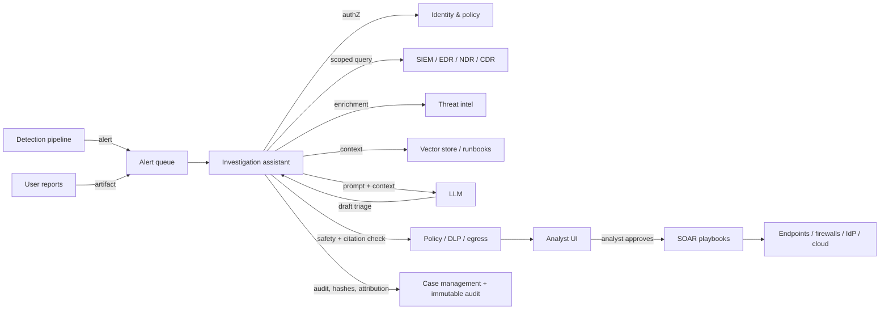

# Security operations investigation assistant

> **SAFE‑AUCA industry reference guide (draft)**
>
> This use case describes a real-world workflow being deployed across Security Operations Centers (SOCs), managed detection and response (MDR) providers, and enterprise incident response teams: an AI assistant that helps human analysts investigate alerts by correlating signals across SIEM / EDR / case-management / threat intel, summarizing evidence, proposing hypotheses, and — in higher-autonomy deployments — taking SOAR playbook actions.
>
> It focuses on:
>
> * how the workflow works in practice (tools, data, trust boundaries, autonomy)
> * what can go wrong (defender-friendly kill chain)
> * how it maps to **SAFE‑MCP techniques**
> * what controls + tests make it safer
>
> **Defender-friendly only:** do **not** include operational exploit steps, payloads, or step-by-step attack instructions.  
> **No sensitive info:** do not include internal hostnames/endpoints, secrets, customer data, non-public incidents, or proprietary details.

---

## Metadata

| Field                | Value                                                            |
| -------------------- | ---------------------------------------------------------------- |
| **SAFE Use Case ID** | `SAFE-UC-0022`                                                   |
| **Status**           | `draft`                                                          |
| **Maturity**         | draft                                                            |
| **NAICS 2022**       | `54` (Professional, Scientific, and Technical Services), `5415` (Computer Systems Design and Related Services), `541512` (Computer Systems Design Services) |
| **Last updated**     | `2026-04-23`                                                     |

### Evidence (public links)

* [OWASP Top 10 for LLM Applications (2025)](https://genai.owasp.org/llm-top-10/)
* [NIST AI 600-1 — AI Risk Management Framework: Generative AI Profile (July 2024)](https://www.nist.gov/publications/artificial-intelligence-risk-management-framework-generative-artificial-intelligence)
* [NIST SP 800-61 Rev. 3 — Incident Response Recommendations and Considerations for Cybersecurity Risk Management (April 2025)](https://csrc.nist.gov/pubs/sp/800/61/r3/final)
* [NIST Cybersecurity Framework (CSF) 2.0 (February 2024)](https://csrc.nist.gov/pubs/cswp/29/the-nist-cybersecurity-framework-csf-20/final)
* [MITRE ATT&CK](https://attack.mitre.org/)
* [Microsoft Security Copilot — product overview](https://www.microsoft.com/en-us/security/business/ai-machine-learning/microsoft-security-copilot)
* [CrowdStrike Charlotte AI — agentic SOC analyst](https://www.crowdstrike.com/en-us/platform/charlotte-ai/)
* [Dropzone AI — autonomous SOC analyst](https://www.dropzone.ai/ai-soc-analyst)
* [Simon Willison — "The lethal trifecta for AI agents: private data, untrusted content, and external communication" (June 2025)](https://simonwillison.net/2025/Jun/16/the-lethal-trifecta/)
* [Invariant Labs — "GitHub MCP Exploited: Accessing private repositories via MCP" (May 2025)](https://invariantlabs.ai/blog/mcp-github-vulnerability)

---

## Minimum viable write-up (Seed → Draft fast path)

This document covers:

* Executive summary
* Industry context & constraints
* Workflow + scope
* Architecture (tools + trust boundaries + inputs)
* Operating modes
* Kill-chain table
* SAFE‑MCP mapping table
* Contributors + Version History

---

## 1. Executive summary (what + why)

**What this workflow does**  
A **security operations investigation assistant** is an AI system deployed inside or alongside a Security Operations Center to help human analysts work through alerts, incidents, and hunt hypotheses at human speed or faster. Typical capabilities include:

* triaging alerts queued from SIEM, EDR, NDR, email security, and cloud detection pipelines
* correlating signals across multiple telemetry sources and timelines
* summarizing evidence into structured case narratives and draft incident reports
* proposing MITRE ATT&CK-aligned hypotheses for novel or ambiguous alert clusters
* drafting natural-language queries (SPL, ES|QL, KQL, UDM, EQL) from analyst intent
* enriching IOCs and TTPs against threat intelligence corpora
* drafting customer / stakeholder communications for MSSPs
* in higher-autonomy deployments: executing SOAR playbook actions (host isolation, token revocation, IP block, account suspension, credential rotation)

Industry instances span vendor-native assistants (Microsoft Security Copilot, Google SecOps with Gemini, CrowdStrike Charlotte AI, SentinelOne Purple AI, Palo Alto Cortex XSIAM, Splunk AI Assistant, Elastic AI Assistant for Security, Trend Companion, Exabeam Nova, IBM QRadar with watsonx), purpose-built "AI SOC analyst" products (Dropzone AI, Prophet Security, Intezer), SOAR-embedded agents (Torq HyperSOC, Tines AI), and MSSP-scale platforms (Arctic Wolf Aurora).

**Why it matters (business value)**  
Alert volume routinely exceeds analyst capacity. A well-configured SOC assistant can compress mean-time-to-triage, reduce analyst fatigue on routine alerts, bring junior analysts closer to senior-level performance, and free senior analysts for genuinely novel investigations. Published vendor metrics describe reductions in manual investigation workload on the order of 80%+; practitioners frame the deployed value more conservatively as "consistent triage floor plus drafting acceleration, human judgment retained for decisions."

**Why it's risky / what can go wrong**  
This workflow's defining trait, distinct from every other SAFE-AUCA use case authored to date, is that **the untrusted input is adversarial by design**. Unlike SAFE-UC-0018 (read-only summarization of internal work items), SAFE-UC-0011 (consumer-facing banking), or SAFE-UC-0024 (privileged shell execution), a SOC assistant's day job is to read content an adversary wrote:

* log lines, stack traces, and process trees originating from attacker-controlled infrastructure
* quarantined phishing emails the analyst is asked to assess
* EDR telemetry collected from compromised endpoints
* threat intelligence feed entries, including attacker-published decoy intel
* user-reported suspicious messages and files
* IOC reports the agent is asked to enrich and cross-reference

Simon Willison's "lethal trifecta" — private data access, untrusted content, and external communication — describes this workflow exactly. Public researcher disclosures from Invariant Labs (MCP tool poisoning, April 2025; GitHub MCP exploitation, May 2025), PromptArmor (Slack AI indirect-prompt-injection exfiltration, August 2024), the academic indirect-prompt-injection literature (Greshake et al., arXiv 2302.12173, 2023), and Johann Rehberger's running catalogue at Embrace The Red collectively establish that production LLM systems reading mixed-trust content are exploitable today. A SOC assistant that pulls attacker-authored content into a model with access to SIEM search, SOAR actions, and customer communications is the canonical instance of the failure class.

Four failure categories matter most in practice:

* **Hallucinated investigation conclusions** — fabricated IOCs, invented attribution, imagined process lineage, made-up CVE references that feed downstream response decisions
* **Adversary-directed mis-routing** — prompt-injected log content that steers the assistant toward dismissing a genuine incident, prioritizing a decoy, or burning operator attention on attacker-chosen artifacts
* **Unauthorized or mis-scoped SOAR action** — host isolated when it should not have been, token revoked for the wrong principal, block rule pushed cluster-wide from a narrow premise
* **Cross-tenant / cross-case leakage** — especially in MSSP deployments where one customer's investigation context bleeds into another's, through shared caches, vector stores, or memory

The CrowdStrike Falcon content update outage (July 19, 2024, CISA alert) is not an AI story but grounds the blast-radius concern: a fleet-scale security tool error has already demonstrated the scale at which a mis-automation in the SOC path can cascade.

---

## 2. Industry context & constraints (reference-guide lens)

### Where this shows up

Common in:

* in-house SOCs at mid- and large-enterprise organizations
* managed detection and response (MDR) and managed security service providers (MSSP)
* cloud-native detection and response teams inside SaaS and hyperscaler platforms
* incident response retainer teams and digital-forensics practices
* security engineering and detection-engineering functions (as analyst-adjacent users)
* national-security, defense-industrial-base, and critical-infrastructure SOCs under additional regulatory overlays

### Typical systems

* SIEM and security data platforms (Microsoft Sentinel, Splunk, Google SecOps/Chronicle, Elastic, QRadar, Sumo Logic, Exabeam, Palo Alto Cortex XSIAM)
* endpoint detection and response (EDR) platforms (CrowdStrike Falcon, SentinelOne Singularity, Microsoft Defender for Endpoint, Palo Alto Cortex XDR, Huntress)
* network detection and response (NDR), cloud detection and response (CDR), identity threat detection (ITDR)
* case management and SOAR (Splunk SOAR, Google SecOps SOAR, Torq, Tines, Swimlane, Palo Alto XSOAR, ServiceNow SecOps)
* threat intelligence platforms and feeds (Recorded Future, Mandiant, Anomali, MISP, internal TIP)
* email security (Abnormal, Proofpoint, Microsoft Defender for Office, Mimecast)
* identity providers (Okta, Entra ID), PAM, cloud consoles
* ticketing, chat, and on-call (Jira, ServiceNow, Slack, Microsoft Teams, PagerDuty)
* forensic acquisition and analysis tooling

### Constraints that matter

* **Adversarial-input-by-design.** The assistant reads content authored by the parties being investigated. Every log body, email body, filename, process command line, URL parameter, and threat intel blob is a potential injection vector.
* **Evidence and chain-of-custody.** Investigations feed law-enforcement referrals, regulatory disclosures, internal disciplinary processes, and civil or criminal litigation. AI-generated case narratives have to remain reproducible and attributable.
* **Regulated disclosure timelines.** SEC Item 1.05 (4 business days post materiality), NIS 2 Article 23 (24-hour early warning, 72-hour notification, 1-month final report), DORA Article 19, NYDFS §500.17 (72 hours), GLBA Safeguards Rule (30 days for incidents affecting ≥500 consumers) all depend on accurate, timely human judgment the assistant informs but does not make.
* **MSSP multi-tenancy.** Providers serving many customers must isolate each customer's data, queries, vector stores, memory, and outputs from every other customer's — a harder problem with shared LLM infrastructure than with traditional siloed tooling.
* **Analyst fatigue.** High alert volumes make consent-fatigue attacks a realistic threat surface, particularly in long shifts and 3 a.m. incident windows.
* **Human accountability.** Decisions remain accountable to a named human analyst; the assistant drafts and proposes, humans decide and attest.

### Must-not-fail outcomes

* directing an analyst to dismiss a genuine compromise by acting on attacker-authored content
* taking (or causing to be taken) an unauthorized SOAR action against the wrong host, account, or network
* leaking one customer's investigation context into another's (MSSP tenant bleed)
* producing case notes that are submitted as evidence but cannot be reproduced or traced to source artifacts
* missing a regulated disclosure window because the assistant's triage mis-classified severity

---

## 3. Workflow description & scope

### 3.1 Workflow steps (happy path)

1. A detection pipeline fires an alert or a user reports suspicious content. The alert arrives in the SOC queue with structured metadata and attached artifacts.
2. The assistant retrieves the alert, correlates related telemetry within the analyst's and agent's combined scope (historical events, related hosts, recent identity signals, relevant threat intel).
3. The assistant produces a structured triage output: narrative of what happened, ATT&CK-aligned hypothesis, confidence indicators with explicit uncertainty, cited source artifacts, proposed next investigative steps, proposed disposition (escalate, dismiss, request more info).
4. A human analyst reviews the triage output, verifies cited artifacts, and decides on disposition.
5. For proposed remediation actions — host isolation, IP block, token revocation, account suspension, rule tuning — the assistant presents the proposed action and impact; a human approves or declines; SOAR executes on approval.
6. The assistant drafts the case note, any customer-facing summary (for MSSPs), and any regulator-facing disclosure drafting; a human edits and signs.
7. Post-incident, the assistant helps produce the lessons-learned report and proposes detection-engineering or hardening changes; humans review and merge.

### 3.2 In scope / out of scope

* **In scope:** alert triage and correlation; evidence summarization; hypothesis proposal aligned to MITRE ATT&CK; natural-language-to-query drafting; enrichment against threat intel; draft case notes, disclosures, and communications; proposed SOAR actions with human approval; post-incident drafting.
* **Out of scope:** autonomous escalation to external parties without human signoff; irreversible destructive actions without explicit step-up; final materiality determinations for regulated disclosure; unsupervised action on data subject to attorney-client privilege or law-enforcement holds.

### 3.3 Assumptions

* The SOC operates inside an established IR process (commonly NIST SP 800-61 Rev 3 or ISO/IEC 27035-aligned).
* Analyst identity and the assistant's service identity are represented separately in IAM and audit logs.
* All data the assistant touches is classified, and data handling respects sector overlays (HIPAA, PCI DSS, CJIS, CMMC where applicable).
* Chain-of-custody procedures apply to any artifact that may become evidence.

### 3.4 Success criteria

* Measurable reduction in mean-time-to-triage and analyst cycle time without increased false-negative rate on genuine incidents.
* Reproducible, traceable AI-generated case narratives — every claim cited to a source artifact.
* Zero unauthorized SOAR actions attributable to assistant behavior.
* Zero cross-tenant data exposure events in MSSP deployments.
* Regulated disclosure timelines met.

---

## 4. System & agent architecture

### 4.1 Actors and systems

* **Human roles:** SOC analysts (Tier 1/2/3), incident commanders, threat hunters, detection engineers, compliance and legal counsel, customer success (MSSP), executive stakeholders.
* **Agent / orchestrator:** the investigation assistant runtime — prompt builder, retrieval layer, tool router, safety filters, case-note formatter.
* **LLM runtime:** internal, partner, or hosted foundation model.
* **Tools (MCP servers / APIs / connectors):** SIEM search, EDR query and action, SOAR playbooks, case management read/write, threat intel lookup, ticketing, identity queries, sandbox submission, evidence-hash computation.
* **Data stores:** alert queues, telemetry stores, case management, threat intel corpora (including vector stores for RAG), knowledge bases, transcripts.
* **Downstream systems affected:** SOAR action targets (endpoints, firewalls, identity providers, cloud consoles); external parties (law enforcement, regulators, customers) via drafted communications.

### 4.2 Trusted vs untrusted inputs

| Input / source                                   | Trusted?         | Why                                                | Typical failure / abuse pattern                                                           | Mitigation theme                                              |
| ------------------------------------------------ | ---------------- | -------------------------------------------------- | ----------------------------------------------------------------------------------------- | ------------------------------------------------------------- |
| Log content (any source)                         | Untrusted        | any bytes could be attacker-authored                | indirect prompt injection via log body                                                    | treat all log text as data; quote-isolate; size-cap            |
| Quarantined malicious emails / attachments       | Untrusted        | the entire payload was written by an adversary     | direct prompt injection; unicode steganography in subject / headers                       | parse in a safe decoder; strip zero-width; never inline HTML    |
| EDR telemetry from potentially compromised hosts | Untrusted        | attacker may have control of the endpoint           | fabricated process tree; planted artifacts                                                | cross-reference with uncompromised signal; don't trust single source |
| Threat intel feeds                               | Semi-trusted     | attacker-published decoy intel is a known pattern  | false-positive engineering; flooding                                                      | provenance weighting; feed freshness; publisher reputation     |
| User-reported suspicious content                 | Untrusted        | by definition it came from an external source      | injection via user-reported body; false reports                                           | sandbox decode; redact before ingestion                        |
| Analyst chat / case notes                        | Semi-trusted     | internal but can be edited                          | accidental PII inclusion; attacker-influenced content copied over                          | audit trail; version history                                    |
| MCP server tool descriptions                     | Semi-trusted     | authored upstream; transport can vary              | tool description poisoning (Invariant Labs, April 2025)                                   | pin and sign manifests; registry verification                   |
| Model output                                     | Untrusted        | probabilistic                                       | hallucinated conclusions; fabricated citations; narrative masking of destructive actions | grounded retrieval required; verifier step; tool-call schema    |

### 4.3 Trust boundaries

Teams commonly model seven boundaries when reasoning about this workflow:

1) **Adversarial-content boundary**  
Every artifact under investigation is adversary-authored until proven otherwise. The assistant's prompt assembly and retrieval layer must keep this content clearly marked as data, never instructions.

2) **Analyst identity vs assistant identity**  
The analyst is authenticated through enterprise IAM. The assistant acts under its own service identity with its own scope — narrower than the analyst's for write actions.

3) **Tenant / case boundary**  
Content, vector memory, caches, and tool call state scope to the single case and single tenant. Cross-case and cross-tenant retrieval must be explicitly denied by default.

4) **Read vs write boundary**  
Reading telemetry is low-blast-radius. Taking SOAR actions (host isolation, token revocation, block rules, account suspension) is not. The transition between the two is an explicit gate.

5) **Evidence boundary**  
Artifacts that may become evidence carry chain-of-custody obligations. The assistant must not modify originals; hashes and timestamps attach to every retrieval; AI-generated summaries are labeled as derived work.

6) **External-communication boundary**  
Any output intended for customers, regulators, or law enforcement is a separate class. The assistant drafts; humans sign.

7) **Model-output boundary**  
LLM output is not an authoritative source. It is a draft requiring analyst verification before it affects disposition, tooling actions, or external communication.

### 4.4 High-level flow (illustrative)

### 4.5 Tool inventory

Typical tools (names vary by platform):

| Tool / MCP server                | Read / write?   | Permissions                            | Typical inputs                       | Typical outputs                         | Failure modes                                                                 |
| -------------------------------- | --------------- | -------------------------------------- | ------------------------------------ | --------------------------------------- | ----------------------------------------------------------------------------- |
| `siem.search`                    | read            | case- and tenant-scoped                | natural-language or query-language   | event records with timestamps           | over-broad query; cross-tenant leakage; query injection                       |
| `edr.query`                      | read            | case-scoped                            | host / process / hash                | process trees; behavioral data          | attacker-controlled telemetry; fabricated artifacts                           |
| `edr.action.isolate_host`        | write           | gated, step-up                         | host id, reason, ticket              | isolation status                        | wrong host; business-critical isolation                                      |
| `identity.revoke_token`          | write           | gated, step-up                         | principal id, reason                 | revocation confirmation                 | wrong principal; customer-impacting revocation                                |
| `firewall.block_ioc`             | write           | gated                                  | IP / domain / hash                   | rule id                                 | overblocking; blocklisting legitimate service                                 |
| `case.read`                      | read            | case- and tenant-scoped                | case id                              | notes, artifacts, timeline              | cross-case leakage                                                            |
| `case.note.create`               | write           | case-scoped; attribution-labeled       | case id, note body, tags             | note id                                 | hallucinated narrative persisted                                              |
| `ti.lookup`                      | read            | rate-limited                           | IOC                                  | reputation / context                    | feed poisoning; stale intel                                                   |
| `sandbox.submit`                 | write           | quota-limited                          | file hash / URL                      | verdict + report                        | detonation of attacker-honey content; sandbox leakage                          |
| `ticket.create`                  | write           | labeled                                | subject, body, assignee              | ticket id                               | wrong assignee; escalation loops                                              |
| `threat_intel.rag`               | read            | tenant- and classification-scoped      | query                                | retrieved passages                      | vector-store poisoning; context contamination                                  |
| MCP third-party tools            | varies          | varies                                 | tool-specific                        | tool-specific                           | tool description poisoning; rug pulls                                         |

### 4.6 Governance & authorization matrix

| Action category                         | Example actions                                         | Allowed mode(s)                      | Approval required?                   | Required auth                        | Required logging / evidence                               |
| --------------------------------------- | ------------------------------------------------------- | ------------------------------------ | ------------------------------------ | ------------------------------------ | --------------------------------------------------------- |
| Read-only triage                        | SIEM search, EDR query, case read, threat intel         | manual / HITL / autonomous           | no                                   | analyst session + agent identity     | query + retrieval set + timestamps                         |
| Proposed triage output                  | narrative, hypothesis, next-steps, draft case note      | manual / HITL / autonomous           | analyst confirm before persist       | same                                 | draft hash, citations, source artifact ids                 |
| Persist case note                       | `case.note.create`                                      | HITL                                 | analyst explicit                     | analyst identity + agent attribution | attribution label "AI-drafted, analyst-approved"           |
| Low-risk SOAR action                    | enrich IOC, open sub-ticket, tag case                    | HITL / autonomous (allow-listed)     | yes for unfamiliar patterns          | scoped role                          | action record + reason                                      |
| High-risk SOAR action                   | host isolation, token revocation, block rule, account suspend | HITL (autonomous rarely appropriate) | step-up + explicit analyst approval  | elevated role + change ticket        | immutable audit + rationale + human attribution            |
| External communication                  | customer notification, regulator draft, LE referral      | manual only                          | always human signoff                 | named signer + counsel review        | versioned draft history + signature                        |
| Evidence-bearing artifacts              | forensic acquisition, hash preservation                  | manual                               | DEFR / forensic lead                 | chain-of-custody procedure            | hash, timestamp, acquirer, storage location                |
| Cross-tenant or cross-case retrieval    | (any)                                                   | **denied by default**                | compliance override only             | elevated + customer consent where applicable | explicit deny log; override audit                   |

### 4.7 Sensitive data & policy constraints

* **Data classes:** alert payloads, raw telemetry, investigation notes, threat intel (including TLP-restricted), evidence artifacts, customer PII/PHI/CHD surfaced in alerts, personnel data.
* **Retention and logging:** preserve originals separately from AI-generated derivatives; hash every original at ingestion; never mutate evidence; maintain immutable audit of assistant prompts, tool calls, and outputs for post-incident review and potential litigation.
* **Regulatory constraints:** the workflow commonly operates under multiple overlays — SOC 2 CC7, NIST CSF 2.0 Detect/Respond, NIST SP 800-61 Rev 3. Sector overlays attach where data classes match: HIPAA §164.308(a)(6) for healthcare, PCI DSS Req 10/11.6/12.10 for cardholder data environments, GLBA Safeguards Rule for financial, CJIS Security Policy §5.3 for law-enforcement-adjacent, CMMC 2.0 for CUI. Jurisdictional overlays include SEC Item 1.05, NIS 2 Article 23, DORA Articles 17-19, NYDFS §500.17.
* **Output policy:** AI-drafted content is labeled AI-drafted before any human reuse; external communications surface verbatim from approved templates where regulation requires specific language; evidence narratives preserve reproducibility (source artifact IDs, hashes, timestamps).

---

## 5. Operating modes & agentic flow variants

### 5.1 Manual baseline (no agent)

Analysts triage alerts directly, authoring their own queries, narratives, and dispositions. Existing safeguards — case management attribution, supervisor review of dispositions, dual control for destructive SOAR actions, independent QA sampling — continue to apply.

**Risks:** labor-intensive, slow under surge, inconsistent across analysts, knowledge silos, alert fatigue.

### 5.2 Assistant as drafter (proposal-only)

The assistant reads queue content and produces triage proposals; a human does the query, investigation, and disposition. The assistant's output is a draft for analyst consumption only — no tool-call writes.

**Risk profile:** bounded by the human reviewer's attention and review load.

### 5.3 HITL per-action (common default)

The assistant proposes individual actions — queries, enrichments, hypotheses, SOAR actions — and a human approves each before execution. Step-up authentication attaches to SOAR verbs with business impact.

**Risk profile:** moderate; turns on UI discipline (proposed actions shown verbatim, impact stated, no hidden side effects) and on consent-fatigue resistance during long sessions.

### 5.4 Autonomous on an allow-list (bounded autonomy)

Read-only triage and an explicitly allow-listed set of low-risk actions (enrichment, sub-ticket creation, tag updates) execute without per-action approval. High-risk writes remain HITL. Cross-tenant and cross-case retrieval remain denied.

**Risk profile:** depends on allow-list quality, alert-level risk classification, and robust guardrails for the allow-list evaluation itself.

### 5.5 Fully autonomous with guardrails (uncommon for high-blast-radius actions)

The assistant executes end-to-end triage for narrow alert types deemed high-confidence, high-volume, and low-business-impact, with post-hoc human review. Rare for high-risk write actions in production against real environments.

**Risk profile:** highest. Requires very strong confidence calibration, kill switches, and rapid rollback paths.

### 5.6 Variants

Architectural variants teams reach for:

1. **Planner / investigator / action split** — separate agents for hypothesis generation, evidence gathering, and action proposal, each with narrower tool access.
2. **MSSP multi-tenant isolation** — per-customer service identities, per-customer vector stores, per-customer rate limits, no shared memory across tenants.
3. **Dual-model adjudication** — a second model (often smaller, independent provider) cross-checks high-stakes conclusions before they reach a human.
4. **Grounded-retrieval-only** — the model is not permitted to assert facts not retrievable from a cited source; ungrounded assertions are rejected.
5. **Explicit evidence handlers** — forensic-quality artifacts flow through a separate pipeline with hashing, chain-of-custody, and no AI mutation.

---

## 6. Threat model overview (high-level)

### 6.1 Primary security & safety goals

* prevent adversary-controlled content from steering the assistant into wrong dispositions or unauthorized actions
* preserve evidence integrity and chain-of-custody throughout assistant-touched workflows
* prevent cross-tenant / cross-case leakage in MSSP or multi-customer contexts
* keep every SOAR action attributable to a named human with documented rationale
* maintain regulated disclosure windows by avoiding misclassification-induced delay

### 6.2 Threat actors (who might attack or misuse)

* **External adversary** who plants crafted content in logs, emails, endpoint artifacts, or threat-intel feeds specifically to manipulate AI-assisted triage
* **Insider threat** abusing analyst session or assistant access to exfiltrate investigation content or suppress a case they would rather not surface
* **Compromised third-party MCP server or integration** whose tool descriptions or outputs manipulate the agent
* **MSSP-adjacent attacker** exploiting tenant-isolation weaknesses to pivot between customers
* **Supply-chain compromise** of the underlying foundation-model provider or agent framework
* **Noisy-neighbor / feed-poisoning attacker** flooding threat intel with decoys

### 6.3 Attack surfaces

* log bodies, process command lines, URL parameters, filenames, header fields
* quarantined email content, attachment metadata, embedded images (multimodal)
* EDR output from endpoints the attacker may control
* threat-intel feed entries, especially open-source and crowd-sourced
* user-reported phishing submissions
* MCP tool descriptions and tool outputs
* case management comments, including externally-editable channels
* vector stores the assistant retrieves from

### 6.4 High-impact failures (include industry harms)

* **Customer / consumer harm:** dismissal of a genuine compromise affecting customer data; cross-tenant leak revealing one customer's incident to another; mis-attribution in customer-facing communications.
* **Business harm:** missed regulated disclosure window; SOAR-driven outage from erroneous fleet-scale action; litigation exposure from non-reproducible AI-generated evidence narrative; reputational damage.
* **Security harm:** adversary exfiltrates data by coaxing the assistant into egressing it; insider uses the assistant to launder privilege; detection coverage regresses as attacker-tuned content trains the assistant toward blind spots.

---

## 7. Kill-chain analysis (stages → likely failure modes)

> Keep this defender-friendly. Describe patterns, not "how to do it."

| Stage                                              | What can go wrong (pattern)                                                                                                            | Likely impact                                                            | Notes / preconditions                                                                |
| -------------------------------------------------- | -------------------------------------------------------------------------------------------------------------------------------------- | ------------------------------------------------------------------------ | ------------------------------------------------------------------------------------ |
| 1. Adversarial-content ingestion                   | Attacker-authored content (log, email, process line, IOC, tool description) enters the assistant's context                              | primes downstream misbehavior                                             | **novel vs 0018 / 0024 / 0011** — reading adversarial content IS the job             |
| 2. Safety-rule bypass                              | Line jumping, metadata steganography, consent-fatigue exploitation on a tired analyst                                                  | agent overrides policy or analyst rubber-stamps                          | shared vector with 0018 / 0024                                                        |
| 3. Scope or privilege elevation                    | Read-only scope coaxed toward write; agent identity coerced into using analyst's higher privileges                                     | unauthorized SOAR capability                                             | partial overlap with 0024; SOC-specific scope-substitution patterns                    |
| 4. Cross-tenant / cross-case pivot                 | One customer's or case's content bleeds into another's via shared vector store, cache, memory, or shift handoff                        | customer data disclosure; MSSP-level privacy breach                      | **novel vs 0018 / 0024 / 0011** — MSSP multi-tenancy has no analog in prior UCs       |
| 5. SOAR action authorization                       | Destructive or business-impacting action (host isolate, token revoke, block rule, account suspend) taken under wrong premise           | outage, customer impact, recovery cost                                   | **novel** — security-specific destructive actions distinct from 0024 shell execution  |
| 6. Evidence / chain-of-custody tampering           | AI-generated case notes become the record; original artifacts unreferenced; narrative masks what the agent actually did                | litigation exposure, regulator findings, integrity loss                  | **novel vs 0018 / 0024 / 0011** — chain-of-custody concern absent from prior UCs       |
| 7. Covert exfiltration via investigation artifacts | Attacker-crafted content steers assistant to egress data via enrichment calls, IOC reports, drafted communications, or tool parameters | regulated-data exfiltration; attacker gains intel about investigation    | shares structure with 0011 exfiltration; SOC-specific channels (IOC reports, comms)   |

---

## 8. SAFE‑MCP mapping (kill-chain → techniques → controls → tests)

Practitioners commonly map this workflow's failure patterns to the following SAFE‑MCP techniques. The mapping is directional — teams adapt it to their stack, threat model, and operating mode. Links in Appendix B resolve to the canonical technique pages.

| Kill-chain stage                                  | Failure / attack pattern (defender-friendly)                                                                               | SAFE‑MCP technique(s)                                                                                                                                   | Recommended controls (prevent / detect / recover)                                                                                                                                                                                                                                                                                                                        | Tests (how to validate)                                                                                                                                                                                                                                                                                                                                                         |
| ------------------------------------------------- | -------------------------------------------------------------------------------------------------------------------------- | -------------------------------------------------------------------------------------------------------------------------------------------------------- | ------------------------------------------------------------------------------------------------------------------------------------------------------------------------------------------------------------------------------------------------------------------------------------------------------------------------------------------------------------------------ | ------------------------------------------------------------------------------------------------------------------------------------------------------------------------------------------------------------------------------------------------------------------------------------------------------------------------------------------------------------------------------- |
| Adversarial-content ingestion                     | Log / email / process / IOC / tool description carries attacker instructions                                                | `SAFE-T1102` (Prompt Injection); `SAFE-T1001` (Tool Poisoning Attack (TPA)); `SAFE-T1402` (Instruction Stenography - Tool Metadata Poisoning); `SAFE-T2106` (Context Memory Poisoning via Vector Store Contamination) | treat all ingested content as data; delimiter isolation; strip zero-width / invisible characters; pin and sign MCP tool descriptions; version and hash vector-store entries; scope retrieval to the current case                                                                                                                                                          | adversarial-content fixture library; fuzzing over log bodies / email bodies; verify tool-description signatures; verify the assistant does not act on instruction-shaped content inside data                                                                                                                                                                                    |
| Safety-rule bypass                                | Content positioned before safety rules; narrative prepared to mask subsequent action; fatigue-driven over-approval        | `SAFE-T1401` (Line Jumping); `SAFE-T1403` (Consent-Fatigue Exploit); `SAFE-T1404` (Response Tampering)                                                    | put system instructions and allow-lists at the tail of the prompt; show executed tool calls verbatim alongside narrative; throttle rapid-fire approvals; surface count of actions-pending and unique-hosts-affected prominently; require distinct confirmation phrasing for destructive verbs                                                                              | long-session stress tests with rapid approval storms; verify UI keeps attention gates active; narrative-vs-tool-call consistency checks                                                                                                                                                                                                                                          |
| Scope or privilege elevation                      | Coerced elevation from read-only to write scope; agent service identity tricked into using analyst-held privileges         | `SAFE-T1309` (Privileged Tool Invocation via Prompt Manipulation); `SAFE-T1104` (Over-Privileged Tool Abuse); `SAFE-T1302` (High-Privilege Tool Abuse); `SAFE-T1308` (Token Scope Substitution); `SAFE-T1307` (Confused Deputy Attack) | separate agent identity from analyst identity in IAM and audit; narrow agent scope below analyst scope; policy-as-code evaluation before every write; explicit HITL approval for destructive SOAR verbs; rotate short-lived tokens; confused-deputy checks on every write tool                                                                                            | attempt elevation scenarios against a mock SOC; verify scope checks block; verify audit captures separate agent vs analyst principal                                                                                                                                                                                                                                             |
| Cross-tenant / cross-case pivot                   | One customer's or case's data surfaces inside another's; shared cache or vector store leaks across boundaries              | `SAFE-T1701` (Cross-Tool Contamination); `SAFE-T1702` (Shared-Memory Poisoning); `SAFE-T1204` (Context Memory Implant); `SAFE-T1705` (Cross-Agent Instruction Injection) | per-tenant service identities; per-tenant vector stores and caches; per-case retrieval scope with no default fallback to org-wide; explicit deny on cross-case queries; monitoring alert on any cross-tenant signal; memory namespace isolation                                                                                                                           | synthetic cross-tenant probe tests; deliberate attempt to retrieve another customer's context; expected behavior is an explicit deny with alert; verify memory / cache isolation empirically                                                                                                                                                                                    |
| SOAR action authorization                         | Assistant proposes or approves a high-blast-radius action under a wrong premise or hidden in narrative                     | `SAFE-T1309` (Privileged Tool Invocation via Prompt Manipulation); `SAFE-T1103` (Fake Tool Invocation (Function Spoofing)); `SAFE-T1302` (High-Privilege Tool Abuse); `SAFE-T1404` (Response Tampering) | policy-as-code gate on destructive verbs (`isolate_host`, `revoke_token`, `block_ioc`, `suspend_account`); strict JSON schema on tool calls; per-action explicit analyst confirmation of specifics; impact preview (how many hosts, which accounts); step-up auth for fleet-scale or high-value targets; rollback runbook                                               | simulate destructive-action scenarios in a sandbox; verify gate blocks without step-up; verify impact preview is accurate; verify rollback works within target time                                                                                                                                                                                                             |
| Evidence / chain-of-custody tampering             | AI-generated narrative becomes the record without traceable citations; originals mutated; attribution unclear              | `SAFE-T1404` (Response Tampering); `SAFE-T2105` (Disinformation Output); `SAFE-T1001` (Tool Poisoning Attack (TPA))                                       | require citations to source artifact IDs and hashes on every factual claim; label AI-drafted content as such throughout the case record; keep originals immutable; hash originals at ingestion; retain assistant prompt + tool-call audit alongside the case; enforce grounded-retrieval-only output policy                                                              | litigate-the-record drill — can a third party reproduce every AI-stated fact from the preserved originals?; hash-integrity checks; attribution-label audit on case notes                                                                                                                                                                                                         |
| Covert exfiltration via investigation artifacts   | Crafted content steers assistant to egress data via enrichment, tool parameters, drafted comms, or IOC reports             | `SAFE-T1910` (Covert Channel Exfiltration); `SAFE-T1911` (Parameter Exfiltration); `SAFE-T1912` (Stego Response Exfiltration); `SAFE-T1904` (Chat-Based Backchannel); `SAFE-T1801` (Automated Data Harvesting); `SAFE-T1803` (Database Dump); `SAFE-T1804` (API Data Harvest) | egress allow-list for enrichment and communications; strict JSON schema with `additionalProperties: false`; parameter size and entropy limits; DLP on draft communications; rate-limit bulk SIEM queries; monitor for sudden retrieval-volume spikes                                                                                                                       | seed synthetic secrets into fixture alerts; verify egress filter blocks; verify no narrative leaks fixture material; volume-anomaly detection tests                                                                                                                                                                                                                             |

---

## 9. Controls & mitigations (organized)

### 9.1 Prevent (reduce likelihood)

* **Separate agent identity from analyst identity** in IAM and audit — the agent is a distinct principal with its own narrow scope.
* **Tenant-scoped everything** — per-tenant service identities, vector stores, caches, and audit namespaces. Cross-tenant retrieval denied by default.
* **Case-scoped retrieval** — the agent cannot query beyond the current case's scope without an explicit, logged cross-case request.
* **Grounded retrieval only** — claims the assistant makes must be traceable to a cited, hashed source artifact. Ungrounded assertions fail closed.
* **Delimiter isolation and content sanitization** for all ingested adversarial content — zero-width character stripping, unicode normalization, HTML entity neutralization.
* **Strict tool-call schemas** with `additionalProperties: false`; parameter size and entropy caps.
* **Signed and pinned MCP tool descriptions**; registry verification at load.
* **Policy-as-code gate** on destructive SOAR verbs; explicit HITL approval required.
* **Impact preview** before any SOAR action — number of hosts, accounts, rules affected; business criticality flags.
* **Egress allow-list** for enrichment, notifications, and external communications.
* **Short-lived tokens** for agent and analyst principals; rotation on schedule and on anomaly.

### 9.2 Detect (reduce time-to-detect)

* behavioral monitoring of the agent's tool-call patterns — novel verbs, unusual tenants, retrieval-volume spikes
* narrative-vs-tool-call consistency check — does the case note match what the tools actually did?
* cross-tenant probe detection (any cross-tenant signal is anomalous)
* consent-rate monitoring — per-session approval count and rhythm
* vector-store integrity monitoring — signed entries, drift alerts
* DLP on drafted communications
* case-note hash monitoring — unexpected mutation of AI-drafted content

### 9.3 Recover (reduce blast radius)

* session kill-switch and per-playbook kill-switch for SOAR actions
* rollback runbooks for each destructive SOAR verb (de-isolate, re-enable tokens, remove block rules) rehearsed regularly
* post-incident review playbook that treats AI-agent-originated failures as a distinct class
* breach / incident notification paths pre-mapped for the regulatory overlays that apply (SEC, NIS 2, DORA, NYDFS, GLBA, HIPAA)
* recovery SLAs aligned to disclosure windows

---

## 10. Validation & testing plan

### 10.1 What to test (minimum set)

* **Adversarial-content robustness** — the assistant ignores instruction-shaped content in logs, emails, process output, tool descriptions.
* **Tenant isolation** — a synthetic cross-tenant probe produces an explicit deny with alert, zero context bleed.
* **SOAR action gating** — destructive verbs cannot fire without step-up + analyst approval + impact preview.
* **Grounded citations** — every factual claim in case notes links to a cited, hashed source artifact.
* **Narrative-vs-tool-call consistency** — case narrative matches the executed tool calls.
* **Chain-of-custody preservation** — originals are immutable and hashed; AI-drafted derivatives are labeled.
* **Regulated-disclosure-timer integrity** — the assistant's severity classification does not cause materiality-clock misses.
* **MSSP fanout correctness** — customer-facing communications attribute to the correct tenant, no cross-customer references.
* **Rollback verification** — every high-risk SOAR action has an exercised rollback path.

### 10.2 Test cases (make them concrete)

| Test name                                     | Setup                                                             | Input / scenario                                                                                          | Expected outcome                                                                                                   | Evidence produced                              |
| --------------------------------------------- | ----------------------------------------------------------------- | --------------------------------------------------------------------------------------------------------- | ------------------------------------------------------------------------------------------------------------------ | ---------------------------------------------- |
| Log-body injection                            | Alert containing crafted log content                              | content attempts to reframe the case toward dismissal                                                     | assistant does not dismiss; safety filter flags attempt; narrative remains faithful                                | fixture + output diff + filter log             |
| Email-body injection                          | Quarantined phishing sample with injection attempt                | assistant asked to assess malicious status                                                                | assistant correctly classifies; no instruction following                                                           | fixture + classification + filter log          |
| Cross-tenant probe                            | Two tenants with overlapping patterns in MSSP deployment          | session in tenant A requests context from tenant B                                                        | explicit deny; alert raised; no content surfaces                                                                   | deny log + alert event                          |
| SOAR destructive-verb gate                    | HITL mode; proposed host isolation                                | proposed action steers toward fleet-wide isolation                                                        | step-up prompt; impact preview accurate; analyst must confirm                                                      | gate event + impact preview + audit entry      |
| Grounded-citation enforcement                 | Alert with sparse source material                                 | assistant asked to summarize                                                                              | assistant does not fabricate; flags unsupported claims; cites only present artifacts                               | citation map + "flagged" labels                 |
| Chain-of-custody integrity                    | Evidence-bearing artifact ingested                                | case proceeds through assistant-assisted analysis                                                         | original immutable; hash preserved; AI-drafted derivatives labeled; full audit reproducible                         | hash log + attribution labels + audit replay   |
| Tool-description poisoning (MCP)              | Modified upstream MCP server descriptor                           | assistant attempts to load                                                                                | load rejected or quarantined pending re-verification                                                               | signature-check log                             |
| Consent-fatigue detection                     | Long session with 30+ approvals                                   | rapid approve-without-read pattern                                                                        | system throttles or requires distinct phrasing; compliance alert                                                   | session metric + alert                          |
| Rollback of isolated host                     | Sandbox / staging                                                 | destructive action approved and executed                                                                  | rollback completes within target time; host back online; case reflects full timeline                               | rollback timing + audit                         |
| Narrative-vs-tool-call consistency            | Post-hoc sample                                                   | compare assistant narrative against executed tool calls                                                   | narrative accurately reflects tool calls; mismatches surface in review                                             | audit comparison report                         |

### 10.3 Operational monitoring (production)

* alerts-per-hour, time-to-triage, accept-as-is vs edit-vs-override rate per analyst cohort
* cross-tenant denies and anomalies (target: zero unexpected cross-tenant signal)
* SOAR-verb block rate; step-up success/failure
* grounded-citation coverage (percent of claims cited)
* consent-rate distribution
* kill-switch and rollback invocation rate
* regulated-disclosure timer integrity (no misses)

---

## 11. Open questions & TODOs

- [ ] Define the organization's acceptable allow-list of autonomous SOAR actions (if any) and the confidence threshold at which each is permitted.
- [ ] Decide the MSSP tenant-isolation model — service identity per tenant, vector store per tenant, audit namespace per tenant — and the monitoring threshold for cross-tenant signal.
- [ ] Specify chain-of-custody procedures when AI-generated derivatives may be submitted as evidence in regulatory or legal proceedings.
- [ ] Decide the regulated-disclosure review path — how severity classifications from the assistant are validated before they start materiality clocks.
- [ ] Define the post-incident review playbook when the SOC assistant is itself implicated in an incident.
- [ ] Document classification overlays (CUI for CMMC deployments, CJI for CJIS deployments, PHI/CHD for sector-regulated deployments) and how the assistant's scope differs per overlay.

---

## 12. Questionnaire prompts (for reviewers)

### Workflow realism

* Are the integrations and data sources in the tool inventory realistic for the organization's SIEM / EDR / SOAR stack?
* What integrations are missing for this deployment (identity, cloud console, sandbox, threat intel, case management)?

### Trust boundaries & permissions

* Is the agent identity distinct from analyst identity in IAM and audit?
* How is case / tenant scope enforced at every retrieval?
* What SOAR verbs are gated by HITL and which are allow-listed autonomous?

### Output safety & persistence

* Are AI-drafted case notes labeled as such throughout the case record?
* Is every factual claim traceable to a cited, hashed source artifact?
* Is the assistant's tool-call audit preserved alongside the case for post-hoc review?

### Correctness

* How are hallucinated conclusions detected before they affect disposition?
* What facts must never be wrong (affected host, affected principal, severity, disclosure-trigger status)?
* What is the rollback plan for each destructive SOAR verb?

### Operations

* Success metrics: MTT-triage, override rate, coverage, customer satisfaction (MSSP)
* Danger metrics: cross-tenant events, SOAR-action rollback rate, disclosure-timer misses
* Who owns the kill switches and the allow-list?

---

## Appendix

### A. Suggested investigation-output format

A pattern that tends to work well for AI-assisted case output:

* **Alert context** (source, severity, linked artifacts)
* **Narrative** (what happened, chronologically, cited)
* **Hypothesis** (ATT&CK tactic/technique mapping with confidence)
* **Evidence** (per-claim source artifact IDs and hashes)
* **Proposed disposition** (escalate / dismiss / request more / take action)
* **Proposed actions** (specific SOAR verbs with target, impact preview)
* **Open questions** (what the assistant cannot determine and why)
* **Uncertainty** (explicit confidence signals, known unknowns)
* **AI-drafted label** with model identifier, prompt version, and timestamp

### B. References & frameworks

Industry practitioners commonly cross-reference the following catalogs and frameworks when reasoning about this workflow. Inclusion here is directional — applicability depends on deployment context, sector, jurisdiction, and the data the assistant can reach.

**SAFE‑MCP techniques referenced in this use case**

* [SAFE‑MCP framework (overview)](https://github.com/safe-agentic-framework/safe-mcp)
* [SAFE-T1001: Tool Poisoning Attack (TPA)](https://github.com/safe-agentic-framework/safe-mcp/blob/main/techniques/SAFE-T1001/README.md)
* [SAFE-T1102: Prompt Injection (Multiple Vectors)](https://github.com/safe-agentic-framework/safe-mcp/blob/main/techniques/SAFE-T1102/README.md)
* [SAFE-T1103: Fake Tool Invocation (Function Spoofing)](https://github.com/safe-agentic-framework/safe-mcp/blob/main/techniques/SAFE-T1103/README.md)
* [SAFE-T1104: Over-Privileged Tool Abuse](https://github.com/safe-agentic-framework/safe-mcp/blob/main/techniques/SAFE-T1104/README.md)
* [SAFE-T1204: Context Memory Implant](https://github.com/safe-agentic-framework/safe-mcp/blob/main/techniques/SAFE-T1204/README.md)
* [SAFE-T1302: High-Privilege Tool Abuse](https://github.com/safe-agentic-framework/safe-mcp/blob/main/techniques/SAFE-T1302/README.md)
* [SAFE-T1307: Confused Deputy Attack](https://github.com/safe-agentic-framework/safe-mcp/blob/main/techniques/SAFE-T1307/README.md)
* [SAFE-T1308: Token Scope Substitution](https://github.com/safe-agentic-framework/safe-mcp/blob/main/techniques/SAFE-T1308/README.md)
* [SAFE-T1309: Privileged Tool Invocation via Prompt Manipulation](https://github.com/safe-agentic-framework/safe-mcp/blob/main/techniques/SAFE-T1309/README.md)
* [SAFE-T1401: Line Jumping](https://github.com/safe-agentic-framework/safe-mcp/blob/main/techniques/SAFE-T1401/README.md)
* [SAFE-T1402: Instruction Stenography - Tool Metadata Poisoning](https://github.com/safe-agentic-framework/safe-mcp/blob/main/techniques/SAFE-T1402/README.md)
* [SAFE-T1403: Consent-Fatigue Exploit](https://github.com/safe-agentic-framework/safe-mcp/blob/main/techniques/SAFE-T1403/README.md)
* [SAFE-T1404: Response Tampering](https://github.com/safe-agentic-framework/safe-mcp/blob/main/techniques/SAFE-T1404/README.md)
* [SAFE-T1701: Cross-Tool Contamination](https://github.com/safe-agentic-framework/safe-mcp/blob/main/techniques/SAFE-T1701/README.md)
* [SAFE-T1702: Shared-Memory Poisoning](https://github.com/safe-agentic-framework/safe-mcp/blob/main/techniques/SAFE-T1702/README.md)
* [SAFE-T1705: Cross-Agent Instruction Injection](https://github.com/safe-agentic-framework/safe-mcp/blob/main/techniques/SAFE-T1705/README.md)
* [SAFE-T1801: Automated Data Harvesting](https://github.com/safe-agentic-framework/safe-mcp/blob/main/techniques/SAFE-T1801/README.md)
* [SAFE-T1803: Database Dump](https://github.com/safe-agentic-framework/safe-mcp/blob/main/techniques/SAFE-T1803/README.md)
* [SAFE-T1804: API Data Harvest](https://github.com/safe-agentic-framework/safe-mcp/blob/main/techniques/SAFE-T1804/README.md)
* [SAFE-T1904: Chat-Based Backchannel](https://github.com/safe-agentic-framework/safe-mcp/blob/main/techniques/SAFE-T1904/README.md)
* [SAFE-T1910: Covert Channel Exfiltration](https://github.com/safe-agentic-framework/safe-mcp/blob/main/techniques/SAFE-T1910/README.md)
* [SAFE-T1911: Parameter Exfiltration](https://github.com/safe-agentic-framework/safe-mcp/blob/main/techniques/SAFE-T1911/README.md)
* [SAFE-T1912: Stego Response Exfiltration](https://github.com/safe-agentic-framework/safe-mcp/blob/main/techniques/SAFE-T1912/README.md)
* [SAFE-T2105: Disinformation Output](https://github.com/safe-agentic-framework/safe-mcp/blob/main/techniques/SAFE-T2105/README.md)
* [SAFE-T2106: Context Memory Poisoning via Vector Store Contamination](https://github.com/safe-agentic-framework/safe-mcp/blob/main/techniques/SAFE-T2106/README.md)

**AI-specific frameworks teams commonly consult**

* [NIST AI Risk Management Framework (AI RMF 1.0)](https://www.nist.gov/itl/ai-risk-management-framework)
* [NIST AI 600-1 — Generative AI Profile (July 2024)](https://www.nist.gov/publications/artificial-intelligence-risk-management-framework-generative-artificial-intelligence)
* [NIST SP 800-218A — SSDF Community Profile for Generative AI](https://csrc.nist.gov/pubs/sp/800/218/a/final)
* [OWASP Top 10 for LLM Applications (2025)](https://genai.owasp.org/llm-top-10/)
* [MITRE ATLAS](https://atlas.mitre.org/)
* [ISO/IEC 42001:2023 — AI management systems](https://www.iso.org/standard/81230.html)
* [ISO/IEC 23894:2023 — AI risk management guidance](https://www.iso.org/standard/77304.html)

**Incident response and digital-forensics fabric**

* [NIST SP 800-61 Rev. 3 — Incident Response Recommendations (April 2025)](https://csrc.nist.gov/pubs/sp/800/61/r3/final)
* [NIST SP 800-86 — Guide to Integrating Forensic Techniques into Incident Response](https://csrc.nist.gov/pubs/sp/800/86/final)
* [NIST SP 800-150 — Guide to Cyber Threat Information Sharing](https://csrc.nist.gov/pubs/sp/800/150/final)
* [NIST Cybersecurity Framework (CSF) 2.0](https://csrc.nist.gov/pubs/cswp/29/the-nist-cybersecurity-framework-csf-20/final)
* [MITRE ATT&CK](https://attack.mitre.org/)

**Public incidents and disclosures adjacent to this workflow**

* [Simon Willison — "The lethal trifecta for AI agents" (June 2025)](https://simonwillison.net/2025/Jun/16/the-lethal-trifecta/)
* [Invariant Labs — "MCP Security Notification: Tool Poisoning Attacks" (April 2025)](https://invariantlabs.ai/blog/mcp-security-notification-tool-poisoning-attacks)
* [Invariant Labs — "GitHub MCP Exploited: Accessing private repositories via MCP" (May 2025)](https://invariantlabs.ai/blog/mcp-github-vulnerability)
* [PromptArmor — "Data Exfiltration from Slack AI via Indirect Prompt Injection" (August 2024)](https://www.promptarmor.com/resources/data-exfiltration-from-slack-ai-via-indirect-prompt-injection)
* [Greshake et al. — "Not what you've signed up for: Compromising Real-World LLM-Integrated Applications with Indirect Prompt Injection" (arXiv 2302.12173, 2023)](https://arxiv.org/abs/2302.12173)
* [Johann Rehberger — Embrace The Red research blog](https://embracethered.com/blog/)
* [HiddenLayer Innovation Hub — AI security research](https://www.hiddenlayer.com/innovation-hub/research)
* [CISA — Widespread IT Outage Due to CrowdStrike Update (July 2024)](https://www.cisa.gov/news-events/alerts/2024/07/19/widespread-it-outage-due-crowdstrike-update) — cited as blast-radius analogy for fleet-scale security tooling, not as an AI incident
* [Michael Bargury — "Living off Microsoft Copilot" (Black Hat USA 2024)](https://i.blackhat.com/BH-US-24/Presentations/US24-MichaelBargury-LivingoffMicrosofCopilot.pdf)

**Vendor product patterns (SOC AI assistants)**

* [Microsoft Security Copilot](https://www.microsoft.com/en-us/security/business/ai-machine-learning/microsoft-security-copilot)
* [Google Security Operations (Gemini in SecOps)](https://cloud.google.com/security/products/security-operations)
* [CrowdStrike Charlotte AI](https://www.crowdstrike.com/en-us/platform/charlotte-ai/)
* [SentinelOne Purple AI](https://www.sentinelone.com/platform/purple/)
* [Dropzone AI — AI SOC Analyst](https://www.dropzone.ai/ai-soc-analyst)
* [Prophet Security — Agentic AI Platform for the Modern SOC](https://www.prophetsecurity.ai/)
* [Intezer — Forensic AI SOC](https://intezer.com/forensic-ai-soc/)
* [Exabeam Nova](https://www.exabeam.com/platform/exabeam-nova/)
* [Palo Alto Networks — Cortex XSIAM](https://www.paloaltonetworks.com/cortex/cortex-xsiam)
* [Splunk AI Assistant for SPL](https://www.splunk.com/en_us/products/splunk-ai-assistant-for-spl.html)
* [Elastic Security AI](https://www.elastic.co/security/ai)
* [Torq HyperSOC](https://torq.io/hypersoc/)
* [Tines AI Platform](https://www.tines.com/platform/ai/)
* [Arctic Wolf Aurora](https://arcticwolf.com/aurora-platform/)

**Sector, jurisdiction, and classification overlays (directional)**

Practitioners commonly reference these depending on sector, data classes, and jurisdiction. Applicability is deployment-specific:

* SOC 2 Trust Services Criteria — CC7 System Operations
* NIS 2 Directive (EU 2022/2555) — incident reporting obligations (24h / 72h / 1-month)
* DORA (EU 2022/2554) — Articles 17–19 for EU financial entities
* SEC cybersecurity disclosure rule — Item 1.05 Form 8-K (4 business days post materiality, 2023)
* NYDFS 23 NYCRR Part 500 §500.17 — 72-hour notification for NY-regulated financial institutions
* GLBA Safeguards Rule (16 CFR Part 314) — 30-day FTC notification for events affecting ≥500 consumers
* HIPAA Security Rule §164.308(a)(6) — security incident procedures for healthcare SOCs
* PCI DSS 4.0 — Req 10 (logging), 11.6 (change detection), 12.10 (incident response) for cardholder-data environments
* CMMC 2.0 — for defense-industrial-base SOCs serving CUI
* CJIS Security Policy §5.3 — for law-enforcement-adjacent SOCs

---

## Contributors

* **Author:** SAFE‑AUCA community (update with name / handle)
* **Reviewer(s):** TBD
* **Additional contributors:** TBD

---

## Version History

| Version | Date       | Changes                                                                                                                                                                                                                                                                                                                                                                                                                                                                                                                                                                                                                                                                                                                                                                                                                                                                                                                                                                                  | Author                  |
| ------- | ---------- | -------------------------------------------------------------------------------------------------------------------------------------------------------------------------------------------------------------------------------------------------------------------------------------------------------------------------------------------------------------------------------------------------------------------------------------------------------------------------------------------------------------------------------------------------------------------------------------------------------------------------------------------------------------------------------------------------------------------------------------------------------------------------------------------------------------------------------------------------------------------------------------------------------------------------------------------------------------------------------------- | ----------------------- |
| 1.0     | 2026-04-23 | Initial draft authored from seed. Covers the adversarial-input-by-design SOC investigation assistant workflow — fundamentally distinct from read-only summarization (SAFE-UC-0018), privileged shell execution (SAFE-UC-0024), and consumer-facing banking (SAFE-UC-0011) in that the data being investigated is authored by the parties under investigation. Seven-stage kill chain with four novel stages: adversarial-content ingestion, cross-tenant pivot (MSSP), SOAR action authorization, and evidence / chain-of-custody tampering. SAFE‑MCP mapping covers 26 techniques across seven stages. Evidence set covers standards (OWASP LLM Top 10 2025, NIST AI 600-1, NIST SP 800-61 Rev 3, NIST CSF 2.0, MITRE ATT&CK), vendor product patterns (Microsoft Security Copilot, CrowdStrike Charlotte AI, Dropzone AI), and public precedents (Simon Willison's "lethal trifecta", Invariant Labs GitHub MCP exploitation, Greshake et al. indirect-prompt-injection academic paper). Appendix B groups SAFE‑MCP anchors, AI frameworks, IR and digital-forensics fabric, public incidents, vendor product patterns, and sector/jurisdiction overlays. | SAFE‑AUCA community     |
