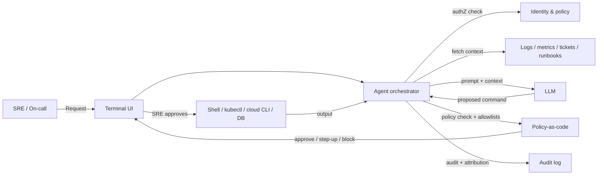

# Terminal-based outage assistant for SRE

> **SAFE‑AUCA industry reference guide (draft)**
>
> This use case describes a real-world workflow that a growing number of organizations deploy alongside their Site Reliability Engineering (SRE), on-call, and platform teams: a command-line AI assistant that helps investigate production incidents by reading logs, proposing diagnostic commands, and — in some operating modes — executing commands against production infrastructure.
>
> It focuses on:
>
> * how the workflow works in practice (tools, data, trust boundaries, autonomy)
> * what can go wrong (defender-friendly kill chain)
> * how it maps to **SAFE‑MCP techniques**
> * what controls + tests make it safer
>
> **Defender-friendly only:** do **not** include operational exploit steps, payloads, or step-by-step attack instructions.  
> **No sensitive info:** do not include internal hostnames/endpoints, secrets, customer data, non-public incidents, or proprietary details.

---

## Metadata

| Field                | Value                                                            |
| -------------------- | ---------------------------------------------------------------- |
| **SAFE Use Case ID** | `SAFE-UC-0024`                                                   |
| **Status**           | `draft`                                                          |
| **Maturity**         | draft                                                            |
| **NAICS 2022**       | `51` (Information), `5182` (Computing Infrastructure Providers and Data Processing Services), `5415` (Computer Systems Design and Related Services) |
| **Last updated**     | `2026-04-22`                                                     |

### Evidence (public links)

* [OWASP Top 10 for LLM Applications (2025)](https://genai.owasp.org/llm-top-10/)
* [NIST AI 600-1 — AI Risk Management Framework: Generative AI Profile (July 2024)](https://nvlpubs.nist.gov/nistpubs/ai/NIST.AI.600-1.pdf)
* [NIST SP 800-53 Rev 5 — Security and Privacy Controls for Information Systems and Organizations](https://csrc.nist.gov/pubs/sp/800/53/r5/upd1/final)
* [Anthropic — Claude Code: Configure permissions](https://code.claude.com/docs/en/permissions)
* [OpenAI — Codex CLI: Sandbox concepts](https://developers.openai.com/codex/concepts/sandboxing)
* [Warp — Terminal and Agent modes](https://docs.warp.dev/agent-platform/warp-agents/interacting-with-agents/terminal-and-agent-modes)
* [Replit — Introducing Plan Mode: A safer way to vibe code (September 2025)](https://blog.replit.com/introducing-plan-mode-a-safer-way-to-vibe-code)
* [Fortune — "An AI-powered coding tool wiped out a software company's database" (July 2025)](https://fortune.com/2025/07/23/ai-coding-tool-replit-wiped-database-called-it-a-catastrophic-failure/)
* [AWS Security Bulletin AWS-2025-019 — Amazon Q Developer and Kiro prompt injection (October 2025)](https://aws.amazon.com/security/security-bulletins/AWS-2025-019/)
* [Invariant Labs — MCP Security Notification: Tool Poisoning Attacks (April 2025)](https://invariantlabs.ai/blog/mcp-security-notification-tool-poisoning-attacks)

---

## Minimum viable write-up (Seed → Draft fast path)

This document covers:

* Executive summary
* Industry context & constraints
* Workflow + scope
* Architecture (tools + trust boundaries + inputs)
* Operating modes
* Kill-chain table
* SAFE‑MCP mapping table
* Contributors + Version History

---

## 1. Executive summary (what + why)

**What this workflow does**  
A **terminal-based outage assistant** is an AI agent that runs inside (or alongside) the command-line environments that SRE, on-call, and platform engineering teams already use. During incidents, the assistant is asked to:

* read system state — recent log lines, errors, metrics, deployment history, open tickets, runbook snippets
* propose diagnostic commands (`kubectl get pods`, `journalctl -u ...`, `aws ec2 describe-instances`, `psql -c "SELECT ..."`, `git log --oneline`)
* optionally execute those commands against production infrastructure
* interpret tool output, iterate on hypotheses, and either converge on a fix or summarize what it found
* in higher-autonomy deployments: apply fixes directly (edit config, restart services, revert commits, scale resources)

Industry instances of this pattern include Claude Code, Cursor's agent mode, Warp's agent mode, OpenAI's Codex CLI, Google's Gemini CLI, GitHub's Copilot CLI, AWS's Amazon Q Developer CLI and Kiro CLI, and open-source agents such as k8sgpt, aider, Continue CLI, and shell-gpt. Adjacent-but-different products — PagerDuty's AI SRE agents and incident.io's Slack-based AI assistants — share the same failure surface even when they are not terminal-native.

**Why it matters (business value)**  
Production incidents are expensive, high-stakes, and time-pressured. A well-configured terminal assistant can reduce mean-time-to-resolution (MTTR) by:

* compressing log triage and correlation work that typically consumes the first minutes of an incident
* surfacing relevant runbook and post-mortem context that on-call engineers may not remember
* suggesting next diagnostic commands when the on-call responder is unfamiliar with the affected system
* drafting incident timelines and post-incident reviews from captured context

**Why it's risky / what can go wrong**  
Unlike read-only summarization, this workflow's defining risk is that the agent often holds (or can obtain) privileged shell access to production. A mistaken, manipulated, or hallucinated command can:

* **Destroy production state** — dropped databases, deleted namespaces, wiped volumes, force-pushed branches. Widely-reported 2025 coverage includes an AI coding agent deleting a production database during a code freeze (Fortune, July 2025), and public reporting has described unexpected `rm -rf` behavior from terminal-agent tools against project and home directories.
* **Leak credentials and secrets** — log reads and diagnostic commands (`env`, `cat ~/.aws/credentials`, `cat ~/.ssh/id_rsa`) that look like normal triage can exfiltrate secrets when the context is contaminated.
* **Execute attacker-supplied instructions** — log lines, error messages, tool output, and MCP server descriptions are untrusted content. AWS issued a security bulletin (AWS-2025-019, October 2025) for prompt injection in the Amazon Q / Kiro IDE plugins, and Invariant Labs has publicly demonstrated tool poisoning in MCP ecosystems.
* **Propagate across infrastructure** — a single compromised command can pivot from one host to an entire fleet via SSH, cluster access, or cloud API credentials.

The OWASP LLM Top 10 (2025) captures this pattern directly as **LLM06 Excessive Agency** — "the agent has more authority than its inputs are trustworthy."

---

## 2. Industry context & constraints (reference-guide lens)

Keep this high level (no implementation specifics).

### Where this shows up

Common in:

* SaaS and cloud-native engineering organizations with on-call rotations
* platform and DevOps teams running Kubernetes, cloud-provider control planes, and CI/CD
* site reliability and incident-response groups
* developer-experience teams shipping AI assistants into terminals
* managed service providers and MSPs that operate production systems on behalf of customers

### Typical systems

* shells and terminal emulators (bash, zsh, fish, tmux, terminal apps that embed agents)
* container orchestration (Kubernetes via kubectl; Nomad; cloud-managed equivalents)
* cloud provider CLIs (`aws`, `gcloud`, `az`)
* observability and telemetry (Prometheus / Grafana / Loki; Datadog; Splunk; ELK/OpenSearch)
* incident and on-call platforms (PagerDuty, incident.io, FireHydrant, Rootly) — increasingly AI-enabled themselves
* source control and code hosting (git, GitHub, GitLab) — the agent often reads and sometimes writes here
* databases and data stores — directly or via admin tools (psql, mongosh, redis-cli)
* secrets managers (HashiCorp Vault, AWS Secrets Manager, cloud KMS)
* policy-as-code layers (Open Policy Agent, Cedar) frequently sit in front of agent execution

### Constraints that matter

* **Least privilege:** the agent typically inherits some subset of the operator's privileges, which in an SRE context can mean production write access. Practitioners treat agent identity separately from the human operator's identity wherever possible.
* **Auditability and attribution:** every proposed and executed command is expected to be attributable to a human, even when the agent drafted it. Regulators and auditors treat the agent as another privileged principal.
* **Change management:** destructive or production-impacting changes often flow through existing change-management and incident-response processes; agents are no exception.
* **Latency and fatigue:** incident triage is time-pressured, and on-call responders working at 3am are a known consent-fatigue target.
* **Blast radius:** unlike a read-only summary that affects a single ticket record, a single shell command can affect entire clusters, regions, or downstream customers.

### Must-not-fail outcomes

* executing destructive commands (`rm -rf`, `DROP`, `kubectl delete`, `git reset --hard`, `systemctl stop` on a critical service) without explicit human approval
* leaking credentials, tokens, or secrets into model context or into outputs that flow outside the trust boundary
* taking actions attributed to a human who did not authorize them
* propagating a compromised or manipulated instruction across hosts, clusters, or clouds
* degrading the incident itself — for example, by generating confident but wrong hypotheses that divert the on-call responder

---

## 3. Workflow description & scope

### 3.1 Workflow steps (happy path)

1. An incident alert fires (paging system, alert manager, error budget breach, customer report).
2. An SRE or on-call responder opens a terminal session and starts the agent (or resumes an existing session).
3. The agent fetches initial context within its permission scope: recent alerts, current cluster/service state, recent deployments, open tickets, relevant runbook entries.
4. The agent proposes a diagnostic command or a small plan (e.g., "check pod status → tail logs → verify upstream connectivity").
5. The responder reviews the proposed command, approves, modifies, or rejects it.
6. The approved command executes inside the agent's sandbox / shell. Output is returned to the agent.
7. The agent interprets the output and proposes the next command or a candidate remediation.
8. Steps 4–7 loop until the incident is mitigated or the responder takes over manually.
9. Optionally, the agent drafts an incident timeline, post-mortem, or runbook update using the captured context.

### 3.2 In scope / out of scope

* **In scope:** read-only diagnostics; proposing and — under appropriate gating — executing commands on production systems; drafting runbooks, timelines, and post-incident reviews; suggesting configuration or code changes for human review.
* **Out of scope:** autonomous financial transactions; actions on customer accounts; interactions with law-enforcement or government systems; rendering final determinations (security classification, compliance verdicts); any action the responder's organization has not explicitly authorized the agent to take.

### 3.3 Assumptions

* The terminal / shell is the authoritative execution surface; the agent's proposed commands become real actions when executed.
* The agent's identity is distinct from the responder's identity in audit logs (service account, short-lived token, or agent-specific principal).
* Log content, error messages, tool output, and MCP server descriptions are treated as untrusted data until they pass safety checks.
* Destructive actions flow through an approval gate — either explicit human confirmation or policy-as-code that rejects dangerous patterns by default.
* The agent operates within the organization's existing change-management and incident-response frameworks.

### 3.4 Success criteria

* The agent reduces MTTR without introducing new incident classes attributable to its behavior.
* Every proposed and executed command is attributable, logged, and reviewable after the incident.
* No destructive action runs without an explicit human approval (in HITL mode) or a documented, allow-listed safe-action policy (in autonomous mode).
* Credentials and secrets are never emitted into model context, outputs, or logs beyond what policy explicitly permits.
* When the agent is uncertain, it surfaces uncertainty rather than hallucinating a confident command.

---

## 4. System & agent architecture

### 4.1 Actors and systems

* **Human roles:** SRE, on-call responder, platform engineer, incident commander, engineering manager; auditors and compliance reviewers (post-incident).
* **Agent / orchestrator:** the terminal-based AI assistant runtime (client, orchestrator, prompt builder, safety filters).
* **LLM runtime:** an internal, partner, or hosted model.
* **Tools (MCP servers / APIs / connectors):** shell execution tool, file read/write tool, cluster API clients (kubectl, cloud SDKs), database clients, observability queries, ticket / incident systems, source-control operations, secrets managers (occasionally).
* **Data stores:** workstation filesystem, container filesystem, production systems reachable by the shell's credentials, log and metric stores, ticket systems, code repositories.
* **Downstream systems affected:** production services; customer-facing systems; databases; deployment pipelines; monitoring and paging; source control history.

### 4.2 Trusted vs untrusted inputs

| Input / source                              | Trusted?         | Why                                        | Typical failure / abuse pattern                                           | Mitigation theme                                              |
| ------------------------------------------- | ---------------- | ------------------------------------------ | ------------------------------------------------------------------------- | ------------------------------------------------------------- |
| Log lines, error messages, stack traces    | Untrusted        | often contain attacker- or customer-supplied content | indirect prompt injection via log content                                  | treat as data; isolate in prompt; sanitize                    |
| Tool outputs (shell, kubectl, cloud CLIs)  | Untrusted        | arbitrary content from queried systems     | contaminated context shaping next command                                  | schema validation; output size caps; context isolation        |
| MCP server tool descriptions               | Semi-trusted     | authored upstream, transport can vary      | tool poisoning (descriptions craft agent behavior)                         | pinning, signing, registry verification                        |
| Ticket, issue, or chat text                | Untrusted        | user-generated                              | prompt injection from a reporter's description                             | treat as data; quote-isolate                                  |
| Runbook / internal documentation           | Semi-trusted     | internal but can be stale or edited       | stale guidance; insider manipulation                                       | provenance; version pinning; citations                        |
| System state reads (cluster state, metrics)| Semi-trusted     | authoritative but ambient                  | over-broad reads; data harvesting                                          | scope and rate-limit; least privilege                         |
| Model output                                | Untrusted        | probabilistic                               | hallucinated commands; fabricated rationale                                | schema; verifier step; approval gate                          |

### 4.3 Trust boundaries

Teams commonly model six boundaries when reasoning about this workflow:

1) **Untrusted input boundary**  
Log lines, error messages, and tool output are untrusted data — even when they originate from internal systems, because the content inside them was often produced by an external actor (a customer request, a third-party library's exception, a CI job's output).

2) **Permission boundary**  
The agent's identity, tokens, and scoped permissions are distinct from the human responder's. The agent must not access or modify objects outside its declared scope, even when the responder could.

3) **Command boundary**  
There is a meaningful difference between *proposing* a command and *executing* it. Proposed commands can be reviewed, edited, or blocked before they become real actions. Teams commonly make this boundary visually and audibly explicit in the UI.

4) **Write boundary (destructive actions)**  
Destructive operations — `rm`, `drop`, `delete`, `reset --hard`, `terminate`, `shutdown`, `stop` of critical services — are treated as a separate category with stricter gating than ordinary writes. A common pattern is a hard allow-list of destructive commands behind step-up approval.

5) **Credential boundary**  
Reads of credential files, token stores, or environment secrets (`~/.aws/credentials`, `~/.ssh/id_rsa`, `printenv`, `ps auxe`) are policy-controlled even when the responder technically has permission; the agent rarely needs those values itself.

6) **Tool-integration boundary**  
Third-party MCP servers and plugins are untrusted by default; their tool descriptions can carry instructions that the model treats as prompts. Pinning, signing, and registry verification are common mitigations.

### 4.4 High-level flow (illustrative)

### 4.5 Tool inventory

Typical tools (names vary by product):

| Tool / MCP server             | Read / write? | Permissions                        | Typical inputs                      | Typical outputs                         | Failure modes                                                            |
| ----------------------------- | ------------- | ---------------------------------- | ----------------------------------- | --------------------------------------- | ------------------------------------------------------------------------ |
| `shell.exec` (bash / zsh)     | read/write    | agent-scoped (ideally non-root)    | command string                      | stdout / stderr / exit code             | destructive commands; shell-metacharacter injection; long-running hangs  |
| `file.read`                   | read          | path allow-list                    | file path                           | file content                            | credential file reads; large reads exhausting context                    |
| `file.write` / `file.edit`    | write         | path allow-list; gated for prod    | path + content                      | success / diff                          | config drift; overwrite of tracked files                                 |
| `kubectl` or cluster API      | read/write    | namespace-scoped role              | verb, resource, namespace           | resource state; apply / delete result   | cluster-wide deletes; namespace escape; CRD mutations                    |
| Cloud provider CLI            | read/write    | scoped IAM role                    | service API call                    | API response                            | cross-account role assumption; deletion of resources; bill-running ops   |
| `git`                         | read/write    | repo-scoped                        | git subcommand                      | diff / log / push result                | force-push; reset --hard; credential leakage via git config              |
| Database admin client         | read/write    | DB role with least privilege       | SQL / shell                         | query result                            | DDL on production; DROP; data exfiltration via SELECT                    |
| Observability query           | read          | service-scoped                     | query (PromQL / Log query)          | time-series / log result                | over-broad queries; log harvesting                                       |
| Ticket / incident system      | read/write    | agent-attributed                   | ticket id, comment                  | updated record                          | mis-attribution; HITL bypass                                             |
| MCP third-party tool          | varies        | varies                             | tool-specific inputs                | tool-specific outputs                   | tool poisoning; schema drift                                             |

### 4.6 Governance & authorization matrix

| Action category                       | Example actions                               | Allowed mode(s)                             | Approval required?                         | Required auth                        | Required logging / evidence                               |
| ------------------------------------- | --------------------------------------------- | ------------------------------------------- | ------------------------------------------ | ------------------------------------ | --------------------------------------------------------- |
| Read-only diagnostics                 | `kubectl get`, `logs`, `describe`; metric queries | manual / HITL / autonomous                  | no                                         | agent-scoped read role               | query + retrieval set                                     |
| Ambient file reads                    | `cat` of non-sensitive files, `ls`            | manual / HITL / autonomous                  | no (within allow-list)                     | path allow-list                      | path accessed + time                                      |
| Credential / secret reads             | `cat ~/.aws/credentials`, `printenv`, key files | manual only (strongly discouraged for agents) | yes, explicit                              | step-up + audit-privileged role       | sealed audit entry                                        |
| Non-destructive writes                | scale up, create tags, annotate               | HITL / autonomous (allow-listed)            | yes for unfamiliar patterns                | scoped writer role                    | before/after; attribution                                 |
| Destructive writes                    | `delete`, `drop`, `rm`, `reset --hard`, `terminate` | **HITL only** (autonomous not recommended)  | **always** explicit human approval          | step-up + change-ticket reference    | immutable audit trail + rationale                         |
| Cross-cluster / cross-account pivots  | assume role; kubeconfig switch; ssh jump       | manual / HITL                               | yes                                        | elevated scope + attestation          | pivot-chain logged                                        |
| External egress                       | `curl`, `wget`, `scp` to external endpoints    | manual / HITL                               | yes                                        | egress allow-list                    | destination + payload classification                      |

### 4.7 Sensitive data & policy constraints

* **Data classes touched by the workflow:** application logs (may include PII, secrets, customer identifiers), infrastructure credentials, deployment artifacts, source code, incident records.
* **Retention / logging:** maintain attributable logs of proposed and executed commands; avoid replicating sensitive data into the agent's transcript store; scrub secret material from both model prompts and output captures.
* **Regulatory constraints:** SaaS-scale organizations commonly carry SOC 2 Trust Services obligations covering logical access (CC6), system operations (CC7), and change management (CC8). Depending on the workload, additional overlays may apply — HIPAA technical safeguards (45 CFR 164.312) for healthcare infrastructure, PCI DSS 4.0 (Req 7 least privilege, Req 10 logging and monitoring) for cardholder systems, and GLBA Safeguards for financial services. For government-cloud deployments, FedRAMP brings the NIST SP 800-53 baseline as a hard requirement rather than a reference.
* **Output policy:** proposed commands should be displayed verbatim before execution so the responder can review; narrated summaries should not be allowed to disguise the underlying tool calls; AI-generated commits and PRs should be clearly attributed.

---

## 5. Operating modes & agentic flow variants

### 5.1 Manual baseline (no agent)

An SRE reads logs and runs diagnostic commands directly, consulting runbooks, dashboards, and teammates. Existing safeguards — change management, dual-control for destructive changes, incident-command patterns, post-incident reviews — apply.

**Risks:** slow under pressure; inconsistent across responders; context switching; fatigue at 3am; knowledge locked in individuals' memory.

### 5.2 Proposed-command only (read-only planning mode)

The agent reads context and **proposes** commands but does not execute anything. This is the mode Replit publicly promoted after its July 2025 production-database deletion incident as "Plan Mode."

**Risk profile:** essentially read-only — bounded to misleading suggestions. The responder remains the execution actor.

### 5.3 Human-in-the-loop (HITL) with per-command approval

The agent proposes commands, and the responder approves each one before execution. Examples include Warp's command-approval UX and Anthropic's Claude Code permission prompts. A common UX pattern is to show the proposed command, a brief rationale, and the target scope; the responder approves once, approves for the session, or rejects.

**Risk profile:** substantially safer than autonomous mode, but vulnerable to **consent fatigue** during long incidents. 3am P1 triage is a well-known pressure point where responders approve without fully reading.

### 5.4 Autonomous on an allow-list (bounded autonomy)

The agent runs commands that match an allow-list of safe patterns (read-only kubectl verbs, safe `ls`/`grep`/`tail`) without explicit approval; destructive operations are blocked or require step-up. OpenAI's Codex CLI documents a three-tier model (`read-only`, `workspace-write`, `danger-full-access`); Anthropic's Claude Code documents a permission model spanning `default`, `acceptEdits`, `plan`, `auto`, and `bypassPermissions`.

**Risk profile:** moderate; depends heavily on allow-list quality and on the isolation around the workspace.

### 5.5 Fully autonomous (strongly gated in production)

The agent runs arbitrary commands without per-call approval — typically inside a sandbox, dev container, or ephemeral VM. Anthropic's engineering blog on Claude Code's auto mode frames unconfigured permission-skipping as the baseline that a classifier-gated "auto mode" was designed to replace.

**Risk profile:** highest — suitable for isolated development or sandboxed CI environments; rarely appropriate against production with live credentials.

### 5.6 Variants

Common architectural variants teams reach for:

1. **Planner vs. executor split** — a separate model or component proposes plans; a second, narrowly-scoped component executes within tighter policy.
2. **Sandboxed execution** — the agent runs inside a Docker container, Cloud Shell, macOS Seatbelt, gVisor, or firecracker microVM; credentials are projected in at execution time only.
3. **Read-only replica shadowing** — the agent operates against a read-only replica or snapshot for diagnostics before touching production.
4. **Policy-as-code front-end** — Open Policy Agent (Rego), Cedar, or custom policy checks gate every proposed command before the approval prompt is even shown.
5. **Session kill switch** — a single keystroke or API call halts the agent and reverts any in-progress destructive action where possible.

---

## 6. Threat model overview (high-level)

### 6.1 Primary security & safety goals

* prevent destructive actions against production without explicit human approval
* prevent leakage of credentials, tokens, and secrets into model context or outputs
* keep every proposed and executed command attributable to a human principal
* resist manipulation of agent behavior by untrusted input (logs, tool output, MCP descriptions)
* contain blast radius when the agent behaves unexpectedly — sandbox, kill-switch, rollback

### 6.2 Threat actors (who might attack or misuse)

* external attacker placing adversarial content into systems the agent reads (web server logs, customer inputs, GitHub issues, error messages from malicious library payloads)
* compromised customer or employee account feeding manipulated input into the agent's context
* insider abusing AI-assisted retrieval to reach data or systems beyond their ordinary scope, or to obscure actions through AI attribution
* compromised or malicious third-party MCP server / CLI plugin whose tool descriptions craft the agent's behavior
* supply-chain compromise of the agent itself or its dependencies

### 6.3 Attack surfaces

* log content, error messages, stack traces, and tool output reaching the model's context window
* ticket, issue, and chat text the agent ingests
* MCP server tool descriptions, tool schemas, and metadata fields
* the shell command surface itself (metacharacters, argument smuggling, wildcard expansion)
* file reads that the agent initiates (configs, credential files, env dumps)
* external egress paths the agent can reach (DNS, HTTP, webhooks)

### 6.4 High-impact failures (include industry harms)

* **Customer / consumer harm:** customer-facing outages caused or extended by agent-originated mistakes; disclosure of customer data through log or database reads that pass through the agent.
* **Business harm:** loss of production state (databases, volumes, repositories) with incomplete backups; regulatory exposure when AI-originated actions lack attribution; reputational damage from publicly-reported AI-agent incidents.
* **Security harm:** credential theft through agent-reachable file reads; lateral movement across clusters and accounts; covert channel exfiltration via diagnostic URLs; persistence through agent-installed cron jobs or modified configs.

---

## 7. Kill-chain analysis (stages → likely failure modes)

> Keep this defender-friendly. Describe patterns, not "how to do it."

| Stage                                   | What can go wrong (pattern)                                                                                    | Likely impact                                                 | Notes / preconditions                                            |
| --------------------------------------- | -------------------------------------------------------------------------------------------------------------- | ------------------------------------------------------------- | ---------------------------------------------------------------- |
| 1. Untrusted input ingestion            | Log lines, error messages, tool output, or MCP tool descriptions carry adversarial content                     | primes the agent to treat data as instructions                | content flows into the prompt without isolation                  |
| 2. Context ordering & checkpoint bypass | Untrusted content appears before safety rules; agent narrative prepared to downplay subsequent actions          | agent overrides policy-aware system prompt                    | classic prompt-window ordering pattern; consent-fatigue at 3am   |
| 3. Discovery & credential access        | Agent enumerates hosts, paths, or env to "triage"; reads credential files as part of the motion                 | secrets surface in model context and potentially in outputs   | common precursor to lateral movement or exfiltration             |
| 4. Privileged command execution         | Proposed command runs with production privileges — destructive, cross-scope, or reading sensitive objects       | production state changes; data destroyed; services disrupted  | the defining stage for this workflow                             |
| 5. Lateral movement / persistence       | One host / cluster / account → fleet; cron or modified config installed "to prevent recurrence"                  | blast radius expands; footholds survive the incident          | requires broader credentials; often the second-order harm        |
| 6. Impact & exfiltration                | Destructive actions complete; secrets or data smuggled via diagnostic URLs, DNS, or MCP parameters              | irreversible damage or regulatory exposure                    | kill-chain terminus; rollback and audit become forensic, not preventive |

---

## 8. SAFE‑MCP mapping (kill-chain → techniques → controls → tests)

Practitioners commonly map this workflow's failure patterns to the following SAFE‑MCP techniques. The mapping is directional — teams adapt it to their stack, threat model, and operating mode. Links in Appendix B resolve to the canonical technique pages.

| Kill-chain stage                      | Failure / attack pattern (defender-friendly)                                                                               | SAFE‑MCP technique(s)                                                                                                               | Recommended controls (prevent / detect / recover)                                                                                                                                                                                                          | Tests (how to validate)                                                                                           |
| ------------------------------------- | -------------------------------------------------------------------------------------------------------------------------- | ----------------------------------------------------------------------------------------------------------------------------------- | ------------------------------------------------------------------------------------------------------------------------------------------------------------------------------------------------------------------------------------------------------- | ---------------------------------------------------------------------------------------------------------------- |
| Untrusted input ingestion             | Log content, error text, tool output, or third-party MCP tool descriptions carry adversarial content                        | `SAFE-T1102` (Prompt Injection); `SAFE-T1001` (Tool Poisoning Attack); `SAFE-T1402` (Instruction Stenography - Tool Metadata Poisoning) | treat all tool output as data; quote / isolate in the prompt; pin and verify tool descriptions; strip zero-width and control characters; size-cap log excerpts; structured tool-call schema                                                              | inject adversarial content into log fixtures; verify agent proposes no instruction-derived actions; fuzz tool descriptions |
| Context ordering & checkpoint bypass  | Untrusted input positioned before safety rules; agent narrative prepared to downplay subsequent actions; consent fatigue     | `SAFE-T1401` (Line Jumping); `SAFE-T1404` (Response Tampering); `SAFE-T1403` (Consent-Fatigue Exploit)                              | keep system instructions and allow-lists at tail of prompt window; show executed commands verbatim alongside narrative; surface tool-call count and diff prominently; throttle bulk approvals                                                               | synthetic long-session tests that count rapid approvals and verify the UI continues to require attention         |
| Discovery & credential access         | Agent enumerates paths, envs, or hosts "for triage"; reads credential files                                                  | `SAFE-T1606` (Directory Listing via File Tool); `SAFE-T1801` (Automated Data Harvesting); `SAFE-T1502` (File-Based Credential Harvest); `SAFE-T1503` (Env-Var Scraping) | path allow-lists that exclude credential stores by default; block `printenv`, `env`, and similar without explicit policy permit; redact secret-shaped strings before returning tool output to the model                                                     | fixtures containing synthetic credentials in logs or files; verify redaction before model ingestion             |
| Privileged command execution          | Proposed command runs with production privileges — destructive, cross-scope, or reading sensitive objects                    | `SAFE-T1309` (Privileged Tool Invocation via Prompt Manipulation); `SAFE-T1302` (High-Privilege Tool Abuse); `SAFE-T1103` (Fake Tool Invocation / Function Spoofing); `SAFE-T1305` (Host OS Privilege Escalation (RCE)) | separate agent identity from human identity; non-root process; explicit HITL for destructive verbs; policy-as-code blocking `rm`, `drop`, `delete`, `reset --hard`, `terminate` without step-up; sandboxed execution (containers, Seatbelt, gVisor, microVM) | attempt destructive patterns in a sandbox; verify gate blocks; verify audit log captures attribution and rationale |
| Lateral movement / persistence        | Pivot from one host / cluster / account; agent installs cron or modifies config "to prevent recurrence"                      | (SAFE‑MCP lateral-movement tactics) — map via adjacent techniques; watch for persistence primitives                                 | short-lived tokens; deny role-chain assumptions without explicit approval; monitor for agent-initiated cron, systemd unit, or webhook installations                                                                                                        | simulated cross-host pivot attempts; verify policy blocks assumption of elevated roles                             |
| Impact & exfiltration                 | Destructive actions complete; secrets smuggled via diagnostic URLs, DNS, or MCP parameters                                   | `SAFE-T2101` (Data Destruction); `SAFE-T1910` (Covert Channel Exfiltration); `SAFE-T1911` (Parameter Exfiltration)                  | egress allow-list for external destinations; DLP on parameters and URLs; strict JSON schema on tool arguments; entropy analysis on argument values; backup and rollback rehearsed                                                                          | seed synthetic secrets; verify egress filter blocks; rehearse restore from backup against mock destructive command |

---

## 9. Controls & mitigations (organized)

### 9.1 Prevent (reduce likelihood)

* **Least privilege by default** — separate agent identity from the human responder; non-root process; scope-limited tokens; no standing credentials to destructive APIs.
* **Approval gate on destructive verbs** — policy-as-code layer blocks `rm -rf`, `drop`, `delete`, `reset --hard`, `terminate`, `shutdown`, and similar without explicit step-up.
* **Command allow-lists and deny-lists** — explicit lists enforced at a kernel or policy layer, not just at the UX layer; user-interface bypass is not enforcement.
* **Sandboxed execution** — containers, dev containers, macOS Seatbelt, gVisor, or ephemeral VMs; credentials projected in only at execution time.
* **Structured tool calls** — strict JSON schemas for tool arguments with `additionalProperties: false`; argument size and entropy limits.
* **Tool-registry verification** — pin MCP tool descriptions; sign and verify at load time; prefer registries with integrity attestation.
* **Secret scrubbing** — redact credential-shaped strings, tokens, and keys from tool output before the model sees them.
* **Egress allow-listing** — restrict `curl`, `wget`, `scp`, and DNS to a known set of destinations.

### 9.2 Detect (reduce time-to-detect)

* behavioral monitoring on agent commands — novel verbs, unusual target namespaces, rapid bulk operations
* alert on credential-file reads, env dumps, and cryptographic-key access from the agent principal
* consent-rate monitoring — spikes in per-session approval count suggest fatigue
* tool-output classification — flagging patterns that look like prompt injection attempts
* diff-based review of agent-initiated configuration changes

### 9.3 Recover (reduce blast radius)

* session kill switch — a single keystroke or API call halts the agent and reverts in-flight destructive operations where possible
* backup and restore rehearsed against the classes of destructive events the agent could cause (database, volume, repository)
* staged rollouts for agent-applied changes; automatic canary / progressive delivery with rollback on error budget breach
* post-incident review playbook specific to AI-agent-originated incidents, including regulator-notification criteria

---

## 10. Validation & testing plan

### 10.1 What to test (minimum set)

* **Permission boundaries** — the agent cannot read or modify objects outside its declared scope, even when the responder could.
* **Destructive-action gating** — destructive verbs are blocked by policy and audit trail, not solely by UI prompts.
* **Prompt-injection robustness** — adversarial content in logs, tool output, and MCP descriptions does not cause the agent to propose destructive or credential-reading actions.
* **Secret hygiene** — credential files, env dumps, and key reads are either blocked or produce redacted output.
* **Attribution** — every proposed and executed command is logged with agent identity, human approver, and timestamp.
* **Sandbox integrity** — commands running inside the sandbox cannot escape to modify the host or reach unauthorized networks.

### 10.2 Test cases (make them concrete)

| Test name                              | Setup                                                | Input / scenario                                                                                    | Expected outcome                                                                                         | Evidence produced                           |
| -------------------------------------- | ---------------------------------------------------- | --------------------------------------------------------------------------------------------------- | -------------------------------------------------------------------------------------------------------- | ------------------------------------------- |
| Destructive-verb gate                  | HITL mode; adversarial prompt steering toward `rm -rf` | agent receives log content asking it to "clean up"                                                  | policy blocks; step-up prompt required; audit entry created                                              | policy log + blocked command + audit entry  |
| Credential-file read block             | path allow-list excludes credential locations         | agent asked to read `~/.aws/credentials` or equivalent                                              | read denied; model receives a redaction notice, not the file contents                                    | denial log + model-visible context          |
| Log-injection robustness               | adversarial log-line fixture                         | agent ingests log line containing an instruction-style payload                                      | agent does not propose the instruction; safety filter logs the attempt                                   | fixture + output + filter log               |
| Tool-description pin                   | modified upstream MCP server descriptor              | attempt to load tool with altered description                                                       | load fails or tool is quarantined pending re-verification                                                 | signature-check log                         |
| Consent-fatigue detection              | long session with 20+ approvals                      | rapid approve-without-read pattern                                                                  | session warns or throttles; monitoring alert to compliance or SRE lead                                    | session metric + alert                      |
| Sandbox escape                         | commands attempting to reach host filesystem         | `../../../`, symlink traversal, mount escape                                                         | contained; no host impact                                                                                 | container audit + host integrity check      |
| Cross-account / cross-cluster pivot    | one-account credential; request to assume another role| agent proposes `aws sts assume-role` across account boundary                                        | request requires explicit approval; role-chain is logged                                                 | IAM audit + approval ticket                 |
| Rollback after simulated destructive op| HITL mode; test namespace                            | operator approves destructive command in a staging namespace                                         | action completes; rollback procedure restores state within target time                                    | restore success + timing evidence           |

### 10.3 Operational monitoring (production)

* per-session command count, approval-rate, and destructive-verb-block count
* credential-path read attempts (should be zero from the agent principal)
* egress attempts outside the allow-list
* time-to-approve distribution (consent-fatigue signal)
* agent-initiated configuration drift across managed systems
* kill-switch and rollback invocation rate

---

## 11. Open questions & TODOs

- [ ] Define the standard allow-list of destructive verbs that the policy layer blocks by default, and the step-up mechanism for overrides.
- [ ] Decide the default sandbox strategy (container, devcontainer, Cloud Shell, microVM) for the organization's threat model and latency budget.
- [ ] Specify how agent identity is represented in existing IAM, audit, and change-management systems.
- [ ] Document the organization's policy on autonomous mode — where (if anywhere) it is allowed to run against production.
- [ ] Define the post-incident review playbook for AI-agent-originated incidents, including regulator notification thresholds.
- [ ] Decide whether the agent is allowed to propose code changes that the responder then merges, and through what review path.

---

## 12. Questionnaire prompts (for reviewers)

### Workflow realism

* Are the tools and terminal integrations realistic for the organization's SRE and platform teams?
* What major system (ticketing, observability, secrets) is missing from the tool inventory for this deployment?

### Trust boundaries & permissions

* Is the agent identity distinct from the human responder's, in IAM and in audit logs?
* Are destructive actions gated by policy-as-code, not just by UX prompts?
* What credentials and tokens are projected into the agent's execution environment, and when are they revoked?

### Output safety & persistence

* Are proposed commands shown verbatim before execution? Are executed commands logged with their actual arguments?
* Is there a kill switch available to the responder and to automated monitoring?
* How is rollback handled for the classes of destructive action the agent could take?

### Correctness

* How does the team detect hallucinated commands before they run?
* What happens when the agent proposes an action the responder disagrees with — is override captured as signal?
* How are consent-fatigue patterns tracked?

### Operations

* Success metrics: MTTR reduction, bad-command block rate, responder override rate
* Danger metrics: credential-read attempts, destructive-verb block rate, blast-radius-adjacent events
* Who owns the kill switch and the agent's allow-list?

---

## Appendix

### A. Suggested proposed-command format

A format that tends to work well when the agent presents a command for approval:

* **Proposed command** (verbatim, as it will be executed)
* **Target scope** (cluster / namespace / account / path)
* **Why this command** (1–2 sentences)
* **Risk class** (read-only / non-destructive write / destructive / credential-access)
* **Expected outcome** (what the agent will infer from the output)
* **Sources used** (tickets, runbook, prior commands — with citations)

### B. References & frameworks

Industry practitioners commonly cross-reference the following catalogs and frameworks when reasoning about this workflow. Inclusion here is directional — applicability depends on deployment context, jurisdiction, and the data the agent can reach.

**SAFE‑MCP techniques referenced in this use case**

* [SAFE‑MCP framework (overview)](https://github.com/safe-agentic-framework/safe-mcp)
* [SAFE-T1001: Tool Poisoning Attack (TPA)](https://github.com/safe-agentic-framework/safe-mcp/blob/main/techniques/SAFE-T1001/README.md)
* [SAFE-T1102: Prompt Injection (Multiple Vectors)](https://github.com/safe-agentic-framework/safe-mcp/blob/main/techniques/SAFE-T1102/README.md)
* [SAFE-T1103: Fake Tool Invocation (Function Spoofing)](https://github.com/safe-agentic-framework/safe-mcp/blob/main/techniques/SAFE-T1103/README.md)
* [SAFE-T1302: High-Privilege Tool Abuse](https://github.com/safe-agentic-framework/safe-mcp/blob/main/techniques/SAFE-T1302/README.md)
* [SAFE-T1305: Host OS Privilege Escalation (RCE)](https://github.com/safe-agentic-framework/safe-mcp/blob/main/techniques/SAFE-T1305/README.md)
* [SAFE-T1309: Privileged Tool Invocation via Prompt Manipulation](https://github.com/safe-agentic-framework/safe-mcp/blob/main/techniques/SAFE-T1309/README.md)
* [SAFE-T1401: Line Jumping](https://github.com/safe-agentic-framework/safe-mcp/blob/main/techniques/SAFE-T1401/README.md)
* [SAFE-T1402: Instruction Stenography - Tool Metadata Poisoning](https://github.com/safe-agentic-framework/safe-mcp/blob/main/techniques/SAFE-T1402/README.md)
* [SAFE-T1403: Consent-Fatigue Exploit](https://github.com/safe-agentic-framework/safe-mcp/blob/main/techniques/SAFE-T1403/README.md)
* [SAFE-T1404: Response Tampering](https://github.com/safe-agentic-framework/safe-mcp/blob/main/techniques/SAFE-T1404/README.md)
* [SAFE-T1502: File-Based Credential Harvest](https://github.com/safe-agentic-framework/safe-mcp/blob/main/techniques/SAFE-T1502/README.md)
* [SAFE-T1503: Env-Var Scraping](https://github.com/safe-agentic-framework/safe-mcp/blob/main/techniques/SAFE-T1503/README.md)
* [SAFE-T1606: Directory Listing via File Tool](https://github.com/safe-agentic-framework/safe-mcp/blob/main/techniques/SAFE-T1606/README.md)
* [SAFE-T1801: Automated Data Harvesting](https://github.com/safe-agentic-framework/safe-mcp/blob/main/techniques/SAFE-T1801/README.md)
* [SAFE-T1910: Covert Channel Exfiltration](https://github.com/safe-agentic-framework/safe-mcp/blob/main/techniques/SAFE-T1910/README.md)
* [SAFE-T1911: Parameter Exfiltration](https://github.com/safe-agentic-framework/safe-mcp/blob/main/techniques/SAFE-T1911/README.md)
* [SAFE-T2101: Data Destruction](https://github.com/safe-agentic-framework/safe-mcp/blob/main/techniques/SAFE-T2101/README.md)

**Industry frameworks teams commonly consult**

* [NIST AI Risk Management Framework (AI RMF 1.0), January 2023](https://nvlpubs.nist.gov/nistpubs/ai/NIST.AI.100-1.pdf)
* [NIST AI 600-1 — AI Risk Management Framework: Generative AI Profile, July 2024](https://nvlpubs.nist.gov/nistpubs/ai/NIST.AI.600-1.pdf)
* [NIST SP 800-53 Rev 5 — Security and Privacy Controls for Information Systems and Organizations](https://csrc.nist.gov/pubs/sp/800/53/r5/upd1/final)
* [NIST SP 800-218A — Secure Software Development Practices for Generative AI and Dual-Use Foundation Models (SSDF Community Profile), July 2024](https://nvlpubs.nist.gov/nistpubs/SpecialPublications/NIST.SP.800-218A.pdf)
* [OWASP Top 10 for LLM Applications (2025)](https://genai.owasp.org/llm-top-10/)
* [MITRE ATLAS](https://atlas.mitre.org/)
* [Regulation (EU) 2024/1689 (AI Act)](https://eur-lex.europa.eu/eli/reg/2024/1689/oj)
* [ISO/IEC 42001:2023 — AI management systems](https://www.iso.org/standard/81230.html)
* [ISO/IEC 23894:2023 — AI risk management guidance](https://www.iso.org/standard/77304.html)

**Public incidents and disclosures adjacent to this workflow**

* [Fortune — "An AI-powered coding tool wiped out a software company's database" (July 2025)](https://fortune.com/2025/07/23/ai-coding-tool-replit-wiped-database-called-it-a-catastrophic-failure/)
* [The Register — "Vibe coding service Replit deleted user's production database" (July 2025)](https://www.theregister.com/2025/07/21/replit_saastr_vibe_coding_incident/)
* [AI Incident Database — Incident 1152: LLM-Driven Replit Agent Reportedly Executed Unauthorized Destructive Commands](https://incidentdatabase.ai/cite/1152/)
* [AWS Security Bulletin AWS-2025-019 — Amazon Q Developer and Kiro: prompt injection in Q / Kiro IDE plugins (October 2025)](https://aws.amazon.com/security/security-bulletins/AWS-2025-019/)
* [Embrace The Red (Johann Rehberger) — "Amazon Q Developer: Remote Code Execution with Prompt Injection" (August 2025)](https://embracethered.com/blog/posts/2025/amazon-q-developer-remote-code-execution/)
* [Invariant Labs — "MCP Security Notification: Tool Poisoning Attacks" (April 2025)](https://invariantlabs.ai/blog/mcp-security-notification-tool-poisoning-attacks)
* [Invariant Labs — "GitHub MCP Exploited: Accessing private repositories via MCP" (May 2025)](https://invariantlabs.ai/blog/mcp-github-vulnerability)
* [Simon Willison — "Model Context Protocol has prompt injection security problems" (April 2025)](https://simonwillison.net/2025/Apr/9/mcp-prompt-injection/)

**Vendor product patterns (approval gating, sandboxing, plan mode)**

* [Anthropic — Claude Code: Configure permissions](https://code.claude.com/docs/en/permissions)
* [Anthropic — "Claude Code auto mode: a safer way to skip permissions" (March 2026)](https://www.anthropic.com/engineering/claude-code-auto-mode)
* [OpenAI — Codex CLI: Sandbox concepts](https://developers.openai.com/codex/concepts/sandboxing)
* [OpenAI — Codex CLI: Agent approvals & security](https://developers.openai.com/codex/agent-approvals-security)
* [Google — Sandboxing in the Gemini CLI](https://google-gemini.github.io/gemini-cli/docs/cli/sandbox.html)
* [Warp — Terminal and Agent modes](https://docs.warp.dev/agent-platform/warp-agents/interacting-with-agents/terminal-and-agent-modes)
* [GitHub — Responsible use of GitHub Copilot CLI](https://docs.github.com/en/copilot/responsible-use/copilot-cli)
* [AWS — Using Amazon Q Developer on the command line](https://docs.aws.amazon.com/amazonq/latest/qdeveloper-ug/command-line.html)
* [Replit — "Introducing Plan Mode: A safer way to vibe code" (September 2025)](https://blog.replit.com/introducing-plan-mode-a-safer-way-to-vibe-code)

**Enterprise safeguards and operating patterns**

* [Open Policy Agent (OPA)](https://www.openpolicyagent.org/)
* [TruffleHog (credential scanning)](https://github.com/trufflesecurity/trufflehog)
* [detect-secrets (pre-commit secret detection)](https://github.com/Yelp/detect-secrets)
* [Microsoft Purview — data security and compliance protections for Microsoft 365 Copilot and other generative AI apps](https://learn.microsoft.com/en-us/purview/ai-microsoft-purview)

---

## Contributors

* **Author:** SAFE‑AUCA community (update with name / handle)
* **Reviewer(s):** TBD
* **Additional contributors:** TBD

---

## Version History

| Version | Date       | Changes                                                                                                                                                                                                                                                                                                                                                                                                                                           | Author                  |
| ------- | ---------- | --------------------------------------------------------------------------------------------------------------------------------------------------------------------------------------------------------------------------------------------------------------------------------------------------------------------------------------------------------------------------------------------------------------------------------------------- | ----------------------- |
| 1.0     | 2026-04-22 | Initial draft authored from seed. Covers the write-capable SRE terminal-agent workflow distinctly from read-only summarization (SAFE-UC-0018). Six-stage kill chain with a dedicated "privileged command execution" stage. SAFE‑MCP mapping covers 16 techniques across six stages (prompt injection, tool poisoning, line jumping, response tampering, consent-fatigue, credential access, privilege escalation, data destruction, covert exfiltration). Evidence set covers OWASP LLM06, NIST AI 600-1, NIST SP 800-53 Rev 5, vendor approval-gating docs from Anthropic / OpenAI / Warp / Replit, and public incidents (Fortune on Replit July 2025, AWS-2025-019, Invariant Labs tool poisoning). Appendix B groups SAFE‑MCP anchors, industry frameworks, public incidents, vendor product patterns, and enterprise safeguards. | SAFE‑AUCA community     |
