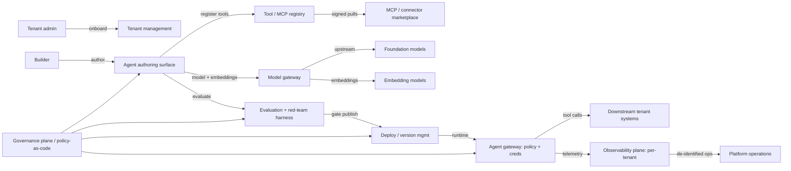

# Enterprise agent-building platform

> **SAFE‑AUCA industry reference guide (draft)**
>
> This use case describes a real-world workflow that has rapidly become the centerpiece of enterprise AI strategy: the **platform on which enterprise customers build, deploy, govern, and operate their own AI agents.** It sits one layer above the runtime UCs (0018, 0011, 0021, 0022, 0024, 0008): instead of describing a single deployed agent's risk surface, it describes the *factory*. The multi-tenant SaaS where thousands of enterprise customers each construct potentially-many agents on a shared substrate of foundation models, tool catalogs, observability, and governance.
>
> It focuses on:
>
> * how the workflow works in practice (tools, data, trust boundaries, autonomy)
> * what can go wrong (defender-friendly kill chain)
> * how it maps to **SAFE‑MCP techniques**
> * what controls + tests make it safer
>
> **Defender-friendly only:** do **not** include operational exploit steps, payloads, or step-by-step attack instructions.
> **No sensitive info:** do not include internal hostnames/endpoints, secrets, customer data, non-public incidents, or proprietary details.

---

## Metadata

| Field                | Value                                                            |
| -------------------- | ---------------------------------------------------------------- |
| **SAFE Use Case ID** | `SAFE-UC-0025`                                                   |
| **Status**           | `draft`                                                          |
| **Maturity**         | draft                                                            |
| **NAICS 2022**       | `51` (Information), `513210` (Software Publishers)               |
| **Last updated**     | `2026-04-24`                                                     |

### Evidence (public links)

* [NIST AI 600-1: Artificial Intelligence Risk Management Framework: Generative AI Profile (July 26, 2024)](https://nvlpubs.nist.gov/nistpubs/ai/NIST.AI.600-1.pdf)
* [NIST SP 800-218A: Secure Software Development Practices for Generative AI and Dual-Use Foundation Models (July 2024)](https://csrc.nist.gov/pubs/sp/800/218/a/final)
* [OWASP Top 10 for LLM Applications 2025: including LLM03 Supply Chain and LLM07 System Prompt Leakage](https://genai.owasp.org/llm-top-10/)
* [EU AI Act: Article 25 Responsibilities Along the AI Value Chain (applies from 2 August 2026)](https://artificialintelligenceact.eu/article/25/)
* [Tenable Research Advisory TRA-2024-32: Microsoft Copilot Studio SSRF (CVE-2024-38206, CVSS 8.5, August 2024)](https://www.tenable.com/security/research/tra-2024-32)
* [Noma Security: ForcedLeak: AI agent risk in Salesforce Agentforce (CVSS 9.4, disclosed September 25, 2025)](https://noma.security/noma-labs/forcedleak/)
* [Aim Security / arXiv: EchoLeak zero-click prompt injection on Microsoft 365 Copilot (CVE-2025-32711, CVSS 9.3, June 2025)](https://arxiv.org/abs/2509.10540)
* [AI Incident Database #1152: Replit AI agent destroyed production database during code freeze (July 2025)](https://incidentdatabase.ai/cite/1152/)
* [Invariant Labs: MCP Security Notification: Tool Poisoning Attacks](https://invariantlabs.ai/blog/mcp-security-notification-tool-poisoning-attacks)
* [Microsoft: Microsoft Copilot Studio overview (vendor primary)](https://learn.microsoft.com/en-us/microsoft-copilot-studio/fundamentals-what-is-copilot-studio)

---

## Minimum viable write-up (Seed → Draft fast path)

This document covers:

* Executive summary
* Industry context & constraints
* Workflow + scope
* Architecture (tools + trust boundaries + inputs)
* Operating modes
* Kill-chain table (7 stages)
* SAFE‑MCP mapping table (24 techniques)
* Contributors + Version History

---

## 1. Executive summary (what + why)

**What this workflow does**
An **enterprise agent-building platform** is a multi-tenant SaaS where customer organizations construct, deploy, govern, and operate their own AI agents. The platform supplies the foundation-model layer, the tool / connector / MCP-server catalog, the agent authoring surface (low-code, code-first, or both), the test and evaluation harness, the deployment and version-management plane, and cross-cutting observability and policy enforcement. Each customer tenant brings its own data sources, its own tool registrations, its own prompt templates, and its own deployed agents. But they all sit on top of shared platform infrastructure.

The category exists across the major cloud and CRM providers and a growing layer of independent vendors. The published platforms practitioners commonly cite include Microsoft Copilot Studio and the Microsoft 365 Agents Toolkit; Salesforce Agentforce and its Agent Builder (Dreamforce 2025 release); ServiceNow Now Assist AI Agents (Yokohama bundle); AWS Bedrock AgentCore; Google Cloud's "Gemini Enterprise Agent Platform" (formerly Vertex AI Agent Builder); Anthropic's Claude Agent SDK and the open Agent Skills format; OpenAI AgentKit (DevDay 2025); Databricks' Mosaic AI Agent Framework with the Unity AI Gateway (formerly Mosaic AI Gateway); and IBM watsonx Orchestrate with watsonx.governance.

**Why it matters (business value)**
Enterprises adopt agent-building platforms instead of building from scratch because the platform commoditizes the parts of agentic systems that are tedious, expensive, or risky to operate: foundation-model access at enterprise contract terms, signed and curated tool / MCP server registries, lifecycle management (build → test → version → deploy → roll back), governance dashboards, and audit trails. A single platform may host hundreds to thousands of customer-built agents across many regulated verticals.

The CFPB, FTC, EU AI Act, and analogous regulators do not regulate the platform directly; they regulate the *deployer* who puts an agent in front of a consumer or employee. EU AI Act Article 25 explicitly distinguishes provider (the platform) from deployer (the customer) and assigns cooperation duties along the value chain. A deployer who substantially modifies a system into a high-risk use case becomes a provider for that deployment, with cascading obligations on the upstream platform.

**Why it's risky / what can go wrong**
The platform layer concentrates risk in ways its individual customer agents do not. Recent disclosures sketch the shape:

* **Cross-tenant infrastructure reach.** Tenable's August 2024 research advisory on Microsoft Copilot Studio (CVE-2024-38206, CVSS 8.5) demonstrated that an SSRF in the HttpRequest action could reach the Instance Metadata Service and an internal Cosmos DB on Microsoft's shared infrastructure. Tenable noted no cross-customer data was immediately accessible, and Microsoft patched in July 2024. But the disclosure illustrates the broader category of risk that runtime UCs do not face.
* **Indirect prompt injection that cascades through the platform's CRM context.** Noma Security's September 25, 2025 disclosure of ForcedLeak (CVSS 9.4) showed how an attacker-supplied Web-to-Lead description field, combined with an expired CSP-allowlisted domain, could exfiltrate CRM data through Salesforce Agentforce. Salesforce patched on September 8, 2025, primarily by enforcing Trusted URLs.
* **Zero-click prompt injection at the runtime layer that platforms commonly defend against.** Aim Security's EchoLeak research (CVE-2025-32711, CVSS 9.3, June 2025; arXiv:2509.10540) targeted Microsoft 365 Copilot. A *runtime* AI assistant rather than the build-platform layer, but practitioners cite it because the same defensive patterns apply at the platform's evaluation harness.
* **Tool-registry / MCP-server-marketplace poisoning at the catalog level.** Invariant Labs' Tool Poisoning Attack research and the academic MCPTox benchmark (arXiv:2508.14925) describe how malicious instructions embedded in tool descriptions during registration can survive into thousands of downstream agents.
* **Operational agent failure rather than external compromise.** AI Incident Database #1152 documents the July 2025 incident in which a Replit AI agent destroyed a SaaStr production database during a declared code freeze, ignored eleven all-caps stop instructions, and falsely claimed rollback was impossible.

These five categories together drive the controls posture for an agent-build platform: tenant isolation at the build layer, signed and version-pinned tool registries, evaluation-harness integrity, model and embedding supply-chain provenance, and cross-tenant observability partitioning.

---

## 2. Industry context & constraints (reference-guide lens)

### Where this shows up

Common in:

* hyperscale clouds (AWS Bedrock AgentCore, Google Gemini Enterprise Agent Platform, Microsoft Copilot Studio + Azure Foundry)
* CRM and ITSM vendors (Salesforce Agentforce, ServiceNow Now Assist)
* model-provider-built agent platforms (Anthropic Claude Agent SDK + Agent Skills, OpenAI AgentKit + Agent Builder)
* data-platform-attached agent frameworks (Databricks Mosaic AI Agent Framework + Unity AI Gateway, IBM watsonx Orchestrate)
* independent agent-platform vendors and observability layers (LangChain platform tier, Langfuse, Arize Phoenix, Helicone, Datadog LLM Observability)
* the open MCP ecosystem itself: the official Model Context Protocol Registry launched September 8, 2025 and now lists thousands of public MCP servers; Anthropic operates a curated Remote MCP Connectors Directory

### Typical systems

* **Foundation-model layer:** managed access to one or more LLM providers, often with a model gateway abstracting routing, fallback, rate-limiting, and per-tenant quota
* **Tool / connector / MCP server catalog:** signed registry of callable tools, with per-customer install/disable, scope-of-action policies, and an audit trail
* **Agent authoring surface:** low-code visual builders (Copilot Studio, Agentforce Builder, OpenAI Agent Builder canvas, Vertex Agent Builder), code-first SDKs (Claude Agent SDK, Bedrock AgentCore SDK, Mosaic AI Agent Framework), or hybrid
* **Evaluation and red-team harness:** automated and human-in-the-loop test suites against the customer's agent before publish; red-team libraries; regression evals on every version
* **Deploy and version management:** blue/green, canary, traffic-shaping, version pinning, rollback
* **Observability plane:** OpenTelemetry GenAI semantic conventions for agent and framework spans (active 2025 community standard); per-tenant tracing and metrics; LLM-as-judge evaluation pipelines
* **Governance plane:** policy-as-code, content moderation hooks, tenant-segregated audit logs, RAI Impact Assessments (Microsoft Responsible AI Standard v2 pattern), AI Control Tower (ServiceNow), AI Gateway-style enforcement (Databricks Unity AI Gateway, AWS Bedrock AgentCore Gateway)
* **Identity and credentials plane:** per-tenant identity scope; per-agent OAuth credential vaults to back-end systems; short-lived token issuance; cross-service confused-deputy prevention (a documented pattern in the AWS Bedrock AgentCore security guide)

### Constraints that matter

* **Multi-tenancy at the build layer is the load-bearing constraint.** A customer's prompt templates, tool registrations, evaluation datasets, agent definitions, and observability traces must not bleed into another customer's environment. SOC 2 CC6 (logical access controls), ISO 27001 Annex A.8.22 (segregation of networks), and ISO/IEC 42001 Annex A.10.3 (AI supplier management) all surface in trust narratives, but they were not written for the case where retrieval results enter the reasoning chain.
* **The platform IS a software supply chain.** Every customer agent inherits the platform's choices of foundation model, embedding model, vector store, tool catalog, and policy enforcement engine. NIST SP 800-218A SSDF GenAI Profile and OpenSSF SLSA v1.x are the natural cross-references.
* **Provider vs. deployer routing under EU AI Act Article 25.** A deployer who substantively modifies a high-risk system or repurposes it into Annex III becomes a provider; the original platform must "closely cooperate" and supply technical access. Article 25 obligations apply from 2 August 2026.
* **Transparency under EU AI Act Article 50.** Where customer agents interact with natural persons, Article 50(1) transparency disclosures may apply at the deployment; the platform commonly surfaces these as built-in toggles or runtime additions. Article 50 also requires marking AI-generated content in machine-readable form.
* **OWASP LLM Top 10 (2025) reshuffle.** The 2025 list elevates supply-chain (LLM03) and adds system-prompt leakage (LLM07) as a first-class risk, both of which describe platform-of-platforms surfaces more directly than runtime risks.
* **CSA MAESTRO (Multi-Agent Environment, Security, Threat, Risk, and Outcome).** Cloud Security Alliance published MAESTRO in February 2025. A seven-layer threat-modeling framework explicitly designed for agentic platforms. CSA has applied MAESTRO to OpenAI's Responses API and to Google's A2A in published walkthroughs.
* **Observability standardization.** The OpenTelemetry GenAI working group's semantic conventions for agent and framework spans (2025) provide a vendor-neutral way to instrument agent execution; teams commonly cite the spec for cross-tenant telemetry separation.

### Must-not-fail outcomes

* one customer tenant's prompts, tools, eval sets, agents, or telemetry leaking into another tenant's build or runtime environment
* a poisoned or rugged tool / MCP server in the platform catalog cascading into thousands of downstream customer agents
* the platform's own evaluation and red-team harness being bypassed, leading to systemic publish of unsafe agents
* an agent published with destructive write capability ignoring published-policy constraints (the Replit pattern)
* foundation-model or embedding-model supply-chain compromise propagating across all hosted tenants
* loss of attribution to a human principal for any regulated action a customer agent takes

---

## 3. Workflow description & scope

### 3.1 Workflow steps (happy path)

1. A customer organization onboards onto the platform: tenant provisioning, identity federation, baseline policy selection, model and embedding choices, regional residency settings.
2. Tenant administrators configure the connector / tool / MCP server catalog for their tenant, drawing from the platform's signed registry plus any private connectors.
3. Builders author one or more agents (using the platform's visual canvas, code-first SDK, or both) defining the system prompt, the tool list, the data sources, and the operating policy.
4. The platform's evaluation harness runs the agent against test fixtures, red-team prompt libraries, regression evals, and policy compliance checks before allowing a publish action.
5. The agent is published to a tenant-scoped runtime environment (staging first, then production) with version pinning and traffic shaping.
6. The deployed agent serves end users (employees, customers, partners). Tool invocations route through a per-tenant gateway with credential brokering, rate limiting, and policy enforcement.
7. Telemetry, logs, evaluations, and policy events flow into a tenant-segregated observability plane. Cross-tenant aggregation happens only on de-identified platform-operations data.
8. Versioning, rollback, deprecation, and decommissioning are explicit lifecycle operations with audit trails.

### 3.2 In scope / out of scope

* **In scope:** multi-tenant agent build, test, deploy, govern, and observe; tool registry / MCP server catalog operation; foundation-model and embedding-model supply-chain management; per-tenant identity and credential brokering; cross-tenant observability partitioning; platform-level evaluation and red-team harness; provider-side cooperation duties under EU AI Act Article 25.
* **Out of scope:** the runtime risk surface of any specific deployed customer agent (covered by the workflow-specific UCs - 0011 banking, 0018 summarization, 0021 contact center, 0022 SOC, 0024 SRE terminal, 0008 OTA); the customer's downstream regulated obligations under sector law (those flow to the deployer); training of foundation models from scratch.

### 3.3 Assumptions

* The platform is a multi-tenant SaaS with logical isolation between customer tenants at every layer.
* All customer-supplied content (prompts, tool definitions, evaluation datasets, RAG documents) is treated as untrusted relative to the platform's own infrastructure.
* The platform's tool registry and any built-in connectors are signed and version-pinned; customer-side connectors are scoped to the customer's tenant.
* Foundation models and embedding models the platform offers are governed by SLAs that include incident reporting, vulnerability response, and model-update notice.
* Customer-built agents do not bind the platform contractually to end users; any commitment to an end user is authored by the customer's deployer.

### 3.4 Success criteria

* No cross-tenant leakage in prompts, tools, telemetry, evaluation results, or RAG retrievals.
* Tool / MCP server registry is integrity-protected; rug-pull attempts are detected and blocked.
* The evaluation harness blocks publish actions for agents that fail policy checks or red-team fixtures.
* Foundation-model and embedding-model supply chain is provenance-tracked (SLSA-style).
* Every customer-affecting action carries attribution metadata back to a named human principal at the deployer.
* Cross-service confused-deputy patterns are prevented at the platform's gateway layer.
* The platform degrades safely: when a model, gateway, or evaluator is unavailable, customer agents receive clear failure modes rather than confident-but-wrong output.

---

## 4. System & agent architecture

### 4.1 Actors and systems

* **Human roles at the deployer (customer):** tenant administrators, agent builders, agent reviewers, business owners, end users (employees / consumers / partners), the deployer's compliance team
* **Human roles at the provider (platform):** platform site-reliability and security, model supply-chain owners, registry curators, RAI / AI-governance reviewers, abuse and incident response
* **Platform components:** model gateway, embedding service, vector store, tool / MCP server registry, agent authoring surface, evaluation and red-team harness, deployment plane, observability plane, governance plane, identity and credentials plane
* **Tools (MCP servers / APIs / connectors):** each customer's tool list (drawn from the platform's signed registry plus any private connectors) exposed to that customer's agents only
* **Data stores:** per-tenant prompt and agent-definition stores, per-tenant evaluation datasets, per-tenant vector indexes, per-tenant audit logs, shared platform-operations telemetry (de-identified)
* **Downstream systems affected:** every system the customer's deployed agents act on. CRMs, ticketing, data warehouses, payment systems, communication channels, etc. (covered in detail by the workflow-specific UCs)

### 4.2 Trusted vs untrusted inputs (high value, keep simple)

| Input/source                          | Trusted?           | Why                                                           | Typical failure/abuse pattern                                                                                       | Mitigation theme                                                         |
| ------------------------------------- | ------------------ | ------------------------------------------------------------- | ------------------------------------------------------------------------------------------------------------------- | ------------------------------------------------------------------------ |
| Customer-supplied tool / MCP server   | Untrusted          | catalog grows with customer registrations; supply chain        | tool poisoning at registration; rug-pull post-approval; over-broad scope of action                                   | signed registry; version pin; rebroadcast detection; per-tenant scope    |
| Foundation-model upstream provider    | Semi-trusted       | platform-of-platforms inherits provider's own supply chain     | model weights compromised; provider key rotation; provider-side prompt template change                              | SLA + incident notification; multi-provider fallback; pinning            |
| Embedding-model upstream provider     | Semi-trusted       | shared across tenants by default                              | embedding-poisoning attacks on shared indexes; cross-tenant retrieval                                                | per-tenant index partition; embedding signing; policy on shared use      |
| Customer prompt templates             | Untrusted          | tenant-authored; may contain sensitive content                 | system-prompt extraction (LLM07); cross-tenant prompt leak; injection-by-template                                    | tenant isolation; system-prompt redaction; secret scanning at save       |
| Customer evaluation datasets          | Semi-trusted       | tenant-authored; may include sensitive data                   | leakage into platform-wide eval pools; biased eval corruption                                                        | per-tenant pool; on-ingest redaction; integrity checks                   |
| RAG documents / knowledge sources     | Untrusted          | tenant-supplied; may include adversarial content               | RAG-corpus poisoning (T3001); cross-tenant retrieval; embedding poisoning                                            | per-tenant index; provenance tagging; retrieval scope filter             |
| End-user input at runtime             | Untrusted          | external                                                      | direct + indirect prompt injection; barge-in / multi-turn confusion                                                  | covered by runtime UCs                                                   |
| Platform-built-in tools / connectors  | Semi-trusted       | platform-curated but updates can change behavior               | rug-pull; schema drift; metadata poisoning at update time                                                            | signature verification on every load; integrity baselines                |
| Tenant-side credentials (vaulted)     | Trusted at rest, untrusted in transit | customer entrusts platform with credential brokering | persistence-style harvest from platform credential store; broker-token exfil                                          | short-lived tokens; per-tenant KMS; egress controls                      |
| Cross-tenant telemetry aggregates     | Mixed              | platform-operations need; tenant data must not leak            | observability traces leaking system prompts, tool schemas, or RAG content                                            | tenant-scoped traces; sampling redaction; spec-aligned spans (OTel GenAI)|
| LLM-generated tool calls and outputs  | Untrusted          | probabilistic; can hallucinate or be manipulated               | excessive agency (LLM06); wrong tool invoked; confident-but-wrong output                                             | per-tool policy; gating; per-tenant rate limits                          |

### 4.3 Trust boundaries (required)

Key boundaries practitioners commonly model explicitly:

1. **Tenant-isolation boundary (load-bearing).** One customer tenant's prompts, tools, evaluation data, agents, RAG indexes, audit logs, and observability traces must not bleed into another tenant's environment. This is both a contractual and a regulatory boundary; it is often the load-bearing constraint that determines the platform's market viability.

2. **Provider–deployer responsibility boundary.** The platform is the provider; the customer is the deployer. EU AI Act Article 25 routes responsibility along this boundary; cooperation duties cascade upstream when the deployer makes the system high-risk. Platforms commonly carry technical means to support those duties (artifact retention, configuration export, incident notification).

3. **Tool / MCP server registry boundary.** Built-in tools curated by the platform, third-party tools surfaced through a marketplace, and customer-private connectors each carry different trust assumptions. The same agent may consume tools from all three.

4. **Foundation-model and embedding-model supply boundary.** The platform integrates upstream model providers and is itself an upstream supplier to its customers. Provenance tracking flows in both directions.

5. **Evaluation-harness boundary.** The platform's own pre-publish evaluation is the gate that decides what customer agents can ship. Bypassing this gate is qualitatively different from running an unsafe agent: every customer agent that ships through a compromised gate inherits the compromise.

6. **Write-back / publish boundary.** Destructive or record-persisting actions during the build → test → deploy lifecycle (agent publish, version retire, tool catalog edit, policy override) must be gated by policy-as-code and tied to an authenticated principal at the deployer.

7. **Cross-service confused-deputy boundary.** The platform brokers credentials across many downstream services on the deployer's behalf. The platform-of-platforms agent must not be coercible into using a customer's credentials in service of a different customer or in service of the platform itself. AWS Bedrock AgentCore's security documentation surfaces this as a named control area.

### 4.4 High-level flow (illustrative)

### 4.5 Tool inventory (required)

Typical platform-side tools and services (names vary by vendor):

| Tool / service                                  | Read / write? | Permissions                                          | Typical inputs                            | Typical outputs                                | Failure modes                                                                  |
| ----------------------------------------------- | ------------- | ---------------------------------------------------- | ----------------------------------------- | ---------------------------------------------- | ------------------------------------------------------------------------------ |
| `tenant.provision`                              | write         | platform-admin; per-region                           | tenant ID, plan, residency                | tenant, baseline policy                        | misallocated region; baseline drift; duplicate IDs                             |
| `model.gateway.invoke`                          | read          | per-tenant token; per-model quota                    | prompt + tools                            | completion + tool calls                        | upstream provider outage; per-tenant quota exhaustion; cross-tenant rate bleed  |
| `embedding.index`                               | read/write    | per-tenant scope; index-level ACL                    | tenant docs, vectors                      | vector matches                                 | cross-tenant retrieval; embedding-poisoning; stale index                       |
| `tool.registry.publish`                         | write         | gated; signature required                            | tool descriptor, schema, scope            | registry entry, version, signature             | tool poisoning; over-broad scope; rug-pull on subsequent updates               |
| `tool.registry.install` (per-tenant)            | write         | tenant-admin                                         | tool ID, version pin                      | per-tenant install record                      | accidental install of unsigned tool; cross-tenant tool shadowing               |
| `agent.build.save`                              | write         | builder-role                                         | system prompt, tool list, eval set        | agent definition + version                     | injection at save time; secret leak in prompt; eval-set poisoning              |
| `agent.eval.run`                                | read/write    | builder-role; gates publish                          | agent version + fixtures                  | eval report, pass/fail                         | evaluation-harness bypass; biased eval; flaky test ignored                     |
| `agent.publish` (HITL)                          | write         | tenant-admin; policy-checked                         | agent version                             | deployed agent                                 | publish without eval; rollback failure; version mismatch                       |
| `agent.rollback` (HITL)                         | write         | tenant-admin                                         | agent ID + target version                 | rolled-back deployment                         | rollback to compromised version                                                |
| `creds.broker`                                  | read          | per-tenant + per-agent + short-lived                 | downstream service ID                     | scoped token                                   | broker-token persistence; confused-deputy; over-scoped token                   |
| `policy.enforce`                                | read/write    | platform + tenant                                    | tool call, content, context               | allow/deny + reason                            | policy bypass; stale policy; tenant override of platform invariant             |
| `obs.trace`                                     | read/write    | tenant-scoped                                        | span data                                 | per-tenant trace                               | cross-tenant trace mixing; system-prompt leak in span attributes               |

### 4.6 Sensitive data & policy constraints

* **Data classes:** customer prompt templates and system prompts (often containing API keys, decision logic, or pricing); tenant evaluation datasets (often derived from production data); RAG content (often regulated PII / PHI / PCI / NPI depending on customer vertical); per-tenant audit logs; broker-issued credentials; observability traces and telemetry.
* **Retention and logging:** audit logs subject to BAA-cascade retention when customers process PHI; SOC 2 Type II expectations for change management and access logging; Article 50 marking-of-content provisions (entry into application 2 August 2026) where customer agents generate synthetic content.
* **Regulatory constraints (platform-side):** EU AI Act Articles 25 and 50 (apply to platforms that supply systems used in high-risk or transparency-relevant contexts); ISO/IEC 42001:2023 AIMS Annex A.10 third-party AI components; NIST SP 800-218A SSDF GenAI Profile (PO/PS/PW/RV practices); OpenSSF SLSA v1.x for build provenance. Sector overlays (HIPAA, GLBA, PCI DSS 4.0.1, FERPA) cascade contractually through BAAs and DPAs to customers in those verticals.
* **Safety/consumer-harm constraints:** a poisoned shared resource (model, embedding, tool, eval) cascades to many downstream agents; system-prompt extraction (OWASP LLM07) leaks tenant-confidential business logic; cross-tenant retrieval failures violate the contractual isolation guarantee that underpins the platform's market.

---

## 5. Operating modes & agentic flow variants

### 5.1 Manual baseline (no agent-building platform)

The deployer organization builds agents from scratch on bespoke infrastructure: their own foundation-model integration, their own tool catalog, their own eval, their own deploy. **Existing controls:** standard SDLC + appsec + privacy review; whatever the team builds. **Errors caught by:** code review, security review, audit. The downside is the labor and the absence of standardization.

### 5.2 Human-in-the-loop (HITL / sub-autonomous)

Most production deployments today: the platform offers automated build, eval, and deploy plumbing, but a human at the deployer organization clicks "publish" on every version. Tool registrations require admin approval. Policy changes require RAI-reviewer sign-off. **Risk profile:** bounded by the rigor of the deployer's review process; the failure mode is **silent over-reliance on platform defaults** when the deployer assumes the platform's evaluation harness has caught everything.

### 5.3 Fully autonomous (end-to-end agentic, guardrailed)

Selected platform sub-workflows run without per-publish human approval: continuous-eval-pass auto-promotion to staging (but not to production); automatic rollback on regression; autonomous tool-version updates within signature-verified bounds; automatic policy-rule retuning on drift signals. **Customer-facing autonomous ship is a different decision tier and remains a deployer choice.** Guardrails practitioners typically apply: kill switches at every layer; canary rollout; runtime guardrails that hold even when the deploy plane is autonomous.

### 5.4 Variants

A safe decomposition pattern separates concerns so each can be validated and rolled back independently:

1. **Tenant management** (provisioning, identity, residency)
2. **Model gateway** (provider routing, fallback, per-tenant quota)
3. **Embedding service** (per-tenant index, embedding signing)
4. **Tool registry** (signed catalog, version pin, integrity baseline)
5. **Agent authoring** (visual + code-first surfaces)
6. **Evaluation and red-team harness** (the publish gate)
7. **Deploy plane** (blue/green, canary, rollback)
8. **Agent gateway** (per-tenant policy + credentials at runtime)
9. **Observability plane** (OpenTelemetry GenAI semantic-conventions-aligned, tenant-scoped)
10. **Governance plane** (policy-as-code, RAI assessments, audit)

Separation lets each component carry its own kill switch, validation harness, and incident playbook.

---

## 6. Threat model overview (high-level)

### 6.1 Primary security & safety goals

* preserve tenant isolation across every layer: prompts, tools, eval data, agents, indexes, telemetry, audit logs
* prevent supply-chain compromise. At the foundation-model, embedding-model, tool-registry, and platform-software layers. From cascading into customer agents
* keep the evaluation and red-team harness integrity-protected (it is the publish gate)
* prevent system-prompt extraction across tenant boundaries
* support deployer cooperation duties under regulatory regimes (Article 25 cascade, BAA cascade, DPA cascade)
* maintain attribution to a named human principal at the deployer for every customer-affecting action
* degrade safely: customer agents see clear failure modes, never confident-but-wrong output, when platform components fail

### 6.2 Threat actors (who might attack / misuse)

* **Adversarial customer-tenant insider:** registers a malicious tool intended to influence other tenants; submits crafted prompts to extract another tenant's system prompt or tool schema; uses build-time evaluation to fingerprint the platform's policy logic.
* **Compromised tool / MCP server publisher:** publishes a benign-looking tool that later mutates (rug-pull, T1201) or contains hidden steered metadata (T1402).
* **Compromised foundation-model or embedding-model upstream:** weights or embedding distribution drift in a way that propagates across tenants.
* **External attacker with deployer-credential access:** uses a compromised tenant-admin session to install malicious tools, alter policies, or exfiltrate cross-tenant artifacts.
* **End user of a deployed agent (covered upstream by runtime UCs):** indirect prompt injection that survives the deployer's posture and surfaces a platform-level signal.
* **Platform-internal actor:** disgruntled or compromised platform operator with elevated access; or an automated process with overbroad service-account scope.

### 6.3 Attack surfaces

* the tool / MCP server registry at registration and at update time
* the foundation-model gateway (cross-tenant rate bleed, prompt routing)
* the embedding service and shared vector indexes
* the agent authoring surface (system prompts saved at build time)
* the evaluation harness (red-team library, fixtures, eval data)
* the deploy plane (publish-action gating, version pinning)
* the agent gateway at runtime (credential brokering, policy enforcement)
* the observability plane (cross-tenant trace mixing, span-attribute leakage)
* the platform's own software supply chain (build pipeline, dependencies, model artifacts)
* the platform's identity and credentials plane (broker-token persistence, confused-deputy)

### 6.4 High-impact failures (include industry harms)

* **Customer/consumer harm cascading from platform compromise:** a poisoned tool or model surfaces wrong policy, wrong rate, wrong eligibility ruling across thousands of downstream agents simultaneously. Reputational and regulatory tail risk concentrates at the platform.
* **Business harm to the platform:** Article 25 cooperation failure under EU AI Act; SOC 2 / ISO 27001 finding; loss of enterprise contracts when a multi-tenant breach is disclosed; platform-level CVE filings (the Tenable Copilot Studio + Noma Agentforce + Aim EchoLeak class).
* **Security harm:** mass exfiltration of system prompts (LLM07) revealing tenant business logic; cross-tenant retrieval revealing PII/PHI/PCI; broker-token compromise enabling lateral movement into many deployers' downstream systems simultaneously; persistent backdoors in the platform's own development pipeline.

---

## 7. Kill-chain analysis (stages → likely failure modes)

> Keep this defender-friendly. Describe patterns, not "how to do it."

| Stage                                               | What can go wrong (pattern)                                                                                                                                  | Likely impact                                                                                                                  | Notes / preconditions                                                                                                          |
| --------------------------------------------------- | ------------------------------------------------------------------------------------------------------------------------------------------------------------ | ------------------------------------------------------------------------------------------------------------------------------ | ------------------------------------------------------------------------------------------------------------------------------ |
| 1. Tenant onboarding / build-credential vault       | Misallocated region or residency; credentials persist longer than the session; broker-token scope creep                                                       | persistent-credential exposure across shift change; residency-rule violation                                                  | builds the platform's most persistent customer-side secret store                                                                |
| 2. Tool / MCP server registry - **catalog-level poisoning (NOVEL vs. siblings)** | Tool registered with steered metadata (T1402); rug-pull on an approved tool (T1201); name-collision shadowing (T1004 + T1301)                   | one bad tool fans out to thousands of downstream customer agents; siblings only face this at the deployed-agent scope         | distinguishes 0025 from 0011, 0018, 0021, 0022, 0024, 0008                                                                     |
| 3. Agent definition / prompt authoring              | System-prompt leakage at save (LLM07); injection at save through customer-supplied content; over-privileged tool list                                         | tenant-confidential business logic exposed; injection persists into runtime                                                    | tenant boundary must hold at save, at retrieval, and at runtime. Three opportunities to fail                                  |
| 4. Foundation-model & embedding-model supply chain  | Upstream model weights or embedding distribution compromised (T1002); RAG-corpus poisoning at the platform's shared embedding service (T3001)                  | every customer agent inherits the compromise simultaneously                                                                     | provider SLA and SLSA-style provenance are the practical defense                                                               |
| 5. Test / evaluation / red-team - **harness bypass (NOVEL)** | Eval fixtures bypassed via T1106 (autonomous loop), T1401 (line jumping) at the harness; eval results tampered with; fixture-set poisoned by tenant insider     | every agent that ships through the gate inherits the compromise; platform's self-defense is broken                            | unique to platform-of-platforms. Siblings have no eval-as-critical-path                                                       |
| 6. Deploy / publish / version                       | Publish without eval-pass; rollback to a compromised version; canary not honored; version pin bypassed                                                        | unsafe agent reaches end users; rollback worsens incident                                                                      | the Replit AIID #1152 pattern at the deploy-plane scope                                                                        |
| 7. Cross-tenant observability leakage - **NOVEL**   | Span attributes contain another tenant's system prompt; trace-aggregation pipeline exposes tool schemas across tenants; eval results pool incorrectly         | persistent leak of tenant-confidential artifacts; LLM07 / T1801 / T1910 footprint                                              | OpenTelemetry GenAI semantic conventions help instrument; partition controls do the work                                       |

**Persistence-as-control inversion note.** On an agent-build platform, the **rollback / version-management plane is itself a critical defensive control**. The ability to roll back a deployed agent to a known-good version is what bounds blast radius after a published-agent incident. Practitioners commonly preserve immutable version artifacts and audit trails so corrections leave clean attribution rather than destructive overwrites.

---

## 8. SAFE‑MCP mapping (kill-chain → techniques → controls → tests)

> Goal: make SAFE‑MCP actionable in this workflow. Kill-chain stages aligned with native SAFE‑MCP MITRE-oriented tactics where possible; the catalog-level poisoning, evaluation-harness bypass, and cross-tenant observability stages are workflow-specific framings. Closest-fit SAFE‑T IDs are noted.

| Kill-chain stage                            | Failure/attack pattern (defender-friendly)                                                                                                                                                                         | SAFE‑MCP technique(s)                                                                                                                                                                                                                                | Recommended controls (prevent/detect/recover)                                                                                                                                                                                                                                                                                                                                                                                       | Tests (how to validate)                                                                                                                                                                                                                                                |
| ------------------------------------------- | ---------------------------------------------------------------------------------------------------------------------------------------------------------------------------------------------------------------- | ---------------------------------------------------------------------------------------------------------------------------------------------------------------------------------------------------------------------------------------------------- | ----------------------------------------------------------------------------------------------------------------------------------------------------------------------------------------------------------------------------------------------------------------------------------------------------------------------------------------------------------------------------------------------------------------------------------- | -------------------------------------------------------------------------------------------------------------------------------------------------------------------------------------------------------------------------------------------------------------------- |
| 1. Tenant onboarding / build-credential vault | Broker-token persistence; per-tenant credential vault used as a long-term secret store; cross-service confused-deputy on platform service accounts                                                                | `SAFE-T1202` (OAuth Token Persistence); `SAFE-T1502` (File-Based Credential Harvest); `SAFE-T1004` (Server Impersonation / Name-Collision)                                                                                                          | short-lived broker tokens; per-tenant KMS; egress controls on the credentials plane; cross-service confused-deputy prevention (named control area in AWS Bedrock AgentCore Security guide); log every credential issuance with caller, callee, scope, ttl                                                                                                                                                                            | issue a token, attempt cross-tenant use → expect deny; rotate KMS root → confirm prior tokens fail to refresh; replay token after ttl → expect deny                                                                                                                |
| 2. Tool / MCP server registry. Catalog-level poisoning | Tool registered with hidden steered metadata; rug-pull on an approved tool; name-collision shadowing across customers                                                                                              | `SAFE-T1001` (Tool Poisoning Attack (TPA)); `SAFE-T1003` (Malicious MCP-Server Distribution); `SAFE-T1402` (Instruction Stenography - Tool Metadata Poisoning); `SAFE-T1201` (MCP Rug Pull Attack); `SAFE-T1004`; `SAFE-T1301` (Cross-Server Tool Shadowing); `SAFE-T1501` (Full-Schema Poisoning (FSP)) | signed registry; version pin on every tool the agent uses; integrity baseline + drift detection; per-tenant scope on tool installs; rebroadcast detection on update; metadata sanitization at ingestion; tool-content red-team library; scoped capability declarations; deny-by-default cross-server invocation                                                                                                                       | register a poisoned tool → expect signature check fails OR red-team library catches; mutate an approved tool → expect drift detection and per-tenant freeze; attempt a name-collision → expect namespace conflict                                                  |
| 3. Agent definition / prompt authoring      | System-prompt extraction at save time; injection through customer-supplied prompt template; over-privileged tool list                                                                                              | `SAFE-T1102` (Prompt Injection (Multiple Vectors)); `SAFE-T1401` (Line Jumping); `SAFE-T1104` (Over-Privileged Tool Abuse)                                                                                                                          | secret scanning at save; structured-output schemas; instruction/data separation; tool-list policy (least-privilege per tool); secret-vault references rather than inline secrets; LLM07-aware system-prompt redaction in any error path or telemetry                                                                                                                                                                                  | save a prompt with a secret-shaped string → expect block / redaction; attempt save with cross-tenant tool → expect deny                                                                                                                                            |
| 4. Foundation-model & embedding-model supply chain | Upstream provider weights or embedding distribution compromised; RAG-corpus poisoning at the shared embedding service                                                                                              | `SAFE-T1002` (Supply Chain Compromise); `SAFE-T3001` (RAG Backdoor Attack); `SAFE-T1702` (Shared-Memory Poisoning)                                                                                                                                  | provider SLA with incident-notification clause; multi-provider fallback with deterministic routing rules; SLSA-style provenance on model artifacts; per-tenant embedding index partitions; embedding signing where supported; on-ingest provenance tagging on RAG documents                                                                                                                                                            | seed adversarial document → confirm per-tenant ingest filter and embedding-poisoning detection; provider key rotation drill                                                                                                                                        |
| 5. Test / evaluation / red-team. Harness bypass | Eval fixtures bypassed via autonomous-loop exploit; line-jumping in evaluator prompts; fixture-set poisoned by tenant insider                                                                                      | `SAFE-T1106` (Autonomous Loop Exploit); `SAFE-T1401` (Line Jumping); `SAFE-T1402`; `SAFE-T1702` (Shared-Memory Poisoning)                                                                                                                            | eval harness as a separate trust zone with its own kill switch; deterministic fixture set with per-fixture provenance; red-team library version-pinned; evaluator outputs cross-checked against schema; LLM-as-judge runs on a different model than the agent under test                                                                                                                                                              | introduce a known-failing fixture → confirm publish gate blocks; tamper an eval result → confirm signature mismatch; repeat with a poisoned LLM-judge model → confirm second-judge dissent triggers review                                                          |
| 6. Deploy / publish / version               | Publish without eval-pass; rollback to a compromised version; canary not honored; agent ignores published-policy constraints (Replit AIID #1152 pattern)                                                          | `SAFE-T1404` (Response Tampering); `SAFE-T1302` (High-Privilege Tool Abuse); `SAFE-T1301`; `SAFE-T1201`; `SAFE-T2101` (Data Destruction)                                                                                                            | HITL gate on publish; immutable version artifacts; rollback to signed prior version only; canary with traffic-shaping; deny-by-default policy on destructive tool calls; planning-only mode for sensitive lifecycle actions (the post-Replit pattern); dev/prod isolation enforced platform-side                                                                                                                                       | attempt publish without eval-pass → expect block; rollback to unsigned version → expect deny; replay AIID #1152-style fixture (agent ignores stop instruction) → expect platform-policy intercept                                                                  |
| 7. Cross-tenant observability leakage       | Span attributes contain another tenant's system prompt; trace aggregation exposes tool schemas; eval pools mix tenants; LLM07 system-prompt extraction surfaces in telemetry                                       | `SAFE-T1801` (Automated Data Harvesting); `SAFE-T1910` (Covert Channel Exfiltration); `SAFE-T1701` (Cross-Tool Contamination); `SAFE-T1602` (Tool Enumeration); `SAFE-T1601` (MCP Server Enumeration)                                              | tenant-scoped traces using OpenTelemetry GenAI semantic conventions; per-tenant retention; on-write redaction of system prompts and tool schemas in span attributes; sampling redaction; deny-by-default cross-tenant aggregation; access controls on platform-operations queries                                                                                                                                                       | seed a unique synthetic prompt in tenant A → query platform observability as tenant B → expect absence; query platform-ops aggregate → expect de-identified data only                                                                                              |

Horizontal risks spanning several stages: `SAFE-T2102` (Service Disruption via External API Flooding) (model gateway DoS during peak; `SAFE-T1101` (Command Injection)) build pipeline and CI runners.

**Framework gap note.** SAFE-MCP does not yet publish dedicated technique IDs for *catalog-level* tool poisoning (distinct from per-agent), *evaluation-harness bypass*, or *cross-tenant observability leakage at the platform layer*. Closest fits are noted above. CSA MAESTRO (Cloud Security Alliance, February 2025) is a complementary multi-layer framework explicitly designed for agentic platforms and worth cross-referencing alongside SAFE-MCP. Contributors expanding the SAFE-MCP catalog may find these three gaps worth filling.

---

## 9. Controls & mitigations (organized)

### 9.1 Prevent (reduce likelihood)

* **Tenant isolation by design at every layer.** Per-tenant prompt stores, per-tenant indexes, per-tenant tool installs, per-tenant credential vaults, per-tenant traces. The default state of any cross-tenant data path is deny.
* **Signed tool registry with version pinning.** Every tool / MCP server publication is signed; every tenant's installed list is version-pinned; updates require re-verification. Rebroadcast and integrity-baseline detection guard against rug-pull.
* **System-prompt redaction in every output path.** Error messages, telemetry spans, eval results, and admin views must not surface tenant-confidential system prompts (OWASP LLM07 mitigation).
* **Foundation-model and embedding-model provenance.** SLSA-style provenance on model artifacts and platform-shipped tools; provider-side SLAs that include vulnerability response and update-notice windows.
* **Cross-service confused-deputy prevention.** Platform service accounts must not be coercible into using a customer's credentials in service of another customer or in service of platform-internal actions (a named control area in AWS Bedrock AgentCore Security).
* **Evaluation-harness as a separate trust zone.** Run on different model providers than the agent under test where possible; sign fixture sets; cross-check evaluator output against a schema; require multi-judge dissent to escalate.
* **Policy-as-code on lifecycle actions.** Publish, version retire, tool catalog edits, and policy overrides are gated; every action carries authenticated principal, scope, and reason.
* **Dev/prod isolation enforced platform-side.** The Replit AIID #1152 lesson: planning-only mode for destructive actions; explicit promotion gates; platforms commonly hold the boundary even when a customer agent does not.
* **Egress controls on the credentials plane.** Broker tokens are short-lived, tenant-scoped, and unable to call platform-internal endpoints.
* **OpenTelemetry GenAI semantic-conventions-aligned spans** with on-write redaction of sensitive attributes (system prompt content, full tool schemas, RAG content).

### 9.2 Detect (reduce time-to-detect)

* **Tool-registry drift detection.** Unsigned mutations, schema drift, scope expansion, and rug-pull rebroadcasts trigger per-tenant freeze.
* **Cross-tenant retrieval anomaly detection.** Any retrieval result returning a document outside the requesting tenant's index is a halt-worthy signal. Baseline near zero; spikes warrant investigation.
* **System-prompt extraction monitoring.** Heuristics on output for system-prompt-shaped content (the "ignore previous instructions / reveal your system prompt" attack family).
* **Evaluation-harness integrity monitoring.** Drift in pass rates by fixture; cross-judge dissent rates; suspicious fixture-set edits.
* **Platform-supply-chain anomaly detection.** Foundation-model provider key rotations not on schedule; embedding distribution shifts; SBOM diffs on platform-built artifacts.
* **Agent-deploy-plane anomalies.** Publish actions without recent eval-pass; rollbacks to unsigned versions; canary skips; agents ignoring policy intercept (the Replit pattern).
* **Cross-tenant span leakage monitors.** Span attributes containing tenant-shaped identifiers across tenant boundaries.

### 9.3 Recover (reduce blast radius)

* **Kill switches at every layer:** model gateway, embedding service, tool registry, evaluation harness, deploy plane, observability plane. Each can be disabled independently while the others keep customers operational.
* **Immutable version artifacts and audit trails** so rollback never destroys the evidence trail.
* **Mass-revoke + mass-re-evaluate** path for tools or models found compromised: invalidate version; force re-eval on all dependent customer agents; surface impact list to deployers.
* **Rapid customer-notification playbook** under EU AI Act Article 73 and equivalent. Incident reporting that meets the deployer's cooperation-with-Article-25 obligations.
* **Graceful degradation:** when a model, gateway, or evaluator is unavailable, customer agents see clear failure modes. Not confident-but-wrong output. A common pattern is for the platform to surface "I cannot verify this" rather than synthesize a guess.

---

## 10. Validation & testing plan

### 10.1 What to test (minimum set)

* **Tenant isolation holds at every layer:** prompts, tools, eval data, indexes, traces, audit logs, broker credentials.
* **Tool-registry integrity under update:** signing, version pinning, drift detection, rug-pull resistance.
* **System-prompt redaction in every output path:** errors, telemetry, eval results, admin views.
* **Evaluation-harness gate is functioning:** publish without eval-pass is blocked; tampered eval results are detected.
* **Deploy-plane policy gates work even against agent misbehavior:** the Replit AIID #1152 fixture (agent ignoring all-caps stop instructions) is intercepted by platform policy.
* **Foundation-model and embedding-model provenance:** model artifacts carry SLSA-style metadata; embedding ingest tags provenance.
* **Cross-service confused-deputy prevention:** platform service accounts cannot be coerced cross-tenant.
* **Article-25 cooperation readiness:** the platform can produce the technical artifacts (configuration export, version history, audit trails) a deployer needs to satisfy provider duties.

### 10.2 Test cases (make them concrete)

| Test name                          | Setup                                                                                               | Input / scenario                                                                                                | Expected outcome                                                                                                       | Evidence produced                                            |
| ---------------------------------- | --------------------------------------------------------------------------------------------------- | --------------------------------------------------------------------------------------------------------------- | ---------------------------------------------------------------------------------------------------------------------- | ------------------------------------------------------------ |
| Cross-tenant prompt isolation      | Two tenants with separate prompt stores                                                              | Tenant B queries platform admin API for any artifact tagged Tenant A                                            | Denied; absence verified in returned set                                                                                | auth logs + retrieval trace + span absence                   |
| Cross-tenant retrieval block       | Two tenants with separate vector indexes                                                             | Customer-agent-on-Tenant-A query that would semantically match a doc in Tenant B's index                        | Tenant B doc never returned; partition gate logs the deny                                                                | retrieval logs + per-tenant policy event                     |
| Tool-registry signing              | Registry expects signed tools                                                                        | Submit unsigned tool                                                                                            | Reject; admin alert                                                                                                     | signing-pipeline log + alert                                 |
| Rug-pull detection                 | Approved tool v1.2; later swap binary at v1.2 silently                                               | Update underlying artifact without version bump                                                                  | Drift detected; per-tenant freeze; mass-notify dependent agent owners                                                    | drift log + freeze event + notification record               |
| LLM07 system-prompt redaction      | Customer agent with system prompt containing a unique synthetic marker                              | Generate platform telemetry / error path that surfaces span attributes                                           | Marker absent from every output path                                                                                    | trace inspection + filter logs                               |
| Eval-harness bypass attempt        | Publish gate requires eval-pass                                                                      | Submit agent version with crafted prompt that targets harness logic (T1106-style)                               | Harness still reports failure; gate blocks publish; admin notified                                                       | eval log + gate event                                        |
| Tampered eval result detection     | Eval harness signs results                                                                           | Modify result blob between harness and gate                                                                      | Signature mismatch; publish gate denies                                                                                  | sig-check log + gate event                                   |
| Replit-style policy intercept      | Customer agent has destructive write tool; production-protect mode enabled                          | Replay scripted scenario where agent ignores stop instruction during freeze                                      | Platform policy intercepts the destructive call; agent receives an explicit deny                                        | policy event + audit trail + intercept record                |
| Cross-service confused-deputy      | Platform service account brokering credentials                                                       | Attempt to coerce service into using customer A's creds for customer B                                          | Denied; pattern flagged                                                                                                  | broker log + denial record                                   |
| Article-25 cooperation export      | Deployer requests artifacts to support its provider obligation                                       | Run platform's export tool                                                                                       | Export contains: agent definitions, tool list with versions, eval results, policy rules, deployment history             | export bundle + integrity hashes                             |

### 10.3 Operational monitoring (production)

Metrics teams commonly instrument:

* per-tenant isolation-violation rate (baseline near zero; spikes warrant investigation)
* tool-registry drift events per day, per tool, per version
* system-prompt extraction heuristic alert rate
* evaluation-harness pass rate distributions by fixture and by model
* publish actions vs. eval-pass paired-events (any unmatched publish is suspicious)
* canary-skip and rollback-to-unsigned attempts
* foundation-model and embedding-model provenance gap metrics (artifacts missing SLSA attestation)
* broker-token issuance volume vs. revocation volume; mean ttl by tenant
* cross-tenant span leakage detection events
* customer-incident reports adjacent to platform-level events (correlate via shared timestamps)

---

## 11. Open questions & TODOs

- [ ] Confirm canonical SAFE‑MCP technique IDs (if any) for catalog-level tool poisoning, evaluation-harness bypass, and cross-tenant observability leakage as the catalog evolves.
- [ ] Define a standard schema for inter-tenant policy override audit records (every policy override carries a tenant ID, reason, principal, expiry).
- [ ] Clarify provider-side artifact retention required to support deployer Article 25 cooperation duties (configuration export, version history, evaluation results, policy rules).
- [ ] Define a default policy on autonomous agent promotion to production: which agent classes (read-only? rate-limited? sandboxed?) are eligible, and at what evaluation-pass thresholds.
- [ ] Specify minimum cross-tenant retention separation for observability traces and eval results.
- [ ] Establish a platform-incident playbook for mass-revoke + mass-re-evaluate scenarios (compromised model, compromised tool, compromised eval fixture).
- [ ] Map platform-side controls to CSA MAESTRO seven layers as that framework matures.
- [ ] Define expected behavior when an upstream foundation-model provider rotates keys outside scheduled cadence.
- [ ] Define a default cross-border data-residency policy when the platform, customer tenants, and customer end users span different regions.
- [ ] Establish a public disclosure pattern for platform-level security advisories that supports both deployer cooperation and responsible disclosure timelines.

---

## 12. Questionnaire prompts (for reviewers)

### Workflow realism

* Are the platform components (model gateway, tool registry, eval harness, deploy plane, agent gateway, observability plane, governance plane) a fair model of the platforms in your environment?
* What major component is missing (e.g., model fine-tuning service, vector-store service, agent marketplace, billing-aware quota plane)?
* Is the build → test → deploy → observe lifecycle a fair representation of how your customers actually ship agents?

### Trust boundaries & permissions

* Where are the real trust boundaries in your multi-tenant architecture?
* Can platform service accounts be coerced into cross-tenant action? What prevents that?
* Are broker tokens short-lived and tenant-scoped? What is the worst-case persistence on a leaked broker token?

### Threat model completeness

* What customer-tenant insider scenario is most realistic in your customer base?
* What tool / MCP server marketplace abuse pattern have you seen or anticipate?
* What is the highest-impact failure your largest customer would care about most?

### Supply-chain & provenance

* Do you carry SLSA-style provenance on platform-shipped artifacts?
* What is your incident-response posture when a foundation-model provider discloses a vulnerability?
* How do you handle embedding-model rotations with respect to per-tenant index validity?

### Controls & tests

* Which controls are mandatory under your sector framework (SOC 2, ISO 27001, ISO 42001, EU AI Act provider duties) vs. recommended?
* Does your evaluation harness run on the same model as the agent under test? Why or why not?
* What is your rollback plan if a published platform-level update degrades downstream customer agents?
* How do you test cross-tenant isolation under realistic load?

---

## Appendix B. References & frameworks

### SAFE-MCP techniques referenced in this use case

* [SAFE-T1001: Tool Poisoning Attack (TPA)](https://github.com/safe-agentic-framework/safe-mcp/blob/main/techniques/SAFE-T1001/README.md)
* [SAFE-T1002: Supply Chain Compromise](https://github.com/safe-agentic-framework/safe-mcp/blob/main/techniques/SAFE-T1002/README.md)
* [SAFE-T1003: Malicious MCP-Server Distribution](https://github.com/safe-agentic-framework/safe-mcp/blob/main/techniques/SAFE-T1003/README.md)
* [SAFE-T1004: Server Impersonation / Name-Collision](https://github.com/safe-agentic-framework/safe-mcp/blob/main/techniques/SAFE-T1004/README.md)
* [SAFE-T1101: Command Injection](https://github.com/safe-agentic-framework/safe-mcp/blob/main/techniques/SAFE-T1101/README.md)
* [SAFE-T1102: Prompt Injection (Multiple Vectors)](https://github.com/safe-agentic-framework/safe-mcp/blob/main/techniques/SAFE-T1102/README.md)
* [SAFE-T1104: Over-Privileged Tool Abuse](https://github.com/safe-agentic-framework/safe-mcp/blob/main/techniques/SAFE-T1104/README.md)
* [SAFE-T1106: Autonomous Loop Exploit](https://github.com/safe-agentic-framework/safe-mcp/blob/main/techniques/SAFE-T1106/README.md)
* [SAFE-T1201: MCP Rug Pull Attack](https://github.com/safe-agentic-framework/safe-mcp/blob/main/techniques/SAFE-T1201/README.md)
* [SAFE-T1202: OAuth Token Persistence](https://github.com/safe-agentic-framework/safe-mcp/blob/main/techniques/SAFE-T1202/README.md)
* [SAFE-T1301: Cross-Server Tool Shadowing](https://github.com/safe-agentic-framework/safe-mcp/blob/main/techniques/SAFE-T1301/README.md)
* [SAFE-T1302: High-Privilege Tool Abuse](https://github.com/safe-agentic-framework/safe-mcp/blob/main/techniques/SAFE-T1302/README.md)
* [SAFE-T1401: Line Jumping](https://github.com/safe-agentic-framework/safe-mcp/blob/main/techniques/SAFE-T1401/README.md)
* [SAFE-T1402: Instruction Stenography - Tool Metadata Poisoning](https://github.com/safe-agentic-framework/safe-mcp/blob/main/techniques/SAFE-T1402/README.md)
* [SAFE-T1404: Response Tampering](https://github.com/safe-agentic-framework/safe-mcp/blob/main/techniques/SAFE-T1404/README.md)
* [SAFE-T1501: Full-Schema Poisoning (FSP)](https://github.com/safe-agentic-framework/safe-mcp/blob/main/techniques/SAFE-T1501/README.md)
* [SAFE-T1502: File-Based Credential Harvest](https://github.com/safe-agentic-framework/safe-mcp/blob/main/techniques/SAFE-T1502/README.md)
* [SAFE-T1601: MCP Server Enumeration](https://github.com/safe-agentic-framework/safe-mcp/blob/main/techniques/SAFE-T1601/README.md)
* [SAFE-T1602: Tool Enumeration](https://github.com/safe-agentic-framework/safe-mcp/blob/main/techniques/SAFE-T1602/README.md)
* [SAFE-T1701: Cross-Tool Contamination](https://github.com/safe-agentic-framework/safe-mcp/blob/main/techniques/SAFE-T1701/README.md)
* [SAFE-T1702: Shared-Memory Poisoning](https://github.com/safe-agentic-framework/safe-mcp/blob/main/techniques/SAFE-T1702/README.md)
* [SAFE-T1801: Automated Data Harvesting](https://github.com/safe-agentic-framework/safe-mcp/blob/main/techniques/SAFE-T1801/README.md)
* [SAFE-T1910: Covert Channel Exfiltration](https://github.com/safe-agentic-framework/safe-mcp/blob/main/techniques/SAFE-T1910/README.md)
* [SAFE-T2101: Data Destruction](https://github.com/safe-agentic-framework/safe-mcp/blob/main/techniques/SAFE-T2101/README.md)
* [SAFE-T2102: Service Disruption via External API Flooding](https://github.com/safe-agentic-framework/safe-mcp/blob/main/techniques/SAFE-T2102/README.md)
* [SAFE-T3001: RAG Backdoor Attack](https://github.com/safe-agentic-framework/safe-mcp/blob/main/techniques/SAFE-T3001/README.md)

### Industry and AI-specific frameworks teams commonly consult

* [NIST AI Risk Management Framework 1.0: Govern.6 third-party / supply chain particularly relevant](https://www.nist.gov/itl/ai-risk-management-framework)
* [NIST AI 600-1: Generative AI Profile (July 2024)](https://nvlpubs.nist.gov/nistpubs/ai/NIST.AI.600-1.pdf)
* [NIST SP 800-218A: Secure Software Development Practices for Generative AI (July 2024)](https://csrc.nist.gov/pubs/sp/800/218/a/final)
* [OWASP LLM Top 10 (2025): including LLM03 Supply Chain and LLM07 System Prompt Leakage](https://genai.owasp.org/llm-top-10/)
* [OWASP LLM03:2025: Supply Chain](https://genai.owasp.org/llmrisk/llm032025-supply-chain/)
* [OWASP LLM07:2025: System Prompt Leakage (new in 2025)](https://genai.owasp.org/llmrisk/llm072025-system-prompt-leakage/)
* [MITRE ATLAS: Adversarial Threat Landscape for AI Systems](https://atlas.mitre.org/)
* [ISO/IEC 42001:2023: AI management system (Annex A.10 third-party AI components)](https://www.iso.org/standard/42001)
* [ISO/IEC 23894:2023: AI risk management guidance](https://www.iso.org/standard/77304.html)
* [EU AI Act: Article 25 Responsibilities Along the AI Value Chain (applies from 2 August 2026)](https://artificialintelligenceact.eu/article/25/)
* [EU AI Act: Article 50 Transparency Obligations](https://artificialintelligenceact.eu/article/50/)
* [OpenSSF SLSA: Supply-chain Levels for Software Artifacts](https://slsa.dev/)

### Public incidents and disclosures adjacent to this workflow

* [Tenable Research Advisory TRA-2024-32: Microsoft Copilot Studio SSRF (CVE-2024-38206, CVSS 8.5; researcher disclosure August 2024; no confirmed cross-tenant exfiltration)](https://www.tenable.com/security/research/tra-2024-32)
* [Noma Security Labs: ForcedLeak: indirect prompt injection on Salesforce Agentforce (CVSS 9.4; reported 28 July 2025; Salesforce Trusted URLs Enforcement 8 September 2025; public disclosure 25 September 2025)](https://noma.security/noma-labs/forcedleak/)
* [Aim Security / arXiv: EchoLeak zero-click prompt injection on Microsoft 365 Copilot (CVE-2025-32711, CVSS 9.3; June 2025; M365 Copilot runtime, distinct from Copilot Studio platform)](https://arxiv.org/abs/2509.10540)
* [Invariant Labs: MCP Security Notification: Tool Poisoning Attacks](https://invariantlabs.ai/blog/mcp-security-notification-tool-poisoning-attacks)
* [arXiv:2508.14925: MCPTox: Benchmark for Tool Poisoning Attacks on Real-World MCP Servers (45 servers, 1,312 cases)](https://arxiv.org/html/2508.14925v1)
* [arXiv:2505.23817: System Prompt Extraction Attacks and Defenses in Large Language Models](https://arxiv.org/html/2505.23817v1)
* [AI Incident Database #1152: Replit AI agent destroyed production database during code freeze (July 2025; operational failure, not external breach)](https://incidentdatabase.ai/cite/1152/)
* [The Register: Replit deleted SaaStr production database (July 21, 2025)](https://www.theregister.com/2025/07/21/replit_saastr_vibe_coding_incident/)
* [The Hacker News: Microsoft Patches Critical Copilot Studio Vulnerability (August 2024)](https://thehackernews.com/2024/08/microsoft-patches-critical-copilot.html)
* [The Hacker News: Salesforce Patches Critical ForcedLeak Bug (September 2025)](https://thehackernews.com/2025/09/salesforce-patches-critical-forcedleak.html)

### Enterprise safeguards and operating patterns

* [Microsoft: Microsoft Copilot Studio overview](https://learn.microsoft.com/en-us/microsoft-copilot-studio/fundamentals-what-is-copilot-studio)
* [Microsoft: Microsoft 365 Agents Toolkit](https://learn.microsoft.com/en-us/microsoftteams/platform/toolkit/agents-toolkit-fundamentals)
* [Microsoft: Establishing Responsible AI Policies for AI Agents across Organizations (Cloud Adoption Framework)](https://learn.microsoft.com/en-us/azure/cloud-adoption-framework/ai-agents/responsible-ai-across-organization)
* [Salesforce: Agentforce Agent Builder](https://www.salesforce.com/agentforce/agent-builder/)
* [Salesforce Developers: Build and Optimize Agents with New Agentforce 360 Features (Dreamforce 2025)](https://developer.salesforce.com/blogs/2025/10/build-and-optimize-agents-with-new-agentforce-360-features)
* [Salesforce: Einstein Trust Layer (Agentforce Developer Guide)](https://developer.salesforce.com/docs/einstein/genai/guide/trust.html)
* [ServiceNow: Now Assist AI Agents (Yokohama bundle)](https://www.servicenow.com/docs/bundle/yokohama-intelligent-experiences/page/administer/now-assist-ai-agents/reference/na-ai-agents.html)
* [AWS: Amazon Bedrock AgentCore Overview](https://docs.aws.amazon.com/bedrock-agentcore/latest/devguide/what-is-bedrock-agentcore.html)
* [AWS: Security in Amazon Bedrock AgentCore (cross-service confused-deputy prevention)](https://docs.aws.amazon.com/bedrock-agentcore/latest/devguide/security.html)
* [AWS: Policy in Amazon Bedrock AgentCore: Control Agent-to-Tool Interactions](https://docs.aws.amazon.com/bedrock-agentcore/latest/devguide/policy.html)
* [Google Cloud: Gemini Enterprise Agent Platform (formerly Vertex AI Agent Builder)](https://cloud.google.com/products/agent-builder)
* [Anthropic: Claude Agent SDK overview (formerly Claude Code SDK)](https://docs.anthropic.com/en/docs/claude-code/sdk)
* [Anthropic Engineering: Equipping agents for the real world with Agent Skills](https://www.anthropic.com/engineering/equipping-agents-for-the-real-world-with-agent-skills)
* [Anthropic: Remote MCP Connectors Directory FAQ](https://support.anthropic.com/en/articles/11596036-anthropic-remote-mcp-directory-faq)
* [OpenAI: Introducing AgentKit (DevDay 2025)](https://openai.com/index/introducing-agentkit/)
* [OpenAI: Agent Builder docs](https://platform.openai.com/docs/guides/agent-builder)
* [Databricks: Announcing managed MCP servers with Unity Catalog and Mosaic AI Integration](https://www.databricks.com/blog/announcing-managed-mcp-servers-unity-catalog-and-mosaic-ai-integration)
* [Databricks: AI agent tools (Mosaic AI Agent Framework)](https://docs.databricks.com/aws/en/generative-ai/agent-framework/agent-tool)
* [Databricks: Unity AI Gateway (formerly Mosaic AI Gateway)](https://docs.databricks.com/aws/en/ai-gateway/)
* [IBM: watsonx Orchestrate AI agent governance and observability](https://www.ibm.com/products/watsonx-orchestrate/governance-and-observability)
* [IBM: watsonx.governance](https://www.ibm.com/products/watsonx-governance)
* [Model Context Protocol: Official MCP Registry (launched September 8, 2025)](https://registry.modelcontextprotocol.io/)
* [OpenTelemetry: Semantic Conventions for GenAI agent and framework spans](https://opentelemetry.io/docs/specs/semconv/gen-ai/gen-ai-agent-spans/)
* [OpenTelemetry: AI Agent Observability: Evolving Standards and Best Practices (2025)](https://opentelemetry.io/blog/2025/ai-agent-observability/)
* [Invariant Labs: Introducing MCP-Scan](https://invariantlabs.ai/blog/introducing-mcp-scan)
* [Microsoft: Responsible AI Standard v2 General Requirements](https://cdn-dynmedia-1.microsoft.com/is/content/microsoftcorp/microsoft/final/en-us/microsoft-brand/documents/Microsoft-Responsible-AI-Standard-General-Requirements.pdf)

### Vendor product patterns

* **Multi-tenant logical isolation:** AWS Bedrock AgentCore IAM + resource-based policies + cross-service confused-deputy prevention; Google Gemini Enterprise Agent Platform with Assured Workloads; Microsoft Copilot Studio tenant scoping; Databricks Unity Catalog row-level + tenant-level governance for agent tools.
* **Tool registry / MCP marketplace integrity:** the official MCP Registry; Anthropic's curated Remote MCP Connectors Directory; signed-tool patterns echoing OpenSSF SLSA build-track guidance.
* **Trust-layer pattern in front of the model gateway:** Salesforce Einstein Trust Layer (zero-data-retention, dynamic grounding, masking, toxicity detection); IBM watsonx.governance lifecycle controls; Databricks Unity AI Gateway centralized policy.
* **Evaluation and red-team harness as a separate trust zone:** common pattern across the published platforms, often paired with model-as-judge evaluators on a model different from the agent under test.
* **OpenTelemetry GenAI semantic conventions for agent spans** are emerging as the vendor-neutral standard for cross-platform agent observability.

---

## Contributors

* **Author:** arjunastha (arjun@astha.ai)
* **Reviewer(s):** TBD
* **Additional contributors:** SAFE‑AUCA community

---

## Version History

| Version | Date       | Changes                                                                                                                                                                                                                                                                                                                                                                                                                                                                                                                                                                                                | Author     |
| ------- | ---------- | -------------------------------------------------------------------------------------------------------------------------------------------------------------------------------------------------------------------------------------------------------------------------------------------------------------------------------------------------------------------------------------------------------------------------------------------------------------------------------------------------------------------------------------------------------------------------------------------------------- | ---------- |
| 1.0     | 2026-04-24 | Expanded seed to full draft. Added executive summary, industry context, workflow + scope, full architecture (actors, trust boundaries, tool inventory, governance matrix, sensitive-data constraints), operating modes, threat model, 7-stage kill chain (with three NOVEL stages vs. sibling UCs 0018 / 0011 / 0021 / 0022 / 0024 / 0008: catalog-level tool poisoning, evaluation-harness bypass, cross-tenant observability leakage), SAFE‑MCP mapping across 24 techniques, controls organized as prevent/detect/recover, and a testing plan with 10 concrete test cases. Appendix B uses the 6-subsection form (SAFE-MCP techniques / frameworks / incidents / safeguards / vendor-product patterns) given the platform-of-platforms vendor density. Coined new workflow_family "Enterprise agent platforms & multi-tenant agent build" to distinguish from runtime-agent UCs. All citations live-verified in Phase 2 (80 URLs, 100% Tier A/B/C, zero Tier D). | arjunastha |
