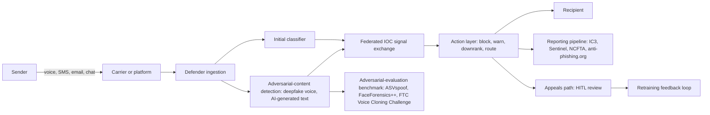

# Anti-scam messaging safety assistant

> **SAFE‑AUCA industry reference guide (draft)**
>
> This use case describes the AI **defender** workflow that detects and blocks scam messages on consumer-facing platforms: telecom voice and SMS, messaging apps and email, banking transaction-warning systems, social platforms, and dating apps. It is the first SAFE‑AUCA use case where the AI is the defender rather than the system being attacked. Scammers themselves use AI now (deepfake voice clones, AI-generated phishing text, BEC content), and 0027 maps the arms race directly.
>
> It focuses on:
>
> * how the workflow works in practice (tools, data, trust boundaries, autonomy)
> * what can go wrong (defender-friendly kill chain)
> * how it maps to **SAFE‑MCP techniques**
> * what controls + tests make it safer
>
> **Defender-friendly only:** do **not** include operational exploit steps, payloads, or step-by-step attack instructions.
> **No sensitive info:** do not include internal hostnames/endpoints, secrets, customer data, non-public incidents, or proprietary details.

---

## Metadata

| Field                | Value                                              |
| -------------------- | -------------------------------------------------- |
| **SAFE Use Case ID** | `SAFE-UC-0027`                                     |
| **Status**           | `draft`                                            |
| **Maturity**         | draft                                              |
| **NAICS 2022**       | `51` (Information)                                 |
| **Last updated**     | `2026-04-25`                                       |

### Evidence (public links)

* [FCC Declaratory Ruling FCC 24-17 on AI-generated voices in robocalls under TCPA (8 February 2024)](https://docs.fcc.gov/public/attachments/FCC-24-17A1.pdf)
* [FCC Lingo Telecom $1M Consent Decree, first STIR/SHAKEN failure for AI-cloned voices (21 August 2024)](https://www.fcc.gov/document/fcc-eb-settles-lingo-transmitting-illegal-robocalls)
* [FCC $6M Forfeiture Order against Steve Kramer for New Hampshire AI-Biden robocalls, 24-104 (26 September 2024)](https://www.fcc.gov/document/fcc-issues-6m-fine-nh-robocalls)
* [FBI IC3 2024 Internet Crime Report (859,532 complaints, $16.6B losses, $4.9B elder fraud)](https://www.ic3.gov/AnnualReport/Reports/2024_IC3Report.pdf)
* [FTC Consumer Sentinel Network 2024 Data Book (6.5M reports, $12.5B fraud losses)](https://www.ftc.gov/system/files/ftc_gov/pdf/csn-annual-data-book-2024.pdf)
* [FTC Voice Cloning Challenge winners (8 April 2024)](https://www.ftc.gov/news-events/news/press-releases/2024/04/ftc-announces-winners-voice-cloning-challenge)
* [UK Online Fraud Charter (signed 30 November 2023)](https://www.gov.uk/government/publications/online-fraud-charter-2023)
* [UK PSR PS25/5 Consolidated Policy Statement on APP scams reimbursement (May 2025; in force 7 October 2024)](https://www.psr.org.uk/media/rhelv4op/ps25-5-app-scams-reimbursement-consolidated-policy-statement-may-2025.pdf)
* [EBA and ECB Joint Report on Payment Fraud (December 2025; EUR 4.2B EEA fraud, 85% of credit-transfer scam losses borne by users)](https://www.eba.europa.eu/sites/default/files/2025-12/1709846a-84d9-47cf-86a0-b155efb34d66/EBA%20and%20ECB%20Report%20on%20Payment%20Fraud.pdf)
* [CNN: Arup revealed as victim of $25 million Hong Kong deepfake CFO video-call scam (16 May 2024 confirmation; February 2024 incident)](https://www.cnn.com/2024/05/16/tech/arup-deepfake-scam-loss-hong-kong-intl-hnk)

---

## Minimum viable write-up (Seed → Draft fast path)

This document covers:

* Executive summary
* Industry context and constraints
* Workflow and scope
* Architecture (tools, trust boundaries, inputs)
* Operating modes
* Kill-chain table (7 stages)
* SAFE‑MCP mapping table (22 techniques)
* Contributors and Version History

---

## 1. Executive summary (what + why)

**What this workflow does**
An **anti-scam messaging safety assistant** is an AI defender deployed across consumer messaging surfaces (telecom voice, SMS, email security gateways, messaging apps, banking transaction-warning systems, dating apps, and social platforms) to detect and block scam content. The defender ingests inbound messages, classifies for scam patterns, runs adversarial-content detection (deepfake voice, AI-generated phishing text), exchanges federated indicator-of-compromise (IOC) signals with peer platforms, takes action (block, warn, route to safe channel), reports verified scams to law enforcement and consumer-protection bodies (FBI IC3, FTC Consumer Sentinel, NCFTA, anti-phishing.org), and operates an appeals path for false positives.

The category exists across telecom carriers (Verizon Call Filter, AT&T ActiveArmor, T-Mobile Scam Shield, Hiya, Truecaller, Robokiller, Nomorobo), voice-deepfake detection vendors (Pindrop Pulse, Reality Defender, Daon AI.X, Nuance Gatekeeper), email-security gateways (Proofpoint, Mimecast, Microsoft Defender for Office 365, Abnormal AI), banking transaction-warning vendors (Feedzai, NICE Actimize), platform integrity teams (Meta, Reddit), and consumer fraud-monitoring services (Aura, IDX, LifeLock).

**Why it matters (business value)**
The arms race is live and visible in regulator data. The FBI IC3 2024 Annual Report counted 859,532 complaints with $16.6 billion in reported losses (up 33% year over year) and $4.9 billion in elder fraud (up 43% year over year), with phishing and spoofing the top complaint category at 193,407 reports. The FTC Consumer Sentinel Network 2024 Data Book recorded 6.5 million consumer reports and $12.5 billion in fraud losses (up 25% year over year), with imposter scams contributing $2.95 billion. The EBA and ECB Joint Report on Payment Fraud (December 2025) found EUR 4.2 billion in EEA payment fraud in 2024, with 85% of credit-transfer fraud losses borne by users (the authorised-push-payment scam pattern).

Concrete recent events shape the deployment posture. On 8 February 2024 the FCC released Declaratory Ruling 24-17 confirming that AI-generated voices fall under the TCPA's "artificial or prerecorded voice" prohibition. On 21 August 2024 the FCC entered a $1 million consent decree against Lingo Telecom for transmitting illegal AI-cloned-voice robocalls, the first STIR/SHAKEN failure tied to AI voice. On 26 September 2024 the FCC issued a $6 million forfeiture order (24-104) against Steve Kramer for the 3,000 New Hampshire AI-Biden robocalls. The Hong Kong Arup deepfake video-call incident (HK$200 million / approximately $25.6 million USD, February 2024 incident, May 2024 Arup confirmation) is the canonical recent corporate-deepfake case. On 7 October 2024 the UK Payment Systems Regulator's mandatory APP-fraud reimbursement scheme came into force, with a £85,000 cap shared 50/50 between sending and receiving payment service providers and a five-business-day reimbursement clock; the first-year reimbursement rate reached 88% (£173 million paid).

**Why it's risky / what can go wrong**
The defender frame inverts most prior SAFE‑AUCA failure modes. The primary risks include:

* **Asymmetric outcome stakes.** A false negative (missed scam) is catastrophic for the consumer, often an elder fraud victim or a romance scam target. A false positive (legitimate message blocked) raises distinct concerns about access and free expression, particularly for newcomers, immigrants, and users with non-standard communication patterns.
* **Adversarial inputs against the defending classifier.** Scam senders craft inputs to evade detection. Recent academic work (arXiv 2505.03831, "A Comprehensive Analysis of Adversarial Attacks against Spam Filters", Hotoğlu, Sen, Can) demonstrated word-substitution attacks bypassing six deep-learning spam-detection models more than 90% of the time. The defender's classifier corpus, embedding store, and feedback loops are first-order assets under attack (T2107 AI Model Poisoning via MCP Tool Training Data Contamination, T2106 Context Memory Poisoning via Vector Store Contamination, T3001 RAG Backdoor Attack).
* **Cross-platform federated signal poisoning.** When platforms share scam-IOC signals across federation (anti-phishing.org, Telecom Robocall Anti-Abuse, FS-ISAC, banking-side fraud feeds), a poisoned signal at one peer can cascade. SAFE-MCP T1701 Cross-Tool Contamination, T1003 Malicious MCP-Server Distribution, and T1707 CSRF Token Relay all apply differently here than in operator-side workflows.
* **Reg E §1005.11 APP gap.** Reg E covers UNAUTHORIZED EFTs (60-day notice, 10-business-day investigation, provisional credit). Authorised-push-payment scams (the user authorised the transfer under deception) historically fall outside §1005.11. A defender's UX must not promise Reg E reimbursement for authorised-but-deceived transfers.
* **Reporting-pipeline pressure.** Adversaries can flood IC3, Consumer Sentinel, NCFTA, and anti-phishing.org pipelines (T2102 Service Disruption via External API Flooding) or downgrade their OAuth (T1408 OAuth Protocol Downgrade) to drown legitimate signal.
* **Tipping-off-style constraints.** CSAM and victim-protection rules apply at the reporting boundary. The platform's user-facing surfaces should not inform the suspected scam sender that a report has been filed.
* **Vendor-self-report vs independent benchmark.** Vendor accuracy claims (Pindrop Pulse cites 99% on known engines and over 90% on unseen, with a 96.4% NPR study; Truecaller cites "fastest most accurate" framing in their 28 May 2024 launch) are commonly paired with independent benchmarks (ASVspoof 5 with 1,044,846 utterances and 32 attack algorithms; FaceForensics++; FTC Voice Cloning Challenge winners AI Detect, DeFake, OriginStory, with Pindrop Security receiving a recognition-only award due to company-size ineligibility).

These failure modes drive the controls posture: layered detection across modalities (voice, text, transaction patterns), independent benchmarking on adversarial-aware datasets, signed federated-signal exchange with provenance, conservative reporting-pipeline egress controls, false-positive appeal paths, and an honest narrative about both the regulatory gaps (Reg E APP) and the regulatory wins (UK PSR APP reimbursement).

---

## 2. Industry context and constraints (reference-guide lens)

### Where this shows up

Common in:

* **telecom carriers** with carrier-side spam screening (Verizon Call Filter, AT&T ActiveArmor, T-Mobile Scam Shield, Hiya Protect powering Samsung Smart Call and AT&T Call Protect)
* **third-party telecom anti-scam apps** (Truecaller, Robokiller, Nomorobo)
* **voice-deepfake detection vendors** at the contact-center boundary (Pindrop Pulse, Reality Defender, Daon AI.X, Nuance Gatekeeper)
* **email security gateways** (Proofpoint, Mimecast, Microsoft Defender for Office 365, Abnormal AI for BEC behavioural analysis)
* **banking transaction-warning vendors** (Feedzai, NICE Actimize for APP-fraud detection)
* **platform integrity teams** at messaging and social platforms (Meta integrity, Reddit Anti-Evil Operations)
* **consumer fraud-monitoring services** (Aura, IDX, LifeLock, Cisco Talos for threat intel)
* **regulator reporting infrastructure** as a downstream consumer (FBI IC3, FTC Consumer Sentinel, NCFTA, anti-phishing.org)

### Typical systems

* **Inbound message ingestion** across voice, SMS, email, chat, and social DMs.
* **Initial classification** (scam / not-scam) on text, audio, and metadata features.
* **Adversarial-content detection** for deepfake voice, AI-generated text, and AI-generated images.
* **Federated signal exchange** with peer platforms for IOC sharing.
* **Action layer** (block, warn, downrank, route to safe channel, hold for review).
* **Reporting pipeline** to IC3, Consumer Sentinel, NCFTA, anti-phishing.org, and platform-internal trust-and-safety queues.
* **Appeals and false-positive remediation** with human review.
* **Observability and red-team harness** for continuous adversarial evaluation.

### Constraints that matter

* **FCC Declaratory Ruling FCC 24-17 (8 February 2024).** TCPA's "artificial or prerecorded voice" prohibition expressly covers AI-generated voices. Defenders ingest STIR/SHAKEN attestation levels (A, B, C) as positive signals.
* **STIR/SHAKEN under 47 CFR Part 64 Subpart HH** with the FCC Robocall Mitigation Database. Voice service providers carry KYC and Know Your Upstream Provider (KYUP) duties.
* **FCC enforcement precedent.** The Lingo Telecom $1 million consent decree (21 August 2024) is the first STIR/SHAKEN failure tied to AI-cloned voices. The Steve Kramer $6 million forfeiture order (Forfeiture Order 24-104, 26 September 2024) is the largest single robocall forfeiture against an AI-Biden campaign. The Lingo decree introduced a first-of-kind compliance plan covering KYC, KYUP, 15-day non-compliance reporting, and a dedicated STIR/SHAKEN-knowledgeable senior manager.
* **FTC Telemarketing Sales Rule, 16 CFR Part 310.** §310.3 deceptive acts and §310.4 abusive acts supply the taxonomy a defender's classifier should mirror. The 2024 amendments extended record-keeping and B2B coverage.
* **FTC Voice Cloning Challenge methodology (April 2024).** Cash-prize winners AI Detect (OmniSpeech), DeFake (Washington University in St. Louis, Ning Zhang), and OriginStory; Pindrop Security received a recognition award (ineligible for cash prize due to company size). The challenge surfaced approaches (watermarking, biosignal capture at recording, real-time two-second-window inference), not certified methods.
* **CFPB Reg E §1005.11.** Covers UNAUTHORISED EFTs. 60-day notice, 10-business-day investigation (extendable to 45 calendar days, or 90 for new accounts, point-of-sale, or foreign-initiated transfers), and provisional credit within 10 business days. **APP-style "you authorised it under deception" scams have historically fallen outside §1005.11.** A defender's UX should not promise Reg E reimbursement for authorised-but-deceived transfers.
* **UK Online Fraud Charter (signed 30 November 2023).** Voluntary commitments by 12 platforms (Amazon, eBay, Meta, Google, Instagram, LinkedIn, Match Group, Microsoft, Snapchat, TikTok, X, YouTube) on verification, reporting, and removal.
* **UK PSR mandatory APP reimbursement.** In force 7 October 2024 under Specific Direction SD20. £85,000 cap shared 50/50 between sending and receiving payment service providers, five-business-day reimbursement clock, £100 sending-PSP excess (waived for vulnerable consumers). First-year reimbursement rate 88% (£173 million paid). Consolidated policy statement PS25/5 (May 2025).
* **EBA and ECB Joint Payment Fraud Report (December 2025).** EUR 4.2 billion EEA fraud in 2024, with 85% of credit-transfer fraud losses borne by users from scams.
* **EBA Opinion on new types of payment fraud (29 April 2024).** Three categories: payer manipulation (impersonation scams), mixed social-engineering and technical, and payee manipulation.
* **EU DSA Article 17 (statement of reasons).** When the defender suppresses or demotes a message on a hosted platform integration, Article 17 requires a clear, language-appropriate, durable statement of reasons covering the action, its facts, and whether automated means were used. The DSA Transparency Database publishes these.
* **EU DSA Article 22 (trusted flaggers).** A scam-defender can apply for trusted-flagger status with a Digital Services Coordinator, forcing priority handling of scam notices on platforms.
* **OWASP LLM Top 10 (2025).** LLM01 prompt injection covers scam content crafted to manipulate the defender's classifier; LLM02 sensitive information disclosure covers leakage through prompts or logs; LLM09 misinformation covers confident misclassification.
* **MITRE ATLAS (v5.4.0, 16 tactics, 84 techniques).** AML.T0051 LLM Prompt Injection (direct and indirect) and broader evasion tactics.
* **NIST AI RMF 1.0 plus AI 600-1 GenAI Profile (26 July 2024).** Information integrity, confabulation, information security, and value-chain risks all apply.
* **ISO/IEC 42001:2023.** First international AI management system standard. Annex A controls on AI policy, impact assessment, third-party data, and lifecycle management.
* **18 USC §1029 (access device fraud), §1343 (wire fraud), §1349 (attempt and conspiracy).** The federal statutes scams are most often charged under. Evidence preservation by the defender is prosecutorially valuable.
* **C2PA Content Credentials 2.2.** A positive signal (declared provenance), not evidence of fraud in absence. ChatGPT and DALL-E 3 already embed C2PA.

### Must-not-fail outcomes

* a defender that confidently mis-classifies a deepfake voice clone as a legitimate caller and lets a fraud-induced wire transfer proceed
* a false-positive block of a legitimate sender with no working appeal path, particularly for newcomers, immigrants, or non-standard communication patterns
* a poisoned federated IOC signal cascading across many peer platforms simultaneously
* a defender that promises Reg E reimbursement for authorised-but-deceived transfers (the APP gap)
* a CSAM or victim-protection report tipping off the suspected scam sender via a user-facing surface
* exfiltration of victim PII via the defender's explanation text or appeal artefacts (T1910 Covert Channel Exfiltration)
* reporting-pipeline degradation that drowns legitimate signal under adversarial flooding (T2102)
* vendor-marketing accuracy claims relied on as if they were independent benchmarks

---

## 3. Workflow description and scope

### 3.1 Workflow steps (happy path)

1. An inbound message arrives across voice, SMS, email, chat, or social DM. The carrier or platform routes it through the defender pipeline.
2. The defender ingests the message and metadata (sender, ASR transcript, headers, attestation level, prior-history features).
3. The initial classifier scores scam likelihood across multiple signal classes (text features, audio features, behavioural patterns, network IOCs).
4. Adversarial-content detection runs in parallel (voice-deepfake detection, AI-generated-text detection, brand-impersonation matching, link analysis).
5. Federated IOC signals are queried from peer platforms (and contributed back if confidence is high).
6. The action layer decides: block, warn the recipient, downrank, route to safe channel, hold for human review, or pass through.
7. If the message is verified scam and reportable, the reporting pipeline routes structured artefacts to FBI IC3 (for cyber-fraud), FTC Consumer Sentinel, NCFTA (for industry-shared signal), and anti-phishing.org (for phishing-specific takedown).
8. If the recipient or sender disputes the action, the appeals path opens with data-minimised intake and human review, and the model gets retraining feedback.

### 3.2 In scope and out of scope

* **In scope:** detection and blocking of scam messages on consumer-facing surfaces; federated IOC signal exchange with peer platforms; reporting to law enforcement and consumer-protection bodies; appeals and false-positive remediation; defender adversarial-evaluation harness.
* **Out of scope:** seizure of scammer assets (law-enforcement function); criminal prosecution (DOJ); banking-side reimbursement decisioning under Reg E or UK PSR (a separate workflow with its own rules); chat-based negotiation with active scammers; automated counter-attack against scam infrastructure.

### 3.3 Assumptions

* The defender is the regulated entity's processor. The user (recipient) is the data subject. The carrier or platform is the controller.
* Inbound messages are untrusted by default. Sender attestation (STIR/SHAKEN) is a positive signal, not a guarantee.
* False-positive harm is real and bounded by an appeals path. A working appeal is a primary control.
* Federated IOC signals carry provenance and signature. Unsigned signals are dropped.
* Reg E §1005.11 covers unauthorised EFTs only. The defender's UX never promises Reg E reimbursement for authorised-but-deceived transfers.
* CSAM and victim-protection reports flow under tipping-off-style constraints. User-facing surfaces never reflect that a report has been filed.

### 3.4 Success criteria

* False-negative rate on adversarial-aware test sets is published and reviewed continuously.
* False-positive rate paired with appeal-resolution time as a regulatory metric (DSA Article 17 effective).
* Demographic-bias regression on every classifier update.
* Federated IOC signal integrity holds under replay, rogue-issuer, and scope-downgrade testing.
* Reporting pipeline integrity holds under adversarial flooding.
* The defender's UX honestly distinguishes regulated-disclosure surfaces (Reg E unauthorised EFT vs PSR APP regime vs unregulated transfer).
* Vendor self-report metrics are paired with independent benchmark results in any consumer-facing claim.

---

## 4. System and agent architecture

### 4.1 Actors and systems

* **The recipient (consumer).** The user the defender protects. Often a vulnerable target (elder, recent loss, immigrant). The data subject under privacy law.
* **The scam sender.** External, untrusted, increasingly using AI (deepfake voice, AI-generated text, automated social engineering).
* **The carrier or platform.** The regulated entity (telecom, email provider, social platform, bank). Operates the defender pipeline.
* **The defender vendor.** Processor or subprocessor (Hiya, Pindrop, Proofpoint, Feedzai). Sells detection capabilities.
* **Federated peer.** Other platforms exchanging IOC signals (anti-phishing.org members, Telecom Robocall Anti-Abuse, FS-ISAC).
* **Reporting endpoint.** FBI IC3, FTC Consumer Sentinel, NCFTA, anti-phishing.org.
* **Law enforcement.** FBI Operation Level Up (8,103 victims notified, $511 million estimated savings, 77% unaware they were being scammed at notification time), state AGs, international peers.

### 4.2 Trusted vs untrusted inputs (high value, keep simple)

| Input/source                              | Trusted?          | Why                                                                  | Typical failure/abuse pattern                                                                                              | Mitigation theme                                                                  |
| ----------------------------------------- | ----------------- | -------------------------------------------------------------------- | -------------------------------------------------------------------------------------------------------------------------- | --------------------------------------------------------------------------------- |
| Inbound voice / SMS / email / chat        | Untrusted         | external; the primary attack surface                                  | adversarial evasion (word substitution, audio perturbation); deepfake voice; AI-generated phishing text                     | adversarial-aware classifier; layered detection; ASVspoof-grade independent benchmark |
| STIR/SHAKEN attestation                   | Semi-trusted      | issuer-attested but only as strong as upstream KYC                   | rogue carrier accepting AI-cloned-voice traffic (Lingo precedent)                                                          | KYUP duty; attestation-level weighting; FCC Mitigation Database cross-check        |
| Federated IOC signal from peer platform   | Semi-trusted      | platform-curated but exchange is the attack surface                  | poisoned signal cascade (T1701, T1003); rogue peer impersonation (T1306, T1407)                                            | signed signals; per-issuer integrity baseline; replay detection; expiry            |
| Vendor classifier model                   | Semi-trusted      | platform-trained or vendor-supplied                                  | training-data poisoning (T2107); model drift; unfair demographic distribution                                              | adversarial-aware retraining; demographic-bias regression; signed model artefacts  |
| Vector store of scam patterns             | Semi-trusted      | platform-curated; updated via feedback loop                          | embedding poisoning (T2106) by attacker-crafted reports                                                                   | per-tenant index; embedding integrity; on-write redaction                          |
| User-supplied appeal evidence             | Untrusted         | external; may include further injection                              | injection in appeal text; PII over-collection                                                                              | structured-output appeals schema; data-minimised intake                            |
| Reporting-pipeline OAuth tokens           | Trusted at rest   | issued by IC3, Consumer Sentinel, NCFTA                             | OAuth downgrade (T1408); persistent token abuse (T1202)                                                                    | short-lived tokens; FIDO2 step-up; egress control                                  |
| Defender's own logs and explanations      | Semi-trusted      | system-generated but may leak                                        | covert exfiltration via explanation text (T1910); parameter exfil (T1911)                                                  | redaction at write time; tipping-off-aware content scanner                         |
| LLM-generated classifier reasoning        | Untrusted         | probabilistic; may hallucinate or be manipulated                     | response tampering (T1404); confident misclassification (T2105)                                                            | structured-output schema; human-in-the-loop on high-stakes actions                 |

### 4.3 Trust boundaries (required)

Key boundaries practitioners commonly model explicitly:

1. **The defender-as-defender boundary.** The defender's classifier path is the asset adversaries attack. Most prior SAFE‑AUCA UCs treat the AI as a target tool; 0027 treats the AI as a system being evaded. The trust posture flips: input content is hostile by default, and the defender's own model and corpus are the assets to protect.
2. **The asymmetric-outcome boundary.** False-negative harms (consumer scam loss, often elder fraud) and false-positive harms (legitimate access denied, free-expression chill) carry different stakes. Both commonly hold thresholds with documented review.
3. **The federated-IOC boundary.** Signals exchanged across platforms carry provenance, signature, and expiry. Unsigned signals are dropped. Peers can be revoked.
4. **The reporting-pipeline integrity boundary.** IC3, Consumer Sentinel, NCFTA, and anti-phishing.org accept structured artefacts under integrity controls. Adversaries flooding the pipeline (T2102) or downgrading its OAuth (T1408) is a real threat.
5. **The tipping-off boundary.** CSAM and victim-protection reports flow without informing the suspected sender via any user-facing surface.
6. **The Reg E §1005.11 boundary.** The defender's UX never represents Reg E reimbursement for authorised-but-deceived transfers. This is a regulatory accuracy boundary, not a technical one.
7. **The vendor-claim vs independent-benchmark boundary.** Vendor accuracy figures (Pindrop, Truecaller) are paired with independent results (ASVspoof, FaceForensics++, FTC Voice Cloning Challenge) before any consumer-facing claim.

### 4.4 High-level flow (illustrative)

### 4.5 Tool inventory (required)

Typical tools and services (names vary by deployment):

| Tool / service                              | Read / write? | Permissions                                       | Typical inputs                            | Typical outputs                                    | Failure modes                                                                  |
| ------------------------------------------- | ------------- | ------------------------------------------------- | ----------------------------------------- | -------------------------------------------------- | ------------------------------------------------------------------------------ |
| `inbound.intake`                            | read          | session-scoped                                    | voice/SMS/email/chat plus metadata        | normalised message envelope                       | injection at ingestion; ASR mis-transcription                                   |
| `classifier.scam`                           | read          | session-scoped                                    | message envelope                          | scam likelihood + feature attribution             | adversarial evasion; demographic bias                                          |
| `deepfake.voice.detect`                     | read          | session-scoped                                    | audio sample                              | synthetic-voice score + confidence interval        | unseen-engine generalisation; presentation attack                              |
| `text.aigc.detect`                          | read          | session-scoped                                    | text content                              | AI-generated likelihood                           | LLM-generated text mimicking authentic style                                   |
| `federated.ioc.query`                       | read          | issuer-attested                                   | IOC fingerprint                           | peer-platform attestations                        | rogue issuer; replayed signal; scope downgrade                                 |
| `federated.ioc.contribute`                  | write         | per-tenant; signed                                | IOC plus context                          | acknowledgement                                    | poisoned contribution; over-broad blast radius                                 |
| `action.block` / `action.warn` (HITL gated) | write         | platform-scoped; appeal-aware                      | message ID + decision                     | applied action + audit trail                      | false-positive harm; unappealable block                                        |
| `report.ic3.submit`                         | write         | regulator-defined                                  | structured fraud report                   | IC3 report ID                                      | mis-routing; over-collection of PII                                            |
| `report.sentinel.submit`                    | write         | regulator-defined                                  | structured fraud report                   | Sentinel record                                    | over-aggregation hiding violations                                             |
| `report.ncfta.submit`                       | write         | industry-shared                                    | IOC and pattern                           | NCFTA acknowledgement                              | tipping-off via metadata                                                        |
| `appeal.intake` (HITL)                      | read/write    | data-minimised                                     | user statement + minimal evidence         | appeal record + outcome                            | over-collection on appeal; queue starvation                                    |
| `evaluation.adversarial`                    | read/write    | service account                                    | adversarial-aware test set                | regression metrics + bias breakdown                | benchmark drift; non-representative test set                                   |
| `audit.export` (regulator request)          | read          | gated; legal-hold                                  | timeframe, query                          | audit bundle                                       | over-exposure; tipping-off in retrieval                                         |

### 4.6 Sensitive data and policy constraints

* **Data classes:** message content (voice, text), sender and recipient identifiers (PSTN number, email, account ID), STIR/SHAKEN attestation logs, federated IOC fingerprints, user appeal evidence, victim PII, financial-transaction context (where banking integrations apply).
* **Retention and logging:** subject to FCC, telecom, banking, GDPR, CCPA, and sector retention rules. Reporting-pipeline artefacts (IC3, Sentinel) commonly retained for prosecutorial and audit purposes.
* **Regulatory constraints:** TCPA (47 USC §227) and FCC declaratory ruling 24-17 on AI voices; STIR/SHAKEN under 47 CFR Part 64 Subpart HH; FTC TSR (16 CFR Part 310); CFPB Reg E §1005.11 (unauthorised EFTs only); UK PSR PS25/5 (APP reimbursement, in force 7 October 2024); EBA Opinion 2024 and PSD3/PSR direction of travel; EU DSA Articles 17 and 22; 18 USC §1029, §1343, §1349; ISO/IEC 42001 AIMS controls.
* **Safety/consumer-harm constraints:** false-negative releases consumer harm; false-positive denies legitimate access; federated-signal poisoning cascades across peers; tipping-off undermines law enforcement; over-collection on appeal violates data minimisation; vendor-claim overreach exposes UDAAP risk.

---

## 5. Operating modes and agentic flow variants

### 5.1 Manual baseline (no AI defender)

Carrier-level rules ("do not connect calls without consent" + classic spam filter), email-server heuristics, banking transaction-flag rules, manual moderator review of flagged content. Existing controls include user-reported takedowns, regulator-issued blocklists, and contact-center handoff for verification questions. Errors are caught by user reports, regulator examination, and after-the-fact prosecution. Many errors are latent until the consumer is harmed.

### 5.2 Human-in-the-loop (HITL / sub-autonomous)

The defender automatically classifies and acts on high-confidence cases (clear robocalls, brand-impersonation phishing, known scam infrastructure) while routing edge cases to human moderators. Banking transaction-warning vendors (Feedzai, NICE Actimize) commonly inject "are you sure?" friction at high-risk transfers. Appeals paths are human-staffed. Risk profile: bounded when the human review is genuine; the dominant failure mode is **silent over-reliance** during high-volume periods plus consent-fatigue in the warning UX.

### 5.3 Fully autonomous (end-to-end agentic, guardrailed)

Selected sub-workflows operate without per-decision approval: high-confidence call blocking, automated phishing-URL takedown via anti-phishing.org, structured Sentinel/IC3 reporting, federated IOC contribution within signed bounds, autonomous retraining-feedback ingestion. Customer-facing autonomous fund recovery is not safe to fully automate; banking-side reimbursement remains regulator-bounded. Guardrails commonly applied: appeals path human-staffed, false-positive rate capped per cohort, kill switch reverts to HITL.

### 5.4 Variants

A safe decomposition pattern separates components:

1. **Ingestion** (per-modality intake with metadata normalisation).
2. **Initial classifier** (text plus audio plus behavioural features).
3. **Adversarial-content detector** (deepfake voice, AI-generated text, deepfake image).
4. **Federated-signal handler** (signed exchange with peers).
5. **Action layer** (block, warn, route, hold for review).
6. **Reporting pipeline** (IC3, Sentinel, NCFTA, anti-phishing.org).
7. **Appeals queue** (data-minimised HITL review).
8. **Retraining feedback** (structured + adversarial-aware).
9. **Adversarial-evaluation harness** (ASVspoof, FaceForensics++, FTC Voice Cloning Challenge methodology).

Each component carries its own kill switch, validation set, and incident playbook.

---

## 6. Threat model overview (high-level)

### 6.1 Primary security and safety goals

* keep false-negative rate below documented thresholds, with adversarial-aware evaluation
* keep false-positive rate bounded by an appeals path with documented turnaround
* preserve federated-IOC signal integrity under replay, rogue-issuer, and scope-downgrade
* preserve reporting-pipeline integrity under adversarial flooding
* preserve tipping-off-style confidentiality on CSAM and victim-protection paths
* maintain demographic-bias bounds across populations, particularly vulnerable cohorts
* maintain a regulator-accurate UX (no Reg E §1005.11 promises for APP-style scams)

### 6.2 Threat actors (who might attack or misuse)

* **Adversarial scam sender.** Crafts inputs to evade detection. Increasingly uses AI: deepfake voice (Hong Kong Arup pattern), AI-generated phishing text, automated brand impersonation, AI-Biden-style cloned voices.
* **Compromised peer or rogue federated issuer.** Contributes poisoned IOC signals (T1003, T1306, T1407, T1701).
* **Insider with platform access.** Misuses the defender to surveil specific users or to falsely escalate enemies' messages as scam.
* **Reporting-pipeline disruptor.** Floods IC3, Sentinel, NCFTA endpoints (T2102) or downgrades OAuth (T1408).
* **Adversarial-ML researcher (and adversary using the research).** Word-substitution and audio-perturbation attacks at evaluation time. arXiv 2505.03831 demonstrates more than 90% bypass against multiple deep-learning spam-detection models.
* **Consumer attempting to manipulate the appeals path.** Submits crafted appeals to release a legitimate block, or to suppress an inconvenient detection.

### 6.3 Attack surfaces

* inbound message content (voice, text) and metadata
* federated-IOC signal exchange (signing, expiry, scope)
* the defender's own classifier corpus, embedding store, and feedback loops
* reporting-pipeline OAuth tokens and submission paths
* appeal-intake schema and UX
* model artefacts (training data, fine-tuned weights, registry of evaluations)
* observability traces and explanation text
* vendor-supplied detector tools (rug-pull risk, T1201)

### 6.4 High-impact failures (include industry harms)

* **Consumer harm:** elder fraud loss after a deepfake voice clone is mis-classified as authentic; romance scam loss after an AI-generated profile evades detection; pig-butchering loss after federated IOCs lag the active campaign; legitimate sender unfairly blocked with no appeal path.
* **Business harm:** UDAAP enforcement (FTC Section 5) on misleading vendor accuracy claims; FCC consent-decree exposure (Lingo precedent) on STIR/SHAKEN failure; PSR enforcement (UK) on APP-fraud reimbursement timelines; DSA Article 17 enforcement on insufficient statement-of-reasons; reputational damage when a public AI-voice incident reveals defender gaps.
* **Security harm:** reporting-pipeline OAuth compromise enabling lateral movement into law-enforcement systems (rare but consequential); cross-platform federated-signal poisoning cascading across many peers; classifier-corpus poisoning that persists across retraining cycles.

---

## 7. Kill-chain analysis (stages → likely failure modes)

> Keep this defender-friendly. Describe patterns, not "how to do it."

| Stage                                                                  | What can go wrong (pattern)                                                                                                                                                   | Likely impact                                                                                          | Notes / preconditions                                                                                                                          |
| ---------------------------------------------------------------------- | ----------------------------------------------------------------------------------------------------------------------------------------------------------------------------- | ------------------------------------------------------------------------------------------------------ | ---------------------------------------------------------------------------------------------------------------------------------------------- |
| 1. Inbound message intake                                              | Malicious payloads in ingestion handlers; ASR mis-transcription that introduces injection text; metadata spoofing                                                              | downstream classifier sees corrupted input                                                              | the entry point for every subsequent failure mode                                                                                              |
| 2. Initial classification (**NOVEL: defender frame**)                  | Adversarial inputs evading the classifier (word substitution, audio perturbation); response tampering at output; sampling-request abuse                                        | scam slips through; or legitimate sender false-blocked                                                | first SAFE‑AUCA UC where the AI is the system being evaded; arXiv 2505.03831 shows over 90% bypass on deep-learning spam filters                |
| 3. Adversarial-content detection (**NOVEL: deepfake voice + AI-generated text**) | Deepfake voice clone (Hong Kong Arup pattern) bypassing the detector; AI-generated phishing text mimicking authentic style; image deepfakes evading watermark check          | consumer harm at scale; vendor accuracy claims exposed                                                 | ASVspoof 5 and FaceForensics++ are the independent benchmarks; FTC Voice Cloning Challenge methods (watermarking, biosignal) inform mitigation |
| 4. Cross-platform federated IOC signal exchange (**NOVEL vs 0030**)    | Poisoned IOC contribution cascades across peers; rogue issuer impersonates legitimate platform; replay or scope downgrade                                                      | many platforms simultaneously mis-classify; trust in federation erodes                                  | distinct from 0030's federated user attributes (here we share adversary signals, not user attributes)                                          |
| 5. Block / warn / route action (**NOVEL: false-positive harm**)        | False-positive block of legitimate sender; consent-fatigue eroding "are you sure?" friction; non-symmetric appeal vs block paths                                              | access denial; free-expression chill; UDAAP exposure                                                   | the safety vs access tension is unique to the defender frame                                                                                   |
| 6. Reporting pipeline                                                  | Adversarial flooding of IC3, Sentinel, NCFTA, anti-phishing.org; OAuth downgrade or token persistence; tipping-off via metadata in submitted reports                          | regulatory non-compliance; report-pipeline degradation; potential re-victimisation                     | analogous to AML SAR confidentiality in 0015 and CSAM reporting in 0030, but with consumer-protection scope                                    |
| 7. Appeals and false-positive remediation                              | Over-collection of PII on appeal intake; appeal-evidence injection; queue starvation; tampering with appeals records to hide false negatives                                  | appeals become unfair or untrustworthy; data-minimisation violations                                   | a working appeal path is itself a control surface, not just a remediation channel                                                              |

**Cross-UC novelty callouts.** Stages 2 and 3 (defender frame for initial classification and adversarial-content detection) are novel against every prior UC because no sibling treats the AI as the system being evaded by adversarial inputs; SAFE-MCP T1102, T1402, T1404, T2105 apply to the defender's classifier path rather than to operator workflows. Stage 4 (federated IOC exchange) is novel against 0030 because the data shared is adversary signals, not user attributes; the trust-boundary assumptions differ. Stage 5 (false-positive harm) is novel because the safety vs access tension is the defining trade-off for the defender posture.

---

## 8. SAFE‑MCP mapping (kill-chain → techniques → controls → tests)

> Goal: make SAFE‑MCP actionable in this workflow. The defender frame reframes existing tactics rather than inventing new ones; closest-fit SAFE‑T IDs are noted.

| Kill-chain stage                                  | Failure/attack pattern (defender-friendly)                                                                                                                  | SAFE‑MCP technique(s)                                                                                                                                                                                              | Recommended controls (prevent/detect/recover)                                                                                                                                                                                                                                                | Tests (how to validate)                                                                                                                                                                                              |
| ------------------------------------------------- | ----------------------------------------------------------------------------------------------------------------------------------------------------------- | ------------------------------------------------------------------------------------------------------------------------------------------------------------------------------------------------------------------ | ------------------------------------------------------------------------------------------------------------------------------------------------------------------------------------------------------------------------------------------------------------------------------------------- | -------------------------------------------------------------------------------------------------------------------------------------------------------------------------------------------------------------------- |
| 1. Inbound message intake                          | Malicious payload in handler; ASR-introduced injection; metadata spoofing                                                                                    | `SAFE-T1101` (Command Injection); `SAFE-T1102` (Prompt Injection (Multiple Vectors))                                                                                                                              | sandboxed ingestion; metadata schema validation; ASR confidence thresholds; quoted-isolation of message content in any agent prompt                                                                                                                                                          | injection-fixture corpus on every modality; metadata fuzz                                                                                                                                                            |
| 2. Initial classification                          | Adversarial evasion (word substitution, audio perturbation); response tampering at classifier output; sampling-request abuse                                  | `SAFE-T1102`; `SAFE-T1402` (Instruction Stenography - Tool Metadata Poisoning); `SAFE-T1404` (Response Tampering); `SAFE-T1112` (Sampling Request Abuse); `SAFE-T1401` (Line Jumping)                              | adversarial-aware retraining; structured-output schema; confidence-interval reporting; sampling-parameter pinning; metadata sanitiser scrubs zero-width and HTML-comment vectors                                                                                                              | arXiv 2505.03831-style adversarial-attack regression set; signed model-artefact integrity                                                                                                                            |
| 3. Adversarial-content detection                   | Deepfake voice clone bypass; AI-generated text mimicking authentic style; deepfake image evading watermark check; classifier corpus poisoning                | `SAFE-T2105` (Disinformation Output); `SAFE-T2107` (AI Model Poisoning via MCP Tool Training Data Contamination); `SAFE-T2106` (Context Memory Poisoning via Vector Store Contamination); `SAFE-T3001` (RAG Backdoor Attack) | ASVspoof 5 and FaceForensics++ benchmark integration; FTC Voice Cloning Challenge methodology (watermarking, biosignal-at-recording, real-time inference); training-data provenance; embedding integrity baseline; C2PA Content Credentials as positive signal                                  | NIST-style independent benchmark on every estimator update; embedding-poisoning fixture; C2PA verifier regression                                                                                                  |
| 4. Cross-platform federated IOC signal exchange   | Poisoned IOC contribution; rogue issuer impersonation; replay or scope downgrade; cross-tool contamination across peer pipelines                              | `SAFE-T1701` (Cross-Tool Contamination); `SAFE-T1003` (Malicious MCP-Server Distribution); `SAFE-T1301` (Cross-Server Tool Shadowing); `SAFE-T1604` (Server Version Enumeration); `SAFE-T1707` (CSRF Token Relay) | issuer allowlist with cryptographic signature verification; signed attestations with short expiry; per-issuer integrity baseline; replay protection; CSRF-aware peer authentication; revocation feed                                                                                          | rogue-issuer fixture; replay-attack tests; expired-attestation acceptance tests; cross-peer pivot simulation                                                                                                       |
| 5. Block / warn / route action                     | False-positive block of legitimate sender; consent-fatigue eroding warning friction; tampered verdict at user-facing surface                                  | `SAFE-T1404` (Response Tampering); `SAFE-T2105` (Disinformation Output)                                                                                                                                            | structured action records with audit trail; consent-fatigue cool-down on repeat warnings; appeal symmetry (appeal at least as easy as block); demographic-fairness regression on action distribution                                                                                          | scripted appeal vs block A/B comparison; demographic-fairness audit; consent-fatigue replay (rapid-fire warnings)                                                                                                  |
| 6. Reporting pipeline                              | Adversarial flooding of IC3, Sentinel, NCFTA; OAuth downgrade and token persistence on pipeline credentials; tipping-off via metadata; bulk PII harvest      | `SAFE-T2102` (Service Disruption via External API Flooding); `SAFE-T1408` (OAuth Protocol Downgrade); `SAFE-T1202` (OAuth Token Persistence); `SAFE-T1502` (File-Based Credential Harvest); `SAFE-T1801` (Automated Data Harvesting); `SAFE-T1601` (MCP Server Enumeration); `SAFE-T1602` (Tool Enumeration) | rate-limit on submissions; short-lived OAuth with FIDO2 step-up; egress controls on pipeline plane; tipping-off content scanner on submitted artefacts; per-tenant report quotas; KMS-backed credential storage                                                                                | flooding simulation against staging IC3/Sentinel mocks; OAuth-downgrade test; token-replay attempt; bulk-export anomaly detection                                                                                  |
| 7. Appeals and false-positive remediation          | Over-collection of PII on appeal intake; injection in appeal text; queue starvation; tampering with appeal records to hide false negatives                  | `SAFE-T2101` (Data Destruction); `SAFE-T1910` (Covert Channel Exfiltration); `SAFE-T2103` (Code Sabotage via Malicious Agentic Pull Request)                                                                       | data-minimised intake schema; structured-output appeals; tamper-evident audit trail on appeal records; rate-limit per user to prevent starvation; HITL review with documented turnaround; on-write redaction in explanation text                                                              | appeal-intake schema audit; injection-in-appeal regression; tamper-evidence verification; turnaround-time SLA monitor                                                                                              |

Horizontal risks spanning several stages: `SAFE-T1001` (Tool Poisoning Attack (TPA)) and `SAFE-T1006` (User-Social-Engineering Install (Improved)) at the vendor connector and operator host; `SAFE-T1201` (MCP Rug Pull Attack) on trusted scam-feed providers that quietly mutate after vetting.

**Framework gap note.** SAFE-MCP does not yet publish dedicated technique IDs for the **defender-AI evasion** class (closest fits: T1102, T1402, T1404 applied to the defender's classifier path), the **federated IOC exchange** trust-boundary class (closest fits: T1701, T1003, T1707), or the **false-positive-harm** failure class (closest fits: T1404, T2105 read as "wrong-classification harm"). The MITRE ATLAS adversarial-ML catalogue (v5.4.0, AML.T0051 LLM Prompt Injection plus broader evasion tactics) is the complementary reference. Contributors expanding the SAFE-MCP catalogue may find these three gaps worth filling.

---

## 9. Controls and mitigations (organized)

### 9.1 Prevent (reduce likelihood)

* **Adversarial-aware retraining.** Training pipeline integrates the latest adversarial-attack research (arXiv 2505.03831 word-substitution, ASVspoof 5 audio attacks, FaceForensics++ visual deepfake corpora) on every model update.
* **Independent benchmarking on every estimator.** Vendor self-report metrics are paired with NIST-grade and challenge-grade independent benchmarks before any consumer-facing accuracy claim.
* **Layered detection across modalities.** Voice deepfake detection plus AI-generated-text detection plus behavioural features plus network IOCs. No single signal class is load-bearing.
* **STIR/SHAKEN attestation as positive signal.** Voice-side defenders ingest attestation level (A, B, C) per FCC Robocall Mitigation Database and weight accordingly; KYC plus KYUP duties cascade upstream via consent-decree precedent (Lingo Telecom).
* **Federated IOC signing.** Peer signals carry signature, expiry, scope. Unsigned signals are dropped. Per-issuer integrity baselines detect drift.
* **Tipping-off-aware reporting.** CSAM and victim-protection submissions flow under tipping-off-style content scanners; user-facing surfaces never reflect that a report has been filed.
* **Reg E accuracy in UX.** The defender's UX never represents Reg E reimbursement for authorised-but-deceived transfers. UK-jurisdiction surfaces correctly invoke PSR PS25/5.
* **Vendor-claim discipline.** Marketing copy distinguishes vendor self-reports from independent benchmarks. The Klarna AI-to-human reversal arc (cited in 0002) is the structural reminder of why this matters.
* **Consent-fatigue cool-downs.** Warning UIs apply cool-downs between repeat prompts and explicit-scope re-prompts after rapid sequences.
* **HITL on irreversible action.** Human review on any account-closure or persistent-block, with documented turnaround.

### 9.2 Detect (reduce time-to-detect)

* **False-negative regression** on adversarial-aware test sets per release.
* **False-positive rate** paired with appeal-resolution time as a regulatory metric.
* **Demographic-bias monitoring** on every classifier update across populations including elder, immigrant, non-English, and disabled cohorts.
* **Federated-signal anomaly detection.** Replay rejects, expired-signal rejects, rogue-issuer rejects, scope-downgrade attempts.
* **Reporting-pipeline integrity monitoring.** Throughput baselines against IC3, Sentinel, NCFTA, anti-phishing.org. Spike alerting.
* **Vector-store integrity drift** on the scam-pattern store and review-corpus embedding store.
* **Vendor-claim audit.** Periodic sampling of consumer-facing accuracy claims against independent-benchmark results.

### 9.3 Recover (reduce blast radius)

* **Kill switches per layer:** ingestion, classifier, adversarial-content detector, federated handler, action layer, reporting pipeline, appeals queue. Each can be disabled independently.
* **Mass re-evaluate path** when a poisoned classifier corpus or rogue federated peer is identified.
* **Signal revocation** for compromised peers, with cascade unwind across dependent platforms.
* **Working appeal at every block,** with data-minimised intake and human review.
* **Graceful degradation.** When a detector is unavailable, the defender escalates to a more-conservative posture (hold-for-review beats false-positive auto-block, but auto-pass is also unsafe; the tunable is documented).
* **Regulator-cooperation export.** Bundled artefacts with integrity hashes, supporting FCC, FTC, CFPB, PSR, EBA, DSA, and state-AG inquiries.

---

## 10. Validation and testing plan

### 10.1 What to test (minimum set)

* **Adversarial-evasion robustness** on classifier across modalities, with arXiv 2505.03831-style and ASVspoof 5 fixture corpora.
* **Demographic-fairness bounds** on classifier outputs across populations.
* **Deepfake-detection efficacy** on FaceForensics++ and ASVspoof 5 grade independent benchmarks.
* **Federated IOC signal integrity** under replay, expiry, rogue issuer, scope downgrade.
* **Reporting-pipeline integrity** under flooding, OAuth downgrade, and token persistence attempts.
* **Appeal symmetry and data minimisation.** Appeal path is no harder than block path; intake collects only what is needed.
* **Tipping-off resistance.** No user-facing surface reveals report submission.
* **Vendor-claim vs independent-benchmark parity.** Consumer-facing accuracy claims align with most-recent independent benchmark.
* **Reg E UX accuracy.** No UX surface promises Reg E reimbursement for authorised-but-deceived transfers.

### 10.2 Test cases (make them concrete)

| Test name                              | Setup                                                                       | Input / scenario                                                                                              | Expected outcome                                                                                                          | Evidence produced                                       |
| -------------------------------------- | --------------------------------------------------------------------------- | ------------------------------------------------------------------------------------------------------------- | ------------------------------------------------------------------------------------------------------------------------- | ------------------------------------------------------- |
| Adversarial spam-filter robustness     | Classifier candidate before promotion                                        | Run arXiv 2505.03831 word-substitution attack corpus                                                          | Bypass rate within published acceptance bound; release blocked otherwise                                                  | adversarial regression report                          |
| Deepfake voice independent benchmark   | Voice-detector candidate before promotion                                    | ASVspoof 5 evaluation set                                                                                     | Equal Error Rate within published bound; per-attack-type breakdown                                                        | benchmark report                                       |
| Federated rogue-issuer rejection       | Federation with allowlisted peers                                            | Submit signed signal from a non-allowlisted issuer                                                            | Rejected; alerted; baseline does not drift                                                                                 | allowlist log + reject record                           |
| Replay-attack resistance               | Federation with signed signals plus expiry                                   | Replay an expired signal                                                                                      | Rejected; fresh attestation required                                                                                       | replay log + reject record                              |
| Reporting-pipeline flood resistance    | Staging IC3 / Sentinel mock                                                  | Adversarial-rate submissions exceeding the per-tenant quota                                                   | Rate-limit kicks in; legitimate submissions complete                                                                      | rate-limit telemetry + completion proof                 |
| OAuth downgrade attempt                | Pipeline OAuth flow                                                          | Attempt to downgrade to a weaker auth scheme                                                                  | Downgrade rejected; alerted                                                                                                | OAuth audit log                                         |
| Tipping-off content scanner            | Outbound report path                                                         | Synthetic phrases that could tip off a sender if surfaced to user                                              | Scanner blocks before user-facing surface; report still routes                                                            | scanner log + blocked-output record                     |
| False-positive appeal symmetry         | Action layer with appeal path                                                | Scripted block plus subsequent appeal                                                                         | Appeal path step count and time at most equal to block path                                                               | scripted A/B comparison                                 |
| Demographic-fairness audit             | Production classifier                                                        | Stratified-sample audit against ground-truth labels                                                            | Within published acceptance bounds; periodic publication                                                                   | audit report                                            |
| Vendor-claim parity                    | Consumer-facing accuracy claim ("our detector catches 99% of voice clones") | Compare against most-recent ASVspoof 5 result on the same model                                              | Claim aligns or is updated; vendor-marketing review triggered                                                              | parity report                                           |
| Reg E UX accuracy                      | UX surface that mentions reimbursement                                      | Render the surface on an authorised-but-deceived scenario                                                     | UX surfaces PSR PS25/5 (UK) or carrier-side fraud ops (US), never Reg E §1005.11                                          | UX-rendering snapshot                                   |
| Appeal data-minimisation                | False-blocked legitimate sender                                              | Submit appeal                                                                                                 | Intake collects only what is needed to overturn; no over-collection                                                       | appeal-intake schema audit                              |

### 10.3 Operational monitoring (production)

Metrics teams commonly instrument:

* false-negative and false-positive rates per modality, per region, per cohort
* appeal-intake volume, resolution-time distribution, override rate
* demographic-fairness metrics on every classifier update and continuously on production traffic via stratified sampling
* federated-signal integrity events: replay rejects, expired-signal rejects, rogue-issuer rejects, scope-downgrade attempts
* reporting-pipeline throughput vs baseline, with alerting on adversarial-flooding patterns
* vector-store integrity drift on classifier and pattern-corpus embeddings
* vendor-claim audit cadence and parity-finding count
* prosecutorial-evidence preservation events (chain-of-custody integrity for IC3 submissions)
* regulator engagement events: FCC inquiries, FTC consent-decree references, FBI IC3 callbacks, UK PSR examinations, EU DSA Article 17 disputes

---

## 11. Open questions and TODOs

- [ ] Confirm canonical SAFE‑MCP technique IDs (if any) emerge for defender-AI evasion, federated IOC exchange trust-boundary, and false-positive-harm failure classes as the catalogue evolves.
- [ ] Define the platform's published false-negative and false-positive rate bounds per cohort and the cadence at which they are reviewed.
- [ ] Define a default policy on autonomous federated-signal contribution: which confidence levels and provenance signals warrant autonomous push.
- [ ] Specify minimum audit-log retention for reporting-pipeline submissions under each applicable framework.
- [ ] Define a working appeal intake schema that meets data minimisation under DSA Article 17 and applicable privacy regimes.
- [ ] Establish a regulator-cooperation playbook supporting FCC, FTC, FBI IC3, CFPB, UK PSR, EBA, and EU DSA Article 17 inquiries on a single artefact bundle.
- [ ] Track FCC Lingo Telecom and Steve Kramer enforcement progression and the legislative path of any TCPA amendments.
- [ ] Track UK PSR PS25/5 first-year reporting (88% reimbursement, £173M paid) and PSD3/PSR direction-of-travel.
- [ ] Define a rapid corrective-action playbook when a poisoned classifier corpus, compromised peer, or rogue federated issuer is identified.
- [ ] Establish a public-disclosure pattern for false-positive class actions (legitimate senders systematically blocked) with regulator-aware timing.

---

## 12. Questionnaire prompts (for reviewers)

### Workflow realism

* Are the modalities (voice, SMS, email, chat, social) a fair model of your defender's coverage?
* Does your defender ingest STIR/SHAKEN attestation levels and weight accordingly?
* What major modality is missing (mobile push, in-app message, voice assistant, video meeting)?

### Trust boundaries and permissions

* Where are the real trust boundaries between platform, defender vendor, federated peer, reporting endpoint, and consumer?
* Do federated IOC signals carry signature and expiry?
* Are reporting-pipeline OAuth tokens short-lived and FIDO2-step-up gated?

### Threat model completeness

* What adversarial pattern is most realistic in your traffic volume (deepfake voice, AI-generated text, behavioural impersonation, federated-signal poisoning)?
* What demographic cohort is most affected by your classifier's false-positive distribution?
* What is the highest-impact failure your largest regulator would care about most?

### Defender-frame inversion

* When was the last time you ran an arXiv 2505.03831-style word-substitution attack against your text classifier?
* When was the last time you ran an ASVspoof 5 evaluation against your voice-deepfake detector?
* Are your consumer-facing accuracy claims paired with independent-benchmark parity audits?

### Controls and tests

* Which controls are mandatory under your sector framework (FCC, FTC, CFPB, UK PSR, EU DSA, EBA) versus recommended?
* What is the rollback plan if a poisoned classifier corpus or rogue federated peer is identified?
* How do you test appeal symmetry vs block symmetry under realistic load?

---

## Appendix B. References and frameworks

### SAFE-MCP techniques referenced in this use case

* [SAFE-T1001: Tool Poisoning Attack (TPA)](https://github.com/safe-agentic-framework/safe-mcp/blob/main/techniques/SAFE-T1001/README.md)
* [SAFE-T1003: Malicious MCP-Server Distribution](https://github.com/safe-agentic-framework/safe-mcp/blob/main/techniques/SAFE-T1003/README.md)
* [SAFE-T1006: User-Social-Engineering Install (Improved)](https://github.com/safe-agentic-framework/safe-mcp/blob/main/techniques/SAFE-T1006/README.md)
* [SAFE-T1101: Command Injection](https://github.com/safe-agentic-framework/safe-mcp/blob/main/techniques/SAFE-T1101/README.md)
* [SAFE-T1102: Prompt Injection (Multiple Vectors)](https://github.com/safe-agentic-framework/safe-mcp/blob/main/techniques/SAFE-T1102/README.md)
* [SAFE-T1112: Sampling Request Abuse](https://github.com/safe-agentic-framework/safe-mcp/blob/main/techniques/SAFE-T1112/README.md)
* [SAFE-T1201: MCP Rug Pull Attack](https://github.com/safe-agentic-framework/safe-mcp/blob/main/techniques/SAFE-T1201/README.md)
* [SAFE-T1202: OAuth Token Persistence](https://github.com/safe-agentic-framework/safe-mcp/blob/main/techniques/SAFE-T1202/README.md)
* [SAFE-T1301: Cross-Server Tool Shadowing](https://github.com/safe-agentic-framework/safe-mcp/blob/main/techniques/SAFE-T1301/README.md)
* [SAFE-T1401: Line Jumping](https://github.com/safe-agentic-framework/safe-mcp/blob/main/techniques/SAFE-T1401/README.md)
* [SAFE-T1402: Instruction Stenography - Tool Metadata Poisoning](https://github.com/safe-agentic-framework/safe-mcp/blob/main/techniques/SAFE-T1402/README.md)
* [SAFE-T1404: Response Tampering](https://github.com/safe-agentic-framework/safe-mcp/blob/main/techniques/SAFE-T1404/README.md)
* [SAFE-T1408: OAuth Protocol Downgrade](https://github.com/safe-agentic-framework/safe-mcp/blob/main/techniques/SAFE-T1408/README.md)
* [SAFE-T1502: File-Based Credential Harvest](https://github.com/safe-agentic-framework/safe-mcp/blob/main/techniques/SAFE-T1502/README.md)
* [SAFE-T1601: MCP Server Enumeration](https://github.com/safe-agentic-framework/safe-mcp/blob/main/techniques/SAFE-T1601/README.md)
* [SAFE-T1602: Tool Enumeration](https://github.com/safe-agentic-framework/safe-mcp/blob/main/techniques/SAFE-T1602/README.md)
* [SAFE-T1604: Server Version Enumeration](https://github.com/safe-agentic-framework/safe-mcp/blob/main/techniques/SAFE-T1604/README.md)
* [SAFE-T1701: Cross-Tool Contamination](https://github.com/safe-agentic-framework/safe-mcp/blob/main/techniques/SAFE-T1701/README.md)
* [SAFE-T1707: CSRF Token Relay](https://github.com/safe-agentic-framework/safe-mcp/blob/main/techniques/SAFE-T1707/README.md)
* [SAFE-T1801: Automated Data Harvesting](https://github.com/safe-agentic-framework/safe-mcp/blob/main/techniques/SAFE-T1801/README.md)
* [SAFE-T1910: Covert Channel Exfiltration](https://github.com/safe-agentic-framework/safe-mcp/blob/main/techniques/SAFE-T1910/README.md)
* [SAFE-T2101: Data Destruction](https://github.com/safe-agentic-framework/safe-mcp/blob/main/techniques/SAFE-T2101/README.md)
* [SAFE-T2102: Service Disruption via External API Flooding](https://github.com/safe-agentic-framework/safe-mcp/blob/main/techniques/SAFE-T2102/README.md)
* [SAFE-T2103: Code Sabotage via Malicious Agentic Pull Request](https://github.com/safe-agentic-framework/safe-mcp/blob/main/techniques/SAFE-T2103/README.md)
* [SAFE-T2105: Disinformation Output](https://github.com/safe-agentic-framework/safe-mcp/blob/main/techniques/SAFE-T2105/README.md)
* [SAFE-T2106: Context Memory Poisoning via Vector Store Contamination](https://github.com/safe-agentic-framework/safe-mcp/blob/main/techniques/SAFE-T2106/README.md)
* [SAFE-T2107: AI Model Poisoning via MCP Tool Training Data Contamination](https://github.com/safe-agentic-framework/safe-mcp/blob/main/techniques/SAFE-T2107/README.md)
* [SAFE-T3001: RAG Backdoor Attack](https://github.com/safe-agentic-framework/safe-mcp/blob/main/techniques/SAFE-T3001/README.md)

### Industry and AI-specific frameworks teams commonly consult

* [NIST AI Risk Management Framework 1.0](https://www.nist.gov/itl/ai-risk-management-framework)
* [NIST AI 600-1: Generative AI Profile (26 July 2024)](https://nvlpubs.nist.gov/nistpubs/ai/NIST.AI.600-1.pdf)
* [OWASP Top 10 for LLM Applications 2025](https://owasp.org/www-project-top-10-for-large-language-model-applications/assets/PDF/OWASP-Top-10-for-LLMs-v2025.pdf)
* [MITRE ATLAS, Adversarial Threat Landscape for AI Systems](https://atlas.mitre.org/)
* [ISO/IEC 42001:2023 AI management systems](https://www.iso.org/standard/42001)
* [C2PA Content Credentials Specification 2.2](https://spec.c2pa.org/specifications/specifications/2.2/specs/C2PA_Specification.html)
* [Content Credentials Verify](https://contentcredentials.org/)

### Public incidents, enforcement, and research adjacent to this workflow

* [CNN: Hong Kong finance worker pays out $25 million after deepfake CFO video call (4 February 2024)](https://www.cnn.com/2024/02/04/asia/deepfake-cfo-scam-hong-kong-intl-hnk)
* [CNN: Arup revealed as victim of $25 million deepfake scam (16 May 2024)](https://www.cnn.com/2024/05/16/tech/arup-deepfake-scam-loss-hong-kong-intl-hnk)
* [FCC Lingo Telecom $1M Consent Decree (21 August 2024)](https://www.fcc.gov/document/fcc-eb-settles-lingo-transmitting-illegal-robocalls)
* [FCC $6M Forfeiture Order against Steve Kramer for NH AI-Biden robocalls, FCC 24-104 (26 September 2024)](https://www.fcc.gov/document/fcc-issues-6m-fine-nh-robocalls)
* [FBI IC3 2024 Internet Crime Report](https://www.ic3.gov/AnnualReport/Reports/2024_IC3Report.pdf)
* [FBI IC3 2023 Internet Crime Report](https://www.ic3.gov/annualreport/reports/2023_ic3report.pdf)
* [FBI IC3 2023 Elder Fraud Report ($3.4B losses, 101,000+ victims aged 60+)](https://www.ic3.gov/annualreport/reports/2023_ic3elderfraudreport.pdf)
* [FBI Operation Level Up (8,103 victims notified, $511M estimated savings, 77% unaware at notification time)](https://www.fbi.gov/how-we-can-help-you/victim-services/national-crimes-and-victim-resources/operation-level-up)
* [FinCEN Alert FIN-2023-Alert005 on Pig Butchering (8 September 2023)](https://www.fincen.gov/system/files/shared/FinCEN_Alert_Pig_Butchering_FINAL_508c.pdf)
* [Hotoğlu, Sen, Can: A Comprehensive Analysis of Adversarial Attacks against Spam Filters (arXiv:2505.03831, May 2025)](https://arxiv.org/abs/2505.03831)
* [Robust ML-based Detection of Conventional, LLM-Generated, and Adversarial Phishing Emails (arXiv:2510.11915, October 2025)](https://arxiv.org/abs/2510.11915)
* [ASVspoof 5 program page](https://www.asvspoof.org/)
* [Wang et al, ASVspoof 5: design, collection and validation of resources (Computer Speech and Language 2025)](https://www.sciencedirect.com/science/article/pii/S0885230825000506)
* [Rössler et al, FaceForensics++: Learning to Detect Manipulated Facial Images (arXiv:1901.08971, ICCV 2019)](https://arxiv.org/abs/1901.08971)
* [AARP Senate Banking testimony of Amy Nofziger (12 September 2024)](https://www.banking.senate.gov/imo/media/doc/nofziger_testimony_9-12-24.pdf)

### Enterprise safeguards and operating patterns

* [Hiya Protect, enterprise call protection](https://www.hiya.com/products/protect)
* [Hiya STIR/SHAKEN explainer](https://blog.hiya.com/stir/shaken-does-it-reduce-illegal-call-spoofing)
* [Pindrop Pulse for audio deepfake detection](https://www.pindrop.com/product/pindrop-pulse/)
* [Pindrop deepfake detection technology](https://www.pindrop.com/solution/deepfake-detection/)
* [Reality Defender, multimodal deepfake detection](https://www.realitydefender.com/)
* [Reality Defender enterprise solution](https://www.realitydefender.com/solutions/enterprise)
* [Daon AI.X (announced 28 June 2023)](https://www.daon.com/resource/daon-announces-ai-x-a-pioneering-technology-to-protect-against-deepfakes-across-voice-face-and-document-verification/)
* [Nuance Gatekeeper datasheet](https://www.nuance.com/asset/en_us/collateral/enterprise/data-sheet/ds-intelligent-fraud-prevention-with-nuance-gatekeeper-en-us.pdf)
* [Proofpoint BEC and EAC protection](https://www.proofpoint.com/us/solutions/bec-and-eac-protection)
* [Mimecast advanced BEC protection](https://www.mimecast.com/use-cases/advanced-bec-protection/)
* [Microsoft Defender for Office 365 anti-phishing policies](https://learn.microsoft.com/en-us/defender-office-365/anti-phishing-policies-about)
* [Microsoft Defender for Office 365 impersonation insight](https://learn.microsoft.com/en-us/defender-office-365/anti-phishing-mdo-impersonation-insight)
* [Abnormal AI, Stop Business Email Compromise Attacks](https://abnormal.ai/solutions/business-email-compromise)
* [Feedzai scam prevention](https://www.feedzai.com/solutions/scam-prevention/)
* [Feedzai transaction fraud](https://www.feedzai.com/solutions/transaction-fraud/)
* [NICE Actimize, Authorized Push Payment fraud](https://www.niceactimize.com/glossary/authorized-push-payment)
* [Truecaller AI Call Scanner press release (28 May 2024, BusinessWire)](https://www.businesswire.com/news/home/20240528009351/en/Introducing-The-Worlds-First-AI-Call-Scanner-by-Truecaller)
* [T-Mobile Scam Shield](https://www.t-mobile.com/benefits/scam-shield)
* [Verizon Call Filter](https://www.verizon.com/solutions-and-services/add-ons/protection-and-security/call-filter/)
* [AT&T ActiveArmor](https://www.att.com/security/active-armor/)
* [Robokiller call-blocking technology](https://www.robokiller.com/robocall-blocking-technology)
* [Nomorobo](https://www.nomorobo.com/)
* [Cisco Talos threats blog](https://blog.talosintelligence.com/category/threats/)
* [Aura Identity Theft Protection](https://www.aura.com/identity-theft-protection)
* [Meta Fraud, Scams, and Deceptive Practices policy](https://transparency.meta.com/policies/community-standards/fraud-and-scams/)
* [Meta Integrity Reports H1 2026 (159M scam ads removed in 2025, 10.9M scam-center accounts removed)](https://transparency.meta.com/reports/integrity-reports-h1-2026/)
* [AARP Fraud Watch Network](https://www.aarp.org/money/scams-fraud/about-fraud-watch-network/)

### Domain-regulatory references

* [FCC Declaratory Ruling FCC 24-17 on AI-generated voices (8 February 2024)](https://docs.fcc.gov/public/attachments/FCC-24-17A1.pdf)
* [FCC press companion: TCPA Applies to AI Technologies that Generate Human Voices](https://www.fcc.gov/document/fcc-confirms-tcpa-applies-ai-technologies-generate-human-voices)
* [FCC Robocall Mitigation Database](https://www.fcc.gov/robocall-mitigation-database)
* [FCC Combating Spoofed Robocalls with Caller ID Authentication (STIR/SHAKEN)](https://www.fcc.gov/call-authentication)
* [FCC Call Blocking Tools](https://www.fcc.gov/call-blocking)
* [16 CFR Part 310 Telemarketing Sales Rule (eCFR)](https://www.ecfr.gov/current/title-16/chapter-I/subchapter-C/part-310)
* [FTC Telemarketing Sales Rule program page](https://www.ftc.gov/legal-library/browse/rules/telemarketing-sales-rule)
* [FTC Voice Cloning Challenge winners (8 April 2024)](https://www.ftc.gov/news-events/news/press-releases/2024/04/ftc-announces-winners-voice-cloning-challenge)
* [FTC Voice Cloning Challenge program page](https://www.ftc.gov/news-events/contests/ftc-voice-cloning-challenge)
* [FTC Consumer Sentinel Network 2024 Data Book](https://www.ftc.gov/system/files/ftc_gov/pdf/csn-annual-data-book-2024.pdf)
* [FTC Consumer Sentinel Network program page](https://www.ftc.gov/enforcement/consumer-sentinel-network)
* [FBI IC3 reports index](https://www.ic3.gov/annualreport/reports)
* [UK Online Fraud Charter (signed 30 November 2023)](https://www.gov.uk/government/publications/online-fraud-charter-2023)
* [UK FCA GC24/5 Authorised Push Payment Fraud guidance consultation](https://www.fca.org.uk/publication/guidance-consultation/gc24-5.pdf)
* [UK PSR PS25/5 Consolidated Policy Statement on APP scams reimbursement (May 2025)](https://www.psr.org.uk/media/rhelv4op/ps25-5-app-scams-reimbursement-consolidated-policy-statement-may-2025.pdf)
* [EBA and ECB Joint Report on Payment Fraud (December 2025)](https://www.eba.europa.eu/sites/default/files/2025-12/1709846a-84d9-47cf-86a0-b155efb34d66/EBA%20and%20ECB%20Report%20on%20Payment%20Fraud.pdf)
* [EBA Opinion on new types of payment fraud and possible mitigants (April 2024)](https://www.eba.europa.eu/sites/default/files/2024-04/363649ff-27b4-4210-95a6-0a87c9e21272/Opinion%20on%20new%20types%20of%20payment%20fraud%20and%20possible%20mitigations.pdf)
* [Regulation (EU) 2022/2065 Digital Services Act (EUR-Lex CELEX 32022R2065)](https://eur-lex.europa.eu/legal-content/EN/TXT/PDF/?uri=CELEX:32022R2065)
* [European Commission Digital Services Act program page](https://digital-strategy.ec.europa.eu/en/policies/digital-services-act)

### Vendor product patterns

* **Carrier-side spam screening:** Verizon Call Filter, AT&T ActiveArmor, T-Mobile Scam Shield powered by Hiya.
* **Third-party telecom anti-scam apps:** Truecaller, Robokiller, Nomorobo.
* **Voice-deepfake detection at contact-center boundary:** Pindrop Pulse, Reality Defender (RealCall, RealMeeting, RealScan), Daon AI.X, Nuance Gatekeeper.
* **Email security gateways:** Proofpoint, Mimecast, Microsoft Defender for Office 365, Abnormal AI for behavioural BEC.
* **Banking transaction-warning vendors:** Feedzai, NICE Actimize for APP-fraud detection.
* **Platform integrity programs:** Meta Fraud, Scams, and Deceptive Practices, with Meta Integrity Reports H1 2026 documenting 159M scam ads removed in 2025.
* **Consumer fraud-monitoring services:** Aura, Cisco Talos for threat intel.
* **Independent benchmarks:** ASVspoof 5 (1,044,846 utterances, 32 attack algorithms), FaceForensics++, FTC Voice Cloning Challenge methodology.

---

## Contributors

* **Author:** arjunastha (arjun@astha.ai)
* **Reviewer(s):** TBD
* **Additional contributors:** SAFE‑AUCA community

---

## Version History

| Version | Date       | Changes                                                                                                                                                                                                                                                                                                                                                                                                                                                                                                                                                                                                                                                          | Author     |
| ------- | ---------- | ------------------------------------------------------------------------------------------------------------------------------------------------------------------------------------------------------------------------------------------------------------------------------------------------------------------------------------------------------------------------------------------------------------------------------------------------------------------------------------------------------------------------------------------------------------------------------------------------------------------------------------------------------------------- | ---------- |
| 1.0     | 2026-04-25 | Expanded seed to full draft. **First SAFE-AUCA UC where the AI is the defender** rather than the system being attacked. 7-stage kill chain with three NOVEL stages vs sibling UCs (defender frame at S2 and S3, federated IOC exchange at S4 distinct from 0030's federated user attributes, false-positive harm at S5). SAFE-MCP mapping across 28 techniques (broadest tactical footprint in the registry). Framework crosswalk spans FCC TCPA + Declaratory Ruling 24-17, FCC enforcement (Lingo $1M, Kramer $6M), FTC TSR + Voice Cloning Challenge, FBI IC3 + Operation Level Up, FTC Consumer Sentinel, CFPB Reg E §1005.11 + APP gap, UK Online Fraud Charter + PSR PS25/5, EBA/ECB Joint Payment Fraud Report December 2025, EU DSA Articles 17 + 22, NIST AI 600-1, OWASP LLM Top 10 (2025), MITRE ATLAS, ISO/IEC 42001, C2PA Content Credentials 2.2, federal fraud statutes (18 USC §1029 / §1343 / §1349). Incident citations precision-framed: Hong Kong Arup deepfake (HK$200M / approx $25.6M USD, February 2024 incident, May 2024 Arup confirmation), FCC Lingo Telecom consent decree (21 August 2024), FCC Kramer forfeiture order 24-104 (26 September 2024), FBI IC3 2024 ($16.6B losses, $4.9B elder fraud), FBI Operation Level Up (8,103 victims, $511M savings, 77% unaware), Hotoğlu et al adversarial spam-filter research, ASVspoof 5 and FaceForensics++ benchmarks, FTC Voice Cloning Challenge winners (AI Detect, DeFake, OriginStory, Pindrop recognition). All citations live-verified in Phase 2 (78 URLs, 100 percent Tier A or B with 3 Tier C corroborated, zero Tier D). Drafted under the no-em-dash human-technical-writer voice rule. | arjunastha |
