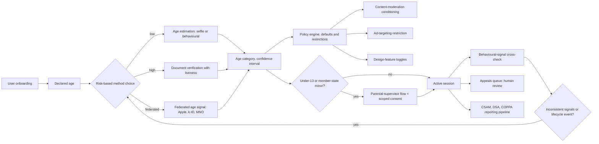

# Teen safety and age-assurance enforcement assistant

> **SAFE‑AUCA industry reference guide (draft)**
>
> This use case describes a real-world workflow that has become the focus of intense regulatory attention worldwide: enforcing teen safety on consumer platforms by determining the age category of users (declared, estimated, or verified) and applying age-appropriate restrictions to content, features, defaults, and data processing.
>
> It is the first SAFE‑AUCA use case where the safety move is to **block access** (to keep minors out of adult-only content, services, or design features) rather than to permit a regulated action carefully. False-allow is the catastrophic failure mode. False-block raises distinct concerns about access for legitimate adults, which the workflow also addresses.
>
> It focuses on:
>
> * how the workflow works in practice (tools, data, trust boundaries, autonomy)
> * what can go wrong (defender-friendly kill chain)
> * how it maps to **SAFE‑MCP techniques**
> * what controls + tests make it safer
>
> **Defender-friendly only:** do **not** include operational exploit steps, payloads, or step-by-step attack instructions.
> **No sensitive info:** do not include internal hostnames/endpoints, secrets, customer data, non-public incidents, or proprietary details.

---

## Metadata

| Field                | Value                                                            |
| -------------------- | ---------------------------------------------------------------- |
| **SAFE Use Case ID** | `SAFE-UC-0030`                                                   |
| **Status**           | `draft`                                                          |
| **Maturity**         | draft                                                            |
| **NAICS 2022**       | `51` (Information)                                               |
| **Last updated**     | `2026-04-24`                                                     |

### Evidence (public links)

* [UK Online Safety Act 2023 (legislation.gov.uk, Royal Assent 26 October 2023)](https://www.legislation.gov.uk/ukpga/2023/50)
* [Ofcom Guidance on Highly Effective Age Assurance, Part 3 (24 April 2025)](https://www.ofcom.org.uk/siteassets/resources/documents/consultations/category-1-10-weeks/statement-age-assurance-and-childrens-access/part-3-guidance-on-highly-effective-age-assurance.pdf?v=395680)
* [European Commission, Guidelines on the Protection of Minors under DSA Article 28 (14 July 2025)](https://digital-strategy.ec.europa.eu/en/library/commission-publishes-guidelines-protection-minors)
* [EDPB Statement 1/2025 on Age Assurance (adopted 11 February 2025)](https://www.edpb.europa.eu/system/files/2025-04/edpb_statement_20250211ageassurance_v1-2_en.pdf)
* [FTC Final Rule amending COPPA, 16 CFR Part 312 (Federal Register, 22 April 2025; effective 23 June 2025; compliance deadline 22 April 2026)](https://www.federalregister.gov/documents/2025/04/22/2025-05904/childrens-online-privacy-protection-rule)
* [NIST IR 8525, Face Analysis Technology Evaluation: Age Estimation and Verification (May 2024)](https://nvlpubs.nist.gov/nistpubs/ir/2024/NIST.IR.8525.pdf)
* [NY Attorney General James and a multistate coalition sue Meta for harming youth (24 October 2023)](https://ag.ny.gov/press-release/2023/attorney-general-james-and-multistate-coalition-sue-meta-harming-youth)
* [FTC investigation leads to lawsuit against TikTok and ByteDance for COPPA violations (2 August 2024)](https://www.ftc.gov/news-events/news/press-releases/2024/08/ftc-investigation-leads-lawsuit-against-tiktok-bytedance-flagrantly-violating-childrens-privacy-law)
* [Apple Developer documentation, Declared Age Range API (introduced iOS 26, WWDC 2025)](https://developer.apple.com/documentation/declaredagerange)
* [Yoti Facial Age Estimation White Paper, July 2025 (vendor methodology)](https://www.yoti.com/wp-content/uploads/2025/08/Yoti-Age-Estimation-White-Paper-July-2025-PUBLIC-v1.pdf)

---

## Minimum viable write-up (Seed → Draft fast path)

This document covers:

* Executive summary
* Industry context and constraints
* Workflow and scope
* Architecture (tools, trust boundaries, inputs)
* Operating modes
* Kill-chain table (7 stages)
* SAFE‑MCP mapping table (24 techniques)
* Contributors and Version History

---

## 1. Executive summary (what + why)

**What this workflow does**
A **teen safety and age-assurance enforcement** workflow does three connected things on a consumer platform:

1. determines a user's age category (declared, estimated, or verified) using one or more methods,
2. applies age-appropriate restrictions to content, features, defaults, and data processing for that user, and
3. operates the parental supervisor accounts, appeals processes, reporting pipelines, and re-verification flows that surround the core determination.

The category is currently a regulatory hot zone. Major frameworks in force or imminent include the UK Online Safety Act 2023 with Ofcom's Highly Effective Age Assurance (HEAA) guidance, the EU Digital Services Act Article 28 with the European Commission's July 2025 guidelines on the protection of minors, the EDPB Statement 1/2025 on Age Assurance, and the United States COPPA Rule final amendments published in the Federal Register on 22 April 2025 (effective 23 June 2025, compliance deadline 22 April 2026). At the international standards level, ISO/IEC 27566-1:2025 published in December 2025 as the first international age-assurance framework standard.

**Why it matters (business value)**
Platforms accessible to minors carry a duty of care that is now formalised in multiple jurisdictions. Operators commonly cite age-assurance and teen safety pipelines for:

* meeting OSA, DSA, COPPA, ICO Children's Code, and state-law expectations on a single technical surface,
* reducing exposure to enforcement actions that have already produced multi-hundred-million-dollar penalties (Epic Games $520M in December 2022, split as $275M COPPA penalty and $245M Section 5 unfair-practices order),
* defending the platform from bias and demographic-fairness claims by adopting independently benchmarked methods (NIST IR 8525, May 2024, evaluated six face age-estimation algorithms with explicit demographic dependence analysis),
* preserving access for legitimate adult users when age-restricted features apply, and
* operating parental-supervisor flows that are themselves a contractual and regulatory surface (the Ninth Circuit's August 2024 NetChoice v. Bonta opinion and subsequent N.D. Cal. injunctions reshape what a regulator can compel here).

**Why it's risky / what can go wrong**
The risk shape inverts most prior SAFE‑AUCA use cases. False-allow (a minor passes through an age gate that should have stopped them) is the catastrophic outcome. False-block (a legitimate adult is excluded) is a separate and serious harm with free-expression and access-to-services dimensions. Recent disclosures sketch the surface:

* **Multistate enforcement against design choices that affect minors.** On 24 October 2023, NY Attorney General Letitia James led a 42-state coalition suing Meta for knowingly designing addictive features for youth and for COPPA violations on under-13 data. The case remains active.
* **Lawsuit, not settlement, against TikTok.** On 2 August 2024 the FTC referred to DOJ a civil action against TikTok and ByteDance for COPPA Rule and 2019 consent-order violations. The complaint seeks civil penalties of up to $51,744 per violation per day from 10 January 2024.
* **State AG lawsuits against platform safety design.** New Mexico AG sued Snap in September 2024 citing 10,000-plus CSAM-related records and inadequate age verification. Texas AG sued Roblox in November 2025; similar suits followed in Louisiana, Kentucky, Florida, Nebraska, and Los Angeles County in 2025-2026.
* **First seven-figure UK age-assurance enforcement.** Ofcom fined AVS Group Ltd GBP 1,000,000 (plus a GBP 50,000 information-request penalty) on 4 December 2025 for inadequate HEAA across 18 adult sites. This was the first GBP 1 million Ofcom enforcement targeting age assurance specifically.
* **Demographic-bias evidence in face-based age estimation.** NIST IR 8525 (May 2024) is the independent benchmark. A peer-reviewed 2024 MDPI Mathematics study reproduced the demographic-dependence finding on different model families.
* **Operational failure of parental flows.** ICO fined TikTok GBP 12.7M in April 2023 after estimating between 1.1 million and 1.4 million UK under-13 users in 2020 had used the service without verifiable parental consent, despite TikTok's stated age gate.

These failure patterns drive the controls posture for an age-assurance and teen-safety workflow: layered determination methods (declared plus estimated plus verified), data minimisation (boolean older-than vs full birthdate where the law allows), independent benchmarking of any face-based estimator, parental-supervisor account flows that resist credential relay and consent fatigue, and reporting pipelines that meet CSAM and DSA transparency duties without compromising the minor's safety.

---

## 2. Industry context and constraints (reference-guide lens)

### Where this shows up

Common in:

* very large online platforms accessible to minors (Meta Instagram Teen Accounts rolled out 17 September 2024, TikTok teen accounts, Snap Family Center, Discord Family Center, YouTube supervised experiences)
* gaming platforms and game distribution (Roblox 17+ Restricted Experiences with ID-or-credit-card verification, Apple Declared Age Range introduced in iOS 26, k-ID's gaming-focused compliance engine federating signals from iOS, Google Play, Xbox, and Meta Horizon)
* adult-content platforms subject to age-verification mandates under OSA Part 5, state-level adult-site age laws, and the EU minors guidelines
* any "information society service likely to be accessed by children" within the meaning of the ICO Children's Code, which applies broadly across consumer apps and websites
* age-assurance vendors selling into the platforms above (Yoti, Persona, Entrust acquired Onfido in 2024, Veriff, AU10TIX, Microblink, k-ID)

### Typical systems

* **Account onboarding flows** that capture declared age, optionally with parental-consent gating for under-13 (COPPA) or under-16 (GDPR Article 8 default; member states may set as low as 13).
* **Age-estimation models** that infer age category from a selfie, voice sample, or behavioural signals. Yoti reports continuous publication of methodology and demographic results; NIST IR 8525 evaluates this model class independently.
* **Document-verification pipelines** that read an ID document (passport, driver licence) and bind it to the user with a liveness selfie. Persona, Entrust Onfido, Veriff, AU10TIX, and Microblink all sell into this layer.
* **Federated age-signal exchanges** that move a verified age category between platforms without resharing the underlying identity data. Apple Declared Age Range and k-ID are recent examples; the design pattern is to surface a category (under 13, 13 to 15, 16 to 17, over 18) rather than an exact birthdate.
* **Content-moderation classifiers conditioned on age** that gate adult content, restrict ad targeting, suppress addictive design features for minors, and apply different default privacy.
* **Parental-supervisor account systems** that pair a verified parent or guardian with a minor account, support consent for processing, and provide visibility into the minor's activity.
* **Reporting pipelines** that handle CSAM mandatory reports under federal law (NCMEC routing in the US), DSA transparency reports, and COPPA disclosures, often under tipping-off-style constraints that prevent informing the subject.
* **Re-verification flows** triggered by lifecycle events (a teen ageing into a less-restricted tier, an account showing inconsistent signals, a parental supervisor revoking consent).

### Constraints that matter

* **The "platform vs deployer vs vulnerable user" three-way routing.** Most teen-safety frameworks place duties on the platform operator (the entity providing the service to minors), not on the AI vendor that supplies an age-estimation model, and not on the minor themselves. When an AI agent does age estimation or content classification, the platform's duty cascades into the agent's design and audit posture.
* **Highly Effective Age Assurance (HEAA) under Ofcom guidance.** The four-criteria test (technically accurate, robust, reliable, fair) is method-agnostic on purpose. Self-declaration is explicitly excluded. Photo-ID matching, facial age estimation, mobile-network operator checks, credit-card checks, digital-ID, open banking, and email-based estimation are all listed as candidate HEAA methods with practical caveats.
* **DSA Article 28 minors guidelines.** The European Commission's 14 July 2025 guidelines define a baseline for online platforms accessible to minors: private-by-default settings for minors' accounts, no profiling-based ads where the platform is "aware with reasonable certainty" the recipient is a minor, autoplay and streaks off by default, annual review.
* **EDPB Statement 1/2025 on Age Assurance.** Ten principles emphasising proportionality, data minimisation, no single-method lock-in, and separation between identity proofing and age determination.
* **COPPA Rule (16 CFR Part 312) as amended in 2025.** Effective 23 June 2025; full compliance deadline 22 April 2026. Notable changes include a new "mixed audience" definition in 312.2, separate parental consent for third-party targeted advertising in 312.5, written children's data security program in 312.8, and retention limits in 312.10.
* **California Age-Appropriate Design Code (CAADCA, AB 2273).** Largely enjoined in current litigation. The Ninth Circuit affirmed a preliminary injunction on the DPIA provisions on 16 August 2024 (NetChoice v. Bonta, No. 23-2969), and the Northern District of California granted a second preliminary injunction on 13 March 2025. California appealed on 11 April 2025. Practitioners cite the substantive design principles directionally because they mirror the ICO Code.
* **State teen-safety laws under partial or full injunction.** Texas SCOPE Act (effective 1 September 2024) had its monitoring-and-filtering provisions enjoined by W.D. Tex. on 30 August 2024; further injunctions followed. Utah's Minor Protection in Social Media Act (which replaced the original SMRA) was preliminarily enjoined by Judge Shelby of the District of Utah in September 2024. KOSA passed the US Senate 91-3 on 30 July 2024 in the 118th Congress, did not advance through the House, and was reintroduced in May 2025 in the 119th Congress; it is **not law** as of April 2026.
* **Biometric privacy where face-based estimation is used.** Illinois BIPA (740 ILCS 14), Texas CUBI (Bus. and Com. Code §503.001), and Washington (RCW 19.375). Texas's $1.375 billion 2024 settlement with Google included CUBI claims and signals AG-led risk even outside Illinois's private right of action.
* **First international age-assurance standard.** ISO/IEC 27566-1:2025 published in December 2025 as Part 1 (Framework). Parts 2 (benchmarks) and 3 (analysis) are in development.

### Must-not-fail outcomes

* a minor passing through an age gate that should have stopped them and being exposed to content or features the platform's policy prohibits for that age category
* a legitimate adult being indefinitely excluded from a service because of a false-block age determination with no working appeal
* a parental-supervisor flow letting an unauthorised adult (impersonating the parent, recycling parental credentials, or exploiting consent fatigue) gain authority over a minor's account
* a CSAM mandatory report being mis-routed, dropped, or tipping the subject off
* face-based age-estimation results carrying demographic bias that disproportionately false-allows or false-blocks particular populations
* federated age-signal flows leaking the underlying identity, defeating the data-minimisation premise
* AI agents in the teen-safety pipeline being prompt-injected into bypassing age gates or revealing why they made a determination

---

## 3. Workflow description and scope

### 3.1 Workflow steps (happy path)

1. A user begins onboarding on a consumer platform. The platform requests a declared age or birthdate, and (depending on the regulatory regime) initiates a more-rigorous age-assurance step.
2. The age-assurance engine selects a method based on risk, jurisdiction, and user choice. Common methods: face-based age estimation, document verification with liveness binding, mobile-network or credit-card checks, federated age signal from the OS or app store, or an open-banking-grade identity proof.
3. The age-assurance engine returns a category (under 13, 13 to 15, 16 to 17, over 18, with confidence intervals) and any artefacts the platform retains for audit (consent records, hashes of the document, biometric template if BIPA-compliant consent was obtained).
4. The platform's policy engine applies age-appropriate defaults: high-privacy default, content-moderation tier, ad-targeting restriction, design-feature toggles (autoplay, infinite scroll, push notifications, streaks), screen-time defaults, and messaging restrictions.
5. If the user is a minor and the regulator requires verifiable parental consent (COPPA under-13, GDPR Article 8 under member-state threshold), the platform invokes a parental-supervisor flow. The parent verifies their identity, links to the minor's account, and grants scoped consent.
6. The user interacts with the platform under the applied controls. Background processes monitor for inconsistent signals (declared age does not match behavioural patterns, claimed adult fails age-estimation when later applied to a feature gate, parental supervisor revokes consent).
7. Lifecycle events trigger re-evaluation: ageing out of a teen tier, escalation from a declared signal to a verified one for a high-risk feature, parental revocation, repeated failed appeals.
8. Reporting pipelines handle compliance artefacts: CSAM reports to NCMEC under tipping-off constraints, DSA transparency reports, COPPA disclosures, ICO accountability records, and audit trails for any AG enforcement query.

### 3.2 In scope and out of scope

* **In scope:** the determination of age category and the application of age-conditioned restrictions; parental-supervisor flows; appeals and re-verification; the operational reporting pipelines (CSAM, DSA, COPPA, transparency).
* **Out of scope:** general identity verification for non-age purposes (KYC, sanctions screening), the underlying CSAM-detection ML pipeline (a separate UC), the platform's broader content-moderation policy outside age conditioning, and direct platform-to-platform data sharing for purposes other than federated age signals.

### 3.3 Assumptions

* The platform is the regulated entity; the age-assurance vendor is a processor or subprocessor; the user (minor or adult) is the data subject. Article 25-style provider-vs-deployer routing is a separate layer from this UC.
* Declared-age inputs are untrusted by default; estimated and verified results pass through documented confidence and integrity checks.
* Biometric processing (face-based estimation) carries BIPA, CUBI, and GDPR Article 9 considerations regardless of the safety purpose.
* Parental-supervisor consent does not replace the minor's data-protection rights; it scopes processing on the minor's behalf.
* Tipping-off and CSAM-handling rules apply at the reporting pipeline; the rest of the platform must not undo the report's confidentiality.

### 3.4 Success criteria

* False-allow rate at the age gate is below the platform's documented threshold for each age category, monitored continuously and reviewed quarterly.
* False-block rate stays bounded with a working appeals path; no class of legitimate adult users is indefinitely excluded.
* Demographic-bias metrics on any face-based estimator are documented (NIST IR 8525-style) and within published acceptance bounds.
* Parental-supervisor accounts resist credential-relay, consent-fatigue, and token-scope-substitution attacks (validated via fixtures in §10.2).
* Federated age signals carry a category, not a birthdate; the underlying identity is never reshared.
* CSAM and DSA reports flow with tipping-off-style confidentiality preserved.
* Every age-affecting decision has a named principal (the platform), with audit-trail evidence sufficient for regulator examination.

---

## 4. System and agent architecture

### 4.1 Actors and systems

* **The minor user.** A vulnerable data subject. Determines the safety lens applied by every other component.
* **The parental supervisor.** A guardian acting as a legal-delegate principal. Distinct from any prior SAFE‑AUCA UC: this is the first identity triangle (parent, child, platform) where one human party holds delegated authority over another human's data.
* **The legitimate adult user.** A user the platform commonly continues to serve. False-block on this party is a non-trivial harm.
* **The adversarial actor.** Could be a minor attempting to evade the age gate, an adult attempting to claim a minor identity, a third party attempting to take over a parental-supervisor account, or a deepfake submitter attempting to spoof biometric-age estimation.
* **The platform operator.** The regulated entity carrying the OSA, DSA, COPPA, ICO Code, state-law, and biometric-privacy duties.
* **Age-assurance vendor.** Processor or subprocessor selling estimation, document verification, liveness, or federated signal services.
* **Content-moderation engine.** Conditions outputs and access on the determined age category.
* **Reporting pipeline.** Handles NCMEC CSAM submissions, DSA transparency, COPPA disclosures.

### 4.2 Trusted vs untrusted inputs (high value, keep simple)

| Input/source                               | Trusted?           | Why                                                                                  | Typical failure/abuse pattern                                                                              | Mitigation theme                                                                  |
| ------------------------------------------ | ------------------ | ------------------------------------------------------------------------------------ | ---------------------------------------------------------------------------------------------------------- | --------------------------------------------------------------------------------- |
| Declared age or birthdate at signup        | Untrusted          | self-attested; minors and adults both have incentives to misrepresent                | flat lying; recycled birthdays; consent-fatigue habituation                                                 | layered methods; HEAA escalation; behavioural-signal cross-check                  |
| Selfie for face-based age estimation       | Semi-trusted       | live capture is plausible but vulnerable to presentation attack                       | deepfake or printed-photo presentation attack; demographic bias in the underlying model                    | passive plus active liveness; NIST IR 8525 grade independent benchmarks; appeals  |
| ID-document image plus liveness selfie     | Semi-trusted       | document is genuine if liveness binds the holder, but documents can be forged         | synthetic ID; recycled selfie; document-template attack                                                     | issuer cryptographic verification; cross-database checks; NIST 800-63 IAL2 floor  |
| Federated age signal from OS or app store  | Semi-trusted       | issuer-attested but only as strong as the issuer's own verification                   | issuer compromise; replayed signal; downgraded scope                                                       | signed attestations; expiry; OAuth scope controls; operator-side cross-check       |
| Parental-supervisor consent record         | Semi-trusted       | depends on parent's identity verification and on freshness of consent                 | credential relay; impersonation; consent fatigue (parent clicks through every prompt)                      | parent-only re-verification; consent expiry; UI cool-downs; T1403-aware design     |
| Behavioural signals (interaction patterns) | Semi-trusted       | useful as a cross-check on declared age                                              | adversarial behaviour-mimicry; demographic confounds                                                       | use as evidence, not as sole determination; auditable thresholds                  |
| Content the user uploads                   | Untrusted          | external creative input                                                              | CSAM submission; injection of instructions in metadata; malicious media payloads                            | content scanning at ingest; sandboxing; mandatory-reporting routing                |
| Platform internal moderation classifiers   | Semi-trusted       | platform-curated but can drift                                                        | classifier drift; demographic bias in moderation; LLM07 system-prompt leakage in agentic moderation         | continuous evaluation; LLM01-aware prompts; auditing                              |
| LLM-generated decisions in the pipeline    | Untrusted          | probabilistic; can be prompt-injected to bypass an age gate                          | prompt injection by minor user; excessive agency in autonomous unblocking                                   | structured output schemas; explicit human-in-the-loop on irreversible decisions   |

### 4.3 Trust boundaries (required)

Key boundaries practitioners commonly model explicitly:

1. **The age-determination boundary.** Crossing this boundary should be hard and auditable. Every method has known failure modes (NIST IR 8525 documents demographic dependence in face estimation; document forgers have known templates; federated signals are only as strong as the issuer). Layered methods exist to make adversarial crossings hard, not merely friction.
2. **The parental-supervisor identity triangle.** Parent, child, and platform all carry interests; the parent acts as a legal delegate but does not replace the child's data-protection rights. This boundary is novel relative to every prior SAFE‑AUCA UC.
3. **The block-access vs permit-access inversion.** The platform's "default deny" posture for restricted features must hold even when an AI agent in the pipeline argues for a permit.
4. **The federated age-signal boundary.** Signals must move as categories, not as identities. Apple's Declared Age Range API and k-ID's federation are explicit about this. A leak here defeats data-minimisation across the entire ecosystem.
5. **The biometric-template boundary.** If face-based age estimation processes biometric data within the meaning of GDPR Article 9 or BIPA, the template handling must follow the law's affirmative-consent and retention rules. Vendor disagreement about whether age estimation is "biometric identification" is real and live; the cautious posture is to assume it is.
6. **The reporting pipeline boundary.** CSAM, DSA, and COPPA reports must reach the regulator without informing the subject. Tipping-off-style constraints apply (analogous to AML SAR confidentiality in SAFE-UC-0015 banking domain).
7. **The appeal boundary.** A false-block is expected to have a working path to human review without forcing the user to expose more data than the original determination required.

### 4.4 High-level flow (illustrative)

### 4.5 Tool inventory (required)

Typical tools and services (names vary by platform):

| Tool / service                                   | Read / write? | Permissions                                               | Typical inputs                                | Typical outputs                                            | Failure modes                                                                  |
| ------------------------------------------------ | ------------- | --------------------------------------------------------- | --------------------------------------------- | ---------------------------------------------------------- | ------------------------------------------------------------------------------ |
| `age.declare` (signup-time intake)               | write         | user-scoped session                                       | self-attested age or birthdate                | declared category record                                   | flat lying; recycled birthdays                                                  |
| `age.estimate.face` (vendor selfie inference)    | read          | per-tenant; per-region; consent-bound                     | selfie capture                                | age category plus confidence interval                       | demographic bias; presentation attack; model drift                              |
| `age.verify.document` (vendor document + liveness) | read       | tenant-scoped; minimal-disclosure mode                    | ID document image plus selfie                  | age category plus boolean over-18 plus optional template    | synthetic ID; recycled selfie; database lag                                     |
| `age.federated.signal` (Apple, k-ID, MNO)        | read          | issuer-attested; signed                                   | issuer assertion                              | category plus expiry                                       | issuer compromise; replay; scope downgrade                                      |
| `policy.apply.minor` (per-category defaults)     | write         | per-user                                                  | category, jurisdiction                        | applied feature toggles, defaults, ad restrictions          | misapplied policy on edge categories; jurisdictional confusion                  |
| `content.moderate.age-aware`                     | read/write    | session-scoped                                            | content plus user category                    | moderation outcome with rationale                           | LLM01 prompt injection by minor; LLM07 system-prompt leak                       |
| `parent.verify.identity`                         | read          | independent path; minimal disclosure                       | parent identity proof                         | verified-parent token                                       | impersonation; credential relay; consent fatigue                                |
| `parent.consent.record` (HITL)                   | write         | gated; scoped to specific minor                            | scope, expiry, parent token                   | consent record                                             | over-broad scope; non-revocable consent                                         |
| `appeal.intake` (HITL human review)              | read/write    | gated; data-minimised                                     | user statement plus optional new evidence     | appeal outcome                                             | appeals backlog; over-collection on appeal                                      |
| `report.csam` (mandatory)                        | write         | regulator-defined endpoint                                | content plus minimal context                  | NCMEC report id                                            | mis-routing; tipping-off leak; missing required fields                          |
| `report.dsa.transparency`                        | write         | annual or quarterly to EU                                  | aggregate counts                              | transparency report                                        | over-aggregation hiding violations; under-aggregation leaking subject data      |
| `audit.export` (regulator request)               | read          | gated; legal-hold mode                                    | timeframe, query                              | audit bundle                                               | over-exposure; tipping-off leak in retrieval                                    |

### 4.6 Sensitive data and policy constraints

* **Data classes:** declared age and birthdate, biometric face templates (if retained), document images, document data fields, liveness binding artefacts, parental-supervisor identity, parental consent records, behavioural signals, content uploaded by minors, CSAM artefacts (special-category, mandatory reporting).
* **Retention and logging:** ICO Children's Code Standard 8 (data minimisation), COPPA §312.10 retention limits as amended in 2025, BIPA §15(a) retention schedule for biometric identifiers, GDPR Article 5(1)(c) and 5(1)(e), tipping-off rules for CSAM evidence handling.
* **Regulatory constraints:** UK Online Safety Act 2023 with Ofcom HEAA guidance (Part 3 published 24 April 2025); EU DSA Article 28 with Commission guidelines (14 July 2025); EDPB Statement 1/2025 on Age Assurance; COPPA 16 CFR Part 312 as amended (effective 23 June 2025, compliance 22 April 2026); ICO Children's Code in force; CAADCA partially enjoined; Texas SCOPE Act and Utah Minor Protection in Social Media Act under partial or full injunction; KOSA pending in 119th Congress; ISO/IEC 27566-1:2025 framework (December 2025); NIST SP 800-63 Rev. 4 (July 2025) for identity-proofing levels; BIPA, CUBI, and Washington biometric statutes; GDPR Article 8 (children's consent) and Article 9 (special-category processing).
* **Safety/consumer-harm constraints:** false-allow exposes minors to harms the platform's policy expressly disallows; false-block excludes legitimate adults; demographic-biased age estimation unequally distributes both errors; parental-supervisor compromise hands a minor's account to an unauthorised adult; CSAM tipping-off can re-victimise.

---

## 5. Operating modes and agentic flow variants

### 5.1 Manual baseline (no AI agents)

A platform without agentic age-assurance still does the work: declared age at signup, manual content review, parental flow via email-based consent, appeals via support ticketing. Existing controls include human moderators, rules-based content filtering, and manual NCMEC reporting. Errors are caught by user complaints and regulator examination, often after harm has occurred.

### 5.2 Human-in-the-loop (HITL / sub-autonomous)

The current production majority. Age-estimation models run automatically; document-verification pipelines auto-extract; policy engines apply defaults. Humans review appeals, edge cases (low-confidence estimation results), CSAM reports, and any decision that affects an account closure or feature ban. **Risk profile:** the dominant failure mode is **silent over-reliance** by overworked reviewers, plus consent-fatigue patterns on the parental side (T1403).

### 5.3 Fully autonomous (end-to-end agentic, guardrailed)

Selected sub-workflows operate without per-decision human approval: routine policy-default application, low-confidence escalation, behavioural-signal cross-check, transparency-report aggregation. Customer-facing autonomous content removal of minor accounts is rarely safe to fully automate; the false-positive harms (excluded legitimate user, mis-classified adult) are large. Guardrails commonly applied: human review on any irreversible action, aggressive logging on autonomous overrides, kill switches that revert to HITL on drift signals.

### 5.4 Variants

A safe decomposition pattern separates components so each can be validated and rolled back independently:

1. **Onboarding intake** (declared age, jurisdictional routing).
2. **Risk-based method selector** (decides estimation vs document vs federated, by jurisdiction and feature risk).
3. **Estimation engine** (vendor; benchmarked against NIST IR 8525-style independent evaluation).
4. **Document verification engine** (vendor; bound to liveness; minimal-disclosure mode where supported).
5. **Federated signal handler** (validates issuer attestation, expiry, scope).
6. **Policy engine** (applies category-conditioned defaults).
7. **Parental-supervisor flow** (parent verification, consent recording, scoped delegation).
8. **Appeals queue** (human review, data-minimised, with cool-down on retries).
9. **Reporting pipeline** (CSAM, DSA, COPPA, audit-export).
10. **Observability and red-team harness** (continuous evaluation, demographic-bias measurement, prompt-injection fixtures).

Decomposition lets each component carry its own kill switch, validation set, and incident playbook.

---

## 6. Threat model overview (high-level)

### 6.1 Primary security and safety goals

* keep false-allow at the age gate below the documented threshold, especially for adult-only content
* keep false-block bounded, with a working appeals path that does not over-collect
* prevent demographic-bias-driven inequities in either error direction
* prevent parental-supervisor account compromise (the parent-child-platform identity triangle)
* preserve federated age signals as categories, never as identities
* preserve CSAM, DSA, and COPPA reporting confidentiality (no tipping-off)
* maintain attribution to a named human principal (the platform) for every regulated action

### 6.2 Threat actors (who might attack or misuse)

* **Minor user attempting to bypass the age gate.** Lies on declared age, recycles a parent's ID, deepfakes a selfie, exploits a federated signal misconfiguration, or social-engineers the appeal.
* **Adult attempting to obtain a minor identity.** A separate and more dangerous category. Targets parental-supervisor flows, recovers an abandoned minor account, or exploits cross-platform federation.
* **Adversarial third party targeting the parental-supervisor account.** Credential relay (T1304), token scope substitution (T1308), rogue authentication issuer (T1306), OAuth downgrade (T1408), or consent-fatigue exploitation (T1403).
* **Compromised vendor or upstream model.** Age-estimation model weights drift or are poisoned; document-verification database is unavailable or corrupted; federated-signal issuer is compromised.
* **Insider with platform access.** Misuses age-assurance data for non-safety purposes; leaks parental consent records; exfiltrates CSAM evidence.
* **Adversarial content in the pipeline.** Prompt-injection inside user-uploaded content steers an agentic moderation classifier; metadata steganography in selfie images steers an estimator.

### 6.3 Attack surfaces

* declared-age input at signup
* selfie capture and the underlying face-estimation model (NIST IR 8525 catalogues the demographic dependence; deepfake / presentation attacks target liveness)
* document-verification scanning and the document-database lookup
* federated age-signal exchanges (issuer compromise, replay, scope downgrade)
* parental-supervisor account creation, recovery, and consent flow
* content-moderation classifiers conditioned on age (LLM01 and LLM07 are first-order)
* the agent's tool registry if the moderation pipeline is agentic (T1402 metadata poisoning of moderation tools)
* the appeals queue (over-collection, queue starvation, social-engineering)
* the reporting pipeline (tipping-off; exfil of report contents)

### 6.4 High-impact failures (include industry harms)

* **Consumer/consumer harm:** a minor is allowed into an adult platform feature and is exposed to age-restricted content; demographic-biased estimation disproportionately false-allows or false-blocks particular populations; a legitimate adult is wrongly excluded with no working appeal.
* **Business harm:** Multistate AG enforcement (the active 42-state action against Meta from October 2023), federal-court COPPA action (the FTC and DOJ TikTok lawsuit from August 2024), seven-figure regulatory fines (Ofcom AVS Group £1M plus £50K on 4 December 2025; ICO TikTok £12.7M in April 2023), state-AG suits against Snap and Roblox in 2024-2025. Section 5 dark-patterns liability (Epic Games $245M in December 2022 for default-public chat for minors).
* **Security harm:** parental-supervisor account compromise; federated-signal leakage exposing minor identities; CSAM report tipping-off.

---

## 7. Kill-chain analysis (stages → likely failure modes)

> Keep this defender-friendly. Describe patterns, not "how to do it."

| Stage                                                                          | What can go wrong (pattern)                                                                                                                                                                                                                          | Likely impact                                                                                                                            | Notes / preconditions                                                                                                                                            |
| ------------------------------------------------------------------------------ | ---------------------------------------------------------------------------------------------------------------------------------------------------------------------------------------------------------------------------------------------------- | ---------------------------------------------------------------------------------------------------------------------------------------- | ---------------------------------------------------------------------------------------------------------------------------------------------------------------- |
| 1. Onboarding and declared-age intake                                          | Flat misrepresentation; recycled birthday; consent-fatigue clicked through on parental approval; memory implant of false age in agentic onboarding                                                                                                    | wrong age category propagates downstream                                                                                                  | declared-age inputs are untrusted by definition; layered methods are the response                                                                                |
| 2. Age-estimation or document-verification (**NOVEL: block-access-as-safety**) | Demographic-biased estimator (NIST IR 8525 documents this); deepfake or presentation attack against liveness; synthetic ID; false-block of legitimate adults                                                                                          | minors pass through (false-allow, catastrophic) or adults excluded (false-block, harm to access)                                          | first SAFE‑AUCA UC where refusal is the success outcome; benchmark against NIST IR 8525-grade independent evaluation                                              |
| 3. Federated age-signal exchange                                               | Schema poisoning of the federated payload (Apple Declared Age Range, k-ID); rogue issuer; replayed signal; OAuth scope downgrade in parent-child federation                                                                                          | trust propagates laterally across vendors; one bad signal taints many platforms                                                          | the design intent is to share a category, not an identity; that intent must hold at every hop                                                                    |
| 4. Content-moderation age conditioning                                         | Prompt injection by minor against an agentic moderation classifier; ad-targeting drift toward profiling that the platform is "aware with reasonable certainty" affects a minor; instruction-stenography (T1402) in moderation-tool metadata          | platform falls out of DSA Article 28(2) compliance; minor is shown content the policy disallows; ad-revenue posture becomes a UDAAP risk | OWASP LLM01, LLM06, LLM07 directly applicable                                                                                                                    |
| 5. Parental-supervisor account compromise (**NOVEL: identity triangle**)       | Token scope substitution (T1308) swapping parent token for child token; credential relay (T1304); rogue authentication server (T1306); consent-fatigue exploit (T1403) on the guardian; OAuth downgrade (T1408) in the federation flow                | unauthorised adult assumes parental authority over a minor's account; minor's data is exposed under cover of consent                     | first SAFE‑AUCA identity triangle where a third-party legal proxy holds delegated authority over a different human's data                                        |
| 6. Reporting pipeline (**NOVEL: tipping-off constraints**)                     | CSAM evidence destruction (T2101) by malicious agent or insider; bulk teen-data harvest (T1801, T1804) by insider; covert exfil of report contents (T1910, T1911, T1912); chat-based backchannel (T1904) signalling the subject                       | regulatory non-compliance; subject is tipped off and re-victimisation risk follows                                                       | analogous to the AML SAR-confidentiality model in 0015 banking domain, but the protected subject is a minor                                                       |
| 7. Re-verification at lifecycle events                                         | Rug-pull (T1201) on an approved age-assurance tool post-renewal; context memory implant (T1204) carrying stale age forward; API data harvest (T1804) in the re-verification window                                                                    | persistent miscategorisation across lifecycle; teen ages out of restrictions early or remains miscategorised                              | the re-verification window is a fresh attack surface even after onboarding succeeded                                                                              |

**Persistence-as-control inversion note.** On a teen-safety workflow, the **default-deny posture** itself is the control: the platform refuses access until age is determined to a documented confidence level. Rolling back to a more-restrictive state is always safe; rolling forward to a less-restrictive state requires evidence. This inverts the persistence logic in cyber-physical use cases like 0008 OTA, where persistence of a bad state requires active recovery.

---

## 8. SAFE‑MCP mapping (kill-chain → techniques → controls → tests)

> Goal: make SAFE‑MCP actionable in this workflow. The block-access-as-safety, parental identity triangle, and tipping-off-style reporting stages are workflow-specific framings; closest-fit SAFE‑T IDs are noted.

| Kill-chain stage                                | Failure/attack pattern (defender-friendly)                                                                                                          | SAFE‑MCP technique(s)                                                                                                                                                              | Recommended controls (prevent/detect/recover)                                                                                                                                                                                                                                                                                                                                                | Tests (how to validate)                                                                                                                                                                                                                                |
| ----------------------------------------------- | --------------------------------------------------------------------------------------------------------------------------------------------------- | ---------------------------------------------------------------------------------------------------------------------------------------------------------------------------------- | -------------------------------------------------------------------------------------------------------------------------------------------------------------------------------------------------------------------------------------------------------------------------------------------------------------------------------------------------------------------------------------------- | ------------------------------------------------------------------------------------------------------------------------------------------------------------------------------------------------------------------------------------------------------ |
| 1. Onboarding and declared-age intake           | Flat misrepresentation; recycled birthday; consent fatigue clicked through; memory implant of false age in agentic onboarding                        | `SAFE-T1102` (Prompt Injection (Multiple Vectors)); `SAFE-T1403` (Consent-Fatigue Exploit); `SAFE-T1204` (Context Memory Implant)                                                  | declared age treated as untrusted; HEAA escalation when stakes warrant; behavioural-signal cross-check; cool-downs in parental-consent UI; agent prompts that quote and isolate user-supplied age claims                                                                                                                                                                                       | fixture set of declared-age claims plus synthetic memory implants; verify estimator and policy engine ignore declared age in high-risk paths                                                                                                          |
| 2. Age-estimation or document-verification      | Demographic-biased estimator; deepfake or presentation attack against liveness; synthetic ID; AI model poisoning of training corpora                  | `SAFE-T1502` (File-Based Credential Harvest); `SAFE-T2107` (AI Model Poisoning via MCP Tool Training Data Contamination); `SAFE-T1404` (Response Tampering); `SAFE-T3001` (RAG Backdoor Attack) | independent benchmarking (NIST IR 8525 grade) on every estimator before production; passive plus active liveness; document issuer cryptographic verification; cross-database checks (NIST 800-63 IAL2 floor); demographic-fairness metrics with published acceptance bounds                                                                                                                    | NIST FATE-style evaluation reports; presentation-attack fixture library; demographic-bias regression tests; signed model artefacts                                                                                                                    |
| 3. Federated age-signal exchange                | Schema poisoning of the federated payload; rogue issuer; replayed signal; OAuth scope downgrade                                                       | `SAFE-T1501` (Full-Schema Poisoning (FSP)); `SAFE-T1407` (Server Proxy Masquerade); `SAFE-T1306` (Rogue Authentication Server); `SAFE-T1408` (OAuth Protocol Downgrade); `SAFE-T1701` (Cross-Tool Contamination) | issuer allowlist with cryptographic signature verification; signed attestations with short expiry; scope minimisation (category, not identity); replay protection at the relying party; per-issuer integrity baselines                                                                                                                                                                       | replay-attack fixtures; rogue-issuer attestation tests; expired-attestation acceptance tests; schema-fuzz on federated payload                                                                                                                       |
| 4. Content-moderation age conditioning          | Prompt injection by minor against agentic moderation classifier; profiling-based ads to known-minor accounts; metadata stenography in moderation tools | `SAFE-T1102`; `SAFE-T2105` (Disinformation Output); `SAFE-T1402` (Instruction Stenography - Tool Metadata Poisoning); `SAFE-T1904` (Chat-Based Backchannel)                       | age-aware prompt isolation; structured output schemas for moderation decisions; LLM07-aware system-prompt redaction in error paths; ad-targeting allowlists conditioned on age category; T1402-style metadata sanitiser on moderation tool descriptors                                                                                                                                       | injection fixtures from minor-perspective; ad-targeting regression tests; T1402 metadata-poisoning fuzz; system-prompt-extraction tests across moderation classifier outputs                                                                          |
| 5. Parental-supervisor account compromise       | Token scope substitution; credential relay; rogue authentication issuer; consent-fatigue exploit; OAuth downgrade                                    | `SAFE-T1308` (Token Scope Substitution); `SAFE-T1304` (Credential Relay Chain); `SAFE-T1306` (Rogue Authentication Server); `SAFE-T1403` (Consent-Fatigue Exploit); `SAFE-T1408` (OAuth Protocol Downgrade) | parent identity verified via independent path (not in-band with the child's signup); short-lived parent tokens; explicit scope per-feature consent (no blanket parental approval); consent-fatigue UI cool-downs; FIDO2 step-up for sensitive actions; rogue-issuer detection on the parent flow                                                                                              | parent-token replay against a different child; consent-fatigue replay (rapid-fire prompts); FIDO2-bypass attempts; rogue-issuer attestation tests on the parental flow                                                                                |
| 6. Reporting pipeline (CSAM, DSA, COPPA)        | CSAM evidence destruction by malicious agent or insider; bulk teen-data harvest; covert exfil of report contents; chat-based backchannel signalling subject | `SAFE-T2101` (Data Destruction); `SAFE-T1801` (Automated Data Harvesting); `SAFE-T1804` (API Data Harvest); `SAFE-T1910` (Covert Channel Exfiltration); `SAFE-T1911` (Parameter Exfiltration); `SAFE-T1912` (Stego Response Exfiltration); `SAFE-T1904` (Chat-Based Backchannel) | tamper-evident audit trail on CSAM evidence; rate-limit on bulk teen-data queries; egress controls on the reporting plane; tipping-off content scanner on any path that could reach the subject; redaction at write time for transparency reports                                                                                                                                            | tamper-detection drill on evidence; bulk-read anomaly detection seeded with synthetic queries; tipping-off-language fixtures; transparency-report redaction regression                                                                                |
| 7. Re-verification at lifecycle events          | Rug-pull on an approved age-assurance tool post-renewal; context memory implant carrying stale age; API data harvest in the re-verification window     | `SAFE-T1201` (MCP Rug Pull Attack); `SAFE-T1204` (Context Memory Implant); `SAFE-T1804` (API Data Harvest)                                                                          | version-pinning on every age-assurance tool; integrity baselines and drift detection on the registry; session-scoped agent memory cleared at re-verification; rate-limits at the re-verification API                                                                                                                                                                                          | rug-pull simulation on a pinned tool; replay of stale agent memory; bulk re-verification harvest tests                                                                                                                                                |

Horizontal risks spanning several stages: `SAFE-T1101` (Command Injection) on the document-verification pipeline if it shells out to an extractor; `SAFE-T1202` (OAuth Token Persistence) on the parental flow if tokens outlive their session; `SAFE-T1601` (MCP Server Enumeration) and `SAFE-T1602` (Tool Enumeration) as recon for any of the above.

**Framework gap note.** SAFE-MCP does not yet publish dedicated technique IDs for the parental-supervisor identity triangle, the block-access-as-safety inversion, or federated age-signal poisoning at the issuer level. Closest fits are noted above. ISO/IEC 27566-1:2025 (Framework), the European Commission's DSA Article 28 minors guidelines, and EDPB Statement 1/2025 are complementary references explicitly designed for age assurance and worth cross-referencing alongside SAFE-MCP. Contributors expanding the SAFE-MCP catalog may find these three gaps worth filling.

---

## 9. Controls and mitigations (organized)

### 9.1 Prevent (reduce likelihood)

* **Layered determination by default.** Declared, estimated, and verified work together. Self-declaration alone is excluded under Ofcom HEAA. The platform documents which method applies to which feature class.
* **Independent benchmarking of every estimator.** NIST IR 8525-grade evaluation reports including demographic-dependence breakdowns. Vendor self-reports are paired with, not substituted for, the independent benchmark.
* **Minimal-disclosure mode by default.** A boolean over-18 or category, not a full birthdate. NIST SP 800-63 Rev. 4 separates identity proofing from age determination; only escalate to identity proofing when the law requires it.
* **Federated signals carry categories, not identities.** Apple Declared Age Range and k-ID are explicit examples of this design choice. Replication of the user's full identity across platforms defeats the point.
* **Parent identity verified out-of-band.** A parent's identity assertion does not pass through the child's signup flow. FIDO2 step-up for high-risk parental actions is the typical pattern.
* **Consent fatigue resisted at UI layer.** Cool-downs between repeat prompts; explicit scope per parental approval; revocation paths visible at a glance; no blanket "approve all".
* **Default-deny posture for restricted features.** The block-access-as-safety inversion: the platform refuses until evidence justifies access.
* **CSAM and tipping-off-aware routing on every reporting path.** Reports flow to NCMEC and analogous bodies; subject-facing surfaces never reflect the report's existence.
* **Biometric handling that assumes BIPA-class consent.** Even where vendors argue age estimation is not biometric identification, the cautious posture is to obtain BIPA-grade consent and follow GDPR Article 9.

### 9.2 Detect (reduce time-to-detect)

* **False-allow rate per age category** monitored continuously, alerting on threshold breach.
* **False-block rate** monitored with appeal-resolution-time as a paired metric; sustained appeal latency is itself a regulatory risk under Article 28.
* **Demographic-bias regression** on every model update, comparing pre- and post-deployment fairness metrics.
* **Federated-signal anomaly detection.** Issuer signing-key rotations off-schedule, replay patterns, scope-downgrade attempts.
* **Parental-flow anomaly detection.** Token-scope-substitution attempts, consent-fatigue patterns (parent approves N prompts in M seconds), rogue-issuer assertions.
* **CSAM-pipeline integrity monitoring.** Tamper detection on evidence; egress monitoring on the reporting plane; no-tipping-off content scanner on any subject-facing path.
* **Re-verification anomaly detection.** Bulk re-verification harvest, stale-memory replays, rug-pull on pinned age-assurance tools.

### 9.3 Recover (reduce blast radius)

* **Kill switches at every layer:** estimator, document-verification engine, federated-signal handler, policy engine, parental flow, content-moderation conditioning, reporting pipeline. Each can be disabled independently while the others continue.
* **Mass re-evaluate** path when a poisoned model or compromised tool is identified: invalidate version, force re-determination on dependent users, surface the impact list to regulators if required by Article 73 of the DSA or analogous.
* **Working appeal at every block.** Data-minimised appeal intake, human review with a documented turnaround, no over-collection on the appeal that exceeds the original determination's data footprint.
* **Graceful degradation.** When a model or signal source is unavailable, the platform escalates to a more-conservative determination (default-deny is safe; default-allow is not).
* **Regulator-ready audit export.** Bundled artefacts with integrity hashes, supporting Article 25-style cooperation duties and AG enforcement queries without exposing minor data unnecessarily.
* **Parental-account recovery path.** Verified out-of-band recovery for legitimate parents, with hard limits to prevent a single recovery flow from being repeated to take over many minor accounts.

---

## 10. Validation and testing plan

### 10.1 What to test (minimum set)

* **Layered determination holds under adversarial declared-age input.** Estimation and verification override declared age in high-risk paths.
* **Demographic-bias bounds are met** on every face-based estimator update, with NIST IR 8525-style methodology.
* **Presentation-attack and deepfake fixtures** are caught by liveness; rate of pass against a known fixture library is published internally.
* **Federated-signal integrity holds** under replay, expiry, and rogue-issuer attempts.
* **Parental flow resists** token scope substitution, credential relay, rogue issuer, OAuth downgrade, and consent-fatigue patterns.
* **Block-access-as-safety holds** under prompt-injection attempts by a minor against the moderation classifier and against the policy engine.
* **CSAM and DSA reporting pipelines** preserve tipping-off-style confidentiality and tamper-evident evidence handling.
* **Re-verification windows** resist rug-pull, stale-memory replay, and bulk harvest.

### 10.2 Test cases (make them concrete)

| Test name                              | Setup                                                                                       | Input / scenario                                                                                                  | Expected outcome                                                                                                                | Evidence produced                                              |
| -------------------------------------- | ------------------------------------------------------------------------------------------- | ----------------------------------------------------------------------------------------------------------------- | ------------------------------------------------------------------------------------------------------------------------------- | -------------------------------------------------------------- |
| Declared-age override                  | High-risk feature gate active                                                                | User declares 18; estimator returns category "13 to 15" with high confidence                                       | Platform applies under-16 restrictions; declared age does not override estimator in high-risk path                              | policy event log + override record                             |
| Demographic-bias regression            | New estimator candidate                                                                      | Run NIST IR 8525-style evaluation against the candidate                                                            | Demographic-fairness metrics within published bounds; release blocked otherwise                                                  | evaluation report + signed model artefact                      |
| Presentation-attack and deepfake       | Liveness-bound estimator                                                                     | Submit printed-photo, video-replay, and deepfake selfies                                                           | All three rejected; appeals path available for legitimate false-block                                                            | liveness log + reject record                                    |
| Federated-signal replay                | Apple or k-ID signal accepted by the relying party                                           | Replay an expired signal                                                                                          | Replay rejected; fresh attestation required                                                                                      | issuer-attestation log + reject event                           |
| Rogue-issuer attestation               | Federated handler with allowlist                                                             | Present a signal from an issuer not on the allowlist                                                              | Reject; alert; baseline does not drift                                                                                           | allowlist log + reject event                                    |
| Token scope substitution               | Parental-supervisor flow                                                                     | Use a parent's token to access a different minor's account                                                         | Denied; flagged as cross-scope attempt                                                                                           | scope-mismatch log + denial record                              |
| Consent-fatigue cool-down              | Parental approval UI                                                                         | Issue 5 parental-approval prompts in 60 seconds                                                                   | UI cool-down kicks in; explicit-scope prompt required                                                                            | UI state log + cool-down event                                  |
| Block-access prompt injection          | Agentic moderation classifier                                                                | Minor user submits crafted text to override the age gate                                                           | Output remains a structured moderation decision; gate holds                                                                      | injection fixture + output diff                                 |
| Tipping-off scanner                    | CSAM reporting pipeline                                                                      | Synthetic content includes phrases that could tip off the subject                                                  | Scanner blocks before any subject-facing surface; report still routed                                                           | scanner log + blocked-output record                            |
| Re-verification rug-pull               | Pinned age-assurance tool at v1.2.3                                                          | Vendor swaps binary at v1.2.3 silently                                                                            | Drift detection blocks; per-tenant freeze; mass re-evaluation path triggered                                                     | drift log + freeze event                                       |
| Appeal data-minimisation               | False-blocked legitimate adult                                                               | User submits appeal                                                                                              | Appeal intake collects only data necessary to overturn; no over-collection                                                        | appeal-intake log                                              |
| Demographic-fairness audit             | Production estimator                                                                         | Stratified-sample audit against ground-truth labels                                                                | Within published acceptance bounds; periodic publication                                                                          | audit report                                                   |

### 10.3 Operational monitoring (production)

Metrics teams commonly instrument:

* false-allow and false-block rates per age category, per region, per estimator version
* appeal-intake volume, resolution-time distribution, override rate
* demographic-fairness metrics on every estimator update (and continuously on production traffic via stratified sampling)
* federated-signal integrity events: replay rejects, expired-signal rejects, rogue-issuer rejects, scope-downgrade attempts
* parental-flow anomaly events: token-scope-substitution attempts, rogue-issuer attestations, consent-fatigue patterns
* CSAM and DSA reporting pipeline volume and tipping-off-scanner block rate
* re-verification window events: tool-rug-pull detections, stale-memory replays
* prompt-injection block rate at the moderation classifier
* regulator engagement events: AG queries, Ofcom HEAA inspections, EU Commission inquiries, ICO investigations

---

## 11. Open questions and TODOs

- [ ] Confirm canonical SAFE‑MCP technique IDs (if any) emerge for the parental-supervisor identity triangle, block-access-as-safety inversion, and federated age-signal issuer compromise as the catalog evolves.
- [ ] Define the platform's published demographic-fairness acceptance bounds for any face-based estimator and the cadence at which they are reviewed.
- [ ] Define a default policy on autonomous re-verification: which lifecycle events trigger automatic re-verification vs human review.
- [ ] Specify minimum audit-log retention for age-affecting decisions under each applicable framework (UK OSA, DSA, COPPA, ICO Code, BIPA).
- [ ] Define a working appeal intake schema that meets data-minimisation under EDPB Statement 1/2025 and ICO Children's Code Standard 8.
- [ ] Establish a regulator-cooperation playbook supporting OSA, DSA Article 25, AG enforcement queries, and FTC investigations on a single artefact bundle.
- [ ] Track the legislative path of KOSA (119th Congress), ongoing CAADCA and SCOPE Act litigation, and ISO/IEC 27566 Parts 2 and 3 publication.
- [ ] Define a rapid corrective-action playbook when a poisoned estimator, compromised tool, or rogue federated issuer is identified.
- [ ] Define a default cross-border data-residency policy when the platform, the age-assurance vendor, and the user's jurisdiction differ.
- [ ] Reconcile parental-consent thresholds across jurisdictions (under-13 COPPA, under-16 GDPR Article 8 default, member-state floors at 13).

---

## 12. Questionnaire prompts (for reviewers)

### Workflow realism

* Are the methods (declared, estimated, verified, federated) a fair reflection of how your platform determines age in 2026?
* What major method or signal is missing (open banking, mobile-network operator checks, behavioural cross-check, school-system attestation)?
* Do your parental flows verify the parent's identity out-of-band, or does the verification pass through the child's session?

### Trust boundaries and permissions

* Where are the real trust boundaries between minor, parent, platform, and age-assurance vendor in your environment?
* Can a parent's token be used to access a different minor's account? What prevents it?
* Are federated age signals carrying a category, or do they carry the underlying identity?

### Threat model completeness

* What adversarial pattern is most realistic in your user base: minor evasion, adult-impersonating-minor, parental-account compromise, or vendor compromise?
* What demographic groups are most affected by your estimator's bias profile, and how is that captured in your audit?
* What is the highest-impact failure your largest regulator would care about most?

### Block-access-as-safety inversion

* Does your platform's default-deny posture hold when an agent in the pipeline argues for a permit?
* Is your false-block rate paired with appeal-resolution-time as a regulatory metric?
* Does your appeal intake collect only data necessary to overturn the block?

### Controls and tests

* Which controls are mandatory under your sector framework (OSA, DSA, COPPA, ICO Code, state-law, BIPA) vs recommended?
* How often do you publish demographic-fairness metrics on your estimators, and to whom?
* What is the rollback plan if a poisoned tool or compromised federated issuer is identified?
* How do you test parental-flow resistance to token scope substitution under realistic load?

---

## Appendix B. References and frameworks

### SAFE-MCP techniques referenced in this use case

* [SAFE-T1101: Command Injection](https://github.com/safe-agentic-framework/safe-mcp/blob/main/techniques/SAFE-T1101/README.md)
* [SAFE-T1102: Prompt Injection (Multiple Vectors)](https://github.com/safe-agentic-framework/safe-mcp/blob/main/techniques/SAFE-T1102/README.md)
* [SAFE-T1201: MCP Rug Pull Attack](https://github.com/safe-agentic-framework/safe-mcp/blob/main/techniques/SAFE-T1201/README.md)
* [SAFE-T1202: OAuth Token Persistence](https://github.com/safe-agentic-framework/safe-mcp/blob/main/techniques/SAFE-T1202/README.md)
* [SAFE-T1204: Context Memory Implant](https://github.com/safe-agentic-framework/safe-mcp/blob/main/techniques/SAFE-T1204/README.md)
* [SAFE-T1304: Credential Relay Chain](https://github.com/safe-agentic-framework/safe-mcp/blob/main/techniques/SAFE-T1304/README.md)
* [SAFE-T1306: Rogue Authentication Server](https://github.com/safe-agentic-framework/safe-mcp/blob/main/techniques/SAFE-T1306/README.md)
* [SAFE-T1308: Token Scope Substitution](https://github.com/safe-agentic-framework/safe-mcp/blob/main/techniques/SAFE-T1308/README.md)
* [SAFE-T1401: Line Jumping](https://github.com/safe-agentic-framework/safe-mcp/blob/main/techniques/SAFE-T1401/README.md)
* [SAFE-T1402: Instruction Stenography - Tool Metadata Poisoning](https://github.com/safe-agentic-framework/safe-mcp/blob/main/techniques/SAFE-T1402/README.md)
* [SAFE-T1403: Consent-Fatigue Exploit](https://github.com/safe-agentic-framework/safe-mcp/blob/main/techniques/SAFE-T1403/README.md)
* [SAFE-T1404: Response Tampering](https://github.com/safe-agentic-framework/safe-mcp/blob/main/techniques/SAFE-T1404/README.md)
* [SAFE-T1407: Server Proxy Masquerade](https://github.com/safe-agentic-framework/safe-mcp/blob/main/techniques/SAFE-T1407/README.md)
* [SAFE-T1408: OAuth Protocol Downgrade](https://github.com/safe-agentic-framework/safe-mcp/blob/main/techniques/SAFE-T1408/README.md)
* [SAFE-T1501: Full-Schema Poisoning (FSP)](https://github.com/safe-agentic-framework/safe-mcp/blob/main/techniques/SAFE-T1501/README.md)
* [SAFE-T1502: File-Based Credential Harvest](https://github.com/safe-agentic-framework/safe-mcp/blob/main/techniques/SAFE-T1502/README.md)
* [SAFE-T1601: MCP Server Enumeration](https://github.com/safe-agentic-framework/safe-mcp/blob/main/techniques/SAFE-T1601/README.md)
* [SAFE-T1602: Tool Enumeration](https://github.com/safe-agentic-framework/safe-mcp/blob/main/techniques/SAFE-T1602/README.md)
* [SAFE-T1701: Cross-Tool Contamination](https://github.com/safe-agentic-framework/safe-mcp/blob/main/techniques/SAFE-T1701/README.md)
* [SAFE-T1801: Automated Data Harvesting](https://github.com/safe-agentic-framework/safe-mcp/blob/main/techniques/SAFE-T1801/README.md)
* [SAFE-T1804: API Data Harvest](https://github.com/safe-agentic-framework/safe-mcp/blob/main/techniques/SAFE-T1804/README.md)
* [SAFE-T1904: Chat-Based Backchannel](https://github.com/safe-agentic-framework/safe-mcp/blob/main/techniques/SAFE-T1904/README.md)
* [SAFE-T1910: Covert Channel Exfiltration](https://github.com/safe-agentic-framework/safe-mcp/blob/main/techniques/SAFE-T1910/README.md)
* [SAFE-T1911: Parameter Exfiltration](https://github.com/safe-agentic-framework/safe-mcp/blob/main/techniques/SAFE-T1911/README.md)
* [SAFE-T1912: Stego Response Exfiltration](https://github.com/safe-agentic-framework/safe-mcp/blob/main/techniques/SAFE-T1912/README.md)
* [SAFE-T2101: Data Destruction](https://github.com/safe-agentic-framework/safe-mcp/blob/main/techniques/SAFE-T2101/README.md)
* [SAFE-T2105: Disinformation Output](https://github.com/safe-agentic-framework/safe-mcp/blob/main/techniques/SAFE-T2105/README.md)
* [SAFE-T2107: AI Model Poisoning via MCP Tool Training Data Contamination](https://github.com/safe-agentic-framework/safe-mcp/blob/main/techniques/SAFE-T2107/README.md)
* [SAFE-T3001: RAG Backdoor Attack](https://github.com/safe-agentic-framework/safe-mcp/blob/main/techniques/SAFE-T3001/README.md)

### Industry and AI-specific frameworks teams commonly consult

* [NIST AI Risk Management Framework 1.0 (Govern, Map, Measure, Manage)](https://www.nist.gov/itl/ai-risk-management-framework)
* [NIST AI 600-1: Generative AI Profile (July 2024)](https://nvlpubs.nist.gov/nistpubs/ai/NIST.AI.600-1.pdf)
* [NIST IR 8525: Face Analysis Technology Evaluation: Age Estimation and Verification (May 2024)](https://nvlpubs.nist.gov/nistpubs/ir/2024/NIST.IR.8525.pdf)
* [NIST SP 800-63 Rev. 4: Digital Identity Guidelines (July 2025 final)](https://pages.nist.gov/800-63-4/)
* [ISO/IEC 27566-1:2025: Age assurance systems, Part 1: Framework (December 2025)](https://www.iso.org/standard/88143.html)
* [OWASP Top 10 for LLM Applications 2025](https://genai.owasp.org/llm-top-10/)
* [MITRE ATLAS: Adversarial Threat Landscape for AI Systems](https://atlas.mitre.org/)

### Public incidents, enforcement, and research adjacent to this workflow

* [NY Attorney General James and 42-state coalition complaint against Meta for harming youth (24 October 2023)](https://ag.ny.gov/press-release/2023/attorney-general-james-and-multistate-coalition-sue-meta-harming-youth)
* [FTC investigation leads to lawsuit against TikTok and ByteDance for COPPA violations (2 August 2024)](https://www.ftc.gov/news-events/news/press-releases/2024/08/ftc-investigation-leads-lawsuit-against-tiktok-bytedance-flagrantly-violating-childrens-privacy-law)
* [DOJ companion release: Justice Department sues TikTok and ByteDance (2 August 2024)](https://www.justice.gov/archives/opa/pr/justice-department-sues-tiktok-and-parent-company-bytedance-widespread-violations-childrens)
* [DOJ Epic Games / Fortnite COPPA penalty $275M plus separate $245M Section 5 unfair-practices order, $520M total (19 December 2022)](https://www.justice.gov/archives/opa/pr/epic-games-inc-developer-fortnite-video-game-agrees-275-million-penalty-and-injunction)
* [FTC companion release: Epic Games to pay more than half a billion dollars (19 December 2022)](https://www.ftc.gov/news-events/news/press-releases/2022/12/fortnite-video-game-maker-epic-games-pay-more-half-billion-dollars-over-ftc-allegations)
* [New Mexico DOJ complaint against Snap (September 2024)](https://nmdoj.gov/press-release/attorney-general-raul-torrez-files-lawsuit-against-snap-inc-to-protect-children-from-sextortion-sexual-exploitation-and-other-harms/)
* [Texas Attorney General complaint against Roblox (November 2025)](https://www.texasattorneygeneral.gov/news/releases/attorney-general-ken-paxton-sues-roblox-putting-pixel-pedophiles-and-profits-over-safety-texas)
* [Ofcom enforcement update on Online Safety Act investigations (live)](https://www.ofcom.org.uk/online-safety/illegal-and-harmful-content/ofcom-issues-update-on-online-safety-act-investigations)
* [Ofcom GBP 1M fine against AVS Group Ltd for inadequate Highly Effective Age Assurance (4 December 2025)](https://www.ofcom.org.uk/online-safety/protecting-children/ofcom-fines-porn-company-1million-for-not-having-robust-age-checks)
* [Ninth Circuit opinion in NetChoice v. Bonta affirming preliminary injunction on CAADCA DPIA provisions (16 August 2024)](https://cdn.ca9.uscourts.gov/datastore/opinions/2024/08/16/23-2969.pdf)
* [California Office of the Governor and Attorney General statement on the Ninth Circuit CAADCA opinion (16 August 2024)](https://www.gov.ca.gov/2024/08/16/governor-newsom-and-attorney-general-bonta-on-appellate-court-decision-regarding-californias-age-appropriate-design-code-act/)
* [MDPI Mathematics: Addressing demographic bias in age estimation models through optimized dataset composition (28 July 2024)](https://www.mdpi.com/2227-7390/12/15/2358)
* [5Rights Foundation: Digital Childhood final report (October 2024)](https://5rightsfoundation.com/wp-content/uploads/2024/10/digital-childhood-final-report.pdf)
* [NSPCC: Online grooming crimes against children increased 89 percent over six years (2024)](https://www.nspcc.org.uk/about-us/news-opinion/2024/online-grooming-crimes-increase/)

### Enterprise safeguards and operating patterns

* [Apple Developer: Declared Age Range API (iOS 26)](https://developer.apple.com/documentation/declaredagerange)
* [Apple WWDC25 Session 299: Deliver age-appropriate experiences in your app (June 2025)](https://developer.apple.com/videos/play/wwdc2025/299/)
* [Meta: Introducing Instagram Teen Accounts (17 September 2024)](https://about.fb.com/news/2024/09/instagram-teen-accounts/)
* [TikTok: Strengthening privacy and safety for youth on TikTok](https://newsroom.tiktok.com/en-us/strengthening-privacy-and-safety-for-youth)
* [Snap: Family Center](https://parents.snapchat.com/family-center)
* [Discord Safety: Family Center update (November 2025)](https://discord.com/safety/family-center-is-getting-an-update)
* [Roblox: Major updates to safety systems and parental controls (November 2024)](https://about.roblox.com/newsroom/2024/11/major-updates-to-our-safety-systems-and-parental-controls)
* [YouTube Blog: Updates to YouTube supervised accounts for teens](https://blog.youtube/news-and-events/updates-youtube-supervised-accounts-teens/)
* [k-ID Developer Hub: Implementing Age Assurance](https://docs.k-id.com/docs/integrating-kid/age-assurance/)

### Domain-regulatory references

* [UK Online Safety Act 2023 (Royal Assent 26 October 2023)](https://www.legislation.gov.uk/ukpga/2023/50)
* [Ofcom Guidance on Highly Effective Age Assurance, Part 3 (24 April 2025)](https://www.ofcom.org.uk/siteassets/resources/documents/consultations/category-1-10-weeks/statement-age-assurance-and-childrens-access/part-3-guidance-on-highly-effective-age-assurance.pdf?v=395680)
* [Ofcom: Age assurance duties under the Online Safety Act (live hub)](https://www.ofcom.org.uk/online-safety/illegal-and-harmful-content/age-assurance)
* [European Commission: Guidelines on the protection of minors under DSA Article 28 (14 July 2025)](https://digital-strategy.ec.europa.eu/en/library/commission-publishes-guidelines-protection-minors)
* [EDPB Statement 1/2025 on Age Assurance (11 February 2025)](https://www.edpb.europa.eu/system/files/2025-04/edpb_statement_20250211ageassurance_v1-2_en.pdf)
* [FTC press release: Final amendments to the COPPA Rule (16 January 2025)](https://www.ftc.gov/news-events/news/press-releases/2025/01/ftc-finalizes-changes-childrens-privacy-rule-limiting-companies-ability-monetize-kids-data)
* [Federal Register: Children's Online Privacy Protection Rule final amendments (effective 23 June 2025; compliance 22 April 2026)](https://www.federalregister.gov/documents/2025/04/22/2025-05904/childrens-online-privacy-protection-rule)
* [eCFR: 16 CFR Part 312 Children's Online Privacy Protection Rule (live)](https://www.ecfr.gov/current/title-16/chapter-I/subchapter-C/part-312)
* [ICO: Children's code guidance and resources](https://www.ico.org.uk/for-organisations/uk-gdpr-guidance-and-resources/childrens-information/childrens-code-guidance-and-resources/)
* [Texas OAG: Securing Children Online Through Parental Empowerment Act](https://www.texasattorneygeneral.gov/consumer-protection/file-consumer-complaint/consumer-privacy-rights/securing-children-online-through-parental-empowerment)
* [US Senate: Kids Online Safety Act reintroduction in the 119th Congress (May 2025)](https://www.blackburn.senate.gov/2025/5/technology/blackburn-blumenthal-thune-and-schumer-introduce-the-kids-online-safety-act)
* [GDPR Article 8 (gdpr-info.eu reference mirror)](https://gdpr-info.eu/art-8-gdpr/)

### Vendor product patterns

* [Yoti Facial Age Estimation White Paper (July 2025)](https://www.yoti.com/wp-content/uploads/2025/08/Yoti-Age-Estimation-White-Paper-July-2025-PUBLIC-v1.pdf)
* [Persona: Age Assurance Software (vendor primary)](https://withpersona.com/use-case/compliance/age-assurance)
* [Entrust (Onfido): Age Verification System (vendor primary)](https://www.entrust.com/use-case/age-verification)
* [Veriff: Age Estimation API documentation](https://devdocs.veriff.com/docs/age-estimation)
* [AU10TIX: Customer (Online) Age Verification Service](https://www.au10tix.com/solutions/age-verification/)
* [Microblink: BlinkID Age Verification use case](https://microblink.com/use-case/age-verification/)

---

## Contributors

* **Author:** arjunastha (arjun@astha.ai)
* **Reviewer(s):** TBD
* **Additional contributors:** SAFE‑AUCA community

---

## Version History

| Version | Date       | Changes                                                                                                                                                                                                                                                                                                                                                                                                                                                                                                                                                                                                                                                              | Author     |
| ------- | ---------- | ---------------------------------------------------------------------------------------------------------------------------------------------------------------------------------------------------------------------------------------------------------------------------------------------------------------------------------------------------------------------------------------------------------------------------------------------------------------------------------------------------------------------------------------------------------------------------------------------------------------------------------------------------------------------- | ---------- |
| 1.0     | 2026-04-24 | Expanded seed to full draft. Added executive summary, industry context, workflow and scope, full architecture (actors, trust boundaries, tool inventory, governance matrix, sensitive-data constraints), operating modes, threat model, 7-stage kill chain (with three NOVEL stages vs sibling UCs 0018 / 0011 / 0021 / 0022 / 0024 / 0008 / 0025: block-access-as-safety inversion at S2, parental-supervisor identity triangle at S5, and tipping-off-constrained reporting at S6), SAFE-MCP mapping across 24 techniques (broadest tactical footprint in the registry to date), controls organized as prevent/detect/recover, and a testing plan with 12 concrete test cases. Appendix B uses the 6-subsection form (SAFE-MCP techniques / frameworks / incidents / safeguards / domain-regulatory / vendor product patterns) given the dense regulatory and vendor landscape. Coined new workflow_family "Teen safety and online child protection". All citations live-verified in Phase 2 (74 URLs, 100 percent Tier A or B, zero Tier D). Drafted under the new no-em-dash human-technical-writer voice rule. | arjunastha |
